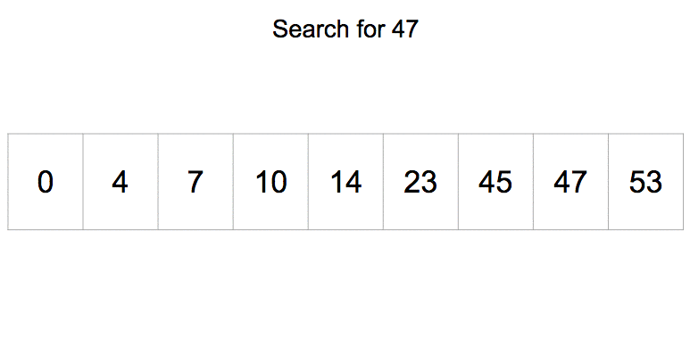

# Бинарный поиск


- [Введение](#введение)
- [Алгоритм](#алгоритм)
- [Реализация](#реализация)
    - [Рекурсивно](#рекурсивно)
    - [Итеративно](#итеративно)
    - [Через Generic-и](#через-generic-и)
    - [В JDK](#в-jdk)
- [Производительность](#производительность)
- [Заключение](#заключение)
- [Полезные ссылки](#полезные-ссылки)
- [Отдельная благодарность](#отдельная-благодарность)

## Введение

Бинарный поиск является одним из базовых алгоритмов поиска и часто встречается на собеседованиях.
В отличии от обычного линейного перебора, работает быстрее, но работает только с отсортированными данными.

## Алгоритм

Алгоритм состоит в том, чтобы взять серединный элемент массива, сравнить его с искомым, и, в зависимости от того, меньше он искомого или больше,
искать в левой или правой части соответственно.

Это продолжается до тех пор, пока искомый элемент не будет найден, либо пока массив не закончится.



Таким образом нам понадобится число операций равное тому, сколько раз нам нужно поделить массив размером `N` пополам.
Отсюда и временная сложность алгоритма двоичного поиска: `O(log(n))`.

Из описания алгоритма понятно, что он работает **только** с отсортированными массивами.

## Реализация

Реализовать алгоритм бинарного поиска можно как итеративно, так и рекурсивно.

### Рекурсивно

```java
public class BinarySearch {
    public static int search(final int[] arr, final int element) {
        if (arr.length == 0) {
            return -1;
        }

        return search(arr, element, 0, arr.length - 1);
    }

    private static int search(final int[] arr, final int element, final int left, final int right) {
        if (left > right) {
            return -1;
        }

        final int mid = left + (right - left) / 2

        if (arr[mid] == element) {
            return mid;
        } else if (arr[mid] > element) {
            return search(arr, element, left, mid - 1);
        } else {
            return search(arr, element, mid + 1, right);
        }
    }
}
```

### Итеративно

```java
public class BinarySearch {
    public static int searchIter(final int[] arr, final int key) {
        if (arr.length == 0) {
            return -1;
        }

        int left = 0;
        int right = arr.length - 1;

        while (left <= right) {
            final int mid = left + (right - left) / 2

            if (arr[mid] == key) {
                return mid;
            } else if (arr[mid] < key) {
                left = mid + 1;
            } else if (arr[mid] > key) {
                right = mid - 1;
            }
        }

        return -1;
    }
}
```

### Через Generic-и

```java
import java.util.Comparator;
import java.util.List;

public class BinarySearch {
    public static <T extends Comparable<? super T>> int search(List<T> xs, T x) {
        return search(xs, x, T::compareTo);
    }

    public static <T> int search(List<T> arr, T element, Comparator<? super T> comparator) {
        int left = 0;
        int right = arr.size() - 1;

        while (left <= right) {
            int mid = left + (right - left) / 2;

            if (comparator.compare(arr.get(mid), element) == 0) {
                return mid;
            }

            if (comparator.compare(arr.get(mid), element) < 0) {
                left = mid + 1;
            } else {
                right = mid - 1;
            }
        }

        return -1;
    }
}
```

### В JDK

Данная сортировка также представлена в стандартной библиотеке `Java` в `java.util.Collections`:

```java
    /**
     * Searches the specified list for the specified object using the binary
     * search algorithm.  The list must be sorted into ascending order
     * according to the {@linkplain Comparable natural ordering} of its
     * elements (as by the {@link #sort(List)} method) prior to making this
     * call.  If it is not sorted, the results are undefined.  If the list
     * contains multiple elements equal to the specified object, there is no
     * guarantee which one will be found.
     *
     * <p>This method runs in log(n) time for a "random access" list (which
     * provides near-constant-time positional access).  If the specified list
     * does not implement the {@link RandomAccess} interface and is large,
     * this method will do an iterator-based binary search that performs
     * O(n) link traversals and O(log n) element comparisons.
     *
     * @param  <T> the class of the objects in the list
     * @param  list the list to be searched.
     * @param  key the key to be searched for.
     * @return the index of the search key, if it is contained in the list;
     *         otherwise, <tt>(-(<i>insertion point</i>) - 1)</tt>.  The
     *         <i>insertion point</i> is defined as the point at which the
     *         key would be inserted into the list: the index of the first
     *         element greater than the key, or <tt>list.size()</tt> if all
     *         elements in the list are less than the specified key.  Note
     *         that this guarantees that the return value will be &gt;= 0 if
     *         and only if the key is found.
     * @throws ClassCastException if the list contains elements that are not
     *         <i>mutually comparable</i> (for example, strings and
     *         integers), or the search key is not mutually comparable
     *         with the elements of the list.
     */
    public static <T>
    int binarySearch(List<? extends Comparable<? super T>> list, T key) {
        if (list instanceof RandomAccess || list.size()<BINARYSEARCH_THRESHOLD)
            return Collections.indexedBinarySearch(list, key);
        else
            return Collections.iteratorBinarySearch(list, key);
    }

    private static <T>
    int indexedBinarySearch(List<? extends Comparable<? super T>> list, T key) {
        int low = 0;
        int high = list.size()-1;

        while (low <= high) {
            int mid = (low + high) >>> 1;
            Comparable<? super T> midVal = list.get(mid);
            int cmp = midVal.compareTo(key);

            if (cmp < 0)
                low = mid + 1;
            else if (cmp > 0)
                high = mid - 1;
            else
                return mid; // key found
        }
        return -(low + 1);  // key not found
    }

    private static <T>
    int iteratorBinarySearch(List<? extends Comparable<? super T>> list, T key)
    {
        int low = 0;
        int high = list.size()-1;
        ListIterator<? extends Comparable<? super T>> i = list.listIterator();

        while (low <= high) {
            int mid = (low + high) >>> 1;
            Comparable<? super T> midVal = get(i, mid);
            int cmp = midVal.compareTo(key);

            if (cmp < 0)
                low = mid + 1;
            else if (cmp > 0)
                high = mid - 1;
            else
                return mid; // key found
        }
        return -(low + 1);  // key not found
    }
```

Также существует реализация, умеющая работать с массивами, она доступна в `java.util.Arrays` через метод `binarySearch`.

## Производительность

Временная сложность: `O(log(n))`.

## Заключение

Алгоритм бинарного поиска используется во многих библиотеках и используется с отсортированными структурами данных, в частности, в `Java` уже есть его реализация, досутпная для массивов в `java.util.Arrays` и в `java.util.Collections` для коллекций данных.

## Полезные ссылки

1. [The curious case of Binary Search — The famous bug that remained undetected for 20 years](https://thebittheories.com/the-curious-case-of-binary-search-the-famous-bug-that-remained-undetected-for-20-years-973e89fc212)
2. [Binary Search Algorithm in Java](https://www.baeldung.com/java-binary-search)
3. [Двоичный поиск](https://ru.wikipedia.org/wiki/%D0%94%D0%B2%D0%BE%D0%B8%D1%87%D0%BD%D1%8B%D0%B9_%D0%BF%D0%BE%D0%B8%D1%81%D0%BA)

## Отдельная благодарность

Отдельную благодарность за ревью и помощь автор хочет выразить:

1. [Alexander Lisianoi](https://github.com/alisianoi)
