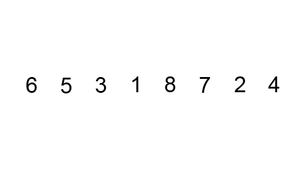

# Сортировка пузырьком

## Введение

Алгоритм сортировки пузырьком является одним из самых простых алгоритмов как для понимания, так и для реализации.

## Алгоритм

Идея заключается в том, что за одну итерацию по массиву необходимо найти и "поднять" вверх (в верхнюю часть массива) наибольший элемент. Отсюда и название алгоритама: наибольшие элементы массива всплывают как пузырьки в воде.

Найдя и подняв один элемент поиск начинается снова, но уже до `N - 1` элемента массива, ведь в конце уже есть предыдущий "поднятый" элемент.

> Здесь `N` - это длина массива.

После этого мы еще раз делаем то же самое, но уже до `N - 2` и так далее.

Получается, что происходит `N` итераций, за каждую из которых мы "поднимаем" элементы вверх.



Для сортировки пузырьком требуется два вложенных цикла. Внутренний цикл занимается поиском и "поднятием" наибольшего элемента, внешний отвечает за количество таких поисков.

Второй вариант реализации заключается в том, что внешний цикл останавливается, когда все пары элементов в массиве пропускаются без замен, т.е нет "всплытий".

## Реализация

Для простоты пример будет работать с массивами `int`-ов.

```java
public static void bubbleSort(int[] arr) {
    final int len = arr.length;
    for (int i = 0; i < len - 1; i++) {
        for (int j = 0; j < len - i - 1; j++) {
            if (arr[j] > arr[j + 1]) {
                int tmp = arr[j];
                arr[j] = arr[j + 1];
                arr[j + 1] = tmp;
            }
        }
    }
}
```

Второй вариант реализации:

```java
public static void bubbleSort(int[] array) {  
    boolean isSorted = false;
    int temp;
    while(!isSorted) {
        isSorted = true;
        for (int i = 0; i < array.length - 1; i++) {
            if (array[i] > array[i + 1]) {
                temp = array[i];
                array[i] = array[i + 1];
                array[i + 1] = temp;
                isSorted = false;
            }
        }
    }
}
```

## Производительность

Из-за двух вложенных циклов сортировка пузырьком медленная, ее временная сложность в наихудшем случае: `О(N^2)`.

## Заключение

Сортировка пузырьком не применяется в реальной жизни из-за низкой производительности и служит только в учебных целях.

## Полезные ссылки

1. [Java. Сортировка пузырьком.](https://www.youtube.com/watch?v=aXyMkR8LGEo)
2. [Bubble Sort in Java](https://www.baeldung.com/java-bubble-sort)
