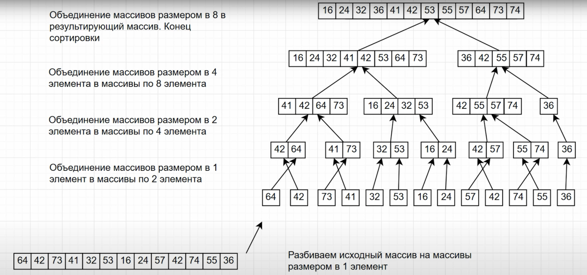
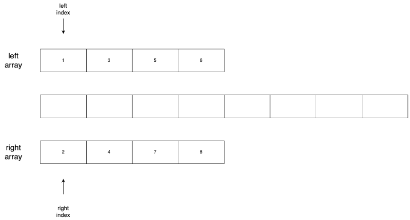

# Сортировка слиянием (Merge Sort)

## Введение

Алгоритм сортировки слиянием (или Merge Sort) похож на алгоритм [быстрой сортировки](./quick.md).
Алгоритм был изобретён Джоном фон Нейманом в 1945 году. В дальнейшем модифицировался и улучшался.

## Алгоритм

Принцип сортировки слиянием заключается в таком подходе, как **разделяй и властвуй**.
Когда исходная задача разделяется на более мелкие подзадачи, которые можно сделать быстрее, после чего их результат объединяется в одно целое.

Алгоритм использует рекурсивный подход для разделения списка на более мелкие части, затем сортирует их и объединяет в отсортированный список.

Принцип работы алгоритма можно описать следующим образом:

* **Разделение**

    Исходный список делится на две примерно (в случае нечетного количества элементов) равные части. Это делается рекурсивно до тех пор, пока каждая часть не будет содержать только один элемент или будет пуста.

    **ВАЖНО:**

    Деление до минимального размера имеет смысл только для сортировки списков с последовательным доступом к элементам.

    Массивы по хорошему надо делить до тех пор, когда размер блока (подсписка) станет достаточно маленьким, чтобы применить эффективный алгоритм сортировки с прямым доступом к элементам. Как это сделано в [Timsort](https://ru.wikipedia.org/wiki/Timsort).

* **Слияние**

    Каждая пара соседних подсписков сливается в один отсортированный список. Слияние происходит путем сравнения элементов из обоих списков и помещения их в правильном порядке в новый список.

* **Рекурсивное объединение**

    Шаги разделения и слияния повторяются рекурсивно для каждого уровня списка до тех пор, пока не будет получен полностью отсортированный список.



## Производительность

Временная сложность: `O(n * log(n))`
Вспомогательная память: `O(n)`

Асимптотическая сложность сортировки слиянием складывается из двух компонентов.

### Разделение

Для начала нам надо разделить исходный список так, чтобы мы получили списки длинной не больше 1.

Для этого мы делим каждый новый список пополам, пока не достигнем длины 1.

```text
        0.                n
        1.           n/2     n/2
        2.         n/4 n/4 n/4 n/4
        3.     ..........n/8.........
        ...
        x.               n/n
```

Цифры слева - это нумерация операций деления, а справа - это длина списков.

Заметим, что на каждом шаге мы делим на 2^(номер_деления).
То есть, зная, что последнее значение 1 (так как мы делим список до длины 1), найдем x:

```text
    n / (2 ^ x) = 1
    n = 2 ^ x
    x = log2(n)
```

Таким образом, чтобы достигнуть списков длины 1, нам надо выполнить log2(n) делений (без учета константы).

### Сортировка и сбор значений

Помимо деления, нам надо сортировать списки и собирать их в новые.

Рассмотрим **максимальные** количества сравнений на каждом этапе слияния

| Длина списка  | Количесво слияний  | Cравнений при одном слиянии | Всего сравнений  |
|---------------|--------------------|-----------------------------|------------------|
|      1        |        n/2         |              2*1            |         n        |
|      2        |        n/4         |              2*2            |         n        |
|      4        |        n/8         |              2*4            |         n        |
|      8        |        n/16        |              2*8            |         n        |
|     ...       |        ...         |              ...            |        ...       |
|     n/2       |         1          |             2*(n/2)         |         n        |

Таким образом, на каждом уровне у нас получается не больше, чем n операций сравнения.

Как мы выяснили ранее, уровней у нас **log(n)**, на каждом не более **n** операций, тогда справедлива оценка: **O(n * log(n))**

## Пример

Давайте рассмотрим алгоритм на примере и далее уже перейдем к реализации.

Пусть у нас есть исходный список: `[6, 5, 3, 1, 8, 7, 2. 4]`

### Шаг 1

Разделяем список на две равные части.

```text
Часть 1: [6, 5, 3, 1]
Часть 2: [8, 7, 2, 4]
```

### Шаг 2

Проделываем то же самое для получившихся частей, пока не получим списки длинной не больше 1:

> two hours later :)

```text
1: [6, 5] 
2: [3, 1] 
3: [8, 7]
4: [2, 4]

---------

1: [6]
2: [5]
3: [3]
4: [1]
5: [8]
6: [7]
7: [2]
8: [4]
```

Получили 8 отсортированных списков (т.к. список длиной 1 можно считать отсортированным).

### Шаг 3

Теперь начинаем попарно объединять подсписки, сортируя элементы при слиянии:

```text
1 merge 2: [5, 6]
3 merge 4: [1, 3]
5 merge 6: [7, 8]
7 merge 8: [2, 4]
```

Продолжаем процесс слияния:

```text
12 merge 34: [1, 3, 5, 6]
56 merge 78: [2, 4, 7, 8]
```

И теперь сливаем два списка в один:

```text
Sorted result: [1, 2, 3, 4, 5, 6, 7, 8]
```


### Процесс слияния подробнее

У нас есть два списка:

```text
left:  [1, 3, 5, 6]
right: [2, 4, 7, 8]
```

Будем поочередно добавлять меньшие элементы в новый список.

Мы начинаем сравнивать первые элементы двух списков, и меньший добавляем в новый.
Затем, берем следующий элемент в списке, из которого добавили, и продолжаем сравнение, добавляя в новый список поочередно все элементы:

```text
    Новый список: []
    1-ое сравнение: 1 и 2 -> добавляем 1
    
    Новый список: [1]
    2-ое сравнение: 3 и 2 -> добавляем 2

    Новый список: [1, 2]
    3-ье сравнение: 3 и 4 -> добавляем 3

    Новый список: [1, 2, 3]
    4-ое сравнение: 5 и 4 -> добавляем 4

    Новый список: [1, 2, 3, 4]
    5-ое сравнение: 5 и 6 -> добавляем 5
    
    Новый список: [1, 2, 3, 4, 5]
    6-ое сравнение: 6 и 7 -> добавляем 6

    Новый список: [1, 2, 3, 4, 5, 6]

    Элементы в первом списке закончились, добавляем все элементы из 2-ого

    Добавили 7 из 2-ого списка
    Новый список: [1, 2, 3, 4, 5, 6, 7]

    Добавили 8 из 2-ого списка
    Новый список: [1, 2, 3, 4, 5, 6, 7, 8]
```



## Реализация

```java
public class MergeSort {

    public static void mergeSort(int[] arr) {

        // Если в массиве нет минимум двух элементов, то сортировать нечего
        if (arr.length <= 1) {
            return;
        }

        // Делим массив на два +- равных подмассива
        int mid = arr.length / 2;
        int[] left = new int[mid];
        int[] right = new int[arr.length - mid];

        // Заполнение подмассивов
        System.arraycopy(arr, 0, left, 0, mid);

        System.arraycopy(arr, mid, right, 0, arr.length - mid);

        // Рекурсивная сортировка подмассивов
        mergeSort(left);
        mergeSort(right);

        // Слияние отсортированных подмассивов
        merge(left, right, arr);
    }

    public static void merge(int[] left, int[] right, int[] arr) {
        int leftInd = 0; // индекс для массива left
        int rightInd = 0; // индекс для массива right
        int resultInd = 0; // индекс для результирующего массива

        // Слияние элементов из подмассивов в результирующий массив
        while (leftInd < left.length && rightInd < right.length) {
            if (left[leftInd] <= right[rightInd]) {
                arr[resultInd] = left[leftInd];
                leftInd++;
            } else {
                arr[resultInd] = right[rightInd];
                rightInd++;
            }
            
            resultInd++;
        }

        // Копирование оставшихся элементов из левого подмассива (если есть)
        while (leftInd < left.length) {
            arr[resultInd] = left[leftInd];
            leftInd++;
            resultInd++;
        }

        // Копирование оставшихся элементов из правого подмассива (если есть)
        while (rightInd < right.length) {
            arr[resultInd] = right[rightInd];
            rightInd++;
            resultInd++;
        }
    }
}
```

### В JDK

Оптимизированная и улучшенная сортировка слиянием (гибридная сортировка [TimSort](https://ru.wikipedia.org/wiki/Timsort)) также представлена в стандартной библиотеке `Java` в `java.util.Collections` через метод `sort(Object[] a)`.

Также существует реализация, умеющая работать с массивами, она доступна в [java.util.Arrays](https://docs.oracle.com/javase/8/docs/api/java/util/Arrays.html#sort-java.lang.Object:A-) через метод `sort(Object[] a)`.

> @implNote
>
> This implementation is a stable, adaptive, iterative mergesort that
> requires far fewer than n lg(n) comparisons when the input array is
> partially sorted, while offering the performance of a traditional
> mergesort when the input array is randomly ordered.  If the input array
> is nearly sorted, the implementation requires approximately n
> comparisons.  Temporary storage requirements vary from a small constant
> for nearly sorted input arrays to n/2 object references for randomly
> ordered input arrays.

## Заключение

Асимптотическая сложность: `O(n * log(n))`.

Достоинства:

* Работает даже на структурах данных последовательного доступа. В таком случае делить надо именно до подсписков минимального размера.
* Хорошо сочетается с подкачкой и кэшированием памяти.
* Неплохо работает в параллельном варианте: легко разбить задачи между процессорами поровну, но трудно сделать так, чтобы другие процессоры взяли на себя работу, в случае если один процессор задержится.
* Не имеет «трудных» входных данных: постоянную асимптотическую сложность, она остается `O(n * log(n))` как в худшем, так и в лучшем случае.
* Устойчивая - это значит, что относительный порядок элементов, с одинаковыми значениями, будет сохранен.

Недостатки:

* На «почти отсортированных» массивах работает столь же долго, как на хаотичных. Существует вариант сортировки слиянием, который работает быстрее на частично отсортированных данных, но он требует дополнительной памяти, в дополнении ко временному буферу, который используется непосредственно для сортировки.

* Накладные расходы: требует дополнительной памяти по размеру исходного массива. [Теоретически](https://www.geeksforgeeks.org/in-place-merge-sort/), можно обойтись без дополнительной памяти, однако это неэффективно, трудно реализуемо и [не рекомендуется](https://stackoverflow.com/questions/2571049/how-to-sort-in-place-using-the-merge-sort-algorithm).

* Рекурсивный подход также можно отнести к минусам, так как сортировка действительно больших (огромных) списков может вызвать накладные расходы на использование стека вызовов. Однако, можно обойтись и без реализации на рекурсии.

Надо понимать, что для разных данных надо использовать разные алгоритмы.

Для массива из 10 чисел простейший, но имеющий минимальные накладные расходы, алгоритм сложности `O(n^2)` будет эффективнее, чем быстрый алгоритм сложности `O(n*ln(n))`: чем меньше объём данных, тем заметнее накладные расходы, требуемые для быстрых алгоритмов. Для примера (очень абстрактного, но все же), сортировка пузырьком 10 чисел заняла у меня 391 нс, в то время как сортировка слиянием отработала за 770 нс. А вот уже начиная с 100 и более числе сортировка пузырьком уступает на порядок: 28202 нс против 7752 нс у merge sort.

Сортировка слиянием - это эффективный алгоритм сортировки, который может быть применен в различных ситуациях в реальной жизни.
Он используется для упорядочивания данных, когда требуется отсортировать большой объем информации. Гибридно встречается и в JDK.

Если данные не помещаются в оперативную память компьютера, сортировка слиянием позволяет выполнять сортировку на жестком диске или других внешних носителях данных.

Именно поэтому сортировку слиянием относят к алгоритмам **внешней** сортировки.

Внешняя сортировка — сортировка данных, расположенных на периферийных устройствах и не вмещающихся в оперативную память, то есть когда применить одну из внутренних сортировок невозможно.

## Полезные ссылки

1. [Sergey Arkhipov Java Tutorials. Java. Сортировка слиянием.](https://www.youtube.com/watch?v=wk6hUweJ4UA)
2. [Wikipedia. Сортировка слиянием](<https://ru.wikipedia.org/wiki/%D0%A1%D0%BE%D1%80%D1%82%D0%B8%D1%80%D0%BE%D0%B2%D0%BA%D0%B0_%D1%81%D0%BB%D0%B8%D1%8F%D0%BD%D0%B8%D0%B5%D0%BC#:~:text=%D0%A1%D0%BE%D1%80%D1%82%D0%B8%D1%80%D0%BE%D0%B2%D0%BA%D0%B0%20%D1%81%D0%BB%D0%B8%D1%8F%D0%BD%D0%B8%D0%B5%D0%BC%20(%D0%B0%D0%BD%D0%B3%D0%BB.,%D0%BF%D1%80%D0%B8%D0%BD%D1%86%D0%B8%D0%BF%D0%B0%20%C2%AB%D1%80%D0%B0%D0%B7%D0%B4%D0%B5%D0%BB%D1%8F%D0%B9%20%D0%B8%20%D0%B2%D0%BB%D0%B0%D1%81%D1%82%D0%B2%D1%83%D0%B9%C2%BB>)
3. [Habr. Сортировка слиянием через рекурсию](https://habr.com/ru/articles/710620/)
4. [Getting Sorted & Big O Notation - Computerphile](https://www.youtube.com/watch?v=kgBjXUE_Nwc)
5. [Лекторий ФПМИ. Введение в программирование 3. Сортировки. MergeSort, недетерминированный QuickSort](https://www.youtube.com/watch?v=TEsRwziPhbo)
6. [ИТМО. Сортировка слиянием](https://neerc.ifmo.ru/wiki/index.php?title=%D0%A1%D0%BE%D1%80%D1%82%D0%B8%D1%80%D0%BE%D0%B2%D0%BA%D0%B0_%D1%81%D0%BB%D0%B8%D1%8F%D0%BD%D0%B8%D0%B5%D0%BC)
7. [Habr. Сортировки слиянием](https://habr.com/ru/companies/edison/articles/431964/)
8. [Geeksforgeeks. In-Place Merge Sort](https://www.geeksforgeeks.org/in-place-merge-sort/)
9. [Geeksforgeeks. Merge Sort – Data Structure and Algorithms Tutorials](https://www.geeksforgeeks.org/merge-sort/)
