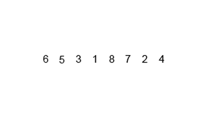

# Merge Sort
## Сортировка слиянием
### Асимптотическая сложность: *O(n * log(n))*

---

## Содержание

* [Принцип и работа алгоритма](#принцип-и-работа-алгоритма)

* [Асимптотика](#асимптотика)

* [Пример](#пример)

* [Реализация](#реализация)

* [Заключение](#заключение)

---


### Принцип и работа алгоритма
Принцип сортировки слиянием заключается в таком подходе, как **"разделяй и властвуй"**.

Идея заключается в том, что для полной сортировки списка, надо отсортировать его меньшие части

Алгоритм использует рекурсивный подход для разделения списка на более мелкие части, затем сортирует их и объединяет в отсортированный список. Принцип работы алгоритма можно описать следующим образом:

* **Разделение:** Исходный список делится на две примерно равные части. Это делается рекурсивно до тех пор, пока каждая часть не будет содержать только один элемент или будет пуста.

* **Слияние:** Каждая пара соседних подсписков сливается в один отсортированный список. Слияние происходит путем сравнения элементов из обоих списков и помещения их в правильном порядке в новый список.

* **Рекурсивное объединение:** Шаги разделения и слияния повторяются рекурсивно для каждого уровня списка до тех пор, пока не будет получен полностью отсортированный список.

---

### Асимптотика

Асимптотическая сложность сортировки слиянием складывается из двух компонентов.

1. Для начала нам надо разделить начальный список так, чтобы мы получили списки длинной не больше 1

Для этого мы делим каждый новый список пополам, пока не достигнем длины 1

        0.                n
        1.           n/2     n/2
        2.         n/4 n/4 n/4 n/4
        3.     ..........n/8.........
        ...
        x.               n/n

Цифры слева - это нумерация операций деления, справа длина списков.

Заметим, что на каждом шаге мы делим на 2^(номер_деления). 
То есть, зная, что последнее значение 1 (так как мы делим список до длины 1), найдем x

    n / (2^x) = 1
    n = 2^x
    x = log_2(n)

Таким образом, чтобы достигнуть списков длины 1, нам надо выполнить log_2(n) делений (без учета константы)

2. Помимо деления, нам надо сортировать списки и собирать их в новые

Рассмотрим **максимальные** количества сравнений на каждом этапе слияния

    Длина списка    Количесво слияний    Cравнений при    Всего сравнений
                                         одном слиянии

          1                n/2                2*1                n     
          2                n/4                2*2                n
          4                n/8                2*4                n
          8                n/16               2*8                n
         ...               ...                ...               ...
          n/2               1                2*(n/2)             n


Таким образом, на каждом уровне у нас получается не больше, чем n операций сравнения.

Как мы выяснили ранее, уровней у нас **log(n)**, на каждом не более **n** операций, тогда справедлива оценка
**O(n * log(n))**
    

---

### Пример



Довольно много букв, поэтому давайте рассмотрим алгоритм на примере и перейдем к реализации

    Исходный список: [6, 5, 3, 1, 8, 7, 2. 4]

**Шаг 1**

Разделяем список на две +- равные части

    Часть 1: [6, 5, 3, 1]
    Часть 2: [8, 7, 2, 4]

**Шаг 2**

Проделываем то же самое для получившихся частей, пока не получим списки длинной не больше 1

*two ours later*

    1: [6, 5] 
    2: [3, 1] 
    3: [8, 7]
    4: [2, 4]

    ---------

    1: [6]
    2: [5]
    3: [3]
    4: [1]
    5: [8]
    6: [7]
    7: [2]
    8: [4]

**Шаг 3**

Получили 8 отсортированных списков (т.к. список длиной 1 можно считать отсортированным)

Теперь начинаем попрано объединять подсписки, сортируя элементы при слиянии

    1 merge 2: [5, 6]
    3 merge 4: [1, 3]
    5 merge 6: [7, 8]
    7 merge 8: [2, 4]

Продолжаем процесс слияния

    12 merge 34: [1, 3, 5, 6]
    56 merge 78: [2, 4, 7, 8]

И теперь сливаем два списка в один

    Sorted result: [1, 2, 3, 4, 5, 6, 7, 8]


*Рассмотрим процесс слияния чуть подробнее*

У нас есть два списка

    1-ый: [1, 3, 5, 6]
    2-ой: [2, 4, 7, 8]

Будем поочередно добавлять меньшие элементы в новый список

Мы начинаем сравнивать первые элементы двух списков, и меньший добавляем в новый.
Затем, берем следующий элемент в списке, из которого добавили, и продолжаем сравнение, добавляя в новый список поочередно все элементы.

    Новый список: []
    1-ое сравнение: 1 и 2 -> добавляем 1
    
    Новый список: [1]
    2-ое сравнение: 3 и 2 -> добавляем 2

    Новый список: [1, 2]
    3-ье сравнение: 3 и 4 -> добавляем 3

    Новый список: [1, 2, 3]
    4-ое сравнение: 5 и 4 -> добавляем 4

    Новый список: [1, 2, 3, 4]
    5-ое сравнение: 5 и 6 -> добавляем 5
    
    Новый список: [1, 2, 3, 4, 5]
    6-ое сравнение: 6 и 7 -> добавляем 6

    Новый список: [1, 2, 3, 4, 5, 6]

    Элементы в первом списке закончились, добавляем все элементы из 2-ого

    Добавили 7 из 2-ого списка
    Новый список: [1, 2, 3, 4, 5, 6, 7]

    Добавили 8 из 2-ого списка
    Новый список: [1, 2, 3, 4, 5, 6, 7, 8]

---

### Реализация

```java

public class MergeSort {

    public static void mergeSort(int[] arr) {

        // Если в массиве нет минимум двух элементов, то сортировать нечего
        if (arr.length <= 1) {
            return;
        }

        // Делим массив на два +- равных подмассива
        int mid = arr.length / 2;
        int[] left = new int[mid];
        int[] right = new int[arr.length - mid];

        // Заполнение подмассивов
        System.arraycopy(arr, 0, left, 0, mid);

        System.arraycopy(arr, mid, right, 0, arr.length - mid);

        // Рекурсивная сортировка подмассивов
        mergeSort(left);
        mergeSort(right);

        // Слияние отсортированных подмассивов
        merge(left, right, arr);
    }

    public static void merge(int[] left, int[] right, int[] arr) {
        int leftInd = 0; // индекс для массива left
        int rightInd = 0; // индекс для массива right
        int resultInd = 0; // индекс для результирующего массива

        // Слияние элементов из подмассивов в результирующий массив
        while (leftInd < left.length && rightInd < right.length) {
            if (left[leftInd] <= right[rightInd]) {
                arr[resultInd] = left[leftInd];
                leftInd++;
            } else {
                arr[resultInd] = right[rightInd];
                rightInd++;
            }
            resultInd++;
        }

        // Копирование оставшихся элементов из левого подмассива (если есть)
        while (leftInd < left.length) {
            arr[resultInd] = left[leftInd];
            leftInd++;
            resultInd++;
        }

        // Копирование оставшихся элементов из правого подмассива (если есть)
        while (rightInd < right.length) {
            arr[resultInd] = right[rightInd];
            rightInd++;
            resultInd++;
        }
    }
}

```
---

### Заключение

**Из плюсов** сортировки слиянием можно выделить ее устойчивость. Это значит, что относительный порядок элементов, с одинаковыми значениями, будет сохранен.
Также, можно выделить в плюс ее постоянную асимптотическую сложность - она остается O(n * log(n)) как в худшем, так и в лучшем случае.

**Минусы** у сортировки тоже есть. Например, расход дополнительной памяти при каждом слиянии, что может оказаться существенно при больших списках. 
Рекурсивный подход тоже отнесем к минусам, так как сортировка больших списков может вызвать накладные расходы на использование системного стека.

>Сортировка слиянием - 
это эффективный алгоритм сортировки, который может быть применен в различных ситуациях в реальной жизни.
Он используется для упорядочивания данных, когда требуется отсортировать большой объем информации.

* Сортировка слиянием может использоваться для сортировки больших наборов данных в базах данных. Например, когда требуется отсортировать результаты запроса, содержащего миллионы записей.

* Если данные не помещаются в оперативную память компьютера, сортировка слиянием позволяет выполнять сортировку на жестком диске или других внешних носителях данных.