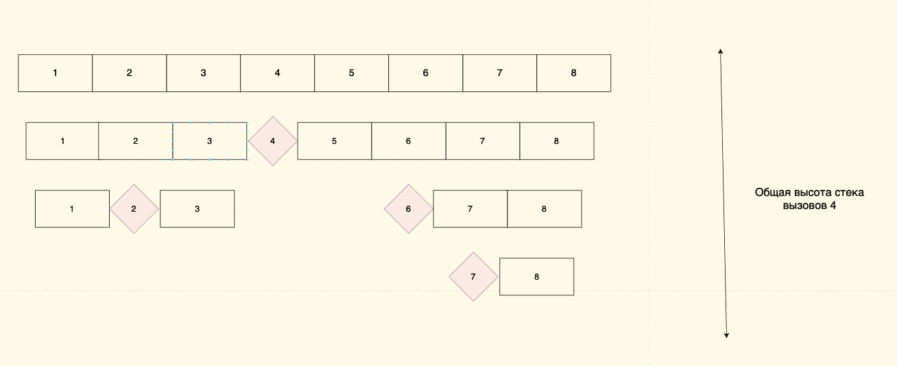

# Быстрая сортировка (Quick Sort)

## Введение

Быстрая сортировка является одной из самых быстрых и часто используемых сортировок.

Алгоритм похож на алгоритм [сортировки слиянием](./merge.md), но с некоторыми отличиями.

## Алгоритм

Принцип сортировки слиянием заключается в таком подходе, как **разделяй и властвуй**.
Когда исходная задача разделяется на более мелкие подзадачи, которые можно сделать быстрее, после чего их результат объединяется в одно целое.

1. Выбирается опорный элемент

    Обычно его называют `pivot` и в разных реализациях существуют разные алгоритмы выбора

2. Исходный массив делится на две части: в левую попадают все элементы, которые меньше опорного, в правую - которые больше (при этом обе части не являются отсортироваными)

    Алгоритм разбиения обычно называется `partitioning` и в разных реализациях существуют разные алгоритмы разбиений

3. Рекурсивно применяем сортировку к обоим подмассивам до тех пор, пока не получим подмассивы, в которых только один элемент или отсутствуют элементы.


При этом, в отличии от [сортировки слиянием](./merge.md), у нас после 3-го шага сортировка будет окончена и ничего дополнительно делать не надо.

### Выбор точки опоры

Быстродействие алгоритма сильно зависит от данных в массиве и выбора опорного элемента.
Так как неудачный выбор опорного элемента в почти (или полностью) отсортированном массиве снижает производительность алгоритма.

* Выбирается первый (или последний) элемент в качестве опорного. Проблема этого подхода в том, что он работает как худший случай, когда массив уже отсортирован.

    Для примера рассмотрим следующий массив: [1, 2, 3, 4, 5, 6, 7, 8] и выбор первого элемента в качестве опорного.

    При таком выборе точки опоры глубина вызова стека составит 8:

    Здесь и далее опорный элемент - это фиолетовый ромб.

    

    В то время как удачный выбор опорного элемента позволит сократить глубину:

    

* Выбирается случайный элемент в качестве опорного. Это предпочтительный подход, поскольку он не имеет шаблона, для которого наступает наихудший случай.

* Выбирается медианный элемент как опорный. Это идеальный подход с точки зрения временной сложности, поскольку мы можем найти медиану за линейное время, а функция разбиения всегда разделит входной массив на две половины. Но в среднем это занимает больше времени, поскольку нахождение медианы имеет высокие константы.

В ранних реализациях, как правило, опорным выбирался именно первый элемент. В последующих реализациях этот недостаток учли и может выбираться средний, случайный или (для больших массивов) медиана первого, среднего и последнего элементов (в зависимости от реализаций).

Медиана всей последовательности является оптимальным опорным элементом, но её вычисление слишком трудоёмко для использования в сортировке.

### Алгоритм разбиения

Второй важный момент, который влияет на работу сортиировки — это `partition`.

Выбирается опорный элемент. Далее исходный массив делится на две части: в левую попадают все элементы, которые меньше опорного, в правую - которые больше. При этом обе части могут быть не отсортированы. Грубо говоря, мы делим массив на две части и все, что меньше опорного кидаем в левую часть, а все, что больше - в правую.

Индекс, который делит массив на эти две части (после которого начинается 'другой' массив) называется `partition index`.

Например дан массив и опорным элементом выбран первый, т.е. это 5:

```text
[5, 3, 8, 4, 2, 7, 1, 10]

partitioning:

partition |  partition  |

[1, 3, 2, 4, 8, 7, 5, 10]
```

Соответственно, `partition index` здесь - это 3.

Существует три распространенных алгоритма для разбиения.

* Наивное разбиение

    Здесь создается копия массива. Сначала в копию помещаются все элементы, которые меньше опорного, а затем все те, которые больше. После временный массив копируется обратно в исходный.

    Это увеличивает затраты по памяти (требует `O(n)` дополнительного пространства), но легко реализуемо:

    ```java
    static void partition(int[] arr) {
        int size = arr.length;
      
        // Опорным эдементом выбран последний в массиве элемент
        int pivot = arr[size - 1];
      
        int[] tmp = new int[size];
        int idx = 0;
        
        for (int i = 0; i < size; i++) {
            if (arr[i] <= pivot) {
                tmp[idx++] = arr[i];
            }
        }
        
        for (int i = 0; i < size; i++) {
            if (arr[i] > pivot) {
                tmp[idx++] = arr[i];
            }
        }
        
        for (int i = 0; i < size; i++) {
            arr[i] = tmp[i];
        }
    }
    ```

    Временная сложность: O(n)
    Вспомогательная память: O(n)

    Алгоритм разбиения мало эффективен и обычно используется в обучающих материалах.

* Разбиение Ломуто

    В данном случае опорным выбирается последний элемент.

    Алгоритм хранит индекс в переменной idx для запоминания границы элементов в массиве, которые меньше опорного. Каждый раз, когда находится элемент, меньше или равный опорному, индекс увеличивается и элемент вставляется перед опорным. После разбиения опорный элемент окажется в позиции idx — на границе между двумя подмножествами.

    ```java
    static void partition(int[] arr) {
        int size = arr.length;
        int pivot = arr[size - 1];
        
        int idx = -1;
        for (int i = 0; i < size; i++) {
            if (arr[i] < pivot) {
                idx++;
                
                int temp = arr[idx];
                arr[idx] = arr[i];
                arr[i] = temp;
            }
        }
        
        int temp = arr[idx + 1];
        arr[idx + 1] = arr[size - 1];
        arr[size - 1] = temp;
    }
    ```

    Временная сложность: O(n)
    Вспомогательная память: O(1)

    Алгоритм разбиения менее эффективен, чем разбиение Хоара, и обычно используется в обучающих материалах.

* Разбиение Хоара

    Обход массива происходит с обеих сторон и больший элемент слева меняется местами с меньшим справа до тех пор, пока оба указателя не встретятся.

    ```java
    static void partition(int[] array) {
        int pivot = array[0];

        int i = 0;
        int j = array.length - 1;

        while (true) {
            while (array[i] < pivot) {
                i++;
            }

            while (array[j] > pivot) {
                j--;
            }

            if (i < j) {
                int tmp = array[i];
                array[i] = array[j];
                array[j] = tmp;

                i++;
                j--;
            } else {
                break;
            }
        }
    }
    ```

    Временная сложность: O(n)
    Вспомогательная память: O(1)

    Алгоритм разбиения Хоара в целом быстрее, чем алгоритм Ломуто, поскольку он выполняет меньше перестановок и делает только один обход массива, что на практике приводит к лучшей временной сложности.

Шаг разбиения можно распараллелить для повышения производительности в многоядерных или распределенных системах.

## Производительность

Временная сложность: `O(n * log(n))`
Вспомогательная память: `O(n)`

Асимптотическая сложность сортировки слиянием складывается из двух компонентов: разделение и сортировка.

Мы делим массив на две части (больше и меньше опорного элемента) относительно опорного элемента и после к каждой части. Как уже было показано выше, операция разделения массива на две части относительно опорного элемента имеет временную сложность O(n).

Поскольку все операции разделения, проделываемые на одной глубине рекурсии, обрабатывают разные части исходного массива, размер которого постоянен, суммарно на каждом уровне рекурсии потребуется также O(n) операций.

Следовательно, общая сложность алгоритма определяется лишь количеством разделений, то есть глубиной рекурсии. Глубина рекурсии, в свою очередь, зависит от сочетания входных данных и способа определения опорного элемента: выше на рисунке мы видели увидели важность выбора правильного опорного элемента и его влияния на глубину стека.

Отсюда, при среднем и лучшем случае массив каждый раз будет разделятся на две части. Таким образом, чтобы достигнуть списков длины 1, нам надо выполнить log2(n) делений (без учета константы).

Это дает временную сложность `O(n * log(n))`.

В худшем случае будет O(n) уровней разбиения, что даст временную сложность `O(n^2)`.

## Реализация

```java
    public static void quickSort(int[] arr) {
        if (arr.length < 2) {
            return;
        }

        quickSort(arr, 0, arr.length - 1);
    }

    private static void quickSort(int[] array, int left, int right) {
        if (left < right) {
            int pi = partition(array, left, right);

            quickSort(array, left, pi);
            quickSort(array, pi + 1, right);
        }
    }

    static int partition(int[] array, int left, int right) {
        int mid = left + (right - left) / 2;
        int pivot = array[mid];

        int i = left;
        int j = right;

        while (true) {
            while (array[i] < pivot) {
                i++;
            }

            while (array[j] > pivot) {
                j--;
            }

            if (i < j) {
                int tmp = array[i];
                array[i] = array[j];
                array[j] = tmp;

                i++;
                j--;
            } else {
                return j;
            }
        }
    }
```

### В JDK

Оптимизированная и улучшенная реализация быстрой сортировки также присутствует в стандартной библиотеке `Java` в [Arrays.sort](https://docs.oracle.com/javase/8/docs/api/java/util/Arrays.html#sort-int:A-):

```java
    /**
     * Sorts the specified array into ascending numerical order.
     *
     * @implNote The sorting algorithm is a Dual-Pivot Quicksort
     * by Vladimir Yaroslavskiy, Jon Bentley, and Joshua Bloch. This algorithm
     * offers O(n log(n)) performance on all data sets, and is typically
     * faster than traditional (one-pivot) Quicksort implementations.
     *
     * @param a the array to be sorted
     */
    public static void sort(int[] a) {
        DualPivotQuicksort.sort(a, 0, 0, a.length);
    }
```

Про вклад Владимира Ярославского в развитие этой реализации можно посмотреть [тут](https://www.youtube.com/watch?v=QDX3yNW6ZeM)

## Заключение

Асимптотическая сложность: `O(n * log(n))`.

Достоинства:

* Быстрая и потому является одной из самых популярных сортировок, часто встречается в работе.
* Работает даже на структурах данных последовательного доступа.
* Хорошо сочетается с механизмами кэширования и виртуальной памяти.
* Допускает распараллеливание (сортировка выделенных подмассивов в параллельно выполняющихся подпроцессах).
* Он эффективен на больших наборах данных.

Недостатки:

* Имеет «трудные» входные данные: сильно деградирует по скорости (до O(n^2)) в худшем или близком к нему случае, что может случиться при неудачных входных данных.
* В зависимости от реализации может привести к ошибке переполнения стека, так как в худшем случае ей может потребоваться сделать O(n) вложенных рекурсивных вызовов.
* Неустойчива, т.е. может менять относительный порядок сортируемых элементов, имеющих одинаковые ключи, по которым происходит сортировка.
* Это не лучший выбор для небольших наборов данных.

Надо понимать, что для разных данных надо использовать разные алгоритмы.

Быстрая сортировка - это эффективный алгоритм сортировки, который может быть применен в различных ситуациях в реальной жизни.
Он используется для упорядочивания данных, когда требуется отсортировать большой объем информации. Гибридно встречается и в JDK.

## Полезные ссылки

1. [Введение в программирование 3. Сортировки. MergeSort, недетерминированный QuickSort](https://www.youtube.com/watch?v=TEsRwziPhbo)
2. [Quick Sort - Computerphile](https://www.youtube.com/watch?v=XE4VP_8Y0BU)
3. [Быстрая сортировка](https://www.geeksforgeeks.org/quick-sort-algorithm/)
4. [Wikipedia. Быстрая сортировка](https://ru.wikipedia.org/wiki/%D0%91%D1%8B%D1%81%D1%82%D1%80%D0%B0%D1%8F_%D1%81%D0%BE%D1%80%D1%82%D0%B8%D1%80%D0%BE%D0%B2%D0%BA%D0%B0)
