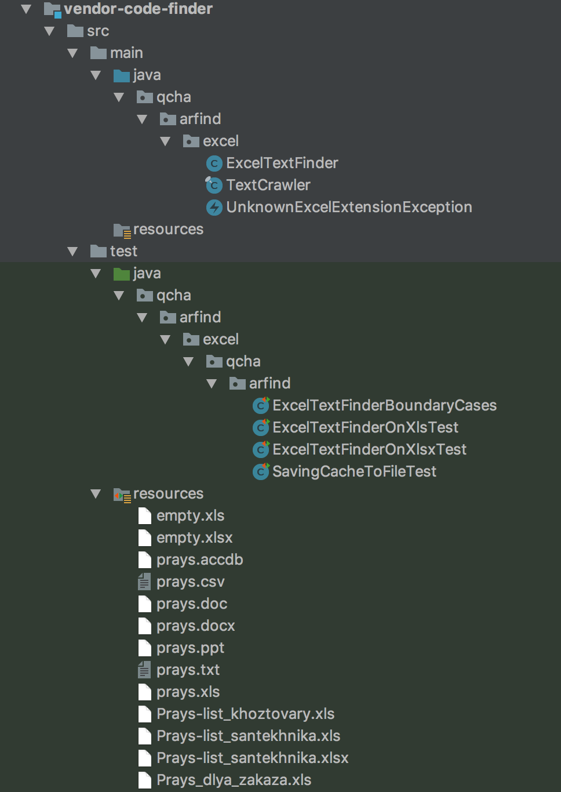
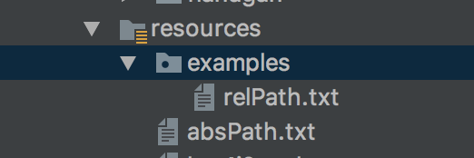

#### Введение
Поговорим про так называемые `ресурсы` проекта. Ресурсы проекта - это файлы, которые принадлежат данному проекту - какие-то файлы настроек, конфиги логгера, служебные картинки, какие-то тестовые файлы и т.д

Раз эти ресурсы принадлежат проекту - то и руководствоваться надо тем, что: 'все свое ношу с собой'.

При этом надо сказать, что мы сейчас говорим про ресурсы - которые должны войти в конечный `jar`-ник с нашим продуктом/проектом.

Как ресурсы попадают в ваш `jar`-ник - это вопрос сборки, в данном случае, мы работаем в IDE от `jetbrains` - она умеет автоматически копировать ресурсы при сборке в ту же точку, куда кладут и скомпилированные классы.

> При написании примеров и демонстрации работы была использована: [IntelliJ Idea](https://www.jetbrains.com/idea/)

Для примера - вот небольшой проект с файлами для тестов, обратите внимание на расположение файлов:




Теперь - то, что мы видим после компиляции проекта:


Видим, что все ресурсы расположились рядом со скомпилированными классами - классы лежали в пакете `qcha.arfind.excel.qcha.arfind` и в скомпилированном виде они тоже лежат в этом пакете, ресурсы же(как видно из первого скриншота) лежали не в пакете, а прямо в *корне* папки `resources` - поэтому они расположились после компиляции именно так, как на втором скриншоте. Если бы в `resources` была воссоздана иерархия папок в том виде, в котором лежали классы - ресурсы бы оказались рядом со скомпилированными классами.

Общая концепция, я думаю, понятна - при компиляции и сборке ресурсы будут располагаться ровно так, как вы их положили - если они лежали в *корне* - они и в результирующем `jar`-нике лягут прямо в *корне*  `jar`-ника, если была создана какая-то иерархия - эта иерархия будет создана и в `jar`-нике.

Как же нам работать с такими ресурсами?

Работа с такими ресурсами возможна опять же при:
* Использовании абсолютного пути до ресурса.
* Использовании методов доступа до ресурса, таких как `getResourceAsStream()`, `getResource()` и т.д

#### Абсолютный путь до ресурса
Являясь наиболее простым и очевидным, данное решение является далеко не лучшим и годится в основном лишь для тестовых вещей, когда вам надо быстро проверить что-то. За исключением, быть может, каких то внешних ресурсов, которые не меняют своего расположения.

Но даже в таком случае лучше указывать расположение таких ресурсов в каком-нибудь файле с настройками(например - в //todo ссылка на properties), а не 'зашивать' явно - лучше избегать 'хардкода'.

Почему использование абсолютного пути - не лучший выход?

Потому что абсолютный путь до ресурса может(и скорее всего *будет*) отличаться на разных машинах/серверах, он будет меняться. И при каждом изменении - вы должны будете вносить правки в ваш код, при этом надо не забыть, что и где менять - иначе можно вообще напороться на ошибки, которые не так просто обнаружить будет.

Поэтому использование абсолютного пути *крайне* не рекомендуется.

#### Работа через методы класса
Как видно из `java.lang.Class` у нас есть целых два метода для получения ресурса.
Это методы  - `getResource(String)` и `getResourceAsStream(String)`, которые на вход ожидают строку.
Эта строка - это путь до ресурса.

Кажется все просто, но тут есть небольшой подводный камень, а именно, что путь до ресурса можно по разному интерпретировать.
Если путь начинается с символа `/` - тогда такой путь называется *абсоолютным*, если нет - *относительным*.

Итак:
* Абсолютный путь, начинается с символа `/`.
* Относительный путь пишется как есть.

Что значит `относительный` путь? Относительно чего?
Ответ прост: относительно **КЛАССА**, относительно места, где лежит наш класс, у которого мы вызываем метод `getResource(String)`.

Еще раз - в чем же разница - зачем нам относительные и абсолютные пути?
Разница в том, что в первом случае ресурс мы ищем относительно корня `classpath`, а во втором - к имени ресурса приписывается еще и *имя пакета*, в котором находится *текущий* класс, у которого вызыватеся метод `getResource()`.

Т.е во втором случае мы ищем ресурс *относительно* расположения **класса**.

Пусть у нас есть класс `Example`, находящийся в пакете `com.github.aarexer` и некоторый файл-ресурс `test.txt`, тогда при вызове:
```java
Example.class.getResource("/test.txt")
```

Мы будем искать файл в `classpath/test.txt`, а при вызове:
```java
Example.class.getResource("test.txt")
```
Будем искать в `classpath/com/github/aarexer/test.txt` - добавится еще полный путь пакета.

#### Примеры
Структура проекта:

В `resources` есть папка `examples` и там лежит `relPath.txt`, в самом же `resources`
есть файл `absPath.txt`.


Выглядит это как-то так:




Посмотрим как можно получить данные ресурсы:
```java
package examples;

import java.net.URISyntaxException;

public class ResourcesTest {
    public static void main(String[] args) throws URISyntaxException {
        ResourcesTest resourcesTest = new ResourcesTest();
        resourcesTest.printURIOfRelResource();
        resourcesTest.printURIOfAbsResource();

        //static
        printURIOfResourceFromStatic();
    }

    private void printURIOfAbsResource() throws URISyntaxException {
        System.out.println(getClass().getResource("/absPath.txt").toURI());
    }

    private void printURIOfRelResource() throws URISyntaxException {
        System.out.println(getClass().getResource("relPath.txt").toURI());
    }

    private static void printURIOfResourceFromStatic() throws URISyntaxException {
        System.out.println(ResourcesTest.class.getClassLoader().getResource("absPath.txt"));
        System.out.println(ResourcesTest.class.getClassLoader().getResource("examples/relPath.txt"));
    }
}
```

Что при запуске выведет нам:
```
file:/Users/aarexer/Coding/java-ex/code-snippets/target/classes/examples/relPath.txt
file:/Users/aarexer/Coding/java-ex/code-snippets/target/classes/absPath.txt
file:/Users/aarexer/Coding/java-ex/code-snippets/target/classes/absPath.txt
file:/Users/aarexer/Coding/java-ex/code-snippets/target/classes/examples/relPath.txt
```

Т.е все ресурсы мы благополучно нашли и можем с ними работать.

При этом надо держать в уме еще вот какой момент - если мы хотим работать с ресурсом в `статическом` методе/блоке, то мы уже должны указывать **относительный путь** до ресурса:
```java
private static void printURIOfResourceFromStatic() throws URISyntaxException {
    System.out.println(ResourcesTest.class.getClassLoader().getResource("absPath.txt"));
    System.out.println(ResourcesTest.class.getClassLoader().getResource("examples/relPath.txt"));
}
```
