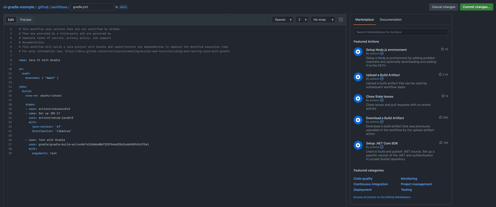

# Actions

## Введение
Action - это способ переиспользования какого-то инструмента в CI/CD пайплайне. Github предоставляет большую библиотеку официальных экшенов, также можно создавать свои и публиковать их в Github Marketplace.

## Зачем
Настройка CI/CD это процесс, который очень часто требует установления одних и тех же процессов. Хочется один раз написать утилиту, а затем пользоваться ей во многих своих проектах. Именно в этом и состоит суть экшенов. 

При описании воркфлоу достаточно написать всего пару строчек и указать нужные параметры, а что происходит внутри может быть куда сложнее.

Например, чтобы воспользоваться `gradle test`, нам нужно склонировать репозиторий, установить JDK и gradle и только затем выполнить эту команду. Тут нам помогают экшенсы, которые компактно и просто позволяют записать то, что мы хотим сделать. Достаточно написать `uses` и имя экшенса, а также указать нужные параметры.

