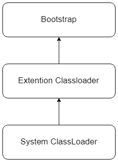
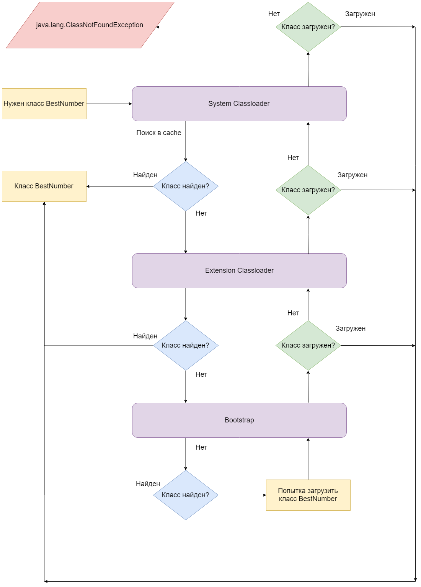

# Загрузка классов

## Введение

> Все примеры написаны с использованием `Java 8`.

Программы, написанные на `Java`, оперируют классами и объектами классов.
При этом классы сначала компилируется в байт-код, после чего уже интерпетируется виртуальной машиной `Java`.

Но как байт-код классов попадает в `JVM`?
Ответ прост: его должен кто-то загрузить.

Этой задачей в `Java` занимаются загрузчики классов или `classloader`-ы.

Любой класс в среде выполнения `Java` был загружен каким-либо загрузчиком.

Также понятно, что загружать 'все' классы не логично и странно, так как ни к чему загружать то, что не используется.

Поэтому большинство классов загружаются только по мере надобности, при первой необходимости.

## Типы загрузчиков

Так как классов в `Java` огромное количество, при этом существуют классы из стандартной библиотеки, существуют самописные классы и т.д, то и загрузчиков классов существует несколько.

Каждый из загрузчиков отвечает за свою область ответственности.

Различают три вида загрузчиков:

* `Bootstrap Classloader` - базовый загрузчик.
        
    Загружает внутренние классы `JDK` из `rt.jar`.

* `System Classloader` - системный загрузчик.
  
    Загружает классы, пути к которым указаны в переменной окружения `CLASSPATH` или пути,
    которые указаны в командном ряде после ключей  `–classpath` или  `–cp`.

* `Extention Classloader` - загрузчик расширений.
  
    Загружает пакеты расширений, которые располагаются в директории `<JAVA_HOME>/lib/ext` или другой директории, описанной в системном параметре `java.ext.dirs`.

Существует также возможность создания собственных загрузчиков.

В таком случае ваш собественный загрузчик должен быть отнаследован от класса `java.lang.ClassLoader`.

### Иерархия

Загрузчики классов образуют иерархию, корнем которой является базовый загрузчки:



У каждого загрузчика есть ссылка на родительский загрузчик при инициализации, что позволяет
делегировать загрузку родителю. 

## Схема загузки класса

Рассмотрим пример, когда произошло обращение к классу `BestNumber`.

В начале идет проверка на то, был ли уже загружен этот класс у текущего загрузчика.

В случае, когда класс уже был загружен ничего интересного не происходит.

А вот в случае, когда класса у текущего загрузчика нет, происходит делегирование загрузки  родительскому загрузчику. В случае, если и там его нет, будет снова вызван родительский загрузчик уже для того, которому делегировали загрузку.

И так будет происходить пока либо искомый класс не будет найден у загрузчиках, либо цепочка вызовов не дойдет до корневого загрузчика `Bootstrap`.

Если в базовом загрузчике нет информации о классе, значит этот класс не был загружен и необходимо его загрузить.

Базовый загрузчик попытается найти искомый класс в области своей ответственности. Если базовый загрузчик искомый класс найти не смог, то происходит проход по загрузчикам в обратном направлении от текущего, корневого.

При этом каждый загрузчик будет пытаться найти класс в своей области ответственности.

> Область ответственности - это то, где загрузчик будет искать классы.
>
> Для корневого загрузчика - это `rt.jar`, для системного - это в основном `classpath`.

Это будет происходить до тех пор, пока либо класс не будет найден, либо поиск не вернет нас к тому загрузчику, с которого все начиналось. И либо тот найдет класс, либо будет сгенерировано исключение `java.lang.ClassNotFoundException`.

Проиллюстрируем выше сказанное:



Для закрепления ответим на несколько вопросов.

---

**Вопрос**:

Почему, когда мы поняли, что класс не загружен, происходит попытка загрузки у родительского загрузчика?

С поиском в кэше делегирование понятно, но зачем происходит делегирование загрузки?

**Ответ**:

Такой подход позволяет загружать классы тем загрузчиком, который максимально близко находится к базовому.

Таким образом достигается максимальная область видимости классов.

> Под областью видимости подразумевается следующее: каждый загрузчик ведет учет классов, которые были им загружены. Этот кэш, содержащий множество загруженных классов, и называется областью видимости.

Благодаря такому подходу поиск классов будет происходить в источниках в порядке их доверия: сначала в стандартной библиотеке `JDK`, с помощью базового загрузчика, потом в папке расширений, с помощью загрузчика расширений, и только потом в `CLASSPATH` уже системным.

---

**Вопрос**:

Какой класс будет реально загружен, если в `$JAVA_HOME/lib/ext` и в `CLASSPATH` есть классы с одинаковыми полными именами?

**Ответ**:

Из всего вышеперечисленного можно заключить, что это будет из `$JAVA_HOME/lib/ext`, а не из `CLASSPATH`.

---

**Вопрос**:

Что произойдет, если в `CLASSPATH` добавить два `jar`-файла, содержащих одинаковые классы, с одинаковыми пакетами?

Например, у меня в `CLASSPATH` попало две версии одной библиотеки и некоторые классы в `jar`-никах одинаковы. Что будет в таком случае?

**Ответ**:

Классы загружаются в том порядке, в котором они были указаны в `CLASSPATH`.

Это означает, что при наличии двух `jar`-файлов, например `Test1.jar` и `Test2.jar`, содержащих одинаковые классы, и перечисленные в `CLASSPATH` как `Test1.jar;Test2.jar`, в память загрузится класс из `Test1.jar`, а класс из `Test2.jar` будет проигнорирован.

Стоит отметить, что ситуаций, когда в `CLASSPATH` оказывается две версии одной библиотеки надо стараться избегать, так как от того, какая из версий будет использоваться, зависит то, как сформируется `CLASSPATH`.

---

### Пространства имен

Каждый загрузчик имеет свое пространство имен для создаваемых классов.

Это значит, что если два одинаковых класса находятся в одном пакете, но загружаются разными загрузчиками, то такие классы будут считаться двумя разными классами.

Таким образом можно, например, создать два `singleton`-объекта. 

## Работа с загрузчиком

Для того, чтобы получить загрузчик, которым был загружен класс можно воспользоваться
методом `getClassLoader()` у класса:

```java
public class ClassLoadersExample {
    public static void main(String[] args) {
        System.out.println(ClassLoadersExample.class.getClassLoader());
        System.out.println(Integer.class.getClassLoader());
    }
}
```

Результат запуска кода выше:

```java
sun.misc.Launcher$AppClassLoader@63947c6b
null
```

Читателя может смутить вывод `null`, поэтому стоит объяснить это поведение.

Здесь `null` означает то, что класс загружен базовым загрузчиком.

Решение о возврате `null`-значения объяснимо тем, чтобы запретить возможность пользователю загружать классы базовым загрузчиком, так как это что-то вроде `root` в `unix`.

Стоит отметить еще то, что при загрузке класса можно явно указать то, каким загрузчиком он должен быть загружен:

```java
public static Class forName(String name, boolean initialize, ClassLoader loader)
```

В качестве `name` передается полное имя класса, с указанием пакета, а в качестве `loader` необходимый загрузчик.

## Ошибки

Возникновение ошибки `java.lang.ClassNotFoundException` было объяснено при описании процесса загрузки класса.
Чаще всего эта ошибка возникает тогда, когда класса нет в `CLASSPATH`.

Но существует еще одна популярная и часто встречаемая ошибка, связанная с загрузкой классов. Речь идет о `java.lang.NoClassDefFoundError`.

Данная ошибка может возникнуть в случае, если во время компиляции, в `compile time`, искомый класс был доступен, однако в процессе выполнения программы, в `runtime`, класс не доступен. Это может произойти, если в поставку программы забыли включить библиотеку, которую она использует.

## Вывод

Загрузка классов происходит с помощью `classloader`-ов или загрузчиков классов, которые выстроены в четкую иерархию, где каждому принадлежит своя область ответственности.

Попытка загрузить класс текущим загрузчиком выполняется только в том случае, если родительский загрузчик не смог найти и загрузить класс.

Каждый загрузчик ведет учет классов, которые были загружены именно им, помещая их в свой кэш. 

Это позволяет загружать классы тем загрузчиком, который максимально близко находится к базовому. Помимо этого механизм делегирования загрузки родительскому загрузчику гарантирует то, что текущий загрузчик не перегрузит загруженный ранее в `JVM` класс.

Различают три вида загрузчиков:

* `Bootstrap Classloader` - базовый загрузчик.
        
    Загружает внутренние классы `JDK` из `rt.jar`.

* `System Classloader` - системный загрузчик.
  
    Загружает классы, пути к которым указаны в переменной окружения `CLASSPATH` или пути,
    которые указаны в командном ряде после ключей  `–classpath` или  `–cp`.

* `Extention Classloader` - загрузчик расширений.
  
    Загружает пакеты расширений, которые располагаются в директории `<JAVA_HOME>/lib/ext` или другой директории, описанной в системном параметре `java.ext.dirs`.

Процесс загрузки класса в кратце выглядит следующим образом:

1. Системный загрузчик проверяет: был ли данный класс загружен ранее? 
2. Если да - то класс вернется из кэша, если нет - то он делегирует загрузку вышестоящему родительскому классу-загрузчику.
3. Вышестоящий загрузчик проделывает ту же процедуру.
4. Это происходит до тех пор, пока либо класс не находится в кэше у загрузчиков, либо не достигается базовый загрузчик.
5. Базовый загрузчик также проверяет свой кэш и если не находит класс, то пытается загрузить класс самостоятельно оттуда, областью котрой заведует, т.е из `rt.jar`.
6. Если там искомого класса нет, то происходит обратный обход иерархии.
7. Это происходит до тех пор, пока либо класс будет загружен, либо будет выброшено исключение `java.lang.ClassNotFoundException`.

В `Java` также существует возможность использовать свои собственные загрузчики классов.