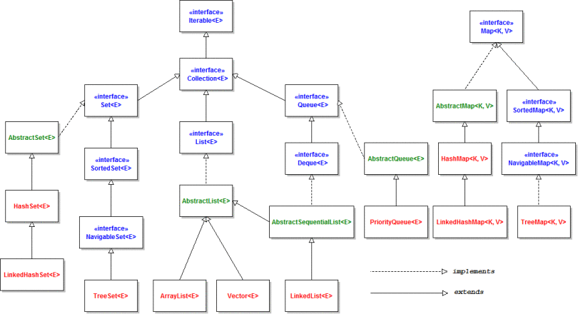

## Введение
Зачем вообще ввели коллекции? Ответ ясен - чтобы увеличение размера массивов и структур данных были из коробки, плюс всякие плюшки для работы с той или иной структурой данных.

Как это все сделано в Java?

Если посмотреть на иерархию, то получится что-то типа:

Тут стоит заметить, что отдельно стоит *`Map`*.

### Почему Map стоит отдельно?
Когда мы говорим про `Collection`, то мы говорим про одно множество объектов.
Но когда мы говорим про `Map` - мы говорим про два множества, про множество ключей
и множество значений, где каждому ключу соответствует некоторое значение.

Опять же, если мы включим `Map` в `Collection`, то необходмио реализовать еще
интерфейс `Iterable`, а так как у нас два множества, то непонятно - по какому из
них мы будем итерироваться и как.

Отсюда можно сделать вывод, что `Map` не является `Collection`.

### Iterable
Видим, что выше всего стоит именно `Iterable` у коллекций.
`Iterable` предоставляет нам итератор, для обхода коллекции.

Дает возможность нам получить итератор для текущей коллекции.
В самом же итераторе - три метода: `hasNext()`, `next()`, `remove()`.
Итератор необходим для обхода коллекции, удаления значений.

//todo
### Collection interface
Что в нем:

* `add()`
* `clear()`
* `size()`
* `remove()`
* `isEmpty()`
* `contains()`

По сути - это главные операции с любой коллекцией - добавление, удаление, проверка
на содержание элемента, очистка.
