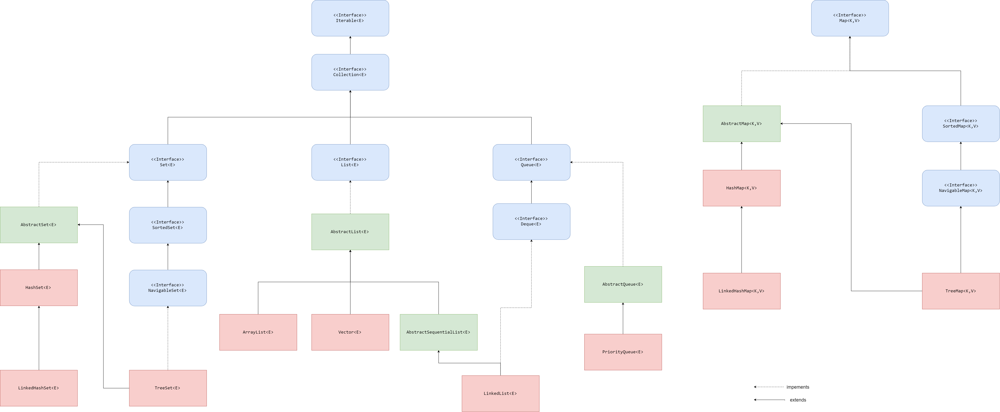

# Структуры данных в Java

## Введение

Понимание структр данных, предоставляемых языком программирования, является основополагающим элементом программирования.
Без осознания того, как хранить и манипулировать данными, а также насколько быстро эти манипуляции происходят, невозможно представить себе программирование.

Являясь `объектно-ориентированным` языком программирования, `Java` предоставляет обширный список структур данных, связанных в четкую иерархию с помощью `интерфейсов` и `классов`.

Коллекции из `JDK` работают **только** с объектами!

Иерархия существующих структур данных в `Java` выглядит следующим образом:



> Изображение лучше скачать, markdown почему-то очень сильно его 'сжимает'.
>
> `Зеленым` выделены абстрактные классы.
>
> `Синим` выделены интерфейсы.
>
> `Красным` выделены конкретные реализации.

Корнем иерархии является интерфейс `java.lang.Iterable`.

Объявление интерфейса выглядит следующим образом:

```java
public interface Iterable<T> {
    /**
     * Returns an iterator over elements of type {@code T}.
     *
     * @return an Iterator.
     */
    Iterator<T> iterator();

    // some code
}
```

Суть интерфейса `java.lang.Iterable` в том, что он добавляет структуре данных возможность итерирования, благодаря предоставлению [итератора](https://ru.wikipedia.org/wiki/%D0%98%D1%82%D0%B5%D1%80%D0%B0%D1%82%D0%BE%D1%80).

Обратите внимание на `<T>`. Это значит, что такой класс может быть параметризован.

Про параметризацию поговорим позднее, пока просто считайте, что параметризировать класс - это значит конкретизировать тот тип, с которым будет работать этот класс. Например, параметризовав `java.lang.Iterable` классом `java.lang.Integer`, разработчик явно покажет, что итерироваться будут только объекты `java.lang.Integer`.

Как уже было сказано выше, `java.lang.Iterable` предоставляет нам итератор для обхода коллекции.

```java
Iterator<T> iterator();
``` 

Благодаря этому коллекции, например, можно использовать в `for-each` цикле.

```java
public void printLines(Iterable<String> lines) {
    for(String line : lines) {
        System.out.println(line);
    }
}
```

Следующим важным интерфейсом является `java.util.Collection`.

Также, как и `java.lang.Iterable`, интерфейс `java.util.Collection` параметризуется.

> Забегая вперед можно сказать, что все коллекции параметризуются.

Объявление:

```java
public interface Collection<E> extends Iterable<E> {
    // ...
}
```

В `Java` все структуры данных, кроме хэш-таблиц, реализуют этот интерфейс, поэтому далее можно называть их `коллекциями`.

Интерфейс `java.util.Collection` предоставляет основные методы для работы с коллекциями.
Выделяется три основынх вида коллекций: `List` (Список), `Queue` (Очередь) и `Set` (Множество).

При этом хэш-таблицы (или `Map`-ы) стоят несколько обособленно и не реализуют интерфейс `java.util.Collection`, хотя когда говорят коллекции `Java` реализации `java.utl.Map` также имеют в виду.

---

**Вопрос**:

Почему хэш-таблицы не реализуют `java.util.Collection`? 

С чем связана эта обособленность?

**Ответ**:

Эта обособленность связана с логическим разделением.

Когда мы говорим про коллекции, то имеется в виду одно множество объектов.

В то время как хэш-таблицы - это два множества объектов, множество ключей
и множество значений, где каждому ключу соответствует свое значение.

Еще одним аргументом может служить то, что при включении хэш-таблиц в иерархию коллекций необходимо будет реализовать итерируемость, но итерироваться по хэш-таблицы можно как по ключам, так и по значениям, что вызывает дополнительную неопределенность.

Хотя эти доводы кому-то могут показаться натянутыми, так как в некоторых языках, например, `Scala` хэш-таблицы итерируемы.

---

## java.util.Collection

Как уже было сказано выше, `java.util.Collection` предоставляет основные методы работы с коллекциями в `Java`:

* `boolean add(element)`
* `boolean remove(element)`
* `int size()`
* `boolean isEmpty()`
* `boolean contains(element)`
* `void clear()`

Разумеется, присутствуют методы, для добавления к коллекции не только одного элемента, но и другой коллекции, так же как и удаления целиком, или по предикату (некоторому условию), но здесь перечислены наиболее часто используемые.

> Предикат - это некоторое условие.

Здесь все довольно интуитивно понятно, кроме, возможно, `boolean add(element)`.

Дело в том, что при добавлении элемента в коллекцию метод вернет `true`, если коллекция была изменена в результате добавления.
Если же текущая реализация коллекции не может содержать дубликаты и уже содержит добавляемый элемент будет возвращено значение `false`.

Еще одним интересным моментом является то, что интерфейс `java.util.Collection` **не предоставляет** метода, который достает элемент из коллекции.

Т.е интерфейс `java.util.Collection` предоставляет возможность только добавлять и удалять значения из коллекции, но не извлекать.

---

**Вопрос**:

Почему же  `java.util.Collection` не предоставляет методов для извлечения элемента из коллекции? 

**Ответ**:

Извлечение элемента является довольно специфичным поведением для каждой реализации.
Например, не все реализации `java.util.Set` упорядочены, отсюда извлечение элемента по индексу является невыполнимым.

Так как множество исключает содержание дубликатов, то возможность извлечения по элементу также выглядит спорным моментом.

Если существует некоторое множество, то вместо `get(element)` достаточно вызвать `contains(element)`.

Так как если элемент есть в множестве, то значение будет `true`, а это значит что `element`, по которому делали `contains`, будет точно тем же, если бы был вызван `get(element)`.

Стоит отметить, что методы извлечения элемента из коллекции добавляются в интерфейсах `java.util.List` и `java.util.Queue`.

---

Следующие интерфейсы расширяют `java.util.Collection`:

* [java.util.List](./list/intro.md)
* [java.util.Set](./set/intro.md)
* [java.util.Queue](./queue/intro.md)

Подробнее о [java.util.Map](./map/intro.md).

Были разобраны структуры данных, предоставленные `JDK`, но помимо этого существуют и другие реализации, например:

* [Trove](http://trove4j.sourceforge.net/html/overview.html), реализация коллекций, работающая с примитивами.
* [Koloboke](https://github.com/leventov/Koloboke), реализация коллекций, работающая с примитивами(форк Trove, поздее ставший полноценным проектом).
* [Google Guava](https://github.com/google/guava), добавляет несколько полезных реализаций структур данных, например, мультимножество.

## Полезные ссылки

1. [Введение в Java. Коллекции. | Технострим](https://www.youtube.com/watch?v=hlAunthj794)
2. [Java #7. Collections, lambdas, method references](https://www.youtube.com/watch?v=cNkZvnBARAc&list=PL4_hYwCyhAvblhTbPQmOF4b3kilWSpOjU&index=7)
3. [Volodya Mozhenkov Коллекции Java - введение](https://www.youtube.com/watch?v=H8YOHx1dLMI)
