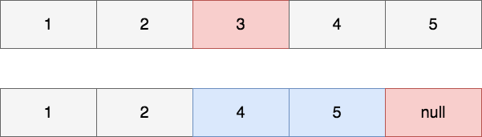

## ArrayList
`ArrayList` - одна из самых популярных и часто используемых реализаций интерфейса `List`.
Это стандартная реализация из `JDK`.

Данная реализация основана на массиве, но, в отличии от массивов в `Java`, `ArrayList` может
менять размер, а также может хранить `null`.

### Как устроено внутри?
Прежде всего обратим внимание на поля класса и выделим наиболее значимые:
* `private static final int DEFAULT_CAPACITY = 10;`
* `transient Object[] elementData;`
* `private int size;`

Количество элементов в массиве хранится в переменной `size`.
Стоит отметить, что `size` - это не размер массива, это именно количество элементов.

> Если представить массив как шкаф с ящиками, то размер массива - это количество ящиков,
 а количество элементов массива - это количество занятых ящиков.

Как было сказано выше - в основе реализации лежит массив. Массив надо как-то инициализировать.
Если не указать размер массива при создании объекта `ArrayList` будет создан массив размером `10`.
За это отвечает как раз `DEFAULT_CAPACITY`.

Можно указать свою емкость списка использовав конструктор:
```java
public ArrayList(int initialCapacity) {/*code*/}
```

Элементы `ArrayList` хранятся в `elementData`, отметим тип - это `Object`.
Приведение к параметризованному типу происходит при обращении - при попытке достать элемент.

### Добавление элементов
За добавление элемента в `ArrayList` отвечает метод - `add(value)`,
при этом проверяется достаточно ли места для вставки - это делает метод `ensureCapacity`.

Т.е сначала мы проверяем - хватает ли места для добавления нового элемента - если хватает, то просиходит добавление элемента в конец:
`elementData[size++] = element;`

При необходимости происходит увеличение массива, но довольно интересным способом:

Создается новый массив - большего размера и вызывается `System.arrayCopy`, который копирует старый массив в новый,
 после чего новый элемент копируется в новый, только что созданный и заполненный, массив.

 Т.е мы создаем копию старого массива, после чего получаем уже массив содержащий старый, но большего размера, у которого достаточно места для добавления элемента в конец.

 Следующий интересный вопрос - это по какому правилу увеличивается размер массива?

#### Увеличение размера массива
Новый массив создается по правилу:
```java
int oldCapacity = elementData.length;
int newCapacity = oldCapacity + (oldCapacity >> 1);
```

Что значит, что размер будет увеличен в **полтора раза**.

После того, как стало понятно каким образом происходит добавлние элементов в конец массива возникает вопрос - как работает добавление в середину или начало?

#### Добавление в середину/начало
Добавление в середину или начало происходит в три этапа:
1. Проверяется - достаточно ли места в массиве для вставки нового элемента:
```java
ensureCapacity(size+1);
```
2. Идет подготовка места для вставки:
```java
System.arraycopy(elementData, index, elementData, index + 1, size - index);
```

Т.е все, что **правее** места вставки, включая само место вставки - сдвигается правее, после чего происходит перезапись значения с указанным индексом:
```java
elementData[index] = element;
size++;
```
Проиллюстрируем это:


При этом, если места для вставки нет - `System.arrayCopy` вызовется дважды - первый раз при создании нового массива, как описано выше, а второй - уже непосредственно при вставке нового элемента.
#### Добавление коллекции

### Удаление
Удалять элементы можно двумя способами:
* по индексу `remove(index)`
* по значению `remove(value)`

#### Удаление по индексу
При удалении по индексу идет смещение всех элементов **влево** - с помощью все того же `System.arrayCopy`:

Сначала определяется количество элементов, которые необходимо скопировать `int numMoved = size - index - 1;`, после чего они копируются с помощью `System.arrayCopy`,
благодаря чему получается 'сдвиг' влево - следовательно последний элемент уже не нужен - про него забываем:
```java
elementData[--size] = null;
```

Проиллюстрируем это:


#### Удаление по значению
При удалении по значению происходит сначала поиск нужного элемента - мы перебираем весь массив поэлементно, пока не находим необходимый.
После чего все происходит также, как и при удалении по индексу.

Удален будет **первый найденный** элемент.

#### Важно помнить!
Важно помнить, что при удалении элементов `capacity` - длина `elementData` - у  `ArrayList` не изменяется.
Это может привести к утечкам в памяти - добавив 1000 элементов в `ArrayList`, а после удалив 999 - размер `elementData` не изменится.

Для его изменения необходимо воспользоваться методом `trimToSize()`. Данный метод урежет `capacity` до `size`.

Т.е он урежет размер массива до количества элементов.
В примере выше - при удалении 999 элементов из 1000 доступных и вызове `trimToSize()` мы поулучим размер массива равный `1`.

Отсюда можно сделать вывод - если у нас есть `ArrayList` с элеменатми и он
будет иметь постоянный размер - можно сразу вызвать `trimToSize()` и ужать неиспользованные 'ячейки'.

Также, не стоит постоянно вызывать `trimToSize()` - особенно, если вы добавили, например, 1000 элементов, потом удалили 999, вызвали `trimToSize()` и снова добаивли 1000 - ведь
*размер* массива после `trimToSize()` в нашем случае станет 1!

#### Многопоточность
Необходимо отметить тот факт, что все методы `ArrayList` - не синхронизированы.
Поэтому добавление из различных потоков в такой массив **строго** не рекомендуется.

### Итоги
Реализация `ArrayList` из стандартной библиотеки `Java` предоставляет нам:

* Быстрый доступ к элементам по *индексу* за время **O(1)**.
* Доступ к элементам по *значению* за **линейное** время **O(n)**.
* Позволяет хранить любые значения - в том числе и `null`.
* Не синхронизирован.
* Автоматически не меняет размер внутреннего массива при удалении элементов.
