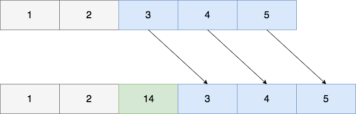
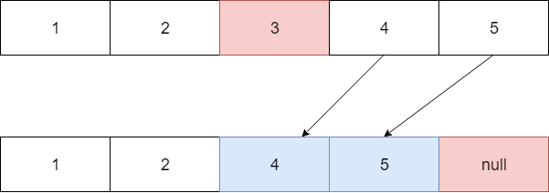

# java.util.ArrayList

- [java.util.ArrayList](#javautilarraylist)
  - [Введение](#введение)
  - [Реализация](#реализация)
  - [Добавление элемента](#добавление-элемента)
    - [Добавление в конец](#добавление-в-конец)
    - [Добавление в середину или начало](#добавление-в-середину-или-начало)
  - [Удаление элемента](#удаление-элемента)
    - [Удаление по индексу](#удаление-по-индексу)
    - [Удаление по значению](#удаление-по-значению)
  - [Важно знать](#важно-знать)
    - [trimToSize](#trimtosize)
    - [modCount](#modcount)
    - [ConcurrentModificationException](#concurrentmodificationexception)
    - [Борьба с ConcurrentModificationException](#борьба-с-concurrentmodificationexception)
      - [Вариант 1](#вариант-1)
      - [Вариант 2](#вариант-2)
      - [Вариант 3](#вариант-3)
      - [Вариант 4](#вариант-4)
  - [Многопоточность](#многопоточность)
  - [Производительность](#производительность)
  - [Заключение](#заключение)
  - [Полезные ссылки](#полезные-ссылки)

## Введение

Класс `java.util.ArrayList` является одной из самых популярных и часто используемых реализаций интерфейса `java.util.List`.

Данная реализация основана на массиве, но, в отличии от массивов в `Java`, `java.util.ArrayList` может динамически менять размер, а также хранить `null` значения.

## Реализация

Прежде всего обратим внимание на поля класса и выделим наиболее значимые:

```java
    /**
     * Default initial capacity.
     */
    private static final int DEFAULT_CAPACITY = 10;

    /**
     * Shared empty array instance used for empty instances.
     */
    private static final Object[] EMPTY_ELEMENTDATA = {};

    /**
     * Shared empty array instance used for default sized empty instances. We
     * distinguish this from EMPTY_ELEMENTDATA to know how much to inflate when
     * first element is added.
     */
    private static final Object[] DEFAULTCAPACITY_EMPTY_ELEMENTDATA = {};

    /**
     * The array buffer into which the elements of the ArrayList are stored.
     * The capacity of the ArrayList is the length of this array buffer. Any
     * empty ArrayList with elementData == DEFAULTCAPACITY_EMPTY_ELEMENTDATA
     * will be expanded to DEFAULT_CAPACITY when the first element is added.
     */
    transient Object[] elementData; // non-private to simplify nested class access

    /**
     * The size of the ArrayList (the number of elements it contains).
     *
     * @serial
     */
    private int size;
```

Количество элементов в списке хранится в переменной `size`.

Важно понимать, что `size` - это не размер массива, это именно количество элементов.
Если представить массив как шкаф с ящиками, то размер массива - это количество ящиков, а количество элементов массива - это количество **занятых** ящиков.

В основе реализации лежит массив и за это отвечает поле `elementData`.

При создании списка можно указать начальный размер массива, воспользовавшись конструктором и передав туда значение желаемого размера:

```java
    /**
     * Constructs an empty list with the specified initial capacity.
     *
     * @param  initialCapacity  the initial capacity of the list
     * @throws IllegalArgumentException if the specified initial capacity
     *         is negative
     */
    public ArrayList(int initialCapacity) {
        if (initialCapacity > 0) {
            this.elementData = new Object[initialCapacity];
        } else if (initialCapacity == 0) {
            this.elementData = EMPTY_ELEMENTDATA;
        } else {
            throw new IllegalArgumentException("Illegal Capacity: "+
                                               initialCapacity);
        }
    }
```

Более того, если вы знаете, что в список будет добавлено большое количество элементов, то для достижения лучшей производительности сразу задавайте необходимый размер через `initialCapacity`.
Лучше с самого начала зарезервировать массив нужного размера, чем несколько раз терять время на его, хоть и динамическое, но расширение.

Здесь все также как и в примере со шкафом. Если вы знаете сколько у вас вещей, то сразу покупаете шкаф необходимого размера и не теряете время.
Если вы покупаете небольшой шкаф, а вещей у вас много, то по мере заполнения вашего шкафа вы будете вынуждены его сменить на более вместительный.
Потом оказывается, что вещей все еще больше и вы снова меняете шкаф. В конце концов вы разместите все вещи, но пока вы вот таким способом подбираете шкаф вы тратите время и ресурсы.

Если не указать размер массива при создании объекта `java.util.ArrayList` в поле `elementData` будет пустой массив:

```java
    /**
     * Constructs an empty list with an initial capacity of ten.
     */
    public ArrayList() {
        this.elementData = DEFAULTCAPACITY_EMPTY_ELEMENTDATA;
    }
```

Это значение хранится в константе `DEFAULTCAPACITY_EMPTY_ELEMENTDATA` и является пустым массивом.

---

**Вопрос**:

Элементы `java.util.ArrayList` хранятся в `elementData`, как уже было отмечено, однако тип массива `java.lang.Object`.

А где же параметризация?

**Ответ**:

Приведение к параметризованному типу происходит при обращении, т.е при попытке достать элемент.

Это связано с тем, как устроена параметризация(`Generic`-и) в `Java`.

Об этом можно прочитать [здесь](../generics/generics.md).

---

Теперь разберем то, как происходит добавление элементов в список и за счет чего достигается динамичность размера.

## Добавление элемента

В `java.util.ArrayList` существует несколько методов для добавления элемента, но для начала разберем наиболее часто используемый.

### Добавление в конец

За добавление элемента в конец у `java.util.ArrayList` отвечает метод:

```java
    /**
     * Appends the specified element to the end of this list.
     *
     * @param e element to be appended to this list
     * @return {@code true} (as specified by {@link Collection#add})
     */
    public boolean add(E e) {
        modCount++;
        add(e, elementData, size);
        return true;
    }

    /**
     * This helper method split out from add(E) to keep method
     * bytecode size under 35 (the -XX:MaxInlineSize default value),
     * which helps when add(E) is called in a C1-compiled loop.
     */
    private void add(E e, Object[] elementData, int s) {
        if (s == elementData.length)
            elementData = grow();
        elementData[s] = e;
        size = s + 1;
    }
```

Перед тем, как вставить добавляемый элемент в список происходит проверка: достаточно ли места для вставки? Есть ли у нас свободные ящики в нашем шкафу?
Если да, место есть, то происходит добавление элемента в конец и при этом возвращается `true`, так как список изменяется:

```java
elementData[s] = e;
size = s + 1;
```

Что происходит в случае, если массив, хранящий элементы, полностью заполнен?

Ответ прост: надо **увеличить** массив, хранящий элементы, т.е. мы покупаем новый шкаф! За это отвечает метод `grow`:

```java
    /**
     * Increases the capacity to ensure that it can hold at least the
     * number of elements specified by the minimum capacity argument.
     *
     * @param minCapacity the desired minimum capacity
     * @throws OutOfMemoryError if minCapacity is less than zero
     */
    private Object[] grow(int minCapacity) {
        int oldCapacity = elementData.length;
        if (oldCapacity > 0 || elementData != DEFAULTCAPACITY_EMPTY_ELEMENTDATA) {
            int newCapacity = ArraysSupport.newLength(oldCapacity,
                    minCapacity - oldCapacity, /* minimum growth */
                    oldCapacity >> 1           /* preferred growth */);
            return elementData = Arrays.copyOf(elementData, newCapacity);
        } else {
            return elementData = new Object[Math.max(DEFAULT_CAPACITY, minCapacity)];
        }
    }

    private Object[] grow() {
        return grow(size + 1);
    }
```

Расширение списка происходит следующим образом:

Если список до этого был пуст, т.е. это первое добавление элемента в список вообще, то будет создан массив размера в константе `DEFAULT_CAPACITY`, это значение 10:

```java
elementData = new Object[Math.max(DEFAULT_CAPACITY, minCapacity)];
```

Если в массиве уже были элементы до вставки, то рассчитывается новый размер массива:

```java
int newCapacity = ArraysSupport.newLength(
                    oldCapacity,
                    minCapacity - oldCapacity, /* minimum growth */
                    oldCapacity >> 1           /* preferred growth */
                );
```

Здесь мы пропустим код `ArraysSupport.newLength`, он немного запутан из-за оптимизаций, в общем случае можно читать, что размер будет вычислен по следующему правилу:

```java
int oldCapacity = elementData.length;
int newCapacity = oldCapacity + (oldCapacity >> 1);
```

Это означает, что размер будет увеличен в **полтора раза**.

> К слову говоря, раньше именно этот код и был при рассчетах. Оптимизации в `ArraysSupport.newLength` связаны именно с расширением списков на размеры близкие к `Integer.MAX_VALUE`.

После того, как новый размер посчитан, происходит копирование старого массива в новый:

```java
elementData = Arrays.copyOf(elementData, newCapacity);
```

По итогу у вас оказывается новый массив, в полтора раза больше старого, в котором хранятся все данные из старого и место для нового, добавляемого элемента.

Теперь, когда место есть, то происходит обычное добавление элемента в конец.

Представьте, что у вас есть шкаф с 10 полками (наш `DEFAULT_CAPACITY`), вы покупаете и складываете в него вещи, пока есть свободные полки в шкафу все отлично, но вот вы купили 11-ю вещь и место в шкафу закончилось. Поэтому вы покупаете новый шкаф, с большим количеством ячеек, перекладываете туда свои старые вещи (в том же порядке, что они хранились) и 11-ю покупку. Старый же шкаф продается на `Avito`: отдается `GarbageCollector`-у, который его уничтожит и освободит память.

Теперь рассмотрим добавлние элемента в середину или начало списка.

### Добавление в середину или начало

За добавление элемента в конкретную ячейку по индексу у `java.util.ArrayList` отвечает метод:

```java
    /**
     * Inserts the specified element at the specified position in this
     * list. Shifts the element currently at that position (if any) and
     * any subsequent elements to the right (adds one to their indices).
     *
     * @param index index at which the specified element is to be inserted
     * @param element element to be inserted
     * @throws IndexOutOfBoundsException {@inheritDoc}
     */
    public void add(int index, E element) {
        rangeCheckForAdd(index);
        modCount++;
        final int s;
        Object[] elementData;
        if ((s = size) == (elementData = this.elementData).length)
            elementData = grow();
        System.arraycopy(elementData, index,
                         elementData, index + 1,
                         s - index);
        elementData[index] = element;
        size = s + 1;
    }
```

Добавление происходит в несколько этапов:

1. Идет проверка на то, что индекс, по которому происходит вставка, не выходит за границы списка:

    ```java
        /**
         * A version of rangeCheck used by add and addAll.
         */
        private void rangeCheckForAdd(int index) {
            if (index > size || index < 0)
                throw new IndexOutOfBoundsException(outOfBoundsMsg(index));
        }
    ```

2. После этого идет стандартная проверка на то, достаточно ли места в массиве для вставки нового элемента, точно та же самая, как и при вставке в конец списка.
При необходимости происходит расширение списка:

    ```java
            if ((s = size) == (elementData = this.elementData).length)
                elementData = grow();
    ```

3. Далее массив подготоваливается для вставки:

    ```java
    System.arraycopy(elementData, index, elementData, index + 1, s - index);
    ```

    Подготовка происходит следующим образом: все элементы, находящиеся **правее** места вставки, включая само место вставки, сдвигается правее. Достигается это копированием правой части массива.

4. Ну и наконец происходит непосредственно вставка значения по указанному индексу:

    ```java
    elementData[index] = element;
    size = s + 1;
    ```

Описанный процесс изображен на рисунке:



Если места для вставки нет, то `System.arrayCopy` будет вызван дважды: первый раз при расширении, т.е создании нового массива, а второй раз уже непосредственно при вставке нового элемента.

## Удаление элемента

Удаление элемента из `java.util.ArrayList` возможно двумя способами:

1. `public E remove(int index)` - это удаление по индексу (по позиции в списке)
2. `public boolean remove(Object o)` - это по значению

### Удаление по индексу

За удаление по индексу у `java.util.ArrayList` отвечает метод:

```java
    /**
     * Removes the element at the specified position in this list.
     * Shifts any subsequent elements to the left (subtracts one from their
     * indices).
     *
     * @param index the index of the element to be removed
     * @return the element that was removed from the list
     * @throws IndexOutOfBoundsException {@inheritDoc}
     */
    public E remove(int index) {
        Objects.checkIndex(index, size);
        final Object[] es = elementData;

        @SuppressWarnings("unchecked") E oldValue = (E) es[index];
        fastRemove(es, index);

        return oldValue;
    }

    /**
     * Private remove method that skips bounds checking and does not
     * return the value removed.
     */
    private void fastRemove(Object[] es, int i) {
        modCount++;
        final int newSize;
        if ((newSize = size - 1) > i)
            System.arraycopy(es, i + 1, es, i, newSize - i);
        es[size = newSize] = null;
    }
```

В начале идет привычная проверка на то, не выходит ли индекс за размер списка:

```java
Objects.checkIndex(index, size);
```

После чего идет смещение всех элементов **влево** с помощью `fastRemove`.

Для упрощения понимания работы, разобьем код на шаги:

1. Определяется количество элементов, которые необходимо скопировать.

    ```java
    int numMoved = size - index - 1;
    ```

2. Происходит копирование с помощью уже знакомого `System.arrayCopy`:

    ```java
    System.arraycopy(elementData, index + 1, elementData, index, numMoved);
    ```

3. Благодаря этому получается 'сдвиг' влево, а значит, последний элемент уже не нужен, поэтому его отдаем на 'съедение' `GarbageCollectror`-у.

    ```java
    elementData[--size] = null; // clear to let GC do its work
    ```

Описанный процесс изображен на рисунке:



В конце будет возвращен удаленный из списка элемент.

### Удаление по значению

За удаление по значению у `java.util.ArrayList` отвечает метод:

```java
    /**
     * Removes the first occurrence of the specified element from this list,
     * if it is present.  If the list does not contain the element, it is
     * unchanged.  More formally, removes the element with the lowest index
     * {@code i} such that
     * {@code Objects.equals(o, get(i))}
     * (if such an element exists).  Returns {@code true} if this list
     * contained the specified element (or equivalently, if this list
     * changed as a result of the call).
     *
     * @param o element to be removed from this list, if present
     * @return {@code true} if this list contained the specified element
     */
    public boolean remove(Object o) {
        final Object[] es = elementData;
        final int size = this.size;
        int i = 0;
        found: {
            if (o == null) {
                for (; i < size; i++)
                    if (es[i] == null)
                        break found;
            } else {
                for (; i < size; i++)
                    if (o.equals(es[i]))
                        break found;
            }
            return false;
        }
        fastRemove(es, i);
        return true;
    }
```

При удалении по значению происходит поиск удаляемого элемента.
Идет перебор массива поэлементно, пока не будет найдет необходимый.

> Обратите внимание на то, что здесь использован `break with label` (место с `break found;`). Несмотря на то, что обычно его использование считается плохим тоном, в некоторых случаях он применяется!

После чего происходит то же самое, что и при удалении по индексу.

При удалении по значению **ключевую** роль играет переопределенный [метод equals](../../object/equals.md), так как удаляемый элемент ищется с его помощью:

```java
o.equals(es[i])
```

Заметьте, что удаление `null` элементов списка и удаление обычных объектов происходит в разных циклах.

Если в списке присутствуют дубли, то удален будет **первый найденный** элемент!

## Важно знать

### trimToSize

Необходимо помнить, что при удалении элементов из списка размер массива `elementData`, хранящего наши элементы, не изменяется. Т.е значение `capacity` остается прежним.

Разберем это на примере:

Создадим список и добавим в него 1000 элементов, после чего удалим 999 из них.

Так вот, несмотря на то, что элементы из списка мы удалили, размер внутреннего массива, т.е количество ячеек в массиве не изменится.

Снова обратимся к примеру со шкафом: представьте, что из своего шкафа выбросили часть вещей. Размер шкафа и его вместимость при этом остались теми же, просто часть полок не заняты.

Когда это может быть плохо? Тогда, когда вы знаете, что в этот список уже не будет добавляться такое количество элементов. Память будет занята этими ячейками массива и не использоваться, так как они всегда будут не заняты/простаивать.

Точно также как и в жизни, если вы поставите гигантский шкаф, который будет вечно пустовать и занимать большое пространство!

Для того, чтобы держать массив в 'актуальном' состоянии и 'ужать' его размер после удаления большого количества элементов существует метод `trimToSize`:

```java
    /**
     * Trims the capacity of this {@code ArrayList} instance to be the
     * list's current size.  An application can use this operation to minimize
     * the storage of an {@code ArrayList} instance.
     */
    public void trimToSize() {
        modCount++;
        if (size < elementData.length) {
            elementData = (size == 0)
              ? EMPTY_ELEMENTDATA
              : Arrays.copyOf(elementData, size);
        }
    }
```

Данный метод урежет размер массива до количества элементов.

В примере с удалением 999 элементов и вызове `trimToSize()` мы поулучим размер массива равный `1`.

Помните, что если вы заполнили список и не планируете, что этот список будет больше расширяться, то можно на таком списке вызвать `trimToSize()` и ужать неиспользованные 'ячейки'.

Однако это не значит, что нужно постоянно вызывать этот метод, особенно, если вы постоянно добавляете и удаляете элементы из списка.

### modCount

На протяжении разбора всех методов, изменяющих список, встречается переменная `modCount`.

Давайте разберем, что это и зачем:

```java
    /**
     * The number of times this list has been <i>structurally modified</i>.
     * Structural modifications are those that change the size of the
     * list, or otherwise perturb it in such a fashion that iterations in
     * progress may yield incorrect results.
     *
     * <p>This field is used by the iterator and list iterator implementation
     * returned by the {@code iterator} and {@code listIterator} methods.
     * If the value of this field changes unexpectedly, the iterator (or list
     * iterator) will throw a {@code ConcurrentModificationException} in
     * response to the {@code next}, {@code remove}, {@code previous},
     * {@code set} or {@code add} operations.  This provides
     * <i>fail-fast</i> behavior, rather than non-deterministic behavior in
     * the face of concurrent modification during iteration.
     *
     * <p><b>Use of this field by subclasses is optional.</b> If a subclass
     * wishes to provide fail-fast iterators (and list iterators), then it
     * merely has to increment this field in its {@code add(int, E)} and
     * {@code remove(int)} methods (and any other methods that it overrides
     * that result in structural modifications to the list).  A single call to
     * {@code add(int, E)} or {@code remove(int)} must add no more than
     * one to this field, or the iterators (and list iterators) will throw
     * bogus {@code ConcurrentModificationExceptions}.  If an implementation
     * does not wish to provide fail-fast iterators, this field may be
     * ignored.
     */
    protected transient int modCount = 0;
```

Итак, как следует из документации, параметр `modCount` отвечает за количество раз, когда список был структурно изменен: поменялся размер, либо на список было оказано такое действие, которое может привести к неверным результатам при итерации по списку.

Это введено для обеспечения детерменированности работы [итераторов](../../patterns/behavioral/iterator.md).

Представьте, что вы проходите по списку, элемент за элементом, вы обошли 10 элементов и переходите к 11-му, в полной уверенности, что обработанные элементы в строю и тут, оказывается, что у вас список не 11 элементов содержит, а 6 - потому что кто-то, работая параллельно с вами, уже изменил ваш список, убрав оттуда что-то!

В результате, работа списка недетерменирована.

Отсюда и необходимость этой переменной: сообщить о модификациях списка, которые не ждали.

Все наследники `java.util.AbstractList` имеют свойство `modCount`, но использование его необязательно. Другими словами, ваша реализация `java.util.AbstractList` может игнорировать `modCount`, при желании. Однако в реализации `java.util.ArrayList` это свойство используется.

### ConcurrentModificationException

Итак, мы выяснили, что параметр `modCount` отвечает за количество раз, когда список был структурно изменен. Но не говорили о том, что **будет**, если список был структурно изменен, а мы по нему итерируемся?

Разумеется, будет ислкючение: `java.util.ConcurrentModificationException`.

Каждый итератор на список при создании запоминает текущий `modCount` в ожидаемый:

```java
    /**
     * An optimized version of AbstractList.Itr
     */
    private class Itr implements Iterator<E> {
        int cursor;       // index of next element to return
        int lastRet = -1; // index of last element returned; -1 if no such
        int expectedModCount = modCount;
        // ....
```

И при вызове каждого метода `remove`, `next` проверяет не было ли изменения списка (тело метода не поностью приводится)?

```java
    public E next() {
        checkForComodification();
        // ....
    }

    public void remove() {
        if (lastRet < 0)
            throw new IllegalStateException();
        checkForComodification();
        // .....
    }

    final void checkForComodification() {
        if (modCount != expectedModCount)
            throw new ConcurrentModificationException();
    }
```

---

**Вопрос**:

Какой результат будет при выполнении данного куска кода:

```java
public class Main {
    public static void main(String[] args) {
        List<String> elems = new ArrayList<>();
        elems.add("1");
        elems.add("2");
        elems.add("0");
        elems.add("3");
        elems.add("4");

        for(String elem: elems) {
            System.out.println(elem);

            if (elem.equals("0")) {
                elems.remove(elem);
            }
        }
    }
}
```

**Ответ**:

При использовании `foreach` конструкции, будет неявно создан итератор, с помощью которого будет производиться обход цикла.
Однако, **изменение** списка будет не через итератор. И возникнет та самая ситуация, когда список изменен извне, а мы по нему итерируемся.

Поэтому будет выброшено `ConcurrentModificationException`.

```java
1
2
0
Exception in thread "main" java.util.ConcurrentModificationException
    at java.base/java.util.ArrayList$Itr.checkForComodification(ArrayList.java:1013)
    at java.base/java.util.ArrayList$Itr.next(ArrayList.java:967)
    at Main.main(Main.java:13)
```

---

### Борьба с ConcurrentModificationException

Как в таком случае удалить элемент?

#### Вариант 1

Самый простой вариант - это удалять с помощью того же итератора, что и используется для обхода списка.
Да, вариант с `foreach` не подойдет, надо будет явно итерироваться:

```java
    final Iterator<String> each = elems.iterator();
    while (each.hasNext()) {
        if ("0".equals(each.next())) {
            each.remove();
        }
    }
```

#### Вариант 2

Воспользоваться методом `removeIf`, который предоставляет нам `java.util.Collection`:

```java
    default boolean removeIf(Predicate<? super E> filter) {
        Objects.requireNonNull(filter);
        boolean removed = false;
        final Iterator<E> each = iterator();
        while (each.hasNext()) {
            if (filter.test(each.next())) {
                each.remove();
                removed = true;
            }
        }
        return removed;
    }
```

Как видите - это точно то же, что и первый вариант, просто условие удаления вынесено в `Predicate`.

#### Вариант 3

Использовать `Stream API` и не модифицировать коллекцию, а создавать новую, после применения к ней функций и цепочки вызовов.

```java
var result = elems.stream().filter(e -> !e.equals("0")).toList();
```

#### Вариант 4

Использовать `concurrent`-реализацию `java.util.ArrayList`. Что подводит нас к теме многопоточности в работе со списками.

## Многопоточность

Все методы `java.util.ArrayList` не синхронизированы.
Поэтому добавление из различных потоков в такой список **строго** не рекомендуется.

Если необходима `concurrent`-реализация `java.util.ArrayList`, то стоит воспользоваться `java.util.concurrent.CopyOnWriteArrayList`.

В `Java` также существует класс утилит `java.util.Collections`, предоставляющий статические методы для преобразования в `concurrent`-структуру данных:

```java
List m = Collections.synchronizedList(new ArrayList(...));
```

Но тут есть подводный камень.

Посмотрим на метод:

```java
    public static <T> List<T> synchronizedList(List<T> list) {
        return (list instanceof RandomAccess ?
                new SynchronizedRandomAccessList<>(list) :
                new SynchronizedList<>(list));
    }
```

Все, что делает метод `synchronizedList` - это оборачивает реализацию `java.util.List` в `SynchronizedList`:

```java
static class SynchronizedList<E>
        extends SynchronizedCollection<E>
        implements List<E> {
        private static final long serialVersionUID = -7754090372962971524L;

        final List<E> list;

        SynchronizedList(List<E> list) {
            super(list);
            this.list = list;
        }

        public E get(int index) {
            synchronized (mutex) {return list.get(index);}
        }
        
        public E set(int index, E element) {
            synchronized (mutex) {return list.set(index, element);}
        }

        // ...
}
```

Где методы синхронизованы на `mutex`:

```java
 final Object mutex;     // Object on which to synchronize
```

Грубо говоря, это превращает `java.util.ArrayList` в `java.util.Vector`. А это серьезно снижает производительность.

В целом, я бы не использовал `Collections.synchronizedList(...)`, разве что необходимо синхронизировать небольшую по объему структуру и производительность не важна.

## Производительность

Благодаря тому, что в основе реализации лежит массив, `java.util.ArrayList` предоставляет доступ к элементам `по индексу` за константное время: `O(1)`.

В то время как доступ к элементу `по значению` требует перебор списка до нахождения искомого, что выражается в линейном времени доступа: `O(N)`.

## Заключение

Реализация `java.util.ArrayList` из стандартной библиотеки `Java` предоставляет быстрый доступ к элементам по индексу и линейное время доступа к элементам по значению.

Благодаря использованию `native`-метода `System.arrayCopy` реализация `java.util.ArrayList` является предпочтительным выбором при необходимости использования списка.

> Ключевое слово `native` означает, что метод реализован в платформенно-зависимом коде, чаще всего на `C/C++`, и скомпонован в виде динамической библиотеки.
>
> Эта реализация зависит от `JVM`.
>
> Возможно, вас сейчас это напугало, но на самом деле достаточно просто понимать, что 
> `native` означает лишь то, что вызываемый код, реализован не на `Java`.

Данная реализация позволяет хранить любые значения, в том числе дубликаты и `null`.

Не синхронизована, поэтому доступ из разных потоков **не рекомендуется**.

Если количество добавляемых элементов в список велико, то имеет смысл сразу задать должное `capacity`, что увеличит скорость работы и сэкономит ресурсы.

Данная реализация динамически меняет размер при добавлении элементов, но не уменьшает размер внутреннего массива при удалении.

Для того, чтобы контролировать размер массива при удалении элементов стоит воспользоваться методом `trimToSize()`.

## Полезные ссылки

1. [Структуры данных в картинках. ArrayList](https://habr.com/ru/post/128269/)
2. [Oracle JavaDoc ArrayList](https://docs.oracle.com/en/java/javase/15/docs/api/java.base/java/util/ArrayList.html)
3. [Будников Александр ArrayList, LinkedList. Java собеседование](https://www.youtube.com/watch?v=IyPaSUFrhaM)