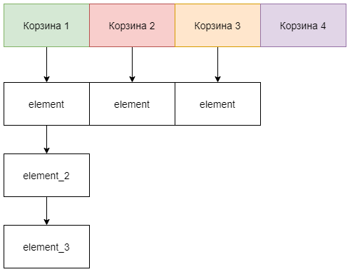

# java.util.HashMap

- [java.util.HashMap](#javautilhashmap)
  - [Введение](#введение)
  - [Реализация](#реализация)
    - [Добавление элемента](#добавление-элемента)
    - [Коллизии](#коллизии)
    - [Удаление элемента](#удаление-элемента)
  - [Важно знать](#важно-знать)
  - [Многопоточность](#многопоточность)
  - [Производительность](#производительность)
  - [Заключение](#заключение)
  - [Полезные ссылки](#полезные-ссылки)

## Введение

Класс `java.util.HashMap` является одной из самых популярных и часто используемых реализаций интерфейса `java.util.Map`. Как уже было сказано во [введении](./intro.md), это структура данных, реализующая интерфейс ассоциативного массива. По сути, это набор пар ключ-значение.

Реализация не гарантирует порядок хранения элементов, однако в лучшем случае предоставляет константное время для добавления, удаления, получение и проверку на содержание элемента.
Но при условии отсутствия коллизий, т.е хорошо определенной хэш-функции добавляемых элементов. В `Java` за хэш-функцию отвечает метод [hashCode](../../object/hashcode.md).

Реализация может динамически менять размер и позволяет хранить `null` значения.

До этого вы уже познакомились с массивами, где обращение к элементу просиходило по индексу. Т.е каждому элементу в массиве соответствует свой номер.


Представьте себе набор пронумерованных корзин, стоящих в ряд. В каждую корзину вы можете положить только одну вещь. Вы кладете обувь на в первую корзину, кофту во вторую и т.д. Грубо говоря, вы уже заранее знаете по какому индексу обращаться к элементу - именно поэтому вы быстро находите нужную вещь.

Теперь представьте точно такой же массив, но индекс элемента зависит от самого элемента. Ведь добавление в хэш-таблицу идет по ключу, а ключом может быть что угодно, любой объект. В таком случае надо как-то сопоставить каждому ключу `int`-овое значение, его позицию в массиве. Для этого и нужен `hash`-код объекта. По этому `hash`-коду, нормализовав по размеру массива, получаем позицию в массиве. Именно поэтому и нет упорядоченности элементов.

Возвращаясь к примеру с корзинами, представьте, что корзины покрашены в цвета. Добавляя пару вы, с помощью `hashCode` ключа, понимаете цвет корзины и уже после этого добавляете туда элемент. Т.е `hashCode` - это цвет, то, в какую корзину вы будете добавлять элемент.

Если в каждой корзине будет по одному элементу, то доступ до такого элемента будет осуществляться максимально быстро, как в обычном массиве, ведь вы знаете сразу где искать элемент.


Однако, что будет, если произойдет *коллизия*, т.е `hashCode`-ы ключей добавляемых элементов совпадут? Как уже было сказано в заметке о [hashCode](../../object/hashcode.md), такое вполне может произойти, особенно, если хэш-функция написана плохо. Элемент будет добавлен, но в таком случае доступ до него уже будет не такой быстрый, так как корзину по цвету мы найдем быстро, а уже в самой корзине надо будет искать нужный элемент.

Это напоминает ситуацию, когда неряшливый человек закидывает в корзину вещи, после чего ему приходится ее разгребать в поисках нужной. Ведь в корзине уже много вещей! И пусть вы знаете, что шапка будет в условной 'зеленой' корзине, но там же кроме искомой шапки еще лежит десять других и свитер.



> Подобный способ разрешения ситуации с коллизиями элементов называется [chaning](https://ru.wikipedia.org/wiki/%D0%A5%D0%B5%D1%88-%D1%82%D0%B0%D0%B1%D0%BB%D0%B8%D1%86%D0%B0#%D0%9C%D0%B5%D1%82%D0%BE%D0%B4_%D1%86%D0%B5%D0%BF%D0%BE%D1%87%D0%B5%D0%BA). Существует еще также и [метод открытой адресации](https://ru.wikipedia.org/wiki/%D0%A5%D0%B5%D1%88-%D1%82%D0%B0%D0%B1%D0%BB%D0%B8%D1%86%D0%B0#%D0%9E%D1%82%D0%BA%D1%80%D1%8B%D1%82%D0%B0%D1%8F_%D0%B0%D0%B4%D1%80%D0%B5%D1%81%D0%B0%D1%86%D0%B8%D1%8F), однако в `java.util.HashMap` за реализацию взят именно `chaining`.

Поэтому коллизии серьезно влияют на производительность `java.util.HashMap`.

Теперь пора подробнее посмотреть на реализацию и алгоритмы добавления, удаления, а также поиск элементов.

## Реализация

Объявление выглядит как:

```java
public class HashMap<K,V> extends AbstractMap<K,V>
    implements Map<K,V>, Cloneable, Serializable {
        // ...
}
```

Это, наверное, один из самых больших по размеру классов в стандартной библиотеке `Java`, поэтому полностью его приводить не имеет смысла. Разберем только самые важные компоненты.

Заметьте, что реализуются интерфейсы-маркеры `java.lang.Cloneable` и `java.io.Serializable`. Т.е структура данных поддерживает [clone](../../object/clone.md) (но помните о подводных камнях такого подхода) и [сериализацию](../../other/../serialization/binary.md).

Количество хранящихся пар содержится в переменной `size`:

```java
    /**
     * The number of key-value mappings contained in this map.
     */
    transient int size;
```

Важно понимать, что `size` - это не размер ассоциативного массива (не количество корзин), это именно количество хранящихся элементов.

Как уже было сказано выше, `java.util.HashMap` - это массив пар ключ-значение.

```java
    /**
     * The table, initialized on first use, and resized as
     * necessary. When allocated, length is always a power of two.
     * (We also tolerate length zero in some operations to allow
     * bootstrapping mechanics that are currently not needed.)
     */
    transient Node<K,V>[] table;
```

---

**Вопрос**:

Возникает вопрос: что такое `Node` и зачем он нужен? 

**Ответ**:

В случае полного отсутствия коллизий хватило бы простого массива, так как каждый элемент находился бы в своей ячейке. Но коллизии неизбежны и возможны даже при очень хорошей хэш-функции. А при коллизии два элемента попадали бы в одну ячейку. Именно поэтому `table` - это не просто массив, а массив корзин, **buckets**.


Так вот то, как такая корзина устроена и есть `Node`. Каждая корзина - это [связный список](../list/linked_list.md).

Класс `Node` объявлен в `java.util.HashMap`, т.е. является вложенным:

```java
 static class Node<K,V> implements Map.Entry<K,V> {
        final int hash;
        final K key;
        V value;
        Node<K,V> next;

        // ...
}
```

* `final int hash` - хеш текущего элемента, который получается в результате хеширования ключа.
* `final K key` - ключ текущего элемента.
* `V value` - значение текущего элемента.
* `Node < K, V> next` - ссылка на следующий узел в пределах одной корзины.

---

Если не указать размер массива `table`, то при создании объекта `java.util.HashMap` будет создан массив размером `16`.
Это значение по-умолчанию, которое хранится в константе `DEFAULT_INITIAL_CAPACITY`.

```java
    /**
     * The default initial capacity - MUST be a power of two.
     */
    static final int DEFAULT_INITIAL_CAPACITY = 1 << 4; // aka 16
```

Можно указать размер при создании объекта списка воспользовавшись конструктором и передав туда значение желаемого размера:

```java
public HashMap(int initialCapacity) {
    // ...
}
```

> Однако надо помнить, что массив создается не в конструкторе, а в момент первого добавления элемента.

Точно также, как и в [java.util.ArrayList](../list/array_list.md), массив динамически расширяем. Решение, когда расширять массив, принимается на основании достижения предельного значения `threshold`:

```java
    /**
     * The next size value at which to resize (capacity * load factor).
     *
     * @serial
     */
    // (The javadoc description is true upon serialization.
    // Additionally, if the table array has not been allocated, this
    // field holds the initial array capacity, or zero signifying
    // DEFAULT_INITIAL_CAPACITY.)
    int threshold;

    /**
     * The load factor for the hash table.
     *
     * @serial
     */
    final float loadFactor;
```

Значение `threshold` рассчитывается по формуле:

```java
threshold = capacity * loadFactor;
```

По-умолчанию этот коэффициент равен:

```java
    /**
     * The load factor used when none specified in constructor.
     */
    static final float DEFAULT_LOAD_FACTOR = 0.75f;
```

Разумеется, как и в `java.util.ArrayList`, этот параметр можно задать через конструктор:

```java
   /**
     * Constructs an empty <tt>HashMap</tt> with the specified initial
     * capacity and load factor.
     *
     * @param  initialCapacity the initial capacity
     * @param  loadFactor      the load factor
     * @throws IllegalArgumentException if the initial capacity is negative
     *         or the load factor is nonpositive
     */
    public HashMap(int initialCapacity, float loadFactor) {
        if (initialCapacity < 0)
            throw new IllegalArgumentException("Illegal initial capacity: " +
                                               initialCapacity);
        if (initialCapacity > MAXIMUM_CAPACITY)
            initialCapacity = MAXIMUM_CAPACITY;
        if (loadFactor <= 0 || Float.isNaN(loadFactor))
            throw new IllegalArgumentException("Illegal load factor: " +
                                               loadFactor);
        this.loadFactor = loadFactor;
        this.threshold = tableSizeFor(initialCapacity);
    }
```

Логично, что эти параметры не могут принимать отрицательные значения, а также выходить за рамки максимально допустимой величины:

```java
    /**
     * The maximum capacity, used if a higher value is implicitly specified
     * by either of the constructors with arguments.
     * MUST be a power of two <= 1<<30.
     */
    static final int MAXIMUM_CAPACITY = 1 << 30;
```

Теперь перейдем к разбору реализаций основных методов.

### Добавление элемента

За добавление в `java.util.HashMap` отвечает метод `put`:

```java
    /**
     * Associates the specified value with the specified key in this map.
     * If the map previously contained a mapping for the key, the old
     * value is replaced.
     *
     * @param key key with which the specified value is to be associated
     * @param value value to be associated with the specified key
     * @return the previous value associated with <tt>key</tt>, or
     *         <tt>null</tt> if there was no mapping for <tt>key</tt>.
     *         (A <tt>null</tt> return can also indicate that the map
     *         previously associated <tt>null</tt> with <tt>key</tt>.)
     */
    public V put(K key, V value) {
        return putVal(hash(key), key, value, false, true);
    }
```

Как видно из описания, результат выполнения метода - это значение, которое ранее ассоциировалось по этому ключу и `null`, если по такому ключу значений не было, либо значение по такому ключу было `null`.

Перед добавлением элемента сначала происходит вычисление `hashCode` ключа:

```java
    /**
     * Computes key.hashCode() and spreads (XORs) higher bits of hash
     * to lower.  Because the table uses power-of-two masking, sets of
     * hashes that vary only in bits above the current mask will
     * always collide. (Among known examples are sets of Float keys
     * holding consecutive whole numbers in small tables.)  So we
     * apply a transform that spreads the impact of higher bits
     * downward. There is a tradeoff between speed, utility, and
     * quality of bit-spreading. Because many common sets of hashes
     * are already reasonably distributed (so don't benefit from
     * spreading), and because we use trees to handle large sets of
     * collisions in bins, we just XOR some shifted bits in the
     * cheapest possible way to reduce systematic lossage, as well as
     * to incorporate impact of the highest bits that would otherwise
     * never be used in index calculations because of table bounds.
     */
    static final int hash(Object key) {
        int h;
        return (key == null) ? 0 : (h = key.hashCode()) ^ (h >>> 16);
    }
```

Как видно из `JavaDoc` метода, это сделано для того, чтобы распределение по корзинам было более равномерным. Если коротко, то без этих дополнительных манипуляций маленькие значения `java.lang.Integer`, `java.lang.Float` и т.д. будут раскладывать значения в первые несколько корзин, что серьезно ухудшит производительность.

Теперь детально рассмотрим само добавление:

```java
    /**
     * Implements Map.put and related methods
     *
     * @param hash hash for key
     * @param key the key
     * @param value the value to put
     * @param onlyIfAbsent if true, don't change existing value
     * @param evict if false, the table is in creation mode.
     * @return previous value, or null if none
     */
    final V putVal(int hash, K key, V value, boolean onlyIfAbsent,
                   boolean evict) {
        Node<K,V>[] tab; Node<K,V> p; int n, i;
        if ((tab = table) == null || (n = tab.length) == 0)
            n = (tab = resize()).length;
        if ((p = tab[i = (n - 1) & hash]) == null)
            tab[i] = newNode(hash, key, value, null);
        else {
            Node<K,V> e; K k;
            if (p.hash == hash &&
                ((k = p.key) == key || (key != null && key.equals(k))))
                e = p;
            else if (p instanceof TreeNode)
                e = ((TreeNode<K,V>)p).putTreeVal(this, tab, hash, key, value);
            else {
                for (int binCount = 0; ; ++binCount) {
                    if ((e = p.next) == null) {
                        p.next = newNode(hash, key, value, null);
                        if (binCount >= TREEIFY_THRESHOLD - 1) // -1 for 1st
                            treeifyBin(tab, hash);
                        break;
                    }
                    if (e.hash == hash &&
                        ((k = e.key) == key || (key != null && key.equals(k))))
                        break;
                    p = e;
                }
            }
            if (e != null) { // existing mapping for key
                V oldValue = e.value;
                if (!onlyIfAbsent || oldValue == null)
                    e.value = value;
                afterNodeAccess(e);
                return oldValue;
            }
        }
        ++modCount;
        if (++size > threshold)
            resize();
        afterNodeInsertion(evict);
        return null;
    }
```

После того, как `hashCode` ключа вычислен, рассчитывается индекс корзины, ячейки в массиве, куда будет добавлен элемент. Возвращаясь к примеру с аналогиями на основании полученного `hashCode` надо понять цвет корзины, в которую мы положим наш добавляемый предмет.

```java
i = (n - 1) & hash
```

, где n – длина массива.

Теперь, зная индекс в массиве, мы получаем список (цепочку) элементов, привязанных к этой ячейке. Мы открываем корзину!

Если в корзине пусто, то просто добавляется элемент.

```java
tab[i] = newNode(hash, key, value, null);
```

Иначе `hashCode` и ключ нового элемента поочередно сравниваются с `hashCode` и ключами элементов из корзины и, при совпадении, значение элемента перезаписывается. Если совпадений не найдено, элемент добавляется в конец списка. При этом, ключ сравнивается [по значению](../../object/equals.md). Поэтому для ключей очень важно правильно определять `hashCode` и `equals`.

После добавления будет произведена проверка не превышает ли текущее количество элементов параметр `threshold` и при необходимости делается `resize` для увеличения размера хеш-таблицы.

До `Java 8` среднее время работы для операций удаления и проверки на содержание будет `O(1 + a)`, где `a` — коэффициент возникновения коллизий. Поэтому, в случае постоянных коллизий `java.util.HashMap` вырождаелась в связный список с доступом до элемента за `O(N)`.

Начиная же с `Java 8` был переработан механизм работы с коллизиями.

### Коллизии

При частых коллизиях все преимущества по производительности `java.util.HashMap` сводятся на нет. До `Java 8` каждая корзина представляла собой связный список. Однако после `Java 8` это уже не всегда так.

```java
                for (int binCount = 0; ; ++binCount) {
                    if ((e = p.next) == null) {
                        p.next = newNode(hash, key, value, null);
                        if (binCount >= TREEIFY_THRESHOLD - 1) // -1 for 1st
                            treeifyBin(tab, hash);
                        break;
                    }
                    if (e.hash == hash &&
                        ((k = e.key) == key || (key != null && key.equals(k))))
                        break;
                    p = e;
                }
```

Т.е идет обход списка и подсчет `binCount`, который отвечает за количество элементов в корзине. Если это значение становится большим или равным `TREEIFY_THRESHOLD`, то будет вызван метод `treeifyBin`.

```java
    /**
     * The bin count threshold for using a tree rather than list for a
     * bin.  Bins are converted to trees when adding an element to a
     * bin with at least this many nodes. The value must be greater
     * than 2 and should be at least 8 to mesh with assumptions in
     * tree removal about conversion back to plain bins upon
     * shrinkage.
     */
    static final int TREEIFY_THRESHOLD = 8;
```

Это количество элементов в одной корзине, при достижении которого внутренний связный список будет преобразован в [красно-черное дерево](https://ru.wikipedia.org/wiki/%D0%9A%D1%80%D0%B0%D1%81%D0%BD%D0%BE-%D1%87%D1%91%D1%80%D0%BD%D0%BE%D0%B5_%D0%B4%D0%B5%D1%80%D0%B5%D0%B2%D0%BE). Метод `treeifyBin` как раз и занимается тем, что производит это преобразование.

```java
    /**
     * Replaces all linked nodes in bin at index for given hash unless
     * table is too small, in which case resizes instead.
     */
    final void treeifyBin(Node<K,V>[] tab, int hash) {
        int n, index; Node<K,V> e;
        if (tab == null || (n = tab.length) < MIN_TREEIFY_CAPACITY)
            resize();
        else if ((e = tab[index = (n - 1) & hash]) != null) {
            TreeNode<K,V> hd = null, tl = null;
            do {
                TreeNode<K,V> p = replacementTreeNode(e, null);
                if (tl == null)
                    hd = p;
                else {
                    p.prev = tl;
                    tl.next = p;
                }
                tl = p;
            } while ((e = e.next) != null);
            if ((tab[index] = hd) != null)
                hd.treeify(tab);
        }
    }
```

Заметим, что если количество элементов в `java.util.HashMap` меньше `MIN_TREEIFY_CAPACITY`, то дерево строится не будет, а все обойдется `resize`-ом, т.е увеличением размера и перестроением хэш-таблицы.

```java
    /**
     * The smallest table capacity for which bins may be treeified.
     * (Otherwise the table is resized if too many nodes in a bin.)
     * Should be at least 4 * TREEIFY_THRESHOLD to avoid conflicts
     * between resizing and treeification thresholds.
     */
    static final int MIN_TREEIFY_CAPACITY = 64;
```

Т.е, если в хэш-таблице меньше **64** корзин, то даже при частых коллизиях преобразование к дереву происходить не будет, хэш-таблица будет увеличена и элементы перераспределены по новым корзинам.

Если же хэш-таблица достаточно велика и при этом часто случаются коллизии, то, чтобы улучшить скорость обхода элементов в корзине, происходит перестроение ее в красно-черное дерево.


Именно поэтому рекомендуется, чтобы ключи реализовывали интерфейс [java.lang.Comparable](../../other/comparable_interface.md). Интерфейс необходим для сравнения элементов и построения дерева.

В случае, если ключи не реализуют интерфейс `java.lang.Comparable`, дерево будет строится на основании `System.identityHashCode()`.

Обратите внимание, что после перестроения корзины в красно-черное дерево класс, хранящий значение уже не `Node`, а `TreeNode`:

```java
 /**
     * Entry for Tree bins. Extends LinkedHashMap.Entry (which in turn
     * extends Node) so can be used as extension of either regular or
     * linked node.
     */
    static final class TreeNode<K,V> extends LinkedHashMap.Entry<K,V> {
        TreeNode<K,V> parent;  // red-black tree links
        TreeNode<K,V> left;
        TreeNode<K,V> right;
        TreeNode<K,V> prev;    // needed to unlink next upon deletion
        boolean red;

        // ...
    }
```

Благодаря этому, начиная с `Java 8+` производительность `java.util.HashMap` в худшем случае не `O(n)`, а `O(log n)`.

### Удаление элемента

За удаление элемента по ключу отвечает метод `remove`:

```java
    /**
     * Removes the mapping for the specified key from this map if present.
     *
     * @param  key key whose mapping is to be removed from the map
     * @return the previous value associated with <tt>key</tt>, or
     *         <tt>null</tt> if there was no mapping for <tt>key</tt>.
     *         (A <tt>null</tt> return can also indicate that the map
     *         previously associated <tt>null</tt> with <tt>key</tt>.)
     */
    public V remove(Object key) {
        Node<K,V> e;
        return (e = removeNode(hash(key), key, null, false, true)) == null ?
            null : e.value;
    }
```

Метод возвращает предыдущее значение по удаляемому ключу или, если элемент не был найден, `null`.

Здесь также расситывается `hashCode`, для вычисления того, из какой корзины удалять элемент.

В случае, если в корзине единственный элемент идет проверка ключей и, при равенстве, удаление элемента.
Если же в корзине больше одного элемента, то происходит обход списка с поиском нужного ключа.

```java
    /**
     * Implements Map.remove and related methods
     *
     * @param hash hash for key
     * @param key the key
     * @param value the value to match if matchValue, else ignored
     * @param matchValue if true only remove if value is equal
     * @param movable if false do not move other nodes while removing
     * @return the node, or null if none
     */
    final Node<K,V> removeNode(int hash, Object key, Object value,
                               boolean matchValue, boolean movable) {
        Node<K,V>[] tab; Node<K,V> p; int n, index;
        if ((tab = table) != null && (n = tab.length) > 0 &&
            (p = tab[index = (n - 1) & hash]) != null) {
            Node<K,V> node = null, e; K k; V v;
            if (p.hash == hash &&
                ((k = p.key) == key || (key != null && key.equals(k))))
                node = p;
            else if ((e = p.next) != null) {
                if (p instanceof TreeNode)
                    node = ((TreeNode<K,V>)p).getTreeNode(hash, key);
                else {
                    do {
                        if (e.hash == hash &&
                            ((k = e.key) == key ||
                             (key != null && key.equals(k)))) {
                            node = e;
                            break;
                        }
                        p = e;
                    } while ((e = e.next) != null);
                }
            }
            if (node != null && (!matchValue || (v = node.value) == value ||
                                 (value != null && value.equals(v)))) {
                if (node instanceof TreeNode)
                    ((TreeNode<K,V>)node).removeTreeNode(this, tab, movable);
                else if (node == p)
                    tab[index] = node.next;
                else
                    p.next = node.next;
                ++modCount;
                --size;
                afterNodeRemoval(node);
                return node;
            }
        }
        return null;
    }
```

Если же корзина представляет собой не список, а древовидную структуру, то происходит обход дерева и удаление элемента. При этом, если количество элементов в одной корзине уменьшится до `UNTREEIFY_THRESHOLD`, то произойдет обратный переход от дерева к связному списку.

```java
    /**
     * The bin count threshold for untreeifying a (split) bin during a
     * resize operation. Should be less than TREEIFY_THRESHOLD, and at
     * most 6 to mesh with shrinkage detection under removal.
     */
    static final int UNTREEIFY_THRESHOLD = 6;
```

## Важно знать

Точно также как и в [java.util.ArrayList](../list/array_list.md), при удалении элементов количество корзин не меняется.
И если в `java.util.ArrayList` предусмотрен метод `trimToSize()`, то в `java.util.HashMap` таких методов нет.

Один из способов, если вам необходимо это сделать, это воспользоваться конструктором `java.util.HashMap` и создать на основе текущей новую структуру данных.

Еще интересно ответить на следующий вопрос.

---

**Вопрос**:

Можно ли потерять элемент в `java.util.HashMap`?

**Ответ**:

Да, это возможно. Но при условии, что изменится ключ, а значит изменится и его `hashCode`.

Рассмотрим ситуацию, когда ключом является класс:

```java
class Key {
    private String value;
 
    public Key(String value) {
        this.value = value;
    }
 
    public void setValue(String value) {
        this.value = value;
    }
 
    public String getValue() {
        return value;
    }
 
    @Override
    public boolean equals(Object obj) {
        if (this == obj) return true;
        if (obj == null || getClass() != obj.getClass()) return false;
 
        Key other = (Key) obj;
 
        return value.equals(other.value);
    }
 
    @Override
    public int hashCode() {
        return value.hashCode();
    }
 
    @Override
    public String toString() {
        return value;
    }
}
```

Далее воспроизведем следующий пример:

```java
public class ExampleApplication {
    public static void main(String[] args) {
        Map<Key, String> map = new HashMap<>();

        Key key = new Key("key1");
        map.put(key, "value1");
        printMapAndValue(map, new Key("key1"));

        key.setValue("key2"); // изменение значения ключа
        printMapAndValue(map, new Key("key1"));  // по старому значению ключа
        printMapAndValue(map, new Key("key2"));  // по новому значеию ключа

        key.setValue("key1");
        printMapAndValue(map, new Key("key1"));
    }


    static void printMapAndValue(Map<Key, String> map, Key key) {
        System.out.println("-------------------------------------");
        System.out.println("map: " + map);
        System.out.println("map.get(" + key + "): " + map.get(key));
    }
}
```

Результатом работы будет:

```java
-------------------------------------
map: {key1=value1}
map.get(key1): value1
-------------------------------------
map: {key2=value1}
map.get(key1): null
-------------------------------------
map: {key2=value1}
map.get(key2): null
-------------------------------------
map: {key1=value1}
map.get(key1): value1
```

Т.е добавили по ключу элемент. Вспомните, как добавляется элемент: по `hashCode` ключа определяется та корзина, в которую будет происходить добавление.
Например, пусть будет так, что по ключу `{key1=value1}` было определено, что элемент должен добавиться в первую корзину.

После чего ключ изменили, а значит его `hashCode` теперь дает другое значение. Следовательно, при попытке обращения по ключу с новым значением будет уже вычисляться **другое** значение корзины. Т.е по новому `hashCode` измененного ключа будет выходить так, что элемент надо искать, например, в четвертой корзине. Но там то ничего нет! А при попытке доступа по старому значению ключа корзина будет вычисляться верно, но поиск ключа по `equals` не найдет совпадений и значение также нельзя будет получить.

Если при этом произойдет еще и `resize`(расширение) таблицы, то значение и вовсе может попасть уже в другую корзину и его нельзя будет получить.

Исходя из этого **важно**, чтобы ключи были **не изменяемыми**! Дабы не наступать на подобные грабли.

---

**Вопрос**:

Можно ли использовать массив в качестве ключа у `java.util.HashMap`?

**Ответ**:

Так как `hashCode` массива не зависит от хранимых в нем элементов, а присваивается при создании массива, а также потому, что у массивов не переопределен `equals` и сравнение идет по ссылке, то использовать массивы в качестве ключей **не рекомендуется**!

Использование массива в качестве ключа приводет к тому, что обратиться к сохраненному с ключом-массивом элементу не получится при использовании другого массива такого же размера и с такими же элементами, доступ можно осуществить лишь в одном случае — при использовании той же самой ссылки на массив, что использовалась для сохранения элемента.

---

## Многопоточность

Все методы `java.util.HashMap` - не синхронизированы.
Поэтому добавление из различных потоков в такой список **строго** не рекомендуется.

Если необходима `concurrent`-реализация `java.util.HashMap`, то стоит воспользоваться [java.util.ConcurrentHashMap](https://docs.oracle.com/javase/8/docs/api/java/util/concurrent/ConcurrentHashMap.html).

В `Java` также существует класс утилит `java.util.Collections`, предоставляющих статические методы для преобразования в `concurrent` структуру данных:

```java
Map m = Collections.synchronizedMap(new HashMap(...));
```

Но тут есть подводный камень.

Посмотрим на метод:

```java
    public static <K,V> Map<K,V> synchronizedMap(Map<K,V> m) {
        return new SynchronizedMap<>(m);
    }
```

Дело в том, что `Collections.synchronizedMap(...)` не создает `java.util.ConcurrentHashMap`. Все, что делает метод `synchronizedMap` - это оборачивает реализацию `java.util.Map` в `SynchronizedMap`:

```java
private static class SynchronizedMap<K,V>
        implements Map<K,V>, Serializable {
        private static final long serialVersionUID = 1978198479659022715L;

        private final Map<K,V> m;     // Backing Map
        final Object      mutex;        // Object on which to synchronize

        SynchronizedMap(Map<K,V> m) {
            this.m = Objects.requireNonNull(m);
            mutex = this;
        }

        // ...
        public V get(Object key) {
            synchronized (mutex) {return m.get(key);}
        }

        public V put(K key, V value) {
            synchronized (mutex) {return m.put(key, value);}
        }
}
```

, где методы синхронизованы на `java.lang.Object`. Грубо говоря, это превращает `java.util.HashMap` в `java.util.HashTable`. А это серьезно снижает производительность. В то время, как `java.util.ConcurrentHashMap` отличается во внутренней структуре для хранения пар key-value и более производительна в многопоточной среде.

В целом, я бы не использовал `Collections.synchronizedMap(...)`, разве что необходимо синхронизировать небольшую по объему структуру и производительность не важна.

## Производительность

Благодаря тому, что в основе реализации лежит массив, `java.util.HashMap` предоставляет доступ к элементам за константное время. Но при условии отсутствия коллизий, т.е хорошо определенной хэш-функции добавляемых элементов.

В худшем случае при постоянных коллизиях все элементы будут попадать в одну корзину, что в свою очередь вырождает `java.util.HashMap` в красно-черное дерево и ухудшает производительность до `O(log(N))`.

Желательно, чтобы ключ реализовывал интерфейс `java.lang.Comparable`, иначе дерево будет строится по `System.identityHashCode()`.

## Заключение

Структура данных `java.util.HashMap` это коллекция пар ключ-значение. Это высокопроизводительная коллекция, но требующая хорошей реализации методов `hashCode` и `equals` у ключа.

Ключи и значения могут быть любых типов, в том числе и `null`. Для хранения примитивных типов используются соответствующие классы-оберки.

Важно, чтобы ключ был неизменяемым объектом, в противном случае возможны ситуации, когда значение по ключу будет потеряно.

Не является упорядоченной коллекцией.

Не синхронизирован.

## Полезные ссылки

1. [Внутренняя работа HashMap в Java](https://habr.com/ru/post/421179/)
2. [Tiebreaker Regarding Java HashMap, TreeNode and TieBreakOrder](https://yermilov.github.io/blog/2017/02/24/tiebreaker-regarding-java-hashmap-treenode-and-tiebreakorder/)
3. [Структуры данных в картинках. HashMap в Java 7](https://habr.com/ru/post/128017/)
4. [Подробный разбор класса HashMap](https://javarush.ru/groups/posts/2496-podrobnihy-razbor-klassa-hashmap)
5. [Что изменилось в работе HashMap в Java 8?](http://sannystark.github.io/java/hashmap/2015/12/25/hashmap-java8.html)
6. [Красно-черное дерево](https://ru.wikipedia.org/wiki/%D0%9A%D1%80%D0%B0%D1%81%D0%BD%D0%BE-%D1%87%D1%91%D1%80%D0%BD%D0%BE%D0%B5_%D0%B4%D0%B5%D1%80%D0%B5%D0%B2%D0%BE)
7. [OTUS Балансировка красно-чёрных деревьев — Три случая](https://habr.com/ru/company/otus/blog/472040/)
8. [Стратегии разрешения коллизий](https://neerc.ifmo.ru/wiki/index.php?title=%D0%A0%D0%B0%D0%B7%D1%80%D0%B5%D1%88%D0%B5%D0%BD%D0%B8%D0%B5_%D0%BA%D0%BE%D0%BB%D0%BB%D0%B8%D0%B7%D0%B8%D0%B9)
9. [Потеря элемента в HashMap](https://www.youtube.com/watch?v=38h3w7RwR-M)
10. [Владимир Долженко — Внутрь VM сквозь замочную скважину hashCode](https://www.youtube.com/watch?v=GS2YqQ1DNJU)