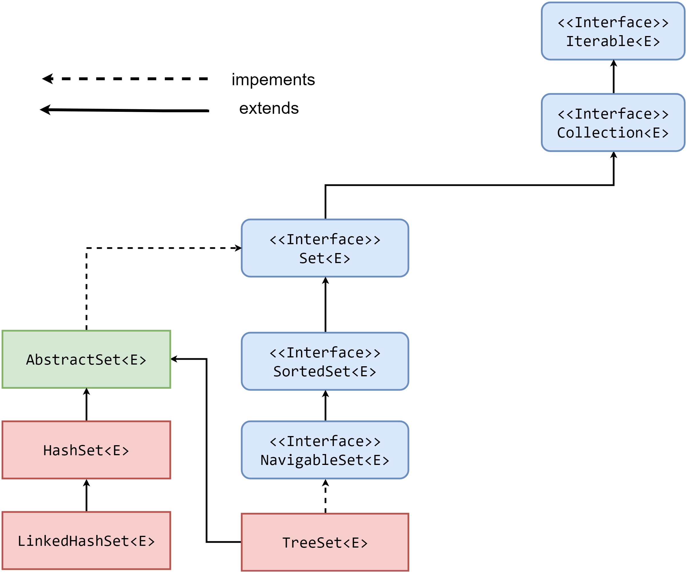

# Интерфейс java.util.Set

## Введение

Как уже было сказано во [введении](../intro.md), интерфес `java.util.Set` расширяет `java.util.Collection`, но при этом не добавляет новых методов.

Реализации интерфейса `java.util.Set` гарантируют отсутствие дублирующих значений.

Так как коллекции позволяют хранить `null` значения, то реализации интерфейса `java.util.Set` могут иметь не более одного такого значения.

Как и все интерфейсы в иерархии коллекций, `java.util.Set` параметризуется.

Объявление выглядит как:

```java
public interface Set<E> extends Collection<E> {
    // ...
}
```

Интерфейс `java.util.Set` описывает математическое понятие множество, отсюда и название.

Для определения того, является ли добавляемое знаечение дублем или нет, `java.util.Set` использует метод `equals`.
Поэтому крайне важно, чтобы этот метод был переопределен для элементов, с которыми планируется работа.

[Подробнее про equals](../../object/equals.md).

Важно помнить, что необходимо очень аккуратно работать с изменяемыми объектами, которые добавляются в `java.util.Set`.

## Получение элемента

Важно помнить, что интерфейс `java.util.Set` не добавляет никаких новых методов, а только наследует те, что есть у `java.util.Collection`.

Это значит, что ни одна реализация `java.util.Set` не содержит методов, достающих элемент из множества.

---

**Вопрос**:

Почему же `java.util.Set` не предоставляет методов для извлечения элемента из множества? Как доставать элементы из множества?

**Ответ**:

Не все реализации `java.util.Set` упорядочены, поэтому извлечение элемента по индексу является не выполнимым.

Множество исключает содержание дубликатов, потому возможность извлечения по элементу не логично.

Если существует некоторое множество, то вместо `get(element)` достаточно вызвать `contains(element)`. 
Так как если элемент есть в множестве, то значение будет `true`, а это значит что `element`, по которому делали `contains`, будет точно тем же, если бы был вызван `get(element)`.

---

## Реализации java.util.Set

Иерархия классов выглядит следующим образом:



Из рисунка видно, что в `Java` существует три наиболее популярных реализаций интерфейса `java.util.Set`:

* [java.util.HashSet](./hash_set.md)
* [java.util.TreeSet](./tree_set.md)
* [java.util.LinkedHashSet](./linked_hash_set.md)

### Выбор реализации

Когда и какую реализацию выбрать?

Если порядок хранения элементов не важен, то выбор `java.util.HashSet` более чем оправдан.

Данная реализация предоставляет быстрый доступ до элемента, но только при условии отсутствия коллизий, т.е хорошо определенной хэш-функции добавляемых элементов, в `Java` за это отвечает метод [hashCode](../../object/hashcode.md).

В случае, если порядок добавления элементов важен, то стоит присмотреться к `java.util.LinkedHashSet`. Понятно, что за сохранение порядка надо платить, поэтому данная реализация работает медленнее, чем `java.util.HashSet`.

Если необходимо, чтобы элементы были отсортированы, то следует присмотреться к `java.util.TreeSet`. Однако в таком случае добавляемые элементы должны либо реализовывать интерфейс `java.lang.Comparable`, либо необходимо написать свой собственный компаратор.