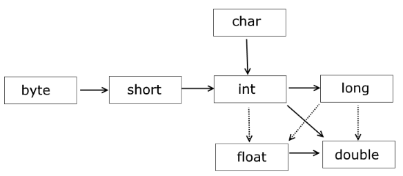
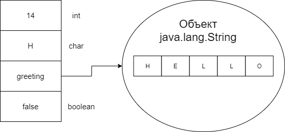
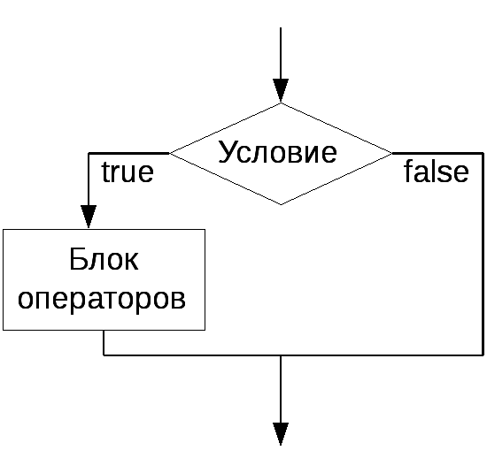
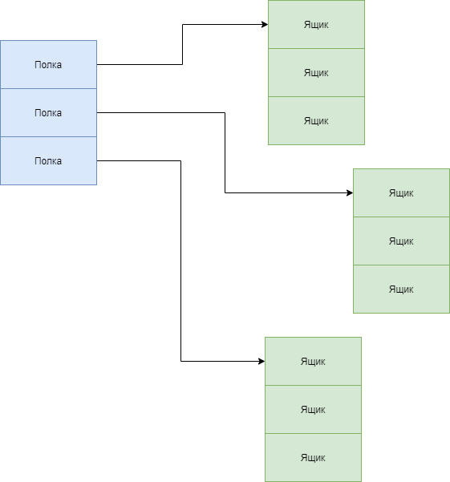

# 1. Java Базовый Курс

[1. Java Базовый Курс](#1-java-базовый-курс)
- [1.1. Занятие 1](#11-занятие-1)
- [1.2. Привет, Мир](#12-привет-мир)
- [1.3. Типы данных](#13-типы-данных)
  - [1.3.1. Примитивные типы](#131-примитивные-типы)
    - [1.3.1.1. Приведение типов](#1311-приведение-типов)
  - [1.3.2. Ссылочные типы](#132-ссылочные-типы)
- [1.4. Операторы](#14-операторы)
  - [1.4.1. Логические операторы](#141-логические-операторы)
    - [1.4.1.1. Отрицание](#1411-отрицание)
    - [1.4.1.2. Условное И](#1412-условное-и)
    - [1.4.1.3. Условное ИЛИ](#1413-условное-или)
  - [1.4.2. Условные операторы](#142-условные-операторы)
- [1.5. Массивы](#15-массивы)
- [1.6. Циклы](#16-циклы)
  - [1.6.1. Цикл for](#161-цикл-for)
  - [1.6.2. Цикл while](#162-цикл-while)
  - [1.6.3. Цикл do-while](#163-цикл-do-while)
  - [1.6.4. Оператор break](#164-оператор-break)
  - [1.6.5. Оператор continue](#165-оператор-continue)
- [1.7. Практика](#17-практика)
  - [1.7.1. FizzBuzz](#171-fizzbuzz)
  - [1.7.2. Числа Фибоначчи](#172-числа-фибоначчи)
  - [1.7.3. Вычисление факториала числа](#173-вычисление-факториала-числа)
  - [1.7.4. Сортировка пузырьком](#174-сортировка-пузырьком)
  - [1.7.5. Подсчет гласных и согласных](#175-подсчет-гласных-и-согласных)
- [1.8. Полезные ссылки](#18-полезные-ссылки)

## 1.1. Занятие 1

## 1.2. Привет, Мир

Так уж сложилось, что в начале изучения любого языка программирования обычно пишут программу, печатающую "Hello World!".

Кто мы такие, чтобы не соблюдать традиции? Итак, на языке программирования `Java` это будет выглядеть следующим образом:

```java
public class HelloWorld {
    public static void main(String[] args) {
        System.out.println("Hello World!");
    }
}
```

При этом, важно, чтобы имя класса совпадало с именем файла, в котором находится класс, с расширением `.java`.

Ключевое слово `public` называется модификатором доступа. Такие модификаторы управляют доступом к коду из других частей программы.
О модификаторах доступа поговорим позже, считайте, что таким образом мы делаем наш класс "публичным", т.е доступным из любой точки программы. А пока перейдем к ключевому слову `class`.

`Java` - это объектно-ориентированный язык программирования. В `Java` разработчик оперирует классами и объектами, это строительные блоки, из которых состоят все приложения.
За ключевым словом `class` следует имя класса. Имя должно начинаться с буквы, а остальная его часть может быть любой комбинацией букв и цифр. В качестве имени класса нельзя использовать зарезервированные слова языка `Java`, например, тот же `public`. Классы принято называть именами существительными, или словосочетаниями, используя [`CamelCase`](https://ru.wikipedia.org/wiki/CamelCase). Это стиль написания составных слов, при котором несколько слов пишутся слитно без пробелов, при этом каждое слово внутри фразы пишется с прописной буквы. 

```java
public class FileUtils {
}
```

В целом, язык позволяет называть классы иначе, но так не принято, и смотреть на вас будут косо. Относитесь к этому как к джентльменскому соглашению.

Обратите внимание на фигурные скобки. Синтаксисом языка принято, что область действия каждого оператора (начало и конец) должна быть обозначена фигурными скобками. В случае с классом они выделяют *тело* класса, где начинается описание класса и где заканчивается.

Далее идет объявление метода.

```java
public static void main(String[] args)
```

Пока пропустим ключевое слово `static`, о нем будет сказано позже.
После него идет тип значения, возвращаемого методом. Ключевое слово `void` означает, что метод ничего не возвращает. После типа возвращаемого значения идет имя метода: `main`.
Так же как и имена классов, имена методов должны начинаться с буквы, остальная часть имени может быть любой комбинацией букв и цифр. Принято начинать имена методов со строчной буквы, а каждое следующее слово выделять прописной, как и в названиях классов. Имена методов при этом обычно бывают глаголами, так как метод - это действие. В качестве имени метода нельзя использовать зарезервированные слова языка `Java`.

Далее идет перечисление параметров, которые принимает метод. Метод `main` принимает массив строк. Что это за массив и зачем он нужен?
Дело в том, что иногда требуется передать определенную информацию программе во время ее запуска. Какие-то настройки подключения к базе данных, пути до ресурсов и т.д.

В случае с методом фигурные скобки выделяют *тело* метода, где начинается метод и где заканчивается.

Объявленный выше метод `main` - это точка входа в программу. Точка входа не может иметь другой вид, кроме того, что представлен выше.
Каждое приложение на `Java` должно иметь такой метод.
Это место, откуда начнется выполнение вашей программы при запуске.

---

**Вопрос**:

Сколько таких точек входа в вашей программе может быть?
Может ли у меня быть несколько классов с таким методом?

**Ответ**:

Может!

Представьте вашу программу в виде здания. Каждая дверь в это здание - это наш метод `main`.
В здании может быть несколько дверей, а может быть одна. Но **войти** в здание можно только через одну дверь.

---

Итак, вы только что написали свою первую программу на `Java`. Поздравляю!

## 1.3. Типы данных

### 1.3.1. Примитивные типы

Как было сказано в [введении](./intro.md), язык программирования `Java` строго типизирован, это значит, что тип каждой переменной должен быть объявлен.

В  `Java` существует всего 8 примитивных типов данных: `byte`, `short`, `char`, `int`, `long`, `float`, `double`, `boolean`.

Числовые типы и диапазоны принимаемых значений:

| Тип    | Размер (бит) | Диапазон                                               |
|--------|--------------|--------------------------------------------------------|
| int    | 32 бит	    | от -2147483648 до 2147483647                           |
| short  | 16 бит       | от -32768 до 32767                                     |
| long   | 64 бит       | от -9223372036854775808L до 9223372036854775807L       |
| byte   | 8 бит        | от -128 до 127                                         |
| float  | 32 бит       |от 1.4e-45f до 3.4e+38f (6-7 значимых десятичных цифр)  |
| double | 64 бит       |от 4.9e-324 до 1.7e+308 (15 значимых десятичных цифр)   |

Обратите внимание на то, что размер типов жестко зафиксирован, в отличие от таких языков как `С`, где размер типа зависит от платформы.
Поэтому в `Java` нет никаких операторов типа `sizeof` и т.д.

Посмотрим, как объявить переменные разных типов в коде:

```java
public class Test {
    public static void main(String[] args) {
        int a = 14;
        double b = 22;
    }
}
```

Слева стоит тип переменной, после идет ее имя и далее, с помощью оператора присваивания `=` переменной присваивается значение. Как видно из примера выше, переменной `a` соответствует значение 14 и тип `int`, а переменной `b` значение 22 и тип `double`. После объявления переменной ее нужно явно инициализировать (задать начальное значение) с помощью оператора присваивания, поскольку использовать переменную примитивного типа, которой не присвоено никакого значения, нельзя.

Символьный тип данных `char` используется для беззнаковых целых чисел, представляющих собой символ `UTF-16` (буквы и цифры). Обратите внимание, что в отличие от языка программирования `C`, в `Java` тип данных `char` занимает 16 бит или два байта. Для обозначения символа в `Java` используются одинарные кавычки:

Числа типа `float` имеют суффикс `F`: 

```java
float a = 3.402F;
```

Числа с плавающей точкой, не имеющие суффикса `F` (например, `3.402`), всегда рассматриваются как числа типа `double`. Для их представления можно (но не обязательно) использовать суффикс `D`, например `3.402D`. 

Для работы с числами с плавающей точкой чаще всего используется тип `double`. Тип `float` используется в ситуациях, в которых важна скорость обработки чисел. Кроме того, иногда тип `float` используется при хранении больших массивов действительных чисел. Так как сейчас обычно нет необходимости экономить байты, то `float`, как и `short` практически не используется.

Более подробно о числах с плавающей точкой и их устройстве автор оставляет на самостоятельное изучение:

1. [Пара слов о числах с плавающей точкой в Java](https://habr.com/ru/post/219595/)
2. [Числа с плавающей точкой в языке Java](http://java-study.ru/17-plav.html)

В `Java` поддерживается 4 системы счисления:

* Двоичная

    Числа в двоичной системе записываются с помощью префикса `0b` или `0B`. Далее идет запись с использованием `0` и `1`.

* Восьмеричная
  
    Числа в восьмеричной системе записываются с помощью ведущего `0`. Допустимые цифры — от `0` до `7`.

* Десятичная

    Числа указываются в привычном виде, но число не может начинаться с `0`, иначе компилятор примет его за восьмеричное. 

* Шестнадцатеричная

    Числа в шестнадцатеричной системе записываются с помощью префиксов `0x` и `0X`. Допустимые цифры — от `0` до `15`, где числа `10-15` обозначаются символами `A-F` соответственно.

Пример:

```java
public class Test {
    public static void main(String[] args) {
           int a = 0b1101010110;
           int b = 012314;
           int c = 456;
           int d = 0x141D12;
           System.out.println("Число a в двоичной системе: " + a);
           System.out.println("Число b в восьмеричной системе: " + b);
           System.out.println("Число c в десятичной системе: " + c);
           System.out.println("Число d в шестнадцатеричной системе: " + d);
    }
}
```

Символьный тип данных `char` используется для беззнаковых целых чисел, представляющих собой символ `UTF-16` (буквы и цифры). Обратите внимание, что в отличии от языка программирования `C`, в `Java` тип данных `char` занимает 16 бит или два байта. Для обозначения символа в `Java` используются одинарные кавычки:

```java
public class Test {
    public static void main(String[] args) {
        char a = 'H';
        char b = 'e';
    }
}
```

Последний из примитивных типов данных - это тип `boolean`. Этот тип представляет значения истинности. Существует только два возможных значения для данного типа, представляющих два булевых состояния: истина (`true`) или ложь (`false`). В `Java` слова `true` и `false` являются ключевыми, т.е. зарезервированы для представления булевых значений, и являются двумя допустимыми литералами для задания значений переменных типа `boolean`. Преобразования булевых переменных в целочисленные и наоборот невозможны.

```java
public class Test {
    public static void main(String[] args) {
        boolean a = true;
        boolean b = false;
    }
}
```

Примитивные типы данных это просто область памяти, где хранится значение определенного типа.

#### 1.3.1.1. Приведение типов

Как уже было сказано, в `Java` каждая переменная и каждое выражение имеют тип, который известен на этапе компиляции.
Но что если понадобилось переменную одного типа преобразовать в другой?

Например, что будет при выполнении следующего кода:

```java
public class Test {
    public static void main(String[] args) {
        short a = 12;
        int b = a;
    }
}
```

Несмотря на то, что тип переменных `b` и `a` не совпадает, все прекрасно будет работать.
Почему? Потому что случится *неявное* преобразование одного типа в другой.

Представьте себе два ящика. Большой ящик легко вместит в себя то, что помещается в ящик поменьше. Также и тут. Тип `int` вместит в себя `short`, поэтому *неявное* преобразование типов одного в другой сработает.

В таком случае, что будет при выполнении следующего кода, когда более маленькому типу присваивается более большой:

```java
public class Test {
    public static void main(String[] args) {
        int a = 12;
        short b = a;
    }
}
```

В таком случае будет ошибка компиляции, что логично.

Но возникает вопрос, что делать, если такое преобразование все же нужно сделать и разработчик понимает все риски?
В таком случае помогает *явное* преобразование:

```java
public class Test {
    public static void main(String[] args) {
        int a = 12;
        short b = (short) a;
    }
}
```

Явное приведение типов сообщает компилятору или человеку читающему код, что вы знаете о том что это не тот тип, но уверены в том что у вас всё получится.

Схема возможных преобразований типов:



Стрелками на рисунке показано, какие преобразования типов могут выполняться автоматически. Пунктирными стрелками показаны автоматичекие преобразования с потерей точности.

Помните, что при преобразовании может быть потеря данных:

```java
int a = 258;
byte b = (byte) a;
System.out.println(b);    // 2
```

Результатом будет число 2.

Число a, которое равно 258, в двоичном системе будет равно `00000000 00000000 00000001 00000010`. Значения типа `byte` занимают в памяти только 8 бит. Поэтому двоичное представление числа `int` усекается до 8 правых разрядов, то есть `00000010`, что в десятичной системе дает число `2`.

Еще один пример потери данных - это усечение рациональных чисел до целых:

```java
double a = 56.9898;
int b = (int) a;
```

Результатом будет 56, несмотря на то, что число 57 было бы ближе к 56.9898. Чтобы избежать подобных казусов, надо применять функцию округления, которая есть в `Java`:

```java
double a = 56.9898;
int b = (int)Math.round(a);
```

### 1.3.2. Ссылочные типы

Как и все в жизни, сложные типы состоят из более простых, те из еще более простых и так до тех пор, пока не находится неделимый тип, примитив.
В свою очередь, сложные типы могут состоять из примитивов и других сложных типов данных.

К таким, более сложным, типам относится строка. Строка - это последовательность символов, как например, "Hello World". Строки - это не примитивный тип, это уже сложный, составной тип данных - класс.
Каждая строка, заключенная в кавычки, представляет собой экземпляр класса `java.lang.String`.

В отличие от примитивов, чье значение хранится в переменной, такие составные типы данных, как объекты классов, слишком большие и сложные, поэтому переменные этих типов хранят в себе не объект, а ссылку на него.



Переменная ссылочного типа указывает на расположение в памяти объекта некоторого класса. При объявлении такой переменной вместо названия примитивного типа необходимо указать название класса.

```java
public class Test {
    public static void main(String[] args) {
        String greeting = "Hello World";
    }
}
```

Переменная `greeting` ссылается на объект типа `java.lang.String`.

Получается, что в `Java` существует разделение на ссылочные и примитивные типы данных.

Особенность такого хранения заключается в том, что ссылок на один и тот же объект может быть несколько, в то время как каждый примитив хранится в своей переменной.

Представьте, что ссылка - это как прозвище. Прозвищ может быть несколько, но все они относятся к одному и тому же объекту. А переменная, работающая с примитивом, - это маленький ящик. Что в него положили, то и хранится. Сложно представить, чтобы в двух ящиках стола лежал один и тот же предмет.

---

**Вопрос**:

Что произойдет при выполнении следующего кода?

```java
public class Test {
    public static void main(String[] args) {
        int a = 4;
        int b = 5;

        a = b;
        a = a + 1;

        // печатаем на экран
        System.out.println(a);
        System.out.println(b);
    }
}
```

**Ответ**:

На экран выведутся цифры 6 и 5.
Так как и `a`, и `b` - это примитивные типы, то после присваивания переменные `a` и `b` будут каждый со своим значением 5.
После чего к `a` прибавляют 1, получая цифру 6.
Но на `b` это никак не влияет, так как у каждой переменной **свое** значение.

---

**Вопрос**:

Что произойдет при выполнении следующего кода?

```java
public class Test {
    public static void main(String[] args) {
        String a = "first";
        String b = "second";
        a = b;
    }
}
```

**Ответ**:

На объект "second" теперь будет две ссылки.
И `a`, и `b` будут ссылаться на один и тот же объект.

---

Также существует еще специальный тип `null`.
Любому ссылочному типу можно присвоить `null`, это является специальной заглушкой, обозначающей, что значение ссылки еще не инициализировано.

```java
String a = null;
```

Класс не только хранит в себе данные, но и предоставляет методы взаимодействия с ними.
Уже знакомый нам класс `java.lang.String` не просто хранит в себе массив `char`, но  и предоставляет методы для работы с этой строкой, например:

```java
public class Test {
    public static void main(String[] args) {
        String a = "hello";
        System.out.println(a.length());    // напечатает длину строки
        System.out.println(a.equals("H")); // сравнение строк "hello" и "H"
    }
}
```

О классах и объектах позже мы поговорим подробнее.

## 1.4. Операторы 

Для обозначения операций сложения, вычитания, умножения и деления в языке `Java` используются обычные арифметические операторы `+`, `-`, `*`, `/`. 

В работе с операторами присваивания удобно использовать сокращенные бинарные арифметические операторы. 
Например, оператор `х += 4;` эквивалентен `x = x + 4;`.

Оператор `/` обозначает целочисленное деление, если оба его аргумента являются целыми числами, иначе этот оператор обозначает деление чисел с плавающей точкой. Остаток от деления целых чисел (т.е. функция `mod`) обозначается символом `%`. Например, `15 / 2` равно `7`, `15 % 2` равно `1`, а `15.0 / 2` равно `7.5`. 

В `Java`, как и в языках `С` или `C++`, существуют операторы инкрементирования и декрементирования: оператор `х++` добавляет единицу к текущему значению переменной `х`, а оператор `х--` вычитает из него единицу.
При этом, существует как постфиксная форма, так и префиксная - `++x`.

Оба этих оператора увеличивают значение переменной на единицу. Разница между ними в том,  когда эти операторы используются внутри выражений. 
Префиксная форма инкремента сначала добавляет единицу к значению переменной, затем возвращает изменённое значение, в то время как постфиксная форма использует старое значение этой переменной и только потом прибавляет единицу.

Пример:

```java
int m = 7;
int n = 7; 
int a = 2 * ++m; // Теперь значение а равно 16, a m — 8. 
int b = 2 * n++; // Теперь значение Ь равно 14, a n — 8. 
```

Для проверки равенства примитивных типов используется оператор `==`.
Например, значение выражения `3 == 7` будет равно `false`.

Для проверки неравенства используется оператор `!=`.
Так, значение выражения `3 != 7` будет равно `true`.

Оператор `==` можно использовать и для проверки равенства объектов, но в результате мы узнаем только, указывают ли их ссылки на один и тот же объект.

Для проверки равенства ссылочных типов данных всегда используйте метод `equals`.

```java
String a = "Hello world";
a.equals("Hi"); // false
```

Кроме того, в языке `Java` есть обычные операторы `<` (меньше), `>` (больше), `<=` (меньше или равно) и `=>` (больше или равно).

### 1.4.1. Логические операторы

#### 1.4.1.1. Отрицание

Знак восклицания означает логический оператор отрицания или инверсию. Этот оператор унарный, т.е применяется только к одному выражению или операнду.
Оператор меняет значение выражения на противоположное. 

```java
boolean a = true;
System.out.println(!a); // false
```

#### 1.4.1.2. Условное И

Оператор `&&` (и) применяют к двум выражениям, и результат его действия будет истинным (true) только, если оба операнда истинны.

Результат работы `&&`.

|  `a`  |  `b`  | `a&&b`  |
|-------|-------|---------|
| true  | true  | true    |
| true  | false | false   |
| false | true  | false   |
| false | false | false   |


#### 1.4.1.3. Условное ИЛИ

Оператор `||` (или) применяют к двум выражениям, и результат его действия будет ложным (false) тогда и только тогда, когда оба операнда ложны. Это бинарные операторы.

Результат работы `||`.

|  `a`  |  `b`  | `a||b`  |
|-------|-------|---------|
| true  | true  | true    |
| true  | false | true    |
| false | true  | true    |
| false | false | false   |


Операторы `&&` и `||` вычисляются по сокращенной схеме. Это означает, что если в ходе вычисления выражения `А && В` выясняется, что подвыражение `А` ложно, то подвыражение `В` не вычисляется.

Например:

```java
if(х != 0 && 1 / х > х + у)
```

Вторая часть никогда не вычисляется, если значение переменной `х` равно нулю. То есть, подвыражение `1/х` не вычисляется, если `х` равно нулю и деления на ноль не происходит.

### 1.4.2. Условные операторы

Условные операторы `if/else` позволяют вашей программе выполнить код, основываясь на значении булевой переменной или выражения.
Конструкция ветвления оператора `if` - это своеобразная развилка, ветвление.

Простая форма записи:

```java
if(условие) {
    //если истина
}
```



Форма записи с ветвлением:

```java
if (условие) {
    // если истина
}
else if (условие2) {
    // если истина
}
else {
    // если условие2 не истина
}
```

Помимо этого существует еще тернарный оператор.

Выглядит тернарный оператор как:

```java
условие ? выражение1 : выражение2
```

Если условие истинно, то выполняется `выражение1`, если нет - `выражение2`.

Пример:

```java
System.out.println(a == 1 ? "One" : "Not one");
```

Тернарный оператор доступен не во всех языках программирования, так как многие считают, что он делает код менее читабельным и советуют его не использовать.
Лично у меня нет каких-то претензий к бедолаге, поэтому я иногда, хоть и редко, использую его.

## 1.5. Массивы

Массив - это объект, хранящий в себе **фиксированное** количество значений одного типа, с последовательными(непрерывными) адресами в памяти.
Другими словами, массив — это нумерованный набор переменных, идущих в памяти подряд.

Представьте себе шкаф для обуви.
В каждую ячейку можно положить только одну пару обуви, а так как шкаф у нас только для обуви, то и положить мы туда можем только обувь.
Шкаф всегда ограниченного размера, ведь количество полок заранее определено.

Если в какой-то момент количество пар обуви у вас становится больше, чем размер шкафа, то вы заказываете новый шкаф.
При этом, если вы экономны, вы старый шкаф сдадите/продадите, а на его место поставите как раз шкаф нужного размера.

Точно то же самое и в нашем случае с массивами. За исключением того, что `Java` берет на себя заботу об утилизации вашего старого шкафа.

Пример объявления массива:

```java
int[] array = new int[5];
```

Либо, если есть возможность сразу заполнить массив:

```java
int[] array = {1, 2, 3, 4, 5};
```

Здесь сначала описывается **тип данных**, хранящихся в массиве, далее с помощью квадратных скобок показывается, что это будет массив, после чего идет `array` - это имя ссылки. После объявления ссылки необходимо создать наш массив, что и делается с помощью ключевого слова `new`, где создается массив `int`-ов размер которого равен 5 элементам. Грубо говоря, мы только что создали шкаф, состоящий из пяти полок.

Массив является ссылочными типом данных, так как это объект.

Очень важным моментом является еще и то, что массив может работать не только с примитивными, но и с ссылочными типами данных.
В случае, когда вы создаете массив для ссылочного типа, например, строк, такой массив будет содержать в себе **ссылки** на объекты.

```java
String[] args = {"Hello", "World"};
```

Здесь объявлен массив, содержащий две ссылки на объекты типа `java.lang.String`.

---

**Вопрос**:

Хорошо, мы задали массив из пяти элементов. Но явно туда еще ничего не положили: какие значения будут лежать в массиве после инициализации?

```java
int[] array = new int[5];
```

**Ответ**:

Если в `C/C++` в таком случае в массиве лежит 'мусор', то в `Java` такой массив будет заполнен значениями *по-умолчанию*.
В случае с числовыми типами значение по-умолчанию будет 0, для `boolean` это будет `false`. Для ссылочных типов данных `null`.

---

Массивы могут быть и двумерными. Что такое двумерный массив? Представьте себе стеллаж, где каждая полка выдвигается и состоит из нескольих отделов. При этом, как и в стеллаже, необязательно, чтобы все полки состояли из одинакого количества отделов. Это массив массивов. 



Пример создания, заполнения и печати на экран двумерного массива:

```java
public class Main {
    public static void main(String[] args) {
        int [][] d = new int [2][];
        d[0] = new int[2];
        d[1] = new int[2];

        d[0][0] = 1;
        d[0][1] = 2;

        d[1][0] = 3;
        d[1][1] = 4;

        System.out.println(Arrays.deepToString(d)); // [[1,2], [3,4]]
    }
}
```

Здесь создается матрица 2 на 2, каждый элемент которой это `int`. Возвращаясь к примеру, здесь сначала объявляется размер стеллажа, а уже после создается каждая полка своего размера.
Если вы знакомы с языком программирования `C` или `C++`, то у вас не должно возникнуть проблем.

Большое количество полезных методов для работы с массивами, как, например, представление массива в виде строки, сортировки и т.д., содержится в стандартном классе `java.util.Arrays`.

## 1.6. Циклы

В прошлом примере инициализация двумерного массива заняла две строчки:

```java
        int [][] d = new int [2][2];
        // инициализация
        d[0] = new int[2];
        d[1] = new int[2];
```

А что если двумерный массив понадобился бы больше? При этом, сама инициализация, как видно в примере, это повторяющееся действие, меняется только индекс массива.
В языке `Java`, как и во всех языках программирования, существуют управляющие структуры, позволяющие выполнять повторяющиеся действия. Это циклы.

Цикл - это управляющая конструкция для многократного выполнения одного и того же участка кода, пока выполняется условие. 

В `Java` набор циклов представлен следующими типами:

* `for`
* `while`
* `do while`

### 1.6.1. Цикл for

Цикл `for` в `Java` выглядит следующим образом:

```java
for (инициализация; условие; итерация) {
    //тело цикла
}
```

* Инициализация - это выражение, которое инициализирует выполнение цикла. Исполняется только раз в начале цикла.
* Условие - это логическое выражение, которое регулирует окончание выполнения цикла. Если результат выражения будет равен `false`, цикл `for` прервет свое выполнение.
* Итерация - это выражение, которое выполняется после каждого шага, прохождения цикла. Чаще всего здесь находится выражение, изменяющее переменные, заданные в инициализации.

Таким образом, перепишем инициализацию двумерного массива с помощью цикла `for`:

```java
for (int i = 0; i < d.length; i++) {
    d[i] = new int[2];
}
```

Выражения инициализации, условия и итерации опциональны, при необходимости их можно опустить:

```java
for (int i = 0; i < d.length;) {
    d[i] = new int[2];
    i++;
}
```

Если опустить выражения с условием, то получим бесконечный цикл.

```java
for (;;) {
    // тело цикла
}
```

Цикл `for` часто используется для обхода массивов, списков и других коллекций.

### 1.6.2. Цикл while

Цикл `while` в `Java` выглядит следующим образом:

```java
while(условие) {
    //тело цикла
}
```

Условие здесь точно такое же логическое выражение, как и у цикла `for`, за исключением того, что условие здесь обязательное выражение.

```java
int count = 5;
while (count >= 0) {
    System.out.println(count);
    count = count - 1;
}
```

Результатом будет:

```java
5
4
3
2
1
0
```

Бесконечный цикл с помощью `while`:

```java
while (true) {
    // тело цикла
}
```

### 1.6.3. Цикл do-while

Цикл `do-while` в `Java` выглядит следующим образом:

```java
do {
    // тело цикла
} while(условие);
```

Разница между циклом `while` и `do-while` состоит только в том, что `do-while` гарантирует **хотя бы одну** итерацию цикла: как видно из конструкции, тело цикла выполняется перед проверкой условия.

```java
int count = 5;
do {
    System.out.println(count);
    count = count - 1;
} while (count >= 0);
```

Этот вид цикла применяется тогда, когда действие необходимо выполнить, по крайней мере, один раз, а их повторение будет зависеть от условия.

### 1.6.4. Оператор break

При необходимости досрочно завершить выполнение цикла в `Java` используется оператор `break`.
После выполнения оператора `break` произойдет моментальный выход из цикла, при этом не будет закончена даже текущая итерация.
Управление передастся оператору, следующему за циклом.

---

**Вопрос**:

Что будет выведено на экран?

```java
int count = 5;
while (count >= 0) {
    if(count == 5) {
        break;
    }

    System.out.println(count);
    count -= 1;
}
```

**Ответ**:

Ничего! Так как сразу по заходу в тело цикла выполнится `if`-условие с `break`, и выполнение цикла прекратится. 

---

### 1.6.5. Оператор continue

Если же нужно продолжить выполнение цикла, но требуется пропустить одну итерацию или ее часть, то используется оператор `continue`.
Как только в цикле встречается оператор `continue` начинается следующая итерация, не дожидаясь завершения текущей.

---

**Вопрос**:

Что будет выведено на экран?

```java
int count = 5;
while (count >= 0) {
    if(count == 5) {
        continue;
    }

    System.out.println(count);
    count -= 1;
}
```

**Ответ**:

Будет выведено:

```java
4
3
2
1
0
```
---

**Вопрос**:

А в таком случае?

```java
int count = 5;
while (count >= 0) {
    System.out.println(count);

    if(count == 5) {
        continue;
    }

    count -= 1;
}
```

**Ответ**:

Так как значение `count` никогда не будет изменено из-за условия с `continue`, то в случае выполнения кода из примера получим бесконечный цикл.

---

## 1.7. Практика

Сразу стоит сказать, что эти задачи довольно просты и направлены только на то, чтобы вы ближе познакомились с синтаксисом и привыкли к нему.
Свой код можно либо вынести в отдельные методы, либо писать прямо в `public static void main(String[] args)`.

### 1.7.1. FizzBuzz

Напишите программу, которая выводит на экран числа от 1 до 100.
При этом вместо чисел, кратных трем, программа должна выводить слово "Fizz", а вместо чисел, кратных пяти — слово "Buzz".
Если число кратно и 3, и 5, то программа должна выводить слово "FizzBuzz".

### 1.7.2. Числа Фибоначчи

В том же классе, где вы объявили `main`, создайте метод, вычисляющий и печатающий N [чисел Фибоначчи](https://ru.wikipedia.org/wiki/%D0%A7%D0%B8%D1%81%D0%BB%D0%B0_%D0%A4%D0%B8%D0%B1%D0%BE%D0%BD%D0%B0%D1%87%D1%87%D0%B8).

```java
public class Main {
    public static void main(String[] args) {
        fibonacci(11);
    }

    void fibonacci(int num) {
        // логика вычисления и печать
    }
}
```

### 1.7.3. Вычисление факториала числа

В том же классе, где вы объявили `main`, создайте метод, вычисляющий и печатающий [факториал](https://ru.wikipedia.org/wiki/%D0%A4%D0%B0%D0%BA%D1%82%D0%BE%D1%80%D0%B8%D0%B0%D0%BB) числа.

```java
public class Main {
    public static void main(String[] args) {
        factorial(8);
    }

    void factorial(int num) {
        // логика вычисления и печать
    }
}
```

В качестве усложнения вы можете создать несколько методов, реализующих разные алгоритмы вычисления, например, рекурсивный и с кешированием значения.

### 1.7.4. Сортировка пузырьком

Напишите [сортировку пузырьком](https://ru.wikipedia.org/wiki/%D0%A1%D0%BE%D1%80%D1%82%D0%B8%D1%80%D0%BE%D0%B2%D0%BA%D0%B0_%D0%BF%D1%83%D0%B7%D1%8B%D1%80%D1%8C%D0%BA%D0%BE%D0%BC) для массива целых чисел.

### 1.7.5. Подсчет гласных и согласных

Напишите метод, получающий на вход строку и печатающий количество гласных и согласных букв в строке.

## 1.8. Полезные ссылки

1. [Лекторий ФИВТ, Java (3 курс) - лектор Пономарёв. Java #2. Введение в Maven. Типы. Операторы. Массивы.](https://www.youtube.com/watch?v=-l4YgRoWRTo&list=PL4_hYwCyhAvblhTbPQmOF4b3kilWSpOjU&index=2)
2. [Типы данных в Java](https://ru.wikibooks.org/wiki/Java/%D0%A2%D0%B8%D0%BF%D1%8B_%D0%B4%D0%B0%D0%BD%D0%BD%D1%8B%D1%85)
3. [Массивы](http://developer.alexanderklimov.ru/android/java/array.php)
4. [Логические операторы](http://developer.alexanderklimov.ru/android/java/logic_operators.php)
5. [Циклы](https://ru.wikibooks.org/wiki/Java/%D0%9E%D0%BF%D0%B5%D1%80%D0%B0%D1%82%D0%BE%D1%80%D1%8B_%D1%86%D0%B8%D0%BA%D0%BB%D0%B0_for,_while,_do_..._while)
6. [Преобразование типов](https://metanit.com/java/tutorial/2.2.php)
7. [Пара слов о числах с плавающей точкой в Java](https://habr.com/ru/post/219595/)
8. [Числа с плавающей точкой в языке Java](http://java-study.ru/17-plav.html)