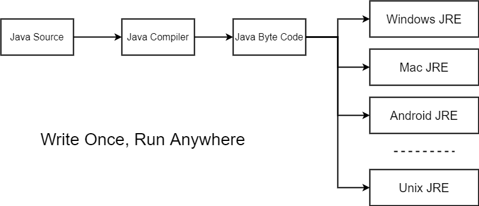

# Java Базовый Курс

Задача этого курса - это сделать обзор, описать ключевые концепции, при этом дав достаточно ссылок для более глубокого самостоятельного изучения.
Невозможно научиться программировать без самостоятельной работы. Курс должен помочь быстрее преодолеть порог входа в язык программирования `Java`.
Именно поэтому некоторые вещи намеренно опущены, так как когда они понадобятся или вы с ними столкнетесь - вы сможете разобраться в них самостоятельно.

## Введение

Прежде чем начать изучение надо ответить на вопрос: Почему именно `Java`?
Выбор языка - это важная часть вашего обучения и развития карьеры.

> Ниже я изложу свое субъективное мнение.
>
> Если вы нашли для себя еще что-то - это замечательно.

Итак, почему именно `Java`?

### Популярность

На момент написания этого текста `Java` стабильно входит в тройку в рейтинге языков программирования [TIOBE](https://www.tiobe.com/tiobe-index/). Этот индекс оценивает популярность языков программирования, на основе подсчёта результатов поисковых запросов.

Также, на `Java` решается невероятно огромный круг задач. Существует множество областей применения `Java`: desktop, web-приложения, трейдинговые приложения, big data, серверные приложения. Это один из наиболее популярных языков в крупных корпорциях, банках и т.д.

### JVM

Одним из лозунгов `Java` является:

> Write once, run anywhere.

Или как еще часто говорят:

> Write once, run everywhere

Принцип гласит, что не важно где и под какую платформу было написано `Java` приложение, его можно будет запустить везде.

Как вы думаете, каким образом это реализовано, да еще и 20 лет назад, когда `Java` только рождалась? Ведь существуют разные архитектуры процессоров, разные длины регистров - все системы разные.

Решением было придумать `Java Virtual Machine`, или коротко `JVM`, придумать для нее свой "машинный" код, затем компилировать исходный `Java` код в этот "машинный" код, который называется [байт-код](https://ru.wikipedia.org/wiki/%D0%91%D0%B0%D0%B9%D1%82-%D0%BA%D0%BE%D0%B4_Java), а уже виртуальная машина будет интерпретировать этот байт-код в машинный, специфичный под каждую платформу. Таким образом, везде, где есть `JVM` можно запустить ваше приложение.

---

На рисунке внимательный читатель мог обнаружить загадочное слово `JRE`, про которое еще не говорили.

Итак, `JRE` расшифровывается как `Java Runtime Environment`, среда выполнения `Java`.
Это минимальная реализация виртуальной машины, необходимая для исполнения Java-приложений, без компилятора и других средств разработки. Состоит из виртуальной машины — `Java Virtual Machine` и библиотеки Java-классов.

`JDK` расшифровывается как `Java Development Kit`, средства разработки.
Это комплект разработчика приложений на языке Java, включающий в себя компилятор, стандартные библиотеки классов `Java`, примеры, документацию, различные утилиты и среду выполнения `JRE`.

Ну а `JVM` - это Java Virtual Machine (сокращенно `Java VM`, `JVM`).
Виртуальная машина Java — это основная часть среды выполнения `Java`, так называемой `JRE`. Виртуальная машина Java интерпретирует байт-код `Java`.

---

Благодаря этому достигается `кроссплатформенность` приложений, написанных на `Java`.
Сегодня приложение разрабатывается под операционную систему `Windows`, а завтра спокойно и без каких-либо дополнительных действий по портированию его можно будет запустить на `Unix`. Главное, чтобы и там, и там была `JVM`.

Также виртуальная машина дает еще несколько важных преимуществ: безопасность и исключение фатальных сбоев на сервере.

Так весь код выполняется в `JVM`, то даже в случае фатального сбоя ваш код не сломает сервер, на котором работает `JVM`. Исполнение (интерпретация) скомпилированного байт-кода происходит в безопасной среде.

### Большой выбор и простота подключения сторонних библиотек

Каждый файл исходного кода `Java` имеет расширение `.java` и компилируется в `.class`. Таким образом, после компиляции получается набор `.class`-файлов. Логично, что передавать такой набор лучше в архиве, поэтому `.class` файлы собирают в один архив и распространяют уже архивом. Такие архивы называются `jar`-архивами или "jar-никами".

Каждая библиотека - это просто `jar`-архив, для его использования необходимо просто добавить его в место, где `Java`(а точнее загрузчики классов или `classloader`-ы) ищет классы для запуска приложения. Такое место называется `classpath`. По существу `classpath` указывает компилятору или виртуальной машине где искать классы необходимые для сборки проекта или же его запуска.

Это значит, что для того, чтобы подключить стороннюю библиотеку необходимо просто добавить `jar`-архив в `classpath`. Все!

Благодаря популярности, большому количеству областей применения `Java` и простоте использования стороннего кода существует бесчисленное множество сторонних библиотек на все случаи жизни.

### Автоматическое управление памятью

Некоторые языки программирования, такие как `C` или `C++`, предоставляют разработчику возможность ручного управления памятью.

С одной стороны, это мощный механизм, позволяющий гибко управлять ресурсами, добиваться лучшей производительности и т.д.
С другой стороны, за такую гибкость приходится платить, и обратной стороной монеты является то, что обязанность по освобождению памяти полностью ложится на плечи разработчика.

Утечки памяти, ссылки на разрушенный объект и т.д. являются серьезной проблемой языков с ручным управлением памятью.
Человеку присуще делать ошибки, что-то забывать и пропускать. Ошибки по отношению к управлению памятью могу опасны и губительны.

И `Java` освобождает разработчиков от ручного управления памятью, перекладывает эту  ответственность на себя.
Благодаря чему разработчик может быть более сконцентрирован на решении задачи и минимизирует количество ошибок, связанных с неправильной работой с памятью.

*Ручное и автоматическое управление памятью - это как автомобиль на ручной и автоматической коробке передач*. И у того, и у другого есть свои минусы и плюсы. Для каких-то задач автомобиль на автоматической коробке передач просто не подойдет, для других же будет наиболее удобен. Здесь та же история.

Как это устроено мы поговорим в одном из следующих [разделов](../../other/garbage_collector.md).

### Набор инструментов для разработки и документация

Для `Java` существует отличный набор инструментов для разработки. Одна из лучших `IDE` для разработки, которую я настоятельно рекомендую использовать в работе: [IntelliJ IDEA](https://www.jetbrains.com/ru-ru/idea/). Также существуют и статические анализаторы кода, профилировщики, сбор метрик работы приложения и многое другое. Все это легко в подключении и использовании.

Широчайшая база документации: официальная документация Oracle, большое и развивающееся комьюнити, огромное количество учебных материалов. Ответы на большинство вопросов, возникающих в ходе разработки, довольно просто найти. Наличие общепризнанных рекомендаций по написанию кода - меньше поводов для бесполезных споров, что тоже очень важно при работе в команде.

### Строгость

Компилятор внимательно следит за разработчиком: `Java` имеет статическую строгую явную типизацию.

Статическая типизация определяется тем, что конечные типы переменных и функций устанавливаются на этапе компиляции. Каждая переменная и каждое выражение имеют тип, который известен на этапе компиляции.
Если метод принимает строку, то на этапе комплияции будет проверено, что в местах вызова метода в качестве аргумента передается именно строка.

Строгая типизация выделяется тем, что язык не позволяет смешивать в выражениях различные типы и не выполняет автоматические неявные преобразования, например нельзя вычесть из строки множество.

Явно типизированные языки отличаются тем, что тип новых переменных или функций и их аргументов нужно задавать явно.

Если объявленные и передаваемые типы не будут совпадать - произойдет ошибка компиляции. Для простоты представьте себе три отверстия: квадратное, круглое и треугольное. В треугольное не получится протолкнуть шар или куб - несоответствие типов.

[Подробнее о типизации](../../other/typing.md).

## Заключение

Итак, `Java` является кроссплатформенным языком программирования с давно отточенными инструментами разработки, прекрасной документацией и обширным сообществом разработчиков.
Благодаря отсутствию ручного управления памятью порог входа в язык снижается, а обилие сторонних библиотек и простота их подключения позволяют решать серьезные задачи даже новичкам.

Также, благодаря накопленному опыту `Java` является хорошим языком для начинающих, так как компилятор внимательно следит за разработчиком, заставляя его задумываться о типах данных. Благодаря накопленному опыту в `Java` мире существует большое количество best practice рекомендаций, позволяющих быстрее понять как лучше писать поддерживаемый и понятный код.

Это один из самых популярных языков программирования, применяющийся в каждой второй компании-корпорации. А это значит, что существует большое количество вакансий и высокий спрос на разработчиков.

Все это делает `Java` отличным выбором в качестве первого языка программирования.

Рекомендую посмотреть на [инфо-карту](https://jaxenter.com/pirates-of-the-jvm-the-infographic-132524.html) всего, что связано с `JVM`: какие есть еще языки, технологии и т.д.

## Полезные ссылки

1. [Лекторий ФИВТ, Java (3 курс) - лектор Пономарёв. Java #1. Экосистема](https://www.youtube.com/watch?v=Bgs-8eJyzhg&list=PL4_hYwCyhAvblhTbPQmOF4b3kilWSpOjU&index=1)
2. [Зачем учить Java и как делать это эффективно. Доклад Яндекса](https://habr.com/ru/company/yandex/blog/481688/)
3. [Сборка мусора, Проблемы ручного управления памятью](https://ru.wikipedia.org/wiki/%D0%A1%D0%B1%D0%BE%D1%80%D0%BA%D0%B0_%D0%BC%D1%83%D1%81%D0%BE%D1%80%D0%B0)
4. [Байт-код](https://ru.wikipedia.org/wiki/%D0%91%D0%B0%D0%B9%D1%82-%D0%BA%D0%BE%D0%B4_Java)
5. [Что такое JVM?](https://topjava.ru/blog/what-is-the-jvm)
6. [Wikipedia JVM](https://ru.wikipedia.org/wiki/Java_Virtual_Machine)
7. [Что такое JDK?](https://topjava.ru/blog/what-is-the-jdk)
8. [Что такое JRE](https://topjava.ru/blog/what-is-the-jre)
9. [Pirates of the JVM](https://jaxenter.com/pirates-of-the-jvm-the-infographic-132524.html)
