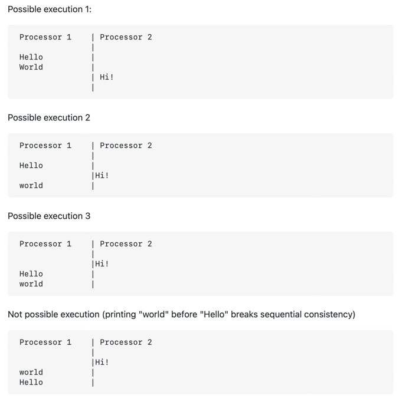

# CAP теорема

## Определение

CAP теорема утверждает, что любая распределенная система может гарантированно предоставить только два из трех свойств:
1) Consistency (консистентность) - каждое чтение предоставляет самое новое значение или ошибку
2) Availability (доступность) - каждый запрос получает ответ, но без гарантии того, что ответ содержит самое новое значение
3) Partition tolerance (отказоустойчивость) - система продолжает функционировать каким-либо образом при разрывах сети между узлами

В случае разрыва сети возникает выбор:
* отменить операцию, тем самым уменьшить доступность, но сохранить консистентность
* продолжить операцию, гарантируя доступность, но рискуя консистентностью

## Зачем

Распределенные системы часто подразумевают разбиение на узлы. Например, может быть несколько одинаковых баз данных, которые синхронизируются между собой.

Если мы желаем достичь консистентности данных на каждом из таких узлов (прочитать одинаковое значение из каждой из баз данных), то мы жертвуем доступностью, поскольку нам нужно произвести синхронизацию перед тем, как дать пользователю прочитать новейшее значение.

Если же мы желаем повысить доступность, то может возникнуть ситуация, когда пользователь получит разные данные на один и тот же запрос, потому что попадет в разные узлы. То есть, мы пожертвуем консистентностью. 

Зачастую реальной консистентностью распределенная система похвастаться не может. Обычно речь идет о sequential consistency - в каждом узле соблюдается указанный порядок операций (например, сначала производится запись, а потом чтение), при этом итоговый порядок операций между всеми узлами может быть недетерминирован.

Также, возможна ситуация, когда для пользователя достаточно гарантировать, что он всегда будет читать свои записи. В таком случае, нужно просто всегда направлять одного пользователя на один и тот же узел. 

## История

Первое упоминание теоремы датируется осенью 1998 года Эриком Брюэром. Затем, она была опубликована как "CAP принцип" в 1999 и представлена как гипотеза на симпозиуме принципов распределенных вычислений в 2000 году. В 2002 году Сэт Гилберт и Нэнси Линч опубликовали формальное доказательство гипотезы Брюэра, после чего она стала теоремой.

## Подводные камни

Важно подметить, что данная теорема относится к случаю, в котором присутствует разбиение системы на узлы, реплики. Из-за этого, в 2010 году появилась PACELC теорема, которая гласит:
если существует разбиение, то существует компромисс между консистентностью и доступностью; иначе, компромисс лежит между задержкой и консистентностью.

## Полезные ссылки

1. [Статья на Wiki](https://en.wikipedia.org/wiki/CAP_theorem)
2. [Sequential consistency](https://en.wikipedia.org/wiki/Sequential_consistency)
3. [Видео про CAP теорему](https://www.youtube.com/watch?v=bQMW5yijyAo)
