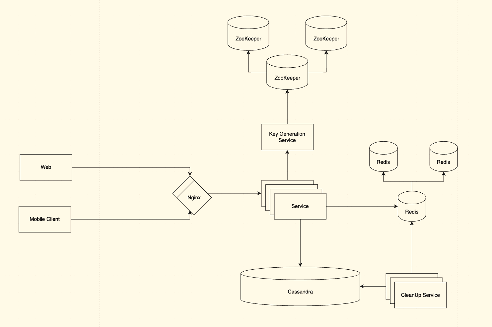

# URL Shorter

- [URL Shorter](#url-shorter)
    - [Условие](#условие)
    - [Решение](#решение)
        - [Фиксация требований](#фиксация-требований)
        - [Расчеты](#расчеты)
            - [RPS](#rps)
            - [Объемы данных](#объемы-данных)
        - [API](#api)
            - [Create Short URL API](#create-short-url-api)
            - [Redirect API](#redirect-api)
        - [URL Encoding](#url-encoding)
            - [Хэширование MD5/CRC32/SHA](#хэширование-md5crc32sha)
            - [Уникальный ID генератор](#уникальный-id-генератор)
        - [Архитектура](#архитектура)
            - [Выбор БД](#выбор-бд)
            - [Key Generation Service](#key-generation-service)
            - [Load Balancing](#load-balancing)
            - [Cache](#cache)
            - [Cleaning service](#cleaning-service)
    - [Полезные ссылки](#полезные-ссылки)

## Условие

Проектирование системы для сокращения URL-адресов.

Суть сервиса в том, что пользователем на вход дается 'длинная' ссылка, а на выход получается укороченный вариант ссылки.
По укороченной ссылке пользователь переходит туда же, куда ведет длинная.

Срок действия укороченной ссылки 1 год.

Длина укороченной ссылки чем короче, тем лучше.

Пример работы:
`https://github.com/qcha/JBook` -> `https://tinyurl.com/36r7659p`.

## Решение

### Фиксация требований

Функциональные требования:

* Срок действия ссылки 1 год
* Длина чем короче, тем лучше
* Сокращенный вариант ссылки может содержать цифры и буквы английского алфавита
* Потенциально мы хотим заложить возможность строить аналитику использования нашего сервиса

Нефункциональные требования:

* DAU 1_000_000 пользователей
* Среднее количество записей от пользователя в день 3
* Пиковое количество запросов от пользователя 5
* Соотношение запросов запись/чтение 10:1

### Расчеты

#### RPS

RPS - это количество запросов в секунду.

Пиковый RPS для записи - это максимальное количество запросов от пользователя умножить на количество всех пользователей и разделить на количество секунд в сутках.

```text
RPS (write) = 5 * 1_000_000 / 86_400 ~= 60 RPS
```

В свою очередь RPS (read) на чтение - это RPS (write) умножить на 10.

```text
RPS (read) = 60 * 10 ~= 600 RPS
```

Общая пиковая нагрузка будет 660 запросов в секунду.

#### Объемы данных

В день мы будем генериировать пять миллионов новых записей, при этом надо поддержать хранение их в течении года, значит всего в год надо хранить:

```text
links_per_day = 5 (запросов на запись в день) * 1_000_000 (количество пользователей)
links_per_year = links_per_day * 365 ~= 2_000_000_000 ~= 2 миллиарда
```

В сокращенной ссылке будем использовать английские буквы разного регистра и цифры.

Отсюда получаем, что размер алфавита (из чего можем формировать ссылку) - это 26 + 26 + 10:

```text
26 - [a-z]
26 - [A-Z]
10 - [0-9]
```

В итоге размер алфавита равен 62.

Длина ссылки - это 62^N >= 18 миллиардов, получается N = 7 с лихвой хватит на все запросы.

Средняя длина длинной ссылки пусть будет 100 символов.

Нам необходимо хранить и ту ссылку, и другую, значит 107 символов на одну запись-связку.

С учетом того, что каждый символ у нас - это 1 байт (ASCII), то 107 байт весит одна запись key-value. Добавим еще поле с датой создания created_at или с датой срока годности ссылки expiration_at - это еще 7 байт на каждую запись.

Посчитаем количество информации, которую надо хранить в год:

```text
memory_per_year = 114 * links_per_year ~= 2TB
```

Модель данных: short_url, long_url, created_at.
Можно также добавить поля для аналитики, user_id - при необходимости.

Основные запросы будут по `short_url`, чтобы получть `long_url`.

### API

#### Create Short URL API

Создание будет происходить с помощью метода POST:

```javascript
POST /shorten

{
    "link": "https://github.com/qcha/JBook"
}
```

Ответы:

* 201 CREATED

    Запрос выполнен успешно и привёл к созданию ресурса.

   ```javascript
    {
        "link": "https://github.com/qcha/JBook",
        "short_link": "36r7659p"
    }
    ```

* 500 Internal Server Error

    Код ответа сервера 500 Internal Server Error указывает на то, что сервер столкнулся с неожиданной ошибкой, которая помешала ему выполнить запрос.

    При проблемах на сервере.

#### Redirect API

Как будет осуществляться редирект по короткой ссылке:

```javascript
GET /${short_link}
```

Ответы:

* 302 FOUND

    Код ответа 302 означает, что URL-адрес 'временно' перемещен по длинному URL-адресу. То есть последующие запросы того же URL-адреса будут сначала отправляться нашему сервису, а затем перенаправляться к серверу длинного URL-адреса.

    Пример ответа:

    ```javascript
    HTTP/1.1 302 Found
    Location: http://www.example.org
    ```

    Где `http://www.example.org` - это наша длинная ссылка.

    Можно было бы выбрать код ответа 301 Moved Permanently, что означает, что длинный URL-адрес 'навсегда' перемещен. Так как перенаправление будет постоянное, то браузер закэширует ответ и последующие запросы по тому же адресу не будут направляться к нашему сервису.

    В случае с 301 мы уменьшаем нагрузку на наш сервис, однако это будет затруднять работу аналитики. Поэтому в данном случае выбираем 302.

* 404 NOT FOUND

    Код ответа на ошибку HTTP 404 Not Found указывает, что сервер не может найти запрошенный ресурс.

    При ошибочных запросах по несуществующим коротким ссылкам или по уже истекшим сроком годности.

* 500 Internal Server Error

    Код ответа сервера 500 Internal Server Error указывает на то, что сервер столкнулся с неожиданной ошибкой, которая помешала ему выполнить запрос.

    При проблемах на сервере.

### URL Encoding

#### Хэширование MD5/CRC32/SHA

Функция хэширования используется для получения из длинного URL-адреса хэша — hashValue.

Что такое hashValue? Это и есть та самая 'короткая' ссылка: `36r7659p`, которая подставляется к нашему сервису и получается сокращенный URL: `https://tinyurl.com/36r7659p`.

Выбор и понимание того как будет осуществляться хэширование влияет на архитектуру: вплоть до добавления новых систем и компонентов.

Поэтому необходимо определиться с тем, как мы буем хэшировать ссылки.

К функции хэширования предъявляются следующие требования:

* Каждое значение longURL должно иметь один хэш hashValue

* Каждое значение hashValue должно указывать обратно на longURL

Как мы выяснили выше, длина такого хэша будет равна 7.

Очевидное решение состоит в использовании общеизвестных функций хэширования вроде CRC32, MD5 и проичх подобных.

Однако, даже самое короткое значение хэша (из CRC32) получается слишком большим (больше 7 символов). Одним из вариантов решений будет брать первые 6 символов от хэша.

Вот пример работы с MD5:

1. Получаем на вход длинный URL: `https://github.com/qcha/JBook`
2. Генерируем хэш: `1b3aabf5266b0f178f52e45f4bb430eb`
3. Берем первые 6 символов: `1b3aabf5266b`
4. Преобразуем в десятичную систему счисления: `1b3aabf5266b -> 47770830013755`
5. Преобразуем в base62 систему: `DZFbb43`

Берем именно 6, потому что из 6 первых байт получается число, которое в base62 преобразуется в строку длиной примерно 7 символов.

Как понятно из названия, base62 — это способ кодирования с использованием 62 символов. Они соотносятся как 0-0, ..., 9-9,   10-a, 11-b, ..., 35-z, 36-A, …, 61-Z, где 'a' соответствует 10, 'Z' соответствует 61 и т. д.

Пусть 11157 - это ИД новой записи.

Таким образом, в представлении base62:

11157 / 62 = 179 целых
11157 % 62 = 59 в остатке

179 / 62 = 2 целых
179 % 62 = 55 в остатке

2 / 62 = 0 целых
2 % 62 = 2 в остатке

```text
1115710 = 2 * 62^2 + 55 * 62^1 + 59 x 62^0 = [2, 55, 59] -> [2, T, X]
```

Из минусов подобного решения:

* Он может генерировать один и тот же сокращенный URL для идентичных 'длинных' URL-ов: когда отличия только в параметрах в URL-ах, например.

* Могут происходить коллизии, когда два разных URL генерируют один и тот же хэш.

Стратегии борьбы с коллизиями:

* Повторное хэширование: при обнаружении коллизии повторно хэшировать исходный URL-адрес с другим seed или использовать дополнительные биты из исходного хэша для генерации уникального короткого URL-адреса.

* Инкрементный суффикс: Добавление инкрементного суффикса (например, '-1', '-2') к короткому URL-адресу до тех пор, пока не будет найден уникальный ключ.

Для того, чтобы бороться с коллизиями необходимо будет делать дополнительные обращения к БД, чтобы проверить уникальность сгенерированного хэша.

#### Уникальный ID генератор

Другой метод генерации коротких URL-адресов — это использование инкрементных идентификаторов. При таком подходе каждому новому URL-адресу, добавляемому в систему, присваивается уникальный, автоматически инкрементный идентификатор.

После генерации идентификатора он преобразуется в формат с использованием кодировки Base62. Эта закодированная строка становится коротким URL-адресом.

Поскольку идентификаторы генерируются инкрементно, каждый новый идентификатор уникален и последователен. Невозможно, чтобы два разных URL получили один и тот же идентификатор, пока механизм генерации идентификаторов (например, база данных с автоматически увеличивающимся первичным ключом) функционирует правильно.

Из минусов подобного решения:

* Предсказуемость: инкрементные идентификаторы предсказуемы, что означает, что кто-то может потенциально вывести количество URL-адресов, сокращенных вашим сервисом, или угадать URL-адреса других пользователей.

    Здесь можно добавить уровень обфускации, закодировав идентификатор с помощью случайного начального числа.

* Масштабируемость: Такой распределенный генератор может стать узким местом масштабируемости и Single Point of Failure.

    Здесь необходимо явно предусмотреть эти риски и компенсации по ним: например, посмотреть как это сделано в Twitter Snowflake.

Именно поэтому решение по тому, как мы будем получать 'короткие' URL должно быть ДО архитектуры - так как непосредственно влияет на нее.

### Архитектура



#### Выбор БД

Так как у нас heavy read система, в которой не нужен механизм `join`-ов между таблицами, а основная часть операций - это key/value, то стоит посмотреть на NoSQL решения: DynamoDB, Cassasndra, MongoDB.

Модель данных: short_url, long_url, created_at.
Можно также добавить поля для аналитики, user_id - при необходимости.

#### Key Generation Service

Для генерации ключей - уникальных ID, выделим отдельный сервис, который с помощью ZooKeeper координатора сможет генерировать нам уникальные идентификаторы.

#### Load Balancing

Наши сервисы поставим за балансировщиком, в качестве балансировщика выберем Nginx.
Так как сервисы являются stateless, т.е. не хранят состояние, то балансировщик можетс помощью алгоритма `round robin` раскидывать запросы по нодам сервиса.

#### Cache

Мы можем использовать кэш, например как Redis или Memcached, для хранения наиболее часто используемых URL-адресов. Таким образом снизив нагрузку на БД.

Это будет LRU cache - Least recently used (Вытеснение давно неиспользуемых).

#### Cleaning service

Сервис по очистке expired URL, тех коротких ссылок, у кого истек срок 'годности'. Его можно как объединить с основным нашим сервисов, так и вынести отдельно. Я думаю, что будет актуально вынести его как отдельный сервис.

## Полезные ссылки

1. [How to implement TinyURL (System Design Interview)](https://www.youtube.com/watch?v=eCLqmPBIEYs)
2. [Mock-собеседование по System Design от Team Lead из Ozon](https://www.youtube.com/watch?v=hCg4N-r_kF0)
3. [How would I design a URL shortener application (interview question prep)](https://www.youtube.com/watch?v=OsFfr2_aQhw)
4. [Design a URL Shortener - System Design Interview](https://blog.algomaster.io/p/design-a-url-shortener)
5. [Сокращение URL-адресов (bit.ly, TinyURL и т. д.) – System Deisgn](https://www.geeksforgeeks.org/system-design-url-shortening-service/)
6. [Designing a URL Shortening Service like TinyURL](https://www.designgurus.io/course-play/grokking-the-system-design-interview/doc/designing-a-url-shortening-service-like-tinyurl)
7. [System Design. Подготовка к сложному интервью. Chapter 8](https://www.litres.ru/book/aleks-suy/system-design-podgotovka-k-slozhnomu-intervu-67193183/)
