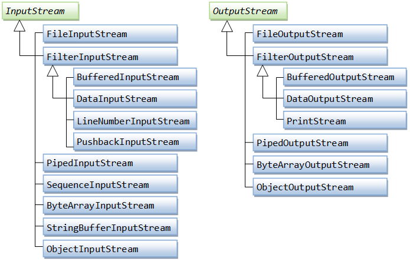

# I/O streams

## Введение

В Java все общение с внешними (не входящими в состав JVM) устройствами (файлы, базы данных, сеть и т.д.) происходит унифицированным образом, с помощью абстракции - Input/Output потока.

Поток (Stream) - объект, представляющий собой источник или приемник данных.

Поток основан на последовательности битов данных и разделяется на два типа: символьный (`Writer` & `Reader`) и байтовый (`InputStream` & `OutputStream`). Выбор которых зависит исключительно от реализуемой задачи.


Допустим, что в приложении есть строка, которую необходимо записать в некий файл на диске. Для это нам необходимо открыть поток к файлу, через который будет передаваться последовательность данных, и вызвать метод записи.

Рассмотрим функции ввода/вывода информации байтовым потоком, реализованные внутри стандартного пакета `java.io`.

## Input & Output Streams

Как сказано в исходном файле `java.io.InputStream.java` (для Output аналогично):

> This abstract class is the superclass of all classes representing an input stream of bytes.

т.е. на самом верхнем уровне абстракции лежат классы `InputStream` и `OutputStream`. 

Рассмотрим подробно `InputStream`. Его основная задача - читать данные байт за байтом. Приведем основные методы:

```java
public abstract class InputStream implements Closeable {
	// основные методы
	abstract int read(); // на самом деле возвращает byte (преобразованный в int), что бы была возможность передать -1 - конец потока.
	int read(byte[] b); // число прочитанных байт 
	void mark(int readlimit); // отмечаем место, к которому можно вернуться 
	void reset(); // сбросить поток
	void close(); // закрыть поток 
}
```

Странность метода `abstract int read()` оправдывается высокой производительностью. 

На основе `InputStream` и `OutputStream` построена дальнейшая иерархия, позволяющая читать и записывать данные наиболее подходящим способом во внешние устройства.



Структура символьный потоков `Writer` `Reader` выполнена аналогичным образом.

## Decorator pattern

Работа с потоками осуществляется на основе паттерна [Decorator](../patterns/structural). Для начала нужно создать поток, затем завернуть его в оболочки, соответствующий реализуемой задаче, и начать его использовать. Пример реализации см в [Статье](../patterns/structural#Реализация).

## Закрытие потока

До `Java 7` закрытие ресурсов происходило примерно следующим образом:

```java
// some code
FileReader fr = null	
BufferedReader br = null;
try {
	// code
	fr = new FileReader(fileName)
	bn = new BufferedReader(fr);
	// code
} catch (Exception e) {
	System.err.println("Error: " + e.getMessage());
} finally {
	try {
		fr.close();
		br.close();
	} catch (IOException) {
		System.err.println("Error: " + e.getMessage());
	}
}
```

что выглядит очень громоздко и не гарантирует закрытие потока, поскольку в блоке `finally` (подробнее об этом см в [статье](../exceptions/exceptions.md#Реагирование)) может случиться исключение и ресурс останется открытым.

В версиях `Java 7` и выше была добавлена такая конструкция, как [`try-with-resources`](../exceptions/exceptions.md#try-with-resources-или-twr). В ней введен специальный интерфейс `java.lang.AutoCloseable` имеющий один метод:

```java
void close() throws Exception;
```

try - "понимает", что FileReader - является AutoClosable и при выходе из try его надо закрыть.

```java
	try (FileReader fr = new FileReader(fileName);
			BufferedReader br = new BufferedReader(fr)) {
		while((line = br.readLine()) != null) {
			// some code
		}
	} catch(IOException e) {
		System.err.println("Error: " + e.getMessage());
	}
```

Как видно, с использованием блока `try-with-resources` код стал выглядеть лаконичнее. И делегирование ответственности закрытия потоков на JVM гарантирует закрытие ресурса.

## Заключение

Работа с ресурсами в `java` не является крайне сложной. 

Достаточно иметь представление о паттерне `Decorator`. 

Понимать реализуемую задачу, для того, чтобы выбирать нужные потоки и оболочки.

И не забывать закрывать ресурсы, с чем отлично помогает `try-with-resources`.