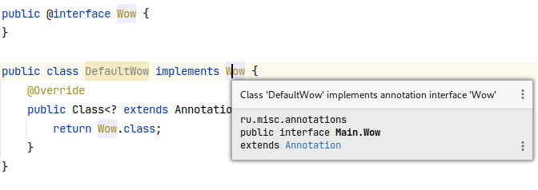
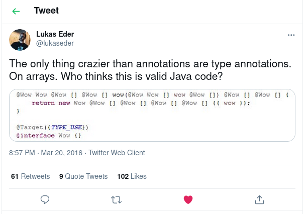

# Аннотации

## Введение

Возьмем многострадального `Person` и попробуем переопределить метод `equals` следующим образом:

```java
public class Person {
    private int age;
    private String name;
    
    public boolean equals(Person person) {
        if (age != person.age) return false;
        return Objects.equals(name, person.name);
    }
}
```

Внимательный читатель сразу скажет, что это не переопределение, а перегрузка (ведь [equals](https://docs.oracle.com/en/java/javase/11/docs/api/java.base/java/lang/Object.html#equals(java.lang.Object)) принимает `java.lang.Object` в качестве аргумента) и будет прав! Это приводит к тому, что такая ошибка может привести к серьезным последствиям (например, в `HashMap` наш метод не поможет). И кажется, что хотелось бы быть застрахованным от подобного рода проблем, однако компилятор не знает что конкретно вы хотели: перегрузить метод или переопределить.

Для того, чтобы 'подсказать' компилятору о том, что метод `equals` не должен быть перегружен, а мы хотели именно переопределить его, нужно оставить некоторую дополнительную информацию.

Эта дополнительная информация называется метаифнормацией или метаданными.

Метаданные (или метаинформация) (от лат. meta — цель, предел и данные) — информация о другой информации, или данные, относящиеся к *дополнительной* информации о содержимом или объекте. Метаданные раскрывают сведения о признаках и свойствах, характеризующих какие-либо сущности, позволяющие автоматически искать и управлять ими в больших информационных потоках. По своей сути - это данные о данных.

Для добавления метаинформации в `Java` как раз и существуют аннотации.

Теперь давайте явно добавим информацию для компилятора о том, что метод должен быть переопределен. Для этого в `Java` уже существует аннотация [@Override](https://docs.oracle.com/en/java/javase/11/docs/api/java.base/java/lang/Override.html).

Добавим аннотацию к методу и попробуем скомпилировать наш код:

```java
public class Person {
    @Override
    public boolean equals(Person person) {
        //                ^^^^^^
        //               Должен быть Object
        return super.equals(obj);
    }
}
```

Возникнет ошибка компиляции:

```java
java: method does not override or implement a method from a supertype
```

Далее мы разберем подробнее, а сейчас лишь отметим, что аннотации не обязательно нужны только для помощи компилятору/интерпретатору, они также могут давать информацию различным инструментам для генерации кода, конфигураций, могут предоставлять информацию для среды разработки, а также быть полезны во время выполнения программы (в runtime).

Метаинформацию можно добавлять не только к методам, как в примере с `@Override`, но и к классам, а также к переменным.

Теперь, когда в общих чертах понятна суть аннотаций, давайте разберемся как создать свою аннотацию.

## Объявление аннотаций

Для объявления аннотаций используется комбинация `@` и ключевого слова `interface` (в `Kotlin` для этого существует ключевое слово [annotation](https://kotlinlang.org/docs/reference/annotations.html)).

Создадим нашу первую аннотацию:

```java
public @interface Wow {
}
```

Добавим ее и к классу, и к полю, и к конструктору, и к его параметру:

```java
@Wow
public class Something {
    @Wow
    private final Set<String> strings;

    @Wow
    public Something(@Wow Set<String> strings) {
        this.strings = strings;
    }
}
```

Из определения можно заметить, что аннотация очень похожа на интерфейс, только необычный.

Так и есть: аннотации - это особые интерфейсы.
Об этом написано в [§ 9.6 JLS - спецификации языка Java](https://docs.oracle.com/javase/specs/jls/se11/html/jls-9.html#jls-9.6):

> An annotation type declaration specifies a new annotation type, **a special kind of interface type.**

То есть, как ни странно, их можно реализовывать, используя ключевое слово `implements`:

```java
public class DefaultFoo implements Wow {
    @Override
    public Class<? extends Annotation> annotationType() {
        return Wow.class;
    }
}
```

При этом, компилятор попросит переопределить `annotationType` - метод из интерфейса [`Annotation`](https://docs.oracle.com/en/java/javase/11/docs/api/java.base/java/lang/annotation/Annotation.html), возвращающий тип аннотации (в данном случае необходимо вернуть `Wow.class`).

---

**Вопрос**:

Имеет ли смысл реализовывать (`implements`) аннотации?

**Ответ**:

Скорее **нет**, чем да.

Intellij IDEA имеет инспекцию "Class extends annotation interface":

> Reports any classes declared as implementing or extending an annotation interface. While it is legal to extend an annotation interface, it is often done by accident, and the result won't be usable as an annotation.

Реализовывать аннотации разрешено, но редко (почти никогда) используется, поэтому эта возможность часто приводит к неправильной обработке аннотации, и IDEA ругается на это:



Примеры [use case-ов](https://stackoverflow.com/questions/3341930/use-cases-for-implementing-annotations), где может быть полезна реализация.

---

**Вопрос**:

Если аннотация - это интерфейс, то кто её реализует?

**Ответ**:

В общем случае это должно быть не так важно, но если посмотреть более детально реализацию `OpenJDK`, то это делается динамически с помощью класса [`Proxy`](https://docs.oracle.com/en/java/javase/11/docs/api/java.base/java/lang/reflect/Proxy.html):

```java
@Wow
public class Main {
    @Retention(RetentionPolicy.RUNTIME)
    public @interface Wow {
    }

    public static void main(String[] args) {
        Wow wow = Main.class.getAnnotation(Wow.class);
        System.out.println(wow.getClass());
    }
}
```

Вывод:

```text
class com.sun.proxy.$Proxy1
```

---

Ну а раз это специальный интерфейс, то у него могут быть и методы!

### Методы аннотаций

У аннотаций могут быть методы, определяются они похожим с обычным интерфейсом способом:

```java
public @interface Wow {
    int method();
}
```

Зачем они нужны?

Предположим, что нам необходимо добавить для аннотации некоторое настраиваемое поведение: запускать метод по расписанию, но расписание гибко настриавать.

Тут то и пригождается то, что аннотации могут иметь методы, т.е. то самое поведение.
И это поведение - это и есть те самые настраиваемые параметры.

В таком случае аннотация объявлена будет в виде:

```java
public @interface Scheduled {
    int delayMillis();

    int rateMillis();
}
```

Использоваться они будут следующим образом:

```java
public class ScheduledUsage {
    @Scheduled(delayMillis = 100, rateMillis = 1000)
    public void scheduledMethod() {
    }
}
```

Для работы со значениями по умолчанию используется ключевое слово `default` (оно же используется для определения тела метода по умолчанию в интерфейсах, начиная с `Java 8+`):

```java
public @interface Scheduled {
    int delayMillis();

    int rateMillis() default 1000;
}
```

В таком случае `rateMillis` указывать будет необязательно, вместо этого будет использовано указанное в объявлении метода значение по умолчанию:

```java
public class ScheduledUsage {
    @Scheduled(delayMillis = 100)
    public void scheduledMethod() {
        // some code
    }
}
```

Аннотации с настраиваемыми значениями называют также параметризованными аннотациями.
Аннотации без параметров часто называют маркерными аннотациями.

#### Возвращаемые значения или параметры аннотаций

Метод в аннотации может возвращать только один из следующих типов:

* Аннотация
* Примитив
* `java.lang.Class`
* `enum`
* `java.lang.String`
* Массив элементов, состоящий из вышеперечиселнных значений

При этом, возвращаемые значения могут быть только константами, т.е. следующий пример **не скомпилируется**:

```java
public class ScheduledUsage {
    private final int delay;
    private final int rate;

    public ScheduledUsage(int delay, int rate) {
        this.delay = delay;
        this.rate = rate;
    }

    @Scheduled(delayMillis = delay, rateMillis = rate)
    // java: element value must be a constant expression
    public void scheduledMethod() {
    }
}
```

Почему так устроено? Аннотации добавляются к элементам класса, а *не* к их экземплярам, отсюда и требование, что все должно быть сконфигурировано на уровне объявления класса.

---

**Вопрос**:

Аннотации **неизменяемы**, однако их методы могут возвращать массивы, которые, в свою очередь, изменяемы.

Что будет, если такой массив изменить?

**Ответ**:

Изменится **возвращенный массив**.

При этом следующий вызов такого метода вернёт массив, в точности соответствующий исходному.

Для этого [происходит **копирование**](https://stackoverflow.com/questions/53436794/how-do-annotations-prevent-mutations-of-an-array-parameter/53436966#53436966) массива.

---

## Мета-аннотации

Аннотация, находящаяся над аннотацией, называется **мета-аннотацией**.
Некоторые мета-аннотации особенно важны, т.к. они позволяют контролировать некоторые аспекты применения аннотаций.

Рассмотрим их чуть подробнее.

### @Retention и доступность аннотаций

Ранее была затронута тема, что аннотации - это мета информация, которой могут пользоваться как компиляторы, инструменты для генерации кода, а также быть полезны во время выполнения программы (в runtime).

Это значит, что обработка аннотаций может происходить:

1. На этапе компиляции

    Например: в [Dagger](https://dagger.dev/), [Micronaut](https://micronaut.io/)

2. Во время исполнения

    Например: в [Jackson](https://github.com/FasterXML/jackson), [Gson](https://github.com/google/gson), [Retrofit](https://square.github.io/retrofit/)

3. На этапе загрузки класса classloader-ом
    Например, частично используется в [lombok](https://projectlombok.org/)

Для возможности указать где аннотация нужна было введено понятие `retention` (от англ. сохранение, удержание) и объявлена аннотация `Retention`:

```java
/**
 * Indicates how long annotations with the annotated interface are to
 * be retained.  If no Retention annotation is present on
 * an annotation interface declaration, the retention policy defaults to
 * {@code RetentionPolicy.CLASS}.
 *
 * <p>A Retention meta-annotation has effect only if the
 * meta-annotated interface is used directly for annotation.  It has no
 * effect if the meta-annotated interface is used as a member interface in
 * another annotation interface.
 *
 * @author  Joshua Bloch
 * @since 1.5
 * @jls 9.6.4.2 @Retention
 */
@Documented
@Retention(RetentionPolicy.RUNTIME)
@Target(ElementType.ANNOTATION_TYPE)
public @interface Retention {
    /**
     * Returns the retention policy.
     * @return the retention policy
     */
    RetentionPolicy value();
}
```

По сути `retention` позволяет указать жизненный цикл аннотации: будет она присутствовать только в исходном коде, в скомпилированном файле, или она будет также видна и в процессе выполнения.

Всего предусмотрено три таких этапа: `SOURCE`, `CLASS`, `RUNTIME` (они перечислены в разделе [RetentionPolicy](https://docs.oracle.com/en/java/javase/11/docs/api/java.base/java/lang/annotation/RetentionPolicy.html)).

| RetentionPolicy | Описание                                                         | Остается в класс-файле | Доступна во время исполнения|
|-----------------|------------------------------------------------------------------|------------------------|-----------------------------|
| `SOURCE`        | Отбрасываются после компиляции                                   | Нет                    | Нет                         |
| `CLASS`         | Отбрасывается на этапе загрузки класса                         | Да                     | Условно: если найти класс-файл и прочитать его |
| `RUNTIME`       | Аннотация всегда доступна через reflection *во время исполнения* | Да                     | Да                          |

Значение по умолчанию: `RetentionPolicy.CLASS`. Т.е. для примеров выше (с `@Wow`) политика именно `CLASS`.

#### Пример

```java
@Retention(RetentionPolicy.CLASS)
@interface RetainedInClass {
}

@Retention(RetentionPolicy.SOURCE)
@interface RetainedInSource {
}

@Retention(RetentionPolicy.RUNTIME)
@interface RetainedAtRuntime {
}

@RetainedInClass
@RetainedAtRuntime
@RetainedInSource
public class Annotations {
    public static void main(String[] args) {
        boolean retainedInClassIsVisible = Annotations.class.getAnnotation(RetainedInClass.class) != null;
        boolean retainedInSourceIsVisible = Annotations.class.getAnnotation(RetainedInSource.class) != null;
        boolean retainedAtRuntime = Annotations.class.getAnnotation(RetainedAtRuntime.class) != null;

        System.out.println("RetainedInClass is visible? " + retainedInClassIsVisible);
        System.out.println("RetainedInSource is visible? " + retainedInSourceIsVisible);
        System.out.println("RetainedAtRuntime is visible? " + retainedAtRuntime);
    }
}
```

В методе `main` производится попытка получить аннотации через reflection api (см. [`Class#getAnnotation`](https://docs.oracle.com/en/java/javase/11/docs/api/java.base/java/lang/Class.html#getAnnotation(java.lang.Class)))

Грубо говоря, в рантайме (во время выполнения) попробуем получить у класса объявленные аннотации.

Результат:

```java
RetainedInClass is visible? false
RetainedInSource is visible? false
RetainedAtRuntime is visible? true
```

Как и ожидалось, во время исполнения видна только аннотация с `RetentionPolicy.RUNTIME`.

Теперь посмотрим что в `class`-файле.

Для просмотра класс файла можно воспользоваться утилитой [`javap`](https://docs.oracle.com/en/java/javase/11/tools/javap.html), поставляемой вместе с jdk.

```shell
javap -v Annotations.class
```

* `-v` - выводить информацию более подробно
* `Annotations.class` - файл, полученный после компиляции

Часть вывода:

```text
RuntimeVisibleAnnotations:
  0: #32()
    ru.misc.annotations.RetainedAtRuntime
RuntimeInvisibleAnnotations:
  0: #34()
    ru.misc.annotations.RetainedInClass
```

Вывод явно показывает, что в класс-файле есть:

* Аннотация, видимая во время исполнения - это `RetainedAtRuntime`
* Аннотация, которую во время исполнения не видно - это `RetainedInClass`
* При этом, `RetainedInSource` не упоминается в контексте использования аннотации в качестве аннотации, что логично - она была отброшена на этапе компиляции.

### @Target и места использования

До этого все аннотации, что мы делали можно было применять как к классам, так и к методам, а также к параметрам класса.

Аннотация [@Target](https://docs.oracle.com/en/java/javase/11/docs/api/java.base/java/lang/annotation/Target.html) - позволяет указать где именно аннотация, может быть использована/применена.

```java
/**
 * Indicates the contexts in which an annotation interface is applicable. The
 * declaration contexts and type contexts in which an annotation interface may
 * be applicable are specified in JLS {@jls 9.6.4.1}, and denoted in source code by
 * enum constants of {@link ElementType java.lang.annotation.ElementType}.
 *
 * <p>If an {@code @Target} meta-annotation is not present on an annotation
 * interface {@code T}, then an annotation of type {@code T} may be written as
 * a modifier for any declaration.
 *
 * <p>If an {@code @Target} meta-annotation is present, the compiler will enforce
 * the usage restrictions indicated by {@code ElementType}
 * enum constants, in line with JLS {@jls 9.7.4}.
 *
 * <p>For example, this {@code @Target} meta-annotation indicates that the
 * declared interface is itself a meta-annotation interface.  It can only be
 * used on annotation interface declarations:
 * <pre>
 *    &#064;Target(ElementType.ANNOTATION_TYPE)
 *    public &#064;interface MetaAnnotationType {
 *        ...
 *    }
 * </pre>
 *
 * <p>This {@code @Target} meta-annotation indicates that the declared class or
 * interface is intended solely for use as a member class or interface in
 * complex annotation interface declarations.  It cannot be used to annotate
 * anything directly:
 * <pre>
 *    &#064;Target({})
 *    public &#064;interface MemberInterface {
 *        ...
 *    }
 * </pre>
 *
 * <p>It is a compile-time error for a single {@code ElementType} constant to
 * appear more than once in an {@code @Target} annotation.  For example, the
 * following {@code @Target} meta-annotation is illegal:
 * <pre>
 *    &#064;Target({ElementType.FIELD, ElementType.METHOD, ElementType.FIELD})
 *    public &#064;interface Bogus {
 *        ...
 *    }
 * </pre>
 *
 * @since 1.5
 * @jls 9.6.4.1 @Target
 * @jls 9.7.4 Where Annotations May Appear
 * @jls 9.7.5 Multiple Annotations of the Same Interface
 */
@Documented
@Retention(RetentionPolicy.RUNTIME)
@Target(ElementType.ANNOTATION_TYPE)
public @interface Target {
    /**
     * Returns an array of the kinds of elements an annotation interface
     * can be applied to.
     * @return an array of the kinds of elements an annotation interface
     * can be applied to
     */
    ElementType[] value();
}
```

Как пример: аннотация `@NotNull`.

Для того, чтобы явно указать область применения существует мета-аннотация `@Target`, которая принимает на вход [ElementType](https://docs.oracle.com/en/java/javase/21/docs/api/java.base/java/lang/annotation/ElementType.html), который описывает контекст применения аннотации.

В `Java 21+` существуют следующие области применения:

| ElementType      |      Описание                                          |
|------------------|--------------------------------------------------------|
| ANNOTATION_TYPE  |  Аннотация применима только к другим аннотациям        |
| CONSTRUCTOR      |  Применение только на конструктор                      |
| FIELD            |  Применение только на поля класса                      |
| LOCAL_VARIABLE   |  Применение только на переменные                       |
| METHOD           |  Применение только на методы                           |
| MODULE           |                                                        |
| PACKAGE          |                                                        |
| PARAMETER        | Примерение на параметры                                |
| RECORD_COMPONENT | Применение только на рекорды                           |
| TYPE             | Применение на классы, интерфейсы, рекорды, перечисления|
| TYPE_PARAMETER   | Применение на параметризованные типы, дженерики        |
| TYPE_USE         |                                                        |

Исчерпывающий список мест применения, как и всегда в подобных случаях, приводится в JLS - спецификации языка Java, [§ 9.6.4.1](https://docs.oracle.com/javase/specs/jls/se11/html/jls-9.html#jls-9.6.4.1).

#### Пример использования Target

Допустим, у нас есть аннотация, необходимая нам в рантайме и смысл аннотация имеет только с полями класса: `@MakesSenseOnlyAtFields`:

```java
@Retention(RetentionPolicy.RUNTIME)
@Target(ElementType.FIELD)
public @interface MakesSenseOnlyAtFields {
}
```

В таком случае, следующий код будет успешно скомпилирован:

```java
public class User {
    @MakesSenseOnlyAtFields
    private final String username;

    public User(String username) {
        this.username = username;
    }
}
```

При попытке добавить аннотацию к классу:

```java
@MakesSenseOnlyAtFields
public class User {
}
```

Получаем ошибку:

```text
java: annotation type not applicable to this kind of declaration
```

---

**Вопрос:**

Можно ли указать несколько `@Target` значений?

**Ответ:**

Да, конечно: поле `value` у `@Target` принимает массив `ElementType`.

Пример:

```java
@Target({ElementType.METHOD, ElementType.FIELD})
@interface Lax {
}

public class Main {
    @Lax
    private int bar;
    
    @Lax
    public void foo() {
    }
}
```

Можно также посмотреть объявление аннотации `@Deprecated`:

```java
@Retention(RetentionPolicy.RUNTIME)
@Target(value={CONSTRUCTOR, FIELD, LOCAL_VARIABLE, METHOD, PACKAGE, MODULE, PARAMETER, TYPE})
public @interface Deprecated {
    // ...
}
```

---

### @Inherited и наследование аннотаций

По умолчанию аннотации не наследуются от родительского класса к дочернему.
Аннотация `@Inherited` помечает аннотацию, которая будет унаследована потомком класса, отмеченного такой аннотацией:

```java
/**
 * Indicates that an annotation interface is automatically inherited.  If
 * an Inherited meta-annotation is present on an annotation interface
 * declaration, and the user queries the annotation interface on a class
 * declaration, and the class declaration has no annotation for this interface,
 * then the class's superclass will automatically be queried for the
 * annotation interface.  This process will be repeated until an annotation for
 * this interface is found, or the top of the class hierarchy (Object)
 * is reached.  If no superclass has an annotation for this interface, then
 * the query will indicate that the class in question has no such annotation.
 *
 * <p>Note that this meta-annotation interface has no effect if the annotated
 * interface is used to annotate anything other than a class.  Note also
 * that this meta-annotation only causes annotations to be inherited
 * from superclasses; annotations on implemented interfaces have no
 * effect.
 *
 * @author  Joshua Bloch
 * @since 1.5
 * @jls 9.6.4.3 @Inherited
 */
@Documented
@Retention(RetentionPolicy.RUNTIME)
@Target(ElementType.ANNOTATION_TYPE)
public @interface Inherited {
}
```

Пример:

```java
@Inherited // 1
@Retention(RetentionPolicy.RUNTIME)
public @interface Persistable {
}

@Persistable // 2
public abstract class AbstractEntity {
}

public class Task extends AbstractEntity { // 3
}

public class InheritedDemo {
    public static void main(String[] args) {
        Persistable persistable = Task.class.getAnnotation(Persistable.class); // 4
        System.out.println(persistable);
    }
}
```

1. Аннотация `Persistable` помечена как наследуемая, `@Inherited`
2. Абстрактный класс `AbstractEntity` в свою очередь помечен как `@Persistable`
3. Класс `Task` не аннотирован, но расширяет (наследует) `AbstractEntity`
4. Запрос аннотации через `Class#getAnnotation`

Вывод:

```text
@ru.misc.annotations.Persistable()
```

Теперь удалим `@Inherited` у `Persistable` и снова запустим код:

```text
null
```

---

**Вопрос**:

До этого было сказано, что `@Inherited` - это для наследования аннотаций потомками класса.
А интерфейсы? Что будет, если такую аннотацию использовать с интерфейсом?

**Ответ**:

Воспроизведем данный вопрос в коде:

```java
@Inherited // 1
@Retention(RetentionPolicy.RUNTIME)
public @interface Persistable {
}

@Persistable
interface Identifiable {
}

public abstract class AbstractEntity implements Identifiable {
}

public class Main {
    public static void main(String[] args) {
        Persistable persistable = AbstractEntity.class.getAnnotation(Persistable.class); // 4
        System.out.println(persistable);
    }
}
```

Вывод:

```text
null
```

Т.е. аннотация будет проигнорирована! Почему?

[Javadoc @Inherited](https://docs.oracle.com/en/java/javase/11/docs/api/java.base/java/lang/annotation/Inherited.html) сообщает, что в этом нет смысла. Аннотация наследуется только от **супер-класса**:

> Note that this meta-annotation type has **no effect** if the annotated type is used to annotate **anything other than a class**. Note also that this meta-annotation only causes annotations to be inherited from superclasses; annotations on implemented interfaces have no effect.

---

### @Repeatable и повторяемые аннотации

Зачастую удобно применить одну и ту же аннотацию несколько раз, например, с разными параметрами:

```java
@Retention(RetentionPolicy.RUNTIME)
public @interface RunEveryDayAt {
    int hours() default 0;
}

public class Cron {
    @RunEveryDayAt(hours = 11)
    @RunEveryDayAt(hours = 23)
    public void compactSpace() {
    }
}
```

Однако, при компиляции класса `Cron` возникнет ошибка:

```text
java: ru.misc.annotations.RunEveryDayAt is not a repeatable annotation type
```

Если посмотреть подсказку `Intellij IDEA`, то там будет запись:

```java
Duplicate annotation. The declaration of 'RunEveryDayAt' does not have a valid java.lang.annotation.Repeatable annotation
```

Для того, чтобы одну и ту же аннотацию можно было применить несколько раз существует мета-аннотация `Repeatable`:

```java
/**
 * The annotation interface {@code java.lang.annotation.Repeatable} is
 * used to indicate that the annotation interface whose declaration it
 * (meta-)annotates is <em>repeatable</em>. The value of
 * {@code @Repeatable} indicates the <em>containing annotation
 * interface</em> for the repeatable annotation interface.
 *
 * @since 1.8
 * @jls 9.6.3 Repeatable Annotation Interfaces
 * @jls 9.7.5 Multiple Annotations of the Same Interface
 */
@Documented
@Retention(RetentionPolicy.RUNTIME)
@Target(ElementType.ANNOTATION_TYPE)
public @interface Repeatable {
    /**
     * Indicates the <em>containing annotation interface</em> for the
     * repeatable annotation interface.
     * @return the containing annotation interface
     */
    Class<? extends Annotation> value();
}
```

Из объявления видно, что необходимо в `value` указать аннотацию-контейнер для всех повторяющихся аннотаций.

Другими словами надо:

1. Объявить другую аннотацию, которая имеет метод `value`, возвращающий массив исходных аннотаций (которые повторно использовать собирались). Важно: не должно быть других методов (без указанных `default` значений).
2. Пометить исходную аннотацию как [@Repeatable](https://docs.oracle.com/en/java/javase/11/docs/api/java.base/java/lang/annotation/Repeatable.html), указав в ней аннотацию, объявленную в предыдущем шаге.

В таком случае, пример с повторяемыми аннотациями преобразуется в:

```java
@Retention(RetentionPolicy.RUNTIME)
public @interface RunEveryDayContainerAnnotation {
    RunEveryDayAt[] value(); // Шаг 1
}

@Retention(RetentionPolicy.RUNTIME)
@Repeatable(RunEveryDayContainerAnnotation.class) // Шаг 2
public @interface RunEveryDayAt {
    int hours() default 0;
}

public class Cron {
    @RunEveryDayAt(hours = 11)
    @RunEveryDayAt(hours = 23)
    public void compactSpace() {
    }
}
```

Аннотация `RunEveryDayContainerAnnotation` - это аннотация-контейнер, метод `value` возвращает массив исходных аннотаций.
Исходная аннотация помечена как `Repeatable` с указанием контейнерной аннотации `RunEveryDayContainerAnnotation`

Запустим следующий код:

```java
public class Main {
    public static void main(String[] args) throws NoSuchMethodException, SecurityException {
        Method method = Cron.class.getMethod("compactSpace");
        System.out.println(Arrays.toString(method.getAnnotationsByType(RunEveryDayAt.class)));
    }
}
```

Вывод будет:

```text
[@ru.misc.annotations.RunEveryDayAt(hours=11), @ru.misc.annotations.RunEveryDayAt(hours=23)]
```

## Коротко про обработку аннотаций

Аннотации - это мета информация. Сами по себе они чаще всего ничего не значат, их должен кто-то обрабатывать.

Обработка аннотаций в общем случае зависит от многих факторов: логики, которую необходимо добавить по предоставленной с помощью аннотации информации, Retention политики, Target-а и так далее.

Это сложная и обширная тема, выходящая за рамки данной статьи, поэтому ниже будет представлен простой пример обработчика аннотации в runtime.

Представим, что необходимо объявить аннотацию для методов, позволяющую ставить паузу перед выполнением основной логики в методе.

Это может выглядеть следующим образом:

```java
public class PauseExample {
    @Pause(value = 1000)
    public void pauseEx() {
        System.out.println("Logic");
    }

    public static void main(String[] args) throws Exception {
        PauseExample pauseExample = new PauseExample();
        Method pauseExMethod = pauseExample.getClass().getMethod("pauseEx");
        Pause pauseExMethodAnnotation = pauseExMethod.getAnnotation(Pause.class);

        System.out.println("@Pause value = " + pauseExMethodAnnotation.value());

        Thread.sleep(pauseExMethodAnnotation.value());
        System.out.println("@Pause with value = " + pauseExMethodAnnotation.value() + " completed");

        System.out.println("Start invoking method");
        
        pauseExMethod.invoke(pauseExample);

        System.out.println("Stop invoking method");
    }
}

@Target(ElementType.METHOD)
@Retention(RetentionPolicy.RUNTIME)
@interface Pause {
    int value();
}
```

Обработка аннотаций и работа с ними - это часть [Java Reflection API](https://docs.oracle.com/javase/8/docs/technotes/guides/reflection/index.html).

## Заключение

Аннотация - это элемент языка, позволяющий в определенном формате добавить **мета-информацию** на разных уровнях исполнения программы.
Это мощный инструмент, который используется как в популярных фреймворках `Spring`, так и многими `IDE`.

Аннотации могут выступать некоторым промежуточным звеном между определённым инструментом, библиотекой или фреймворком и прикладным разработчиком:

С одной стороны: программист **декларативно** указывает, что он хочет получить в месте использования аннотации. С другой: обработчик считывает примененную аннотацию и выполняет что-то со своей стороны.
  
Это может быть:

* Статическая проверка кода на этапе компиляции, например как с `@Override`.
* Проверка данных с помощью [Bean Validation](https://beanvalidation.org/), где будет проверено соответствие имени пользователя указанному регулярному выражению:

    ```java
    public class User {
        @Pattern("[a-z]{6,30}")
        private String username;
    }
    ```

* Декларативное кэширование с помощью [`@Cacheable`](https://docs.spring.io/spring-framework/docs/current/javadoc-api/org/springframework/cache/annotation/Cacheable.html).
* Явное указание имени json-свойства с помощью [`@JsonProperty`](https://stackoverflow.com/questions/12583638/when-is-the-jsonproperty-property-used-and-what-is-it-used-for) из Jackson.

И многое другое.

При этом, будьте аккуратны: если доводить использование аннотаций до абсурда, то может получиться и вовсе страшный монстр:



## Полезные ссылки

1. [Wikipedia. Метаданные](https://ru.wikipedia.org/wiki/%D0%9C%D0%B5%D1%82%D0%B0%D0%B4%D0%B0%D0%BD%D0%BD%D1%8B%D0%B5)
2. [Аннотация (Java)](https://ru.wikipedia.org/wiki/%D0%90%D0%BD%D0%BD%D0%BE%D1%82%D0%B0%D1%86%D0%B8%D1%8F_(Java))
3. [Awesome Annotation Processing](https://github.com/gunnarmorling/awesome-annotation-processing) - агрегатор ссылок по теме Annotation Processing API - программного интерфейса обработки аннотаций на этапе компиляции.
4. [Lesson: Annotations](https://docs.oracle.com/javase/tutorial/java/annotations/) - руководство по аннотациям от Oracle.
5. [Lombok](https://projectlombok.org/) - Annotation Processor, способный избавить Java-разработчика от написания геттеров, сеттеров, `equals`'ов и `hashCode`'ов.
6. [How does lombok work?](https://stackoverflow.com/questions/6107197/how-does-lombok-work) - вопрос на StackOverflow, где рассказывается, как работает Lombok.
7. [Лекция 12. Java: аннотации, рефлекшн, байткод](https://www.youtube.com/watch?v=9OsrWQn8bbI)
