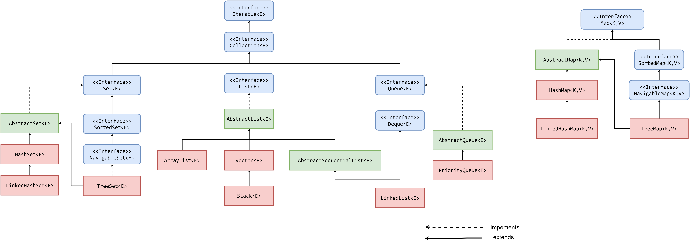

# Структуры данных в Java

## Введение

Понимание и эффективное использование структур данных, является основополагающим элементом программирования.
Без осознания того, как хранить и манипулировать данными, а также насколько быстро эти манипуляции происходят (и какие подводные камни за этим могут крыться), невозможно представить себе программирование.

Являясь `объектно-ориентированным` языком программирования, `Java` предоставляет обширный список структур данных, связанных в четкую иерархию с помощью `интерфейсов` и `классов`.

Коллекции из `JDK` работают **только** с объектами!

Иерархия существующих структур данных в `Java` выглядит следующим образом:



Изображение лучше скачать, так как markdown очень сильно его 'сжимает'.

* `Зеленым` выделены абстрактные классы.
* `Синим` выделены интерфейсы.
* `Красным` выделены конкретные реализации.

Корнем иерархии является интерфейс `java.lang.Iterable`:

```java
/**
 * Implementing this interface allows an object to be the target of the enhanced
 * {@code for} statement (sometimes called the "for-each loop" statement).
 *
 * @param <T> the type of elements returned by the iterator
 *
 * @since 1.5
 * @jls 14.14.2 The enhanced {@code for} statement
 */
public interface Iterable<T> {
    /**
     * Returns an iterator over elements of type {@code T}.
     *
     * @return an Iterator.
     */
    Iterator<T> iterator();

    /**
     * Performs the given action for each element of the {@code Iterable}
     * until all elements have been processed or the action throws an
     * exception.  Actions are performed in the order of iteration, if that
     * order is specified.  Exceptions thrown by the action are relayed to the
     * caller.
     * <p>
     * The behavior of this method is unspecified if the action performs
     * side-effects that modify the underlying source of elements, unless an
     * overriding class has specified a concurrent modification policy.
     *
     * @implSpec
     * <p>The default implementation behaves as if:
     * <pre>{@code
     *     for (T t : this)
     *         action.accept(t);
     * }</pre>
     *
     * @param action The action to be performed for each element
     * @throws NullPointerException if the specified action is null
     * @since 1.8
     */
    default void forEach(Consumer<? super T> action) {
        Objects.requireNonNull(action);
        for (T t : this) {
            action.accept(t);
        }
    }

    /**
     * Creates a {@link Spliterator} over the elements described by this
     * {@code Iterable}.
     *
     * @implSpec
     * The default implementation creates an
     * <em><a href="../util/Spliterator.html#binding">early-binding</a></em>
     * spliterator from the iterable's {@code Iterator}.  The spliterator
     * inherits the <em>fail-fast</em> properties of the iterable's iterator.
     *
     * @implNote
     * The default implementation should usually be overridden.  The
     * spliterator returned by the default implementation has poor splitting
     * capabilities, is unsized, and does not report any spliterator
     * characteristics. Implementing classes can nearly always provide a
     * better implementation.
     *
     * @return a {@code Spliterator} over the elements described by this
     * {@code Iterable}.
     * @since 1.8
     */
    default Spliterator<T> spliterator() {
        return Spliterators.spliteratorUnknownSize(iterator(), 0);
    }
}
```

Основная суть интерфейса `java.lang.Iterable` в том, что он добавляет структуре данных возможность итерирования, благодаря предоставлению [итератора](https://ru.wikipedia.org/wiki/%D0%98%D1%82%D0%B5%D1%80%D0%B0%D1%82%D0%BE%D1%80).

Обратите внимание на `<T>`. Это значит, что такой класс может быть параметризован.

Про параметризацию поговорим позднее, пока просто считайте, что параметризировать класс - это значит конкретизировать тот тип, с которым будет работать этот класс. Например, параметризовав `java.lang.Iterable` классом `java.lang.Integer`, разработчик явно покажет, что итерироваться будут только объекты `java.lang.Integer`.

Как уже было сказано выше, `java.lang.Iterable` предоставляет нам итератор для обхода коллекции, благодаря этому коллекции, например, можно использовать в `for-each` цикле:

```java
public void printLines(Iterable<String> lines) {
    for(String line : lines) {
        System.out.println(line);
    }
}
```

Следующим важным интерфейсом является `java.util.Collection`.

## java.util.Collection

Также, как и `java.lang.Iterable`, интерфейс `java.util.Collection` параметризуется.

В `Java` все структуры данных, кроме хэш-таблиц, реализуют этот интерфейс, поэтому далее можно называть их `коллекциями`.

Интерфейс `java.util.Collection` предоставляет основные методы для работы с коллекциями:

```java
    /**
     * Returns the number of elements in this collection.  If this collection
     * contains more than {@code Integer.MAX_VALUE} elements, returns
     * {@code Integer.MAX_VALUE}.
     *
     * @return the number of elements in this collection
     */
    int size();

    /**
     * Returns {@code true} if this collection contains no elements.
     *
     * @return {@code true} if this collection contains no elements
     */
    boolean isEmpty();

    /**
     * Returns {@code true} if this collection contains the specified element.
     * More formally, returns {@code true} if and only if this collection
     * contains at least one element {@code e} such that
     * {@code Objects.equals(o, e)}.
     *
     * @param o element whose presence in this collection is to be tested
     * @return {@code true} if this collection contains the specified
     *         element
     * @throws ClassCastException if the type of the specified element
     *         is incompatible with this collection
     *         (<a href="{@docRoot}/java.base/java/util/Collection.html#optional-restrictions">optional</a>)
     * @throws NullPointerException if the specified element is null and this
     *         collection does not permit null elements
     *         (<a href="{@docRoot}/java.base/java/util/Collection.html#optional-restrictions">optional</a>)
     */
    boolean contains(Object o);

    /**
     * Ensures that this collection contains the specified element (optional
     * operation).  Returns {@code true} if this collection changed as a
     * result of the call.  (Returns {@code false} if this collection does
     * not permit duplicates and already contains the specified element.)<p>
     *
     * Collections that support this operation may place limitations on what
     * elements may be added to this collection.  In particular, some
     * collections will refuse to add {@code null} elements, and others will
     * impose restrictions on the type of elements that may be added.
     * Collection classes should clearly specify in their documentation any
     * restrictions on what elements may be added.<p>
     *
     * If a collection refuses to add a particular element for any reason
     * other than that it already contains the element, it <i>must</i> throw
     * an exception (rather than returning {@code false}).  This preserves
     * the invariant that a collection always contains the specified element
     * after this call returns.
     *
     * @param e element whose presence in this collection is to be ensured
     * @return {@code true} if this collection changed as a result of the
     *         call
     * @throws UnsupportedOperationException if the {@code add} operation
     *         is not supported by this collection
     * @throws ClassCastException if the class of the specified element
     *         prevents it from being added to this collection
     * @throws NullPointerException if the specified element is null and this
     *         collection does not permit null elements
     * @throws IllegalArgumentException if some property of the element
     *         prevents it from being added to this collection
     * @throws IllegalStateException if the element cannot be added at this
     *         time due to insertion restrictions
     */
    boolean add(E e);

    /**
     * Removes a single instance of the specified element from this
     * collection, if it is present (optional operation).  More formally,
     * removes an element {@code e} such that
     * {@code Objects.equals(o, e)}, if
     * this collection contains one or more such elements.  Returns
     * {@code true} if this collection contained the specified element (or
     * equivalently, if this collection changed as a result of the call).
     *
     * @param o element to be removed from this collection, if present
     * @return {@code true} if an element was removed as a result of this call
     * @throws ClassCastException if the type of the specified element
     *         is incompatible with this collection
     *         (<a href="{@docRoot}/java.base/java/util/Collection.html#optional-restrictions">optional</a>)
     * @throws NullPointerException if the specified element is null and this
     *         collection does not permit null elements
     *         (<a href="{@docRoot}/java.base/java/util/Collection.html#optional-restrictions">optional</a>)
     * @throws UnsupportedOperationException if the {@code remove} operation
     *         is not supported by this collection
     */
    boolean remove(Object o);

    /**
     * Returns {@code true} if this collection contains all of the elements
     * in the specified collection.
     *
     * @param  c collection to be checked for containment in this collection
     * @return {@code true} if this collection contains all of the elements
     *         in the specified collection
     * @throws ClassCastException if the types of one or more elements
     *         in the specified collection are incompatible with this
     *         collection
     *         (<a href="{@docRoot}/java.base/java/util/Collection.html#optional-restrictions">optional</a>)
     * @throws NullPointerException if the specified collection contains one
     *         or more null elements and this collection does not permit null
     *         elements
     *         (<a href="{@docRoot}/java.base/java/util/Collection.html#optional-restrictions">optional</a>),
     *         or if the specified collection is null.
     * @see    #contains(Object)
     */
    boolean containsAll(Collection<?> c);

    /**
     * Adds all of the elements in the specified collection to this collection
     * (optional operation).  The behavior of this operation is undefined if
     * the specified collection is modified while the operation is in progress.
     * (This implies that the behavior of this call is undefined if the
     * specified collection is this collection, and this collection is
     * nonempty.)
     *
     * @param c collection containing elements to be added to this collection
     * @return {@code true} if this collection changed as a result of the call
     * @throws UnsupportedOperationException if the {@code addAll} operation
     *         is not supported by this collection
     * @throws ClassCastException if the class of an element of the specified
     *         collection prevents it from being added to this collection
     * @throws NullPointerException if the specified collection contains a
     *         null element and this collection does not permit null elements,
     *         or if the specified collection is null
     * @throws IllegalArgumentException if some property of an element of the
     *         specified collection prevents it from being added to this
     *         collection
     * @throws IllegalStateException if not all the elements can be added at
     *         this time due to insertion restrictions
     * @see #add(Object)
     */
    boolean addAll(Collection<? extends E> c);

    /**
     * Removes all of this collection's elements that are also contained in the
     * specified collection (optional operation).  After this call returns,
     * this collection will contain no elements in common with the specified
     * collection.
     *
     * @param c collection containing elements to be removed from this collection
     * @return {@code true} if this collection changed as a result of the
     *         call
     * @throws UnsupportedOperationException if the {@code removeAll} method
     *         is not supported by this collection
     * @throws ClassCastException if the types of one or more elements
     *         in this collection are incompatible with the specified
     *         collection
     *         (<a href="{@docRoot}/java.base/java/util/Collection.html#optional-restrictions">optional</a>)
     * @throws NullPointerException if this collection contains one or more
     *         null elements and the specified collection does not support
     *         null elements
     *         (<a href="{@docRoot}/java.base/java/util/Collection.html#optional-restrictions">optional</a>),
     *         or if the specified collection is null
     * @see #remove(Object)
     * @see #contains(Object)
     */
    boolean removeAll(Collection<?> c);

    /**
     * Removes all of the elements from this collection (optional operation).
     * The collection will be empty after this method returns.
     *
     * @throws UnsupportedOperationException if the {@code clear} operation
     *         is not supported by this collection
     */
    void clear();
```

Здесь все довольно интуитивно понятно, кроме, возможно, `boolean add(element)`.

Дело в том, что при добавлении элемента в коллекцию метод вернет `true`, если коллекция была изменена в результате добавления.
Если же текущая реализация коллекции не может содержать дубликаты и уже содержит добавляемый элемент будет возвращено значение `false`.

Еще одним интересным моментом является то, что интерфейс `java.util.Collection` **не предоставляет** метода, который достает элемент из коллекции.

Т.е интерфейс `java.util.Collection` предоставляет возможность только добавлять и удалять значения из коллекции, но не извлекать.

---

**Вопрос**:

Почему же  `java.util.Collection` не предоставляет методов для извлечения элемента из коллекции?

**Ответ**:

Извлечение элемента является довольно специфичным поведением для каждой реализации.
Например, не все реализации `java.util.Set` упорядочены, отсюда извлечение элемента по индексу является невыполнимым.

Так как множество исключает содержание дубликатов, то возможность извлечения по элементу также выглядит спорным моментом.

Если существует некоторое множество, то вместо `get(element)` достаточно вызвать `contains(element)`.

Так как если элемент есть в множестве, то значение будет `true`, а это значит что `element`, по которому делали `contains`, будет точно тем же, если бы был вызван `get(element)`.

Стоит отметить, что методы извлечения элемента из коллекции добавляются в интерфейсах `java.util.List` и `java.util.Queue`.

---

Далее уже более специфичные (близкие к деталям реализации) интерфейсы расширяют `java.util.Collection`, подробнее о них:

* [java.util.List](list/intro.md)
* [java.util.Set](set/intro.md)
* [java.util.Queue](queue/intro.md)

При этом хэш-таблицы (или `Map`-ы) несколько обособлены и не реализуют интерфейс `java.util.Collection`, хотя когда говорят коллекции `Java` реализации `java.utl.Map` зачастую также имеют в виду.

---

**Вопрос**:

Почему хэш-таблицы не реализуют `java.util.Collection`?

С чем связана эта обособленность?

**Ответ**:

Эта обособленность связана с логическим разделением.

Когда мы говорим про коллекции, то имеется в виду одно множество объектов.

В то время как хэш-таблицы - это два множества объектов: множество ключей и множество значений, где каждому ключу соответствует свое значение.

Еще одним аргументом может служить то, что при включении хэш-таблиц в иерархию коллекций необходимо будет реализовать итерируемость, но итерироваться по хэш-таблицам можно по разному: как по ключам, так и по значениям, что вызывает дополнительную неопределенность.

Хотя эти доводы кому-то могут показаться натянутыми, так как в некоторых языках, например, `Scala` хэш-таблицы итерируемы.

---

Подробнее о [java.util.Map](map/intro.md).

## Коллекции не из JDK

Выше были затронуты коллекции, которые предоставляет `JDK`, но помимо этого существуют и другие реализации, например:

* [Trove](http://trove4j.sourceforge.net/html/overview.html), реализация коллекций, работающая с примитивами.
* [Koloboke](https://github.com/leventov/Koloboke), реализация коллекций, работающая с примитивами (форк Trove, поздее ставший полноценным проектом).
* [Google Guava](https://github.com/google/guava), добавляет несколько полезных реализаций структур данных, например, мультимножество.

## Полезные ссылки

1. [Введение в Java. Коллекции. | Технострим](https://www.youtube.com/watch?v=hlAunthj794)
2. [Java #7. Collections, lambdas, method references](https://www.youtube.com/watch?v=cNkZvnBARAc&list=PL4_hYwCyhAvblhTbPQmOF4b3kilWSpOjU&index=7)
3. [Volodya Mozhenkov Коллекции Java - введение](https://www.youtube.com/watch?v=H8YOHx1dLMI)
