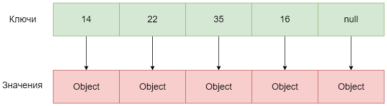

# java.util.HashSet

## Введение

Класс `java.util.HashSet` является одной из самых популярных и часто используемых реализаций интерфейса `java.util.Set`.

Данная реализация основана на `java.util.HashMap`, что не гарантирует порядок хранения элементов, однако предоставляет константное время для добавления, удаления и проверки на содержание элемента в множестве.
Но только при условии отсутствия коллизий, т.е хорошо определенной хэш-функции добавляемых элементов.

В `Java` за это отвечает метод [hashCode](../../object/hashcode.md).

Реализация может динамически менять размер и позволяет хранить `null` значения.

## Реализация

> Прежде чем приступить необходимо ознакомитья с тем, как реализована [java.util.HashMap](../map/hash_map.md).

Обратим внимание на поля класса и выделим наиболее значимые:

```java
    private transient HashMap<E, Object> map;

    // Dummy value to associate with an Object in the backing Map
    private static final Object PRESENT = new Object();
```

Как было сказано выше, в основе реализации лежит `java.util.HashMap`, добавляемые элементы хранятся в поле `map`.
Из определения поля видно, чтр ключом в хэш-таблице является добавляемый элемент, в то время как значением является `java.lang.Obejct`.

Почему так сделано?

Необходимо вспомнить, что `java.util.HashSet` это одно множество объектов.

В то время как `java.util.HashMap` - это два множества объектов: множество ключей и множество значений, где каждому ключу соответствует свое значение.

В `java.util.HashMap` можно быстро получить информацию по ключу, при этом какое значение будет - на самом деле не важно.
А раз не важно то, что это будет за объект, то создавать каждый раз новый было бы не совсем разумно, ведь этими объектами никто не должен пользоваться, они не важны.

Поэтому создается один объект-пустышка и используется как заглушка везде, это значение принадлежит классу, так как имеет модификатор `static`, и хранится в поле `PRESENT`.

Таким образом сохраняются все преимущества, которые дает нам `java.util.HashMap`: константное время для добавления, удаления и проверки на содержание элемента.

Проиллюстрируем это на примере множества чисел:



Cвойства инкапсулируемой внутри `java.util.HashSet` хэш-таблицы настраиваются через конструкторы.

Конструктор по-умолчанию создает `java.util.HashMap` с `capacity` равным 16 и `loadfactor` равным 0.75.

```java
    /**
     * Constructs a new, empty set; the backing <tt>HashMap</tt> instance has
     * default initial capacity (16) and load factor (0.75).
     */
    public HashSet() {
        map = new HashMap<>();
    }
```

Разумеется, если планируется добавление большого количества элементов лучше заранее выставить необходимое `capacity`.

Для этого существуют конструкторы:

```java
    /**
     * Constructs a new, empty set; the backing <tt>HashMap</tt> instance has
     * the specified initial capacity and the specified load factor.
     *
     * @param      initialCapacity   the initial capacity of the hash map
     * @param      loadFactor        the load factor of the hash map
     * @throws     IllegalArgumentException if the initial capacity is less
     *             than zero, or if the load factor is nonpositive
     */
    public HashSet(int initialCapacity, float loadFactor) {
        map = new HashMap<>(initialCapacity, loadFactor);
    }

    /**
     * Constructs a new, empty set; the backing <tt>HashMap</tt> instance has
     * the specified initial capacity and default load factor (0.75).
     *
     * @param      initialCapacity   the initial capacity of the hash table
     * @throws     IllegalArgumentException if the initial capacity is less
     *             than zero
     */
    public HashSet(int initialCapacity) {
        map = new HashMap<>(initialCapacity);
    }
```

Стоит отметить, что `capacity` меньше `0` выставить не получится, так как выбросится исключение `java.lang.IllegalArgumentException`, что логично.

## Добавление элемента

За добавление элемента в `java.util.HashSet` отвечает метод:

```java
    /**
     * Adds the specified element to this set if it is not already present.
     * More formally, adds the specified element <tt>e</tt> to this set if
     * this set contains no element <tt>e2</tt> such that
     * <tt>(e==null&nbsp;?&nbsp;e2==null&nbsp;:&nbsp;e.equals(e2))</tt>.
     * If this set already contains the element, the call leaves the set
     * unchanged and returns <tt>false</tt>.
     *
     * @param e element to be added to this set
     * @return <tt>true</tt> if this set did not already contain the specified
     * element
     */
    public boolean add(E e) {
        return map.put(e, PRESENT) == null;
    }
```

Как видно из реализации, происходит добавление элемента в хэш-мапу `map` в качестве ключа, в качестве значения используется описанный выше объект-заглушка `PRESENT`.

Алгоритм добавления будет тот же, что и в [HashMap](../map/hash_map.md#добавление-элемента):

1. Вычисление hash-кода от добавляемого значения
2. Рассчет по полученному значению корзины
3. Добавление элемента в корзину

Будет возвращено значение `true`, если до этого множество не содержало добавляемого значения, в противном случае элемент не добавится и будет возвращено значение `false`.

---

**Вопрос**:

Как происходит понимание содержался элемент или нет?

Каков алгоритм проверки на то, содержится удаляемый элемент в множестве или нет?

**Ответ**:

Считается, что множество не содержит элемента `e`, если не существует элемента `e2`, такого, что значение выражения будет `true`:

```java
(e == null ? e2 == null : e.equals(e2))
```

Другими словами, если добавляемый элемент `null`, то множество не должно **уже** содержать `null` значение.

Если добавляемый элемент не `null` значение, то в множестве не должно быть ни одного равного ему элемента, где равенство проверяется через `equals`.

Поэтому помимо `hashCode` крайне важно правильно определить [equals](../../object/equals.md).

---

## Удаление элемента

За удаление элемента у `java.util.HashSet` отвечает метод:

```java
    /**
     * Removes the specified element from this set if it is present.
     * More formally, removes an element <tt>e</tt> such that
     * <tt>(o==null&nbsp;?&nbsp;e==null&nbsp;:&nbsp;o.equals(e))</tt>,
     * if this set contains such an element.  Returns <tt>true</tt> if
     * this set contained the element (or equivalently, if this set
     * changed as a result of the call).  (This set will not contain the
     * element once the call returns.)
     *
     * @param o object to be removed from this set, if present
     * @return <tt>true</tt> if the set contained the specified element
     */
    public boolean remove(Object o) {
        return map.remove(o) == PRESENT;
    }
```

Элемент удаляется из `map`, возвращается значение `true`, если элемент присутствовал в множестве и `false`, если нет.

## Содержание элемента

Важно помнить, что интерфейс `java.util.Set`, а значит и рассматриваемая нами сейчас реализация `java.util.HashSet`, не содержит методов получения элемента из множества.

Почему так сделано было разобрано во [введении](intro.md).

Вместо него можно использовать `contains`:

```java
    /**
     * Returns <tt>true</tt> if this set contains the specified element.
     * More formally, returns <tt>true</tt> if and only if this set
     * contains an element <tt>e</tt> such that
     * <tt>(o==null&nbsp;?&nbsp;e==null&nbsp;:&nbsp;o.equals(e))</tt>.
     *
     * @param o element whose presence in this set is to be tested
     * @return <tt>true</tt> if this set contains the specified element
     */
    public boolean contains(Object o) {
        return map.containsKey(o);
    }
```

Как видите, происходит проверка на содержание ключа.

## Многопоточность

Все методы `java.util.HashSet` не синхронизированы.
Поэтому добавление из различных потоков в множество **строго** не рекомендуется.

При необходимости работы с множеством из нескольких потоков рекомендуется использовать специализированные структуры данных, например на базе `ConcurrentHashMap` (доступно с `Java 8+`):

```java
Set<Integer> set = ConcurrentHashMap.newKeySet();
```

В некоторых библиотеках, например, `Guava` добавлены специальные методы для более простого создания таких множеств:

```java
  /**
   * Creates a thread-safe set backed by a hash map. The set is backed by a {@link
   * ConcurrentHashMap} instance, and thus carries the same concurrency guarantees.
   *
   * <p>Unlike {@code HashSet}, this class does NOT allow {@code null} to be used as an element. The
   * set is serializable.
   *
   * @return a new, empty thread-safe {@code Set}
   * @since 15.0
   */
  public static <E> Set<E> newConcurrentHashSet() {
    return Platform.newConcurrentHashSet();
  }
```

Существует также возможность 'обернуть' множество в синхронизированную обертку:

```java
Set<Integer> set = Collections.synchronizedSet(new HashSet<>());
```

Однако, он менее эффективен: по сути он просто оборачивает в обертку у которой все методы являются `synchronized`, в современной `Java` подобный подход **не рекомендуется**.

## Производительность

Благодаря тому, что в основе реализации лежит `java.util.HashMap`, реализация `java.util.HashSet` предоставляет константное время выполнения для добавления элемента: `O(1)`.

Для удаления и проверки на содержание элемента в большинстве случаев будет также константное время: `O(1)`.
Но только при условии отсутствия коллизий, т.е хорошо определенной хэш-функции добавляемых элементов.

Среднее же время работы для операций удаления и проверки на содержание будет `O(1 + a)`, где `a` — коэффициент возникновения коллизий. В самом худшем случае время выполнения может составить `O(n)`, когда возникают постоянные коллизии и все элементы попадают в одну 'корзину', т.е происходит вырождение хэш-таблицы в двусвязый список.

Все вышесказанное справедливо для `Java 7`, так как в версии `Java 8+` реализацию `java.util.HashMap` улучшили, поэтому при большом количестве коллизий 'корзина' становится не двусвязным списком, а сбалансированным деревом, что предоставляет время выполения в худшем случае `O(log(n))`.

Поэтому рекомендуется при работе с `Java 8+` для добавляемых в множество элементов реализовывать `java.lang.Comparable`, что улучшит производительность даже в случае большого количества коллизий. Если ключи не реализуют этот интерфейс дерево будет строится на основе результатов вызова `System.identityHashCode()`.

Еще одним важным моментом, которое необходимо помнить, является то, как устроено итерирование по множеству.

Время итерирования по множеству зависит от количества элементов в множестве и от количества 'корзин' в `java.util.HashMap`.
Поэтому большое значение `capacity` или маленькое значение `load factor` может снизить производительность при итерировании.

> Если вы ничего не поняли, то снова прочтите то, как реализована [java.util.HashMap](../map/hash_map.md).

## Заключение

Реализация `java.util.HashSet` позволяет быстро добавлять, удалять и проверить на содержание элемент в множестве.

Благодаря тому, что данная реализация построена на `java.util.HashMap`, она получает все преимущества и недостатки `java.util.HashMap`.

Необходимым условием корректной работы `java.util.HashSet` являются правильно определенные методы `equals` и `hashCode`.
При работе с `Java 8+` рекомендуется для добавляемых в множество элементов реализовывать `java.lang.Comparable`, что улучшит производительность даже в случае большого количества коллизий.

Не гарантирует порядок хранения элементов.

Не является потокобезопасной реализацией множества.

## Полезные ссылки

1. [Хеш-таблица — Самая Популярная Структура Данных](https://www.youtube.com/watch?v=rPp46idEvnM)
2. [Java Concurrent HashSet Equivalent to ConcurrentHashMap](https://www.baeldung.com/java-concurrent-hashset-concurrenthashmap)
