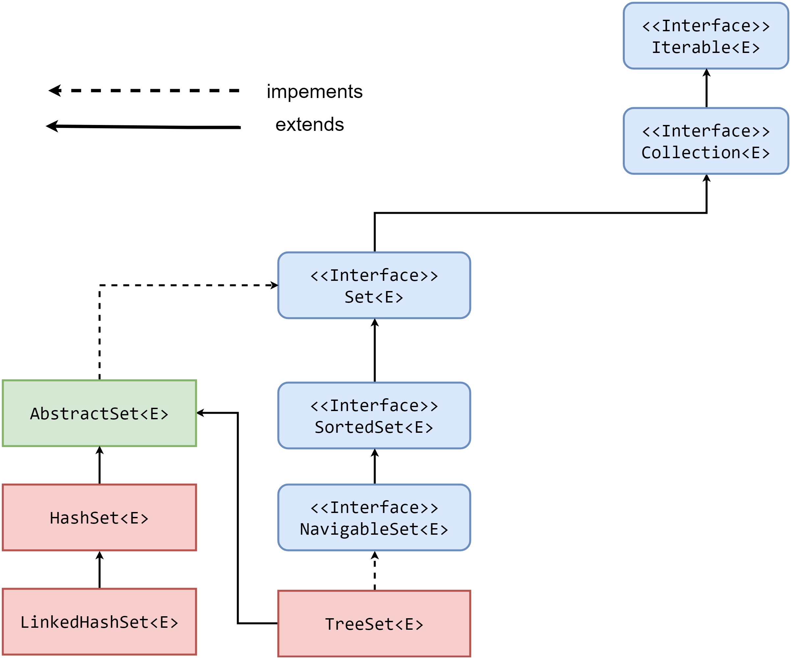

# Интерфейс java.util.Set

## Введение

Интерфейс `java.util.Set` описывает математическое понятие множество, отсюда и название.

Как уже было сказано во [введении](../intro.md), интерфейс `java.util.Set` расширяет `java.util.Collection`, но не добавляет новых методов.

Реализации интерфейса `java.util.Set` гарантируют отсутствие дублирующих значений и позволяют хранить `null` значения, поэтому могут иметь не более одного такого значения.

Как и все интерфейсы в иерархии коллекций, `java.util.Set` параметризуется.

Объявление выглядит как:

```java
public interface Set<E> extends Collection<E> {
    // ...
}
```

Для определения того, является ли добавляемое знаечение дублем или нет, реализации интерфейса `java.util.Set` использует метод `equals`.
Поэтому важно, чтобы этот метод был переопределен для добавляемых элементов.

[Подробнее про equals](../../object/equals.md).

## Получение элемента

Важно помнить, что интерфейс `java.util.Set` не добавляет никаких новых методов, а только наследует те, что есть у `java.util.Collection`.
Это значит, что интерфейс `java.util.Set` не содержит поведения, позволяющего получить элемент из множества.

---

**Вопрос**:

Почему `java.util.Set` не предоставляет методов для извлечения элемента из множества? Как доставать элементы из множества?

**Ответ**:

Не все реализации `java.util.Set` упорядочены, поэтому извлечение элемента по индексу является невыполнимым.

Если существует некоторое множество, то вызвав `contains(element)` вы получите либо `true`, если элемент в множестве содержится, либо `false`, если нет.
Так как дубликатов в множестве быть не может, то получив значение `true` на вызов `contains` вы и получите тот самый элемент, который ищите в множестве.

Отсюда следует, что наличие методов `get` и им подобных в множестве не имеет смысла.

---

## Реализации java.util.Set

Иерархия классов выглядит следующим образом:



Из рисунка видно, что в `Java` существует три наиболее популярных реализаций интерфейса `java.util.Set`:

* [java.util.HashSet](hash_set.md)
* [java.util.TreeSet](tree_set.md)
* [java.util.LinkedHashSet](linked_hash_set.md)

### Выбор реализации

Когда и какую реализацию выбрать?

Если порядок хранения элементов не важен, то выбор `java.util.HashSet` более чем оправдан.

Данная реализация предоставляет быстрый доступ до элемента, но только при условии отсутствия коллизий, т.е хорошо определенной хэш-функции добавляемых элементов, в `Java` за это отвечает метод [hashCode](../../object/hashcode.md).

В случае, если порядок добавления элементов важен, то стоит присмотреться к `java.util.LinkedHashSet`. Понятно, что за сохранение порядка надо платить, поэтому данная реализация работает несколько медленнее, чем `java.util.HashSet`.

Если необходимо, чтобы элементы были отсортированы, то следует присмотреться к `java.util.TreeSet`. Однако в таком случае добавляемые элементы должны либо реализовывать интерфейс `java.lang.Comparable`, либо необходимо будет использовать собственный компаратор.

Важно помнить, что необходимо очень аккуратно работать с изменяемыми объектами, которые добавляются в `java.util.Set`, так как это может серьезно повлиять на поведение множества.
