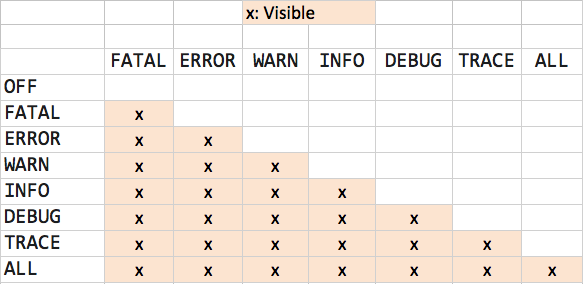

# Логирование в Java

## Введение

Логирование(`logging`) - это процесс записи информации о событиях, происходящих в рамках какого-либо процесса с некоторым объектом. Запись может проводиться в файл регистрации или в базу данных.

> Слово `log`, на самом деле, имеет множество значений, например протокол или журнал. 
> Однако обычно все говорят именно лог и производные от него: логирование и логировать.
>
> Хотя правильнее было бы говорить наверное журналирование/протоколирование и вести журнал/протокол соответственно.
> 
> Но так никто никогда не говорит, конечно ¯\\_(ツ)_/¯

По сути логирование - это то, что позволяет следить за ходом выполнения вашего приложения, вашего кода.

При работе приложения надо понимать, что вообще происходит внутри, особенно при разборе ошибок и инцидентов. В этом как раз и помогают логи - это как запись черного ящика на самолетах.

Нет информации о происходящих событий в приложении - мы ничего не знаем о том, что происходит. И если такое поведение может устраивать в случае, когда все идеально работает (да и то сомнительно), то во всех остальных случаях такое поведение категорически не устраивает никого.

Поэтому "логи всякие нужны, логи всякие важны".

Пришла пора сформулировать требования - чего вообще хотелось бы от логера.

## Требования

Еще одним важным вопросом на который надо ответить - это **что** логировать.

Работа приложения - это происходящие в нем события, которые в свою очередь могут быть классифицированы на:
 * события, связанные с бизнес-логикой
 * события, связанные с безопасностью приложения
 * и системные события, связанные с уже конкретикой реализации - вызовов ОС, использования библиотек, фреймворков и т.д.

Все ли нужно логировать?

Если вы вдруг залогируете в общий файл-лога пароль и логин пользователя, то никто такому рад не будет, что подводит нас к мысли, что логировать надо тоже с умом.

Опять же, если логировать все подряд, то размеры таких логов будут не просто большими, они будут огромными. И у вас возникнет уже другая проблема - где все это хранить.

Добавим сюда еще и то, что логирование - это тоже работа, а значит процессорное время. И чем больше логов мы пишем - тем больше процессорного времени тратится на это, а в ситуации, когда все работает хорошо такое чрезмерное логирование только тормозит.

С другой стороны, при возникновении проблем, особенно спорадических ошибок, чем больше у вас информации - тем лучше.

Т.е возникает требование управления информацией, которая нам нужна в данный момент, а также форматом ее вывода.

При этом, логично, что изменения этого формата и того, что мы хотим видеть в логе не должны требовать перекомпиляции всего проекта или изменения кода.

## Уровни логирования

Уровень логирования - это разделение событий по приоритетам, по степени важности. Например, `error` - пишем ошибки, `debug` - пишем более подробно в лог и т.д.

| Уровень логирования        | Описание                                           |
| -------------------------- |:---------------------------------------------------|
| ALL                        | Все сообщения                                      |
| TRACE                      | Сообщение для более точной отладки                 |
| DEBUG                      | Дебаг-сообщение, для отладки                       |
| INFO                       | Обычное сообщение                                  |
| WARN                       | Предупреждение, не фатально, но что-то не идеально |
| ERROR                      | Ошибка                                             |
| FATAL                      | Фатальная ошибка, дело совсем плохо                |
| OFF                        | Без сообщения                                      |

Если проиллюстрировать это:



## Принципы и понятия

В основе большинства библиотек логирования лежат три понятия: `logger`, `appender` и `layout`.

> Это наиболее распространенные и устоявшиеся понятия, можно сказать, что это - стандарт.

### Logger

Логер - это объект, область ответственности которого - вывод данных в лог и управление уровнем (детализацией) этого вывода.

Логер создается с помощью фабрики и на этапе создания ему присваивается имя. Имя может быть любым, но по стандарту имя должно быть сопряжено с именем класса, в котором вы собираетесь что-то логировать:

```java
Logger logger = LoggerFactory.getLogger(SomeClass.class.getName());
```

Это дает нам имя логера в виде: `ru.aarexer.example.SomeClass`.

Почему так рекомендуется делать?

Потому что важным свойством логгеров является то, что они организованы иерархично. Каждый логгер имеет имя, описывающее иерархию, к которой он принадлежит. Разделитель – точка. Принцип полностью аналогичен формированию имени пакета в `Java`.

Получается выстраивается следующая иерархия логеров:

```
root <- ru <- aarexer <- example <- SomeClass
```

И каждому логеру можно выставить свой уровень. Установленный логгеру уровень вывода распространяется на все его дочерние логгеры, для которых явно не выставлен уровень.

При этом во главе иерархии логеров всегда стоит некотрый дефолтный рутовый(корневой) логер.

Поэтому у всех логеров будет уровень логирования, даже если явно мы не прописали для `ru.aarexer.example.SomeClass` его, то он унаследуется от рутового.

---

**Вопрос**:

Мы установили рутовый уровень в `INFO`, а `ru.aarexer` в `DEBUG`, остальным в иерархии уровень не назначен, т.е:

| Логер                 | Назначенный уровень                |
| --------------------- |:-----------------------------------|
| root                  | INFO                               |
| ru                    | Не назначен                        |
| ru.aarexer            | DEBUG                              |
| ru.aarexer.example    | Не назначен                        |

Какой у какого логера будет уровень логирования?

**Ответ**:

Вспоминаем, что, если уровень логирования не назначен для логера, то он унаследует его от родительского, смотрим на иерархию:

`root <- ru <- aarexer <- example`

И получаем ответ:

| Logger                | Назначенный уровень                | Уровень, который будет  |
| --------------------- |:-----------------------------------|:-----------------------:|
| root                  | Все сообщения                      |  INFO                   |
| ru                    | Не назначен                        |  INFO                   |
| ru.aarexer            | DEBUG                              |  DEBUG                  |
| ru.aarexer.example    | Не назначен                        |  DEBUG                  |

---

Подход с иерархией логеров очень гибкий – можно для всех выставить требуемый уровень, например, `ERROR`, а для необходимых логеров его менять, причем как в сторону понижения, так и в сторону повышения уровня.

Задача логера одна - это вызывать событие, которое приведет к логированию.

```java
logger.info("Application started");
logger.debug("Or not");
```

Это событие по сути состоит из двух полей:

```java
message = "Application started"
level = Level.Info
```

### Appender

Аппендер – это та точка, куда события приходят в конечном итоге.
Это может быть файл, БД, консоль, сокет и т.д.

Здесь нас никто не ограничивает - можно написать свой аппендер, который пишет сообщения куда-угодно.

Получается у нас есть две точки, первая - это логгер, это начало пути, вторая - аппендер, это уже конечная точка.

Логеры и аппендеры связаны в отношении `many-to-many`.

У одного логгера может быть несколько аппендеров, а к одному аппендеру может быть привязано несколько логгеров.

Логеры при этому наследуют от родительских не только уровни логирования, но и аппендеры.

Например, если к root-логгеру привязан аппендер A1, а к логгеру `ru.aarexer` – A2, то вывод в логгер `ru.aarexer` попадет в A2 и A1, а вывод в `ru` – только в A1.

---

**Вопрос**:

Пусть у нас есть несколько аппендеров и логеров

| Logger                          | Appender                           |
| ------------------------------- |:-----------------------------------|
| root                            | А1                                 |
| ru.aarexer                      | А2                                 |
| ru.aarexer.example.SomeClass    | А3                                 |

В какой аппендер попадет лог-сообщение:

```java
LoggerFactory.getLogger(SomeClass.class.getName()).info("hello");
```

**Ответ**:

У логеров есть такое свойство как `additivity`. По умолчанию она установлена в `true`.

Это говорит о том, что логер-наследник будет свои события передавать логеру-родителю.

Смотрим на иерархию:

`root <- ru <- aarexer <- example`

Из всего вышесказанного делаем вывод, что событие "hello" с уровнем `Level.INFO` попадет во все три аппендера.

---

Но такое наследование аппендеров можно отключить через конфигурацию, для этого стоит посмотреть в сторону выставления флага `additivity="false"` на логгерах.

### Layout

Layout - это формат вывода данных.

Т.е как лог-сообщения будут отформативарованы, соответственно тут у каждой библиотеки свой набор доступных форматов.

Теперь пришла пора посмотреть - что вообще есть в `Java`.

## Библиотеки логирования в Java

Ну и самым первым логером, который можно представить себе, был и есть `System.out.println` и `System.err.println`. При этом надо помнить, что `err` и `out` - это два разных потока вывода, где `err` вывод не буферизуется и работает быстрее, чем `out`.

По сути, такой логер может писать либо `info`-сообщения, либо `error`.

Однако он не отвечает всем тем требованиям, которые мы сформулировали выше, поэтому рассмотрим альтернативы.

Наиболее популярные библиотеки логирования в `Java`:

* `java.util.logging` или `JUL`, является частью `JDK`.
* `Apache log4j`
* `logback`, разработанная создателями `log4j`
* `Apache log4j2`, продолжение `log4j`

Это все по сути **реализации** логеров в `Java`, ну а мы бы не писали на `Java`, если бы не попытались сделать нечто объединяющее, чтобы иметь возможность подменять **реализации**, не изменяя свой код. Некоторый адаптер.

И поэтому появились еще две библиотеки:

* `Apache Commons Logging` - `JCL`
* `Simple Logging Facade for Java` - `SLF4J`

### Apache log4j

Это самая первая библиотека логирования, появилась еще в 1999 году.

Конфигурируется через `xml`, либо через `properties`.

Поддерживает большое количество способов вывода логов: от консоли и файла до записи в БД.

Также имеет поддержку обширного формата логирования: от обычного текстового вывода до `html`.

Именно он ввел понятие `appender` - кто пишет в лог, `layout` - форматирование.
В конфигурации задаются эти самые `appender`-ы и какого уровня сообщения попадают к какому `appender`-у.

Ввел соответствие иерархичности категорий и пакетов: например, можно логгировать все сообщения из `org.hibernate` и заглушить всё из `org.hibernate.type`.

Благодаря подобной иерархии лишнее отсекается и поэтому логер работает быстро.


Проект сейчас [не развивается](https://blogs.apache.org/foundation/entry/apache_logging_services_project_announces) и по сути заброшен, с версией `Java 9` уже [не совместим](https://blogs.apache.org/logging/entry/moving_on_to_log4j_2).

Поэтому на данный момент [рекомендуется](http://logging.apache.org/log4j/1.2/) использовать `log4j2`, о котором речь пойдет ниже.

> Вклад `log4j` в мир логирования настолько велик, что многие идеи были взяты в библиотеки логирования для других языков.

### JUL

Зачем нужно было изобретать что-то новое, если уже был `log4j` мне лично не понятно, однако в рамках формирования `JSR 47` взяли не `log4j`, так появился `JUL`.

Логер включен в стандарт(в рамках `JSR 47`) и поставляется вместе с `JDK`. `JUL` имеет следующие уровни логгирования по возрастанию: `FINEST`, `FINER`, `FINE`, `CONFIG`, `INFO`, `WARNING`, `SEVERE`, а так же `ALL` и `OFF`, включающий и отключающий все уровни соответственно.

Вот эти все `FINEST`, `FINER`, `FINE` - это **три** уровня логирования для отладочных сообщений, **три**, Карл!


Чувствуете насколько все переосложнено?

`JUL` очень похож на `log4j`, но предоставляет гораздо меньше возможностей.

Так как стандартных средств форматирования логов недостаточно, то все сводилось к тому, что писались свои. Это при том, что `log4j` предоставлял больший функционал, работал как минимум не медленнее и в целом себя чувствовал хорошо.

Настраивается только с помощью `properties`.

И вот мы уже имеем два логгера, одни библиотеки использовали `log4j`, другие `jul` и это было начало хаоса.

Именно это послужило толчком к созданию `Apache Commons Logging` или `JCL`.

### JCL

Как уже было сказано, `JCL` - это обертка над `log4j` и `JUL`.

Уровни логгирования у JCL совпадают с log4j, а в случае взаимодействия с JUL происходит следующее сопоставление: 

| JCL                        | JUL                                                  |
| -------------------------- |:-----------------------------------------------------|
| ALL                        | `Все сообщения`                                      |
| TRACE                      | `Level.FINEST`                                       |
| DEBUG                      | `Level.FINE`                                         |
| INFO                       | `Level.INFO`                                         |
| WARN                       | `Level.WARNING`                                      |
| ERROR                      | `Level.SEVERE`                                       |
| FATAL                      | `Level.SEVERE`                                       |
| OFF                        | `Без сообщения`                                      |

Конфигурация `JCL` содержит отдельные блоки для `log4j`, `JUL` и собственной реализации.

Внутри себя она часто использует `reflection`, поэтому проседает по производительности и утяжеляет приложение.

`JCL` на данный момент почти никогда не встречается в новых проектах, это довольно старая библиотека, которая встречается разве что в старых `legacy`-проектах.

С уверенностю можно сказать сейчас, что в эту сторону даже смотреть не стоит. Пациент мертв.

> Разработчик `JCL` даже как-то высказался в духе: [Commons Logging was my fault](http://radio-weblogs.com/0122027/2003/08/15.html).

|                               |                                                    |
| ----------------------------- |:---------------------------------------------------|
| Лицензия                      | Apache License Version 2.0                         |
| Последняя версия              | 1.2                                                |
| Дата выпуска последней версии | июль 2014                                          |

### Apache log4j2

Какое-то время все так и существовало, но по мере попытки усидеть на двух стульях происходит раскол и создание `log4j2` - на новых идеях, использующая все модные фишки.

При этом она оказывается полностью несовместима с `log4j`.

Но добавили много нового, парочка из них:

* Система плагинов, которая позволяет добавить новые `appender`-ы, `layout`-ы и т.д
* Улучшения производительности.
* Появилась поддержка конфигруаций через `json` и `yaml`.
* Поддержка `jmx`.

Полный список [тут](http://logging.apache.org/log4j/log4j-2.3/manual/index.html).

Правда перестали поддерживать `properties` конфигурации и конфигурации от `log4j` на `xml` надо было переписывать заново.

На данный момент [рекомендуется](http://logging.apache.org/log4j/1.2/) использовать именно `log4j2`. Однако надо помнить, что `Log4j 2` работает только с `Java 6+`.

|                               |                                                    |
| ----------------------------- |:---------------------------------------------------|
| Лицензия                      | Apache License Version 2.0                         |
| Последняя версия              | 2.11.2                                             |
| Дата выпуска последней версии | февраль 2019                                       |

### SLF4J

Появление нового логера и проблемы `JCL` послужили появлению `slf4j` - еще одной обертке.

Помимо того, что она не имеет проблем с производительностью, как у `JCL`, является оберткой над всеми известными логерами типа `logback`, `log4j`, `jul` и т.д, она предоставляет еще параметризованные сообщения:

```java
log.debug("User {} connected from {}", user, request.getRemoteAddr());
```

При этом преобразование параметров в строку и окончательное форматирование лог-записи происходит **только** при установленном уровне `DEBUG`.

|                               |                                                    |
| ----------------------------- |:---------------------------------------------------|
| Лицензия                      | MIT License                                        |
| Последняя версия              | 2.0.0-alpha0                                       |
| Дата выпуска последней версии | июнь    2019                                       |

### Logback

`logback` был сделан разработчиком `log4j`, поэтому многие фишки перекочевали сразу, а учитывая, что разрабатывался он позже, то старческие болячки `log4j` обошли.

При этом, `logback` не является частью `Apache` или еще какой-то компании и независим.

Может быть сконфигурирован через `xml` и `groovy`.

Для `logback`:

|                               |                                                    |
| ----------------------------- |:---------------------------------------------------|
| Лицензия                      | EPL/LGPL 2.1                                       |
| Последняя версия              | 1.3.0-alpha4                                       |
| Дата выпуска последней версии | февраль 2018                                       |

На данный момент это самый мощный логер по количеству предоставляемых возможностей 'из коробки'. Однако, из-за некоторой его обособленности и сложной лицензии многие опасаются его использования и предпочитают `log4j` или `log4j2`.

В данный момент все чаще встречаются проекты, которые выбрали связку `SLF4J` + `Logback`.

> При этом в версии `1.2.3` стоит явное ограничение на количество файлов, с которым умеет работать логер при ротировании - это трехзначное число, в поздней версии это ограничение убрали.

## Что выбрать

Сейчас я бы выбрал связку `SLF4J` и `logback`, так как при необходимости вы сможете переключиться с `logback` на другую реализацию логера. При этом `logback` обладает всеми преимуществами `slf4j`, но без старых болячек и с дополнительными плюшками.

Из минусов `logback` - это лицензия(LGPL/EPL) и то, что он независимый. Т.е он не принадлежит ни `Apache`, ни каким-то еще компаниям, а это для некоторых может стать серьезным минусом.

Если минусы для вас существенны, то я бы выбирал `log4j2` или `log4j`.

В случае, если ваш проект мал и прост, при этом вы не разрабатываете библиотеку, а пишите именно законченный, маленький продукт и логирование вам не слишком важно - можно взять и `jul`.

## Разбираем SLF4J

Так как из адаптеров это по сути единственный выбор, да и встречается `slf4j` все чаще, то стоит рассмотреть его устройство.

Вся обертка делится на две части — `API`, который используется приложениями, и реализация логера, которая представлена отдельными `jar`-файлами для каждого вида логирования. Такие реализиации для `slf4j` называются `binding`. Например, `slf4j-log4j12` или `logback-classic`.

Достаточно только положить в `CLASSPATH` нужный `binding`, после чего — опа! весь код проекта и все используемые библиотеки (при условии, что они обращаются к `SLF4J`) будут логировать в нужном направлении.

---

**Вопрос**:

А что будет, если в `CLASSPATH` окажется несколько `binding`-ов?

**Ответ**:

`SLF4J` найдет все доступные `binding`-и и напишет об этом, после чего выберет какой-то и тоже об этом напишет.

Вот пример поведения `slf4j`, когда в `CLASSPATH` оказалось два `binding`: `logback` и `slf4j-log4j12`:

```java
SLF4J: Class path contains multiple SLF4J bindings.
SLF4J: Found binding in [jar:file:.gradle/caches/modules-2/files-2.1/ch.qos.logback/logback-classic/1.2.3/7c4f3c474fb2c041d8028740440937705ebb473a/logback-classic-1.2.3.jar!/org/slf4j/impl/StaticLoggerBinder.class]
SLF4J: Found binding in [jar:file:.gradle/caches/modules-2/files-2.1/org.slf4j/slf4j-log4j12/1.7.26/12f5c685b71c3027fd28bcf90528ec4ec74bf818/slf4j-log4j12-1.7.26.jar!/org/slf4j/impl/StaticLoggerBinder.class]
SLF4J: See http://www.slf4j.org/codes.html#multiple_bindings for an explanation.

SLF4J: Actual binding is of type [ch.qos.logback.classic.util.ContextSelectorStaticBinder]
```
---

Что делать при [такой](https://www.slf4j.org/codes.html#multiple_bindings) ситуации. Если коротко, то надо просто вычистить из `CLASSPATH`-а все ненужные `binding`-и и оставить только один.

Т.е вы строите дерево зависимостей проекта, после чего методично вырезаем все, что нам не нужно в `CLASSPATH`-е.

Вроде все проблемы решены, пусть и такими радикальными способоами.

Но это еще не все.


### Проблема

В идеальном мире все должны выводить сообщения через интерфейс обертки, и тогда у нас все будет хорошо, но реальный мир диктует свои правила и приходится взаимодействовать со сторонними библиотеками, которые используют другие логгеры и которые ничего знать не знают о `slf4j`.

Например, `Spring` использует адаптер `jcl`.

И вот в такой ситуации, чтобы все работало с `slf4j` используют так называемые `bridge`-ы.

Что такое `bridge`? Это `jar`-ник, который кладется в `CLASSPATH` вместо настоящей библиотеки логирования, в этом `jar`-нике все классы, которые существуют в настойщей библиотеке логирования, но они просто делегируют все события логирования в `slf4j`.

Например, `jcl-over-slf4j.jar`, `log4j-over-slf4j.jar` или `jul-to-slf4j.jar`, которые переопределяют поведение соответствующих логгеров и перенаправляют сообщения в `slf4j`.

Таким образом, чтобы работать со `Spring` получается надо сделать `CLASSPATH` подобным образом:

```java
    compile "org.slf4j:jcl-over-slf4j:$slf4_version"
    exclude group: "commons-logging", module: "commons-logging"
```

Т.е исключить из `CLASSPATH` уже не нужный нам `jcl`, после чего добавить `bridge`, чтобы он перенаправлял все события логирования `Spring` в `slf4j`.

Подробнее об [этом](https://spring.io/blog/2009/12/04/logging-dependencies-in-spring/).

Проблемы `bridge`-а:

* Если конфигурация сделана программно, то `bridge` не будет работать.
* В `CLASSPATH` может оказаться и `binding`, и `bridge` на один и тот же логгер. В этом случае они начнут бесконечно перекидывать друг другу сообщения логирования, пока не свалятся на `StackOverflowError`.
    
    Например, `log4j-over-slf4j.jar` и `slf4j-log4j12` в одном `CLASSPATH` приведут к `StackOverflowError`.
* Проблема с `JUL`.
    
    Если вы внимательно читали то, что мы говорили про `bridge`, то уже поняли в чем дело: `bridge` по сути подменяет классы, а подменить классы `jdk` - нельзя.

    Поэтому `bridge` для `jdk` логера работает иначе - устанавливается специальный обработчик на `root` логер, который заворачивает события в `slf4j`.

    И все бы ничего, но такой обработчик заворачивает **все** события от `jul`, даже те, для которых не указаны `appender`-ы. Отсюда мы получаем большой `overhead` и проседает производительность.


## Заключение

Проблема логирования в `Java` стоит остро до сих пор. В том, что появилась такая проблема как многообразие логеров и отсутствие какого-то внятного стандарта виноваты все, в том числе и, на мой взгляд, какие-то политические моменты, как например с `JSR 47`. 

Бесконтрольно подтягиваемые транзитивные зависимости библиотек, которые вы используете в своем проекте, рано или поздно принесут какие-то свои библиотеки логирования, отчего могут открыться врата прямиком в ад.

Поэтому следите за `CLASSPATH`, смотрите что вы используете и не разводите `log`-зоопарк.

Если говорить о выборе, то я бы выбрал связку `SLF4J` и `logback`, так как при необходимости вы сможете переключиться с `logback` на другую реализацию логера. При этом `logback` довольно мощная библиотека, предоставляющая большое количество возможностей и `layout`-ов.

При этом, если вы разрабатываете библиотеку, то:

* Не используейте `jul`.
* Задумайтесь о том, что нужна ли библиотека логирования, которую вы используете, другим людям как транзитивная зависимость вашей библиотеки?

Очень важно также не забывать о том, что такое логирование и для чего оно нужно.

Поэтому нельзя скатываться в бесмысленные записи в лог, вывод личных данных и так далее. 

Думайте о том **что** вы пишите в лог!

## Полезные ссылки

1. [Java Logging: история кошмара](https://habr.com/ru/post/113145/)
2. [Владимир Красильщик — Что надо знать о логировании прагматичному Java-программисту](https://www.youtube.com/watch?v=j-i3NQiKbcc)
3. [Ведение лога приложения](http://skipy.ru/useful/logging.html)
4. [Java logging. Hello World](https://habr.com/ru/post/247647/)
