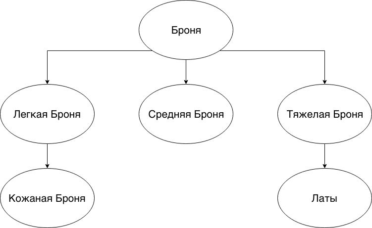

# Абстрактный класс vs Интерфейс

- [Абстрактный класс vs Интерфейс](#абстрактный-класс-vs-интерфейс)
  - [Введение](#введение)
  - [Применение](#применение)
  - [Различия](#различия)
  - [Ошибки](#ошибки)
  - [Заключение](#заключение)
  - [Полезные ссылки](#полезные-ссылки)

## Введение

Темы [интерфейса](./interface.md) и [абстрактного класса](./abstract_class.md) довольно тесно связаны.

Более того, часто возникает путаница и часто новичку не всегда понятно когда что использовать.
Эта грань - какой выбор сделать - размылась еще больше с появлением `default` реализаций методов у интерфейсов.

Поэтому стоит отдельно рассмотреть различия и рекомендации к использованию интерфейсов и абстрактных классов.

Но перед этим еще раз прочтите про [интерфейс](./interface.md) и [абстрактный класс](./abstract_class.md).

## Применение

Ответ на вопрос "Когда применять интерфейс, а когда абстрактный класс?" прямо селдует из понимания, что интерфейс - это **только** поведение, а класс(пусть и абстрактный) - это **совокупность** поведения и ***состояния**.

> Состояние - это то, какую информацию, какие данные хранит этот класс.
> Поведение же - это то, что мы можем ожидать при работе с классом, как с ним взаимодействовать и т.д.

Если необходимо выстроить иерархию классов, обладающих общими свойствами, то **интерфейс** использовать не получится, так как интерфейсы не обладают состоянием, а только поведением.

Такую иерархию классов, с некоторым общим поведением **и** общими свойствами, можно выстроить воспользовавшись либо абстрактными, либо обычными классами.
Главным маячком для определения **что выбрать** должен служить вопрос: "Является ли промежуточный классы-родитель завершенным?".
Если ответ "нет", тогда стоит сделать его абстрактным, в противном случае лучше оставить его обычным классом.

Если же вы хотите выстроить иерархию поведения, то **всегда** используйте `интерфейс`.

Для лучшего понимания представьте себе компьютерную игру-бродилку. В игре есть предметы брони, оружия и т.д.

Броня имеет вес, коэффициент поглощаемого урона и т.д.
Но! Как и в любой игре броня разбивается на **классы**: класс тяжелой брони, легкой, средней.



Из картинки видно, что в данной иеррахии класс `Броня` - это нечто абстрактное, так как далее этот класс разбивается на тяжелую броню, легкую и среднюю.
При этом мы помним, что класс `Броня` содержит некоторое состояние - это как минимум вес и коэффициент поглощаемого урона.

Поэтому логично было бы сделать такой класс сразу абстрактным. Более того, логично было бы сделать и класс `Легкая Броня` также абстрактным, а вот уже `Кожаная Броня` имеет все шансы на то, чтобы быть заврешенным классом.

Теперь добавим в игру пероснажей и монстров.

Все они должны уметь бегать, некоторые персонажи должны уметь красться, некоторые персонажи и монстры должны уметь издавать боевой клич.
При этом **как именно** бегают персонажи или монстры, **как именно** издают боевые кличи мы не знаем.
У каждого класса персонажей или монстров свое **поведение** на этот счет.

Догадываетесь, да?

Здесь уже логично использовать `интерфейс`. Каждый интерфейс будет отвечать за добавление определенного навыка.
Интерфейс `Movable` будет отвечать за добавление поведения бега, `Stealable` за возможность красться и т.д.

А уже то **как именно** это поведение будет реализовано ответственны те, кто это умеет, у каждого будет своя реализация.

> Помните:
>
> `Абстрактные классы` используются только тогда, когда есть `is a` тип отношения.
>
> `Интерфейсы` же могут быть реализованы классами которые не связаны друг с другом.

Интерфейсы отлично подходят для [примесей](https://ru.wikipedia.org/wiki/%D0%9F%D1%80%D0%B8%D0%BC%D0%B5%D1%81%D1%8C_(%D0%BF%D1%80%D0%BE%D0%B3%D1%80%D0%B0%D0%BC%D0%BC%D0%B8%D1%80%D0%BE%D0%B2%D0%B0%D0%BD%D0%B8%D0%B5)), mixin. Что позволяет объявить дополнительный функционал у класса.

Интерфейсы позвоялют безопасно и мощно наращивать функциональность.

Теперь пришла пора поговорить про более технические различия абстрактных классов и интерфейсов.

## Различия

Так как абстрактные классы это тоже классы(простите за тавтологию), то логично предположить, что они могут **иметь** конструктор.

```java
public abstract class Person {
    private int age;
    private String name;

    public Person(int age, String name) {
        this.age = age;
        this.name = name;
    }
}
```

Никаких конструкторов у интерфейса нет и быть не может.

При этом, мы не можем просто так создавать экземпляры и `абстрактного класса`, и `интерфейса`.

> Но мы можем создать анонимный класс и реализовать интерфейс или доопределить абстрактный класс.

Все методы `интерфейса` по-умолчанию являются `public abstract` методами.
Все поля у `интерфейса` являются `public static final` - т.е являются константами.

В то время как у `абстрактного класса` мы можем воспользоваться и другими модификаторами доступа, в частности, скрыть какие-то методы или поля.
Поля у `абстрактного класса` не обязательно(да и не желательно) делать константами.

Абстрактный класс **наследуется**, т.е должен отвечать `is a` типу отношения.
Также в `Java` у класса может быть только один класс-родитель, что также накладывает ограничения на использование и применение `абстрактных классов`.

А вот `интерфейсы` реализуются, при этом они могут быть реализованы классами которые не связаны друг с другом, ведь мы просто добавляем через них некоторое поведение.
Интерфейс **добавляет** поведение классу, соответственно единственный вопрос, который вы должны задать: должен ли уметь ваш класс делать то, что добавляет интерфейс?

В отличии от наследования, класс может реализовывать более одного `интерфейса`.

Ну и самое главное, о чем мы уже говорили миллион раз: `интерфейс` **не** может иметь состояние, в отличии от `абстрактного класса`.

## Ошибки

Ошибочно использовать `абстрактный класс` или `интерфейс` только для того, чтобы запретить создание объектов у какого-то класса.

Например, вы пишите утилитарный класс для работы с файлами: записи, чтения и т.д.

```java
class FileUtils {
    public static final exists(String path) {
        // some code
    }
}
```

Логично, что раз все наши методы принадлежат классу, а не объекту, они `static`, то давать возможность создавать объекты такого класса не совсем логично.

И вот тут некоторые ошибочно делают такой класс абстрактным!

```java
abstract class FileUtils {
    public static final exists(String path) {
        // some code
    }
}
```

Так делать **НЕПРАВИЛЬНО**.

Этим `abstract` намекаете на то, что класс должен участвовать в наследовании, а значит удовлетворять `is a` отношению.
А какое же тут наследование, когда все методы принадлежат классу и вызываться будут у класса?

Логичнее и правильнее сделать такой класс `final` - запретить ему участвовать в наследовании и закрыть возможность создания экземпляров через приватный конструктор.

```java
final class FileUtils {
    private FileUtils() {

    }

    public static final exists(String path) {
        // some code
    }
}
```

## Заключение

Если очень коротко описать предыдущий раздел:

| Интерфейс                                                             | Абстрактный класс                                                                         |
|:----------------------------------------------------------------------|:------------------------------------------------------------------------------------------|
|      Не имеет конструктор                                             |     Может иметь конструктор                                                               |
|      Не может хранить состояние                                       |     Может хранить состояние                                                               |
|      Все поля являются константами                                    |     Модификаторы доступа для полей можно выбрать                                          |
|      Все методы по умолчанию являются `public abstract`               |     Модификаторы доступа для методов(только если это не абстрактные методы) можно выбрать |
|      Можно реализовать несколько интерфейсов у класса                 |     Множественное наследование отсутствует                                                |
|      Классы, реализовывающие интерфейсы могут быть никак не связаны   |     Классы должны отвечать `is a` типу отношения                                          |

И помните, что интерфейс - это **только** поведение, а класс(пусть и абстрактный) - это **совокупность** поведения и ***состояния**.

## Полезные ссылки

1. [Java. Эффективное программирование | Блох Джошуа #Главы 18-19](https://www.ozon.ru/context/detail/id/148627191/)
2. [Mixin](https://ru.wikipedia.org/wiki/%D0%9F%D1%80%D0%B8%D0%BC%D0%B5%D1%81%D1%8C_(%D0%BF%D1%80%D0%BE%D0%B3%D1%80%D0%B0%D0%BC%D0%BC%D0%B8%D1%80%D0%BE%D0%B2%D0%B0%D0%BD%D0%B8%D0%B5))