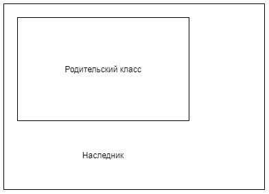

# Наследование

- [Наследование](#наследование)
  - [Введение](#введение)
  - [Создание иерархии классов](#создание-иерархии-классов)
    - [Примечание](#примечание)
  - [Отношения между классами](#отношения-между-классами)
    - [Has-A Relationship](#has-a-relationship)
      - [Отличия композиции от агрегации](#отличия-композиции-от-агрегации)
  - [Минусы и плюсы подходов](#минусы-и-плюсы-подходов)
    - [Отношение is a](#отношение-is-a)
      - [Ситуация с Бонни: MyHashMap](#ситуация-с-бонни-myhashmap)
    - [Отношение has a](#отношение-has-a)
  - [Множественное наследование](#множественное-наследование)
  - [Заключение](#заключение)
  - [Полезные ссылки](#полезные-ссылки)

## Введение

`Наследование` — это инструмент, позволяющий описать новый класс на основе уже существующего с частично или полностью заимствованной функциональностью.
Это мощный инструмент переиспользования кода и создания собственных иерархий классов.
Можно сказать, что на основе одного класса строится новый класс, путем добавления новых полей и методов.



Сперва давайте постараемся ответить на вопрос: Зачем вообще придумали `Наследование`?

Для ответа на него давайте объявим некоторый класс.

> Тут нам на помощь снова придет извечный бродяга примеров: класс `Person`.

```java
class Person {
  private int age;
  private String name;

  // some remaining code
}
```

Пока все прекрасно и удобно.

Но представим, что теперь понадобилось создать новый класс `Employee` - работника.

`Employee` имеет те же черты, что и `Person`, но вдобавок к этому он еще устроен на работу, получает зарплату и т.д.
Т.е это тот же `Person`, но с еще одним дополнительным полем - работа.

В мире, где механизм наследования отсутствует, мы бы объявили этот класс следующим образом:

```java
class Employee {
  private int age;
  private String name;
  private String work;

  // some remaining code
}
```

По сути, все что мы сделали - это скопировали один код класса `Person` и вставили его в `Employee`, добавив, разумеется, сверху еще щепотку нового функционала.
Не мне вам объяснять, что подобный подход, копирования и вставки, это пагубная, опасная и гневающая богов привычка.

Вдобавок к этому есть и еще один неприятный момент!

Для нас очевидно, что эти классы связаны логически, т.е `Employee` - это какой-то `Person`, устроенный на работу, но для `Java` эта связь совсем не очевидна, с точки зрения языка это просто два разных, никак не связанных и не имеющих ничего общего класса.

Но мы-то знаем, что это не так!

Возникает резонное желание - сделать так, чтобы язык знал о связи наших классов и убрать копирование кода.
Разумно, что хочется делегировать ответственность за это копирование кода и поддержание его в консистентном состоянии нашему языку программирования?

> Под консистентным состоянием я имею в виду то, что при добавлении нового поля или метода в `Person` это поле также появится и у `Employee`.

## Создание иерархии классов

Для того, чтобы воспользоваться механизмом наследования, т.е унаследовать один класс от другого, в `Java` существует ключевое слово `extends`.

Класс, от которого производится наследование, называется `базовым`, `родительским` или `суперклассом`.
Новый класс называется `потомком`, `наследником`, `дочерним` или `производным` классом.

Перепишем теперь наш код с использованием `наследования`.

> Стоит заметить, что мы изменили модификаторы доступа к полям классов.
> Модификаторы доступа позволяют вам влиять на то, какие поля и методы классов будут участвовать в наследовании, а какие нет.
>
> Про модификаторы доступа нужно почитать [тут](./encapsulation.md).
>
> Про [this и super](./this_super.md).

```java
class Person {
  protected int age;
  protected String name;

  public Person(int age, String name) {
    this.age = age;
    this.name = name;
  }

  // some remaining code
}

class Employee extends Person {
    private String address;

    public Employee(int age, String name, String address) {
        super(age, name);
        this.address = address
    }
}
```

Теперь, мало того, что код получился более компактным, так как мы убрали дублирование, так еще и выстроилась иерархия классов.
Классы `Person` и `Employee` уже больше не являются не связанными, как это было в первом примере.

Для демонстрации этого мы просто создадим метод, который ждет на вход экземпляры класса `Person`.
Допустим, у нас реализована некая телефонная книга:

```java
class PhoneBook {
    public static void find(Person p) {
        System.out.println(p.name);
    }

    // some code
}
```

Запустите следующий код c классами, которы мы только что написали:

```java
public static void main(String[] args) {
    Person p = new Person(27, "Aleksandr");
    Employee e = new Employee(27, "Maksim", "Sberbank");

    PhoneBook.find(p);
    PhoneBook.find(e);
}
```

Благодаря тому, что `Employee` является наследником `Person` код скомпилируется, а при его выполнении вы увидите в консоли:

```java
Aleksandr
Maksim
```

Это возможно потому, что производный класс полностью удовлетворяет спецификации родительского.
Именно поэтому мы безболезненно в телефонную книгу можем передать и класс `Person`, и класс `Employee`.

Если же вы попробуете повторить тот же трюк, но с классами не использовавшими наследование, как в начальном варианте, код даже не скомпилируется, ведь телефонная книга ждет класс `Person`.
Но `Person` и `Employee` в первом варианте - это два абсолютно разных класса, которые никак не связаны друг с другом.

### Примечание

Важно понимать, что наследование - это не просто инструмент для избавления от дублирования кода.

Как мы уже обсуждали во [введении в ООП](./intro.md), класс - это совокупность `поведения` и `состояния`.

* Состояние - это то, какую информацию и какие данные хранит класс.
* Поведение - это то, что мы можем ожидать при работе с классом, как с ним взаимодействовать и т.д.

Помните, что наследование - это приобретение *и* состояния, *и* поведения класса-родителя.

> Наследование - это приобретение и состояния, и поведения класса-родителя.

## Отношения между классами

Рассмотрим следующий вопрос. У нас есть классы: `Оружие` и `Солдат`. Солдат должен уметь стрелять. Допустимо ли отнаследоваться классом `Солдат` от `Оружия`, тем самым расширив наш класс и получить необходимые стрелковые навыки?

Думаю, нет, так делать нелогично. В таком случае будет приобретено не только поведение стрельбы, но и состояние оружия: марка, скорострельность и т.д. А что делать в случае, когда солдат решит сменить оружие? Понятно, что в приведенном случае один класс не расширяет другой, а скорее содержит часть поведения другого.

В связи с этим возникает вопрос: когда можно использовать наследование, а когда не надо?

Снова рассмотрим два класса, что были приведены выше: `Оружие` и `Солдат`.

Для ответа на вопрос: уместно ли здесь применить наследование спросите себя: какое отношение между классами? Можно ли сказать, что потенциальный потомок `является` тем же, что и родительский класс? Т.е отвечает ли класс `Солдат` отношению `is a` по отношению к `Оружию`?

Если ответ 'да', является, то наследование вполне применимо в этом случае. Если же на вопрос "является ли класс тем же, что и родитель" ответ отрицательный - то в таком случае использовать наследование не рекомендуется.

В случае отрицательного ответа на предыдущий вопрос следуют снова спросить себя: отвечает ли класс `Солдат` отношению `has a` по отношению к `Оружию`? Т.е является ли один объект является составной частью другого?

Скорее всего ответ будет `да` и тогда правильнее использовать **композицию**.

В нашем случае ответ на вопрос: класс `Солдат` связан взаимоотношением `has a` по отношению к `Оружию`. Это значит, что `Оружие` будет полем класса `Солдат`. При этом инициализация поля может быть объявлена по разному: через конструктор или через `setter`-метод.

В таком случае, поведение, которое мы хотим добавить `Солдату`, будет объявлено следующим образом:

```java
class Solder {
  private Weapon weapon;

  public setWeapon(Weapon weapon) {
    this.weapon = weapon;
  }

  public void fire() {
    wepon.fire();
  }
}
```

> Если же ответ на оба вопроса про `has a` и `is a` будет `нет`, то вы скорее всего что-то делаете не так и строите неправильную абстракцию.

---

**Вопрос**:

Для проверки возьмем еще два класса: `Figure` и `Rectangle`.
Определите взаимотношение классов и что будет логичнее использовать: наследование или композицию.

**Ответ**:

Является ли прямоуголник некоей абстрактной фигурой? Скорее всего да. Отношение взаимодействия `is a`.
Значит, логично сделать так, что `Rectangle` является наследником `Figure`.

```java
class Rectangle extends Figure {
  // some code
}
```

---

Теперь чуть подробнее поговорим про `has a` и композицию.

### Has-A Relationship

Существует несколько видов взаимодействия объектов, объединенных под общим понятием "Has-A Relationship" или "Part Of Relationship".
Это отношение означает, что один объект является составной частью другого объекта.

Существует два подвида этого отношения: если один объект создает другой объект и время жизни составляющего объекта зависит от времени жизни целого, то это называется `композиция`.
Если же один объект получает ссылку на другой объект в процессе конструирования, то это уже `агрегация`.

В обоих случаях мы буквально составляем наш класс по кирпичикам.
Именно так, как какой-нибудь двигатель состоит из деталей.

Мы не тащим за собой все из родительского объекта, а работаем только с составными частями.
Т.е это расширение функционала класса за счет **внедрения** других объектов.

#### Отличия композиции от агрегации

* Композиция

  Композиция - это такой случай, когда составные части класса **не могут** существовать без
  существования класса, в который они входят.

  Это как сердце и человек, сердце - это часть человека, но отдельно от него оно не может
  существовать, не может или его существоание не имеет смысла.

* Агрегация

  Агрегация - это такой случай, когда составные части класса **могут** существовать без
  существования класса, в который они входят.

  Это как колеса и машина, колеса - это часть машины, но они вполне могут существовать без
  конкретного текущего автомобиля, мы можем заменить их на зимние или вообще продать.

Композиция - это частный случай агрегации.

> Часто для простоты говорят просто композиция, не делая различий с агрегацией.

Давайте теперь разберем минусы и плюсы каждого из подходов: композиции/агрегации и наследования?

## Минусы и плюсы подходов

### Отношение is a

Плюсы:

* Повторное использование уже существующих и протестированных участков кода.
* Выстраиваемая иерархия наследников.

Минусы:

* Дочерний класс зависит от изменений в родительском классе, изменив что-то в родительском классе, мы автоматически получаем эти изменения в дочернем.

  Пусть у нас есть своя реализация `MyHashMap`, так как мы хотим переиспользовать часть того, что есть в `HashMap`, мы отнаследовались от нее и переопределили метод `add(...)`.
  Все отлично, но теперь, если разработчики `HashMap` добавят метод `addAll(..)`, использующий `add` для добавляения элементов, у нас будет в этом месте дыра, ведь у нас-то своя реализация `add`, а унаследованный метод `addAll` будет добавлять элементы 'по старому'.

* Ошибка в неверной иерархии наследования ведет к большим проблемам в использовании кода в будущем.
  
  Отнаследуйте `Солдата` от `Оружия` и в дальнейшем у вас `Солдаты` начнут перезаряжаться, храниться на складах с оружием и т.д.

* Нарушение инкапсуляции.
  
  В качестве примера посмотрите на следующий код:

  ```java
  public class Artist {
    protected String name;
    protected List<String> albums;

    public Artist(String name) {
        this.name = name;
    }
  }

  class Second extends Artist {
    public void breakEncapsulation() {
        System.out.println(super.name);
    }
  }
  ```

  Здесь мы через `super` обратились к полю родительского класса.

* Тянем все проблемы и ошибки наследованного кода.
* Тяжело выстраивать правильные абстракции.

Еще одним существенным минусом является следующая ситуация: это может быть причиной сильного связывания вашего кода.
При появлении большого колиечества наследников внесение правок в родительский класс не так легко и безопасно.

Для иллюстрации этого приведем следующий пример.

#### Ситуация с Бонни: MyHashMap

Почему при композиции мы избегаем ситуации описанной в примере с `MyHashMap`?

Ответ прост: при композиции мы просто создадим `HashMap` полем класса и сами пропишем интерфейс нашего класса, вызывая лишь те методы, которые нам нужны.
При этом ситуаций, которые описаны выше, просто не возникнет - мы определим метод `add`, как нам надо и даже если разработчики добавят в `HashMap` какой-то
свой еще один `addAll` метод - нас это никак не затронет, так как наш класс умеет только то, что мы прописали - и не более.

Т.е при композиции мы максимально контролируем и знаем поведение нашего класса: ведь мы сами его и написали.
Никакие "новые" методы не могут попасть в интерфейс нашего класса - пока мы сами их явно не вызовем и не напишем на них свои обертки.

При `наследовании` же, как было сказано, мы получаем любые изменения родительского класса в дочернем, более того, мы можем даже не заметить, что у нас изменился интерфейс - если он просто расширился и не сломал старый!

В какой-то мере при использовании `наследования` мы *не полностью контролируем* интерфейс нашего класса, а это может привести к трудно уловимым и раздражающим ошибкам.

### Отношение has a

Плюсы:

* Ситуации на подобие той, что описана выше с `MyHashMap` исключены.
* Возможность скрыть проблемы класса-родителя, создав обертку, в которой скроем недостатки `API` класс-родителя.
* Легко применять и строить абстракции.

Минусы:

* Иногда действительно неудобно работать с наследованием и иерархией классов.
* Если объектов-владельцев достаточно много, то создание и уничтожение вместо одного объекта двух или более может пагубно сказаться на производтельнсоти.

`Наследование` - это именно `расширение` какого-то функционала, в то время как `композиция` - это включение(внедрение) функционала.

Существует даже правило:

> Предпочитайте композицию наследованию.

## Множественное наследование

Снова начнем с вопроса: может ли у класса быть более одного предка?

> `java.lang.Object` мы не берем в виду, так как он является родительским классом для всех.

В языках программирования типа `C++`, `Python` и т.д это возможно, такой механизм называется множественным наследованием.
В `Java` так сделать **нельзя**.

С одной стороны, это довольно удобно когда вы можете отнаследоваться от нескольких предков.
С другой стороны, как показывает практика, множественное наследование может оказаться потенциальным источник проблем и ошибок, о чем мы поговорили выше, сравнив композицию и наследование.

На мой взгляд, множественное наследование слишком развязывает руки разработчикам, позволяя часто не задумываться о том, что такое наследование и насколько это опасный инструмент.

Применительно к программированию такие просчеты могут быть фатальными и разрушить всю архитектуру приложения.
Частично из-за возможности подобных ошибок в `Java` просто решили не разрешать множественное наследование.

Если вам интересно мое мнение, то я думаю, что множественное наследование не предоставляет настолько незаменимые и необходимые возможности, а потенциальных проблем, имеющих разрушительные последствия, может создать более чем необходмио.

## Заключение

Наследование - это очень мощный инструмент, позволяющий выстраивать иерархии классов, обеспечить переиспользование кода и бороться с дублированием.

Однако, насколько этот инструмент мощный, настолько же и опасный.

Старайтесь не злоупотреблять наследованием!
Помните, что вы можете разрушить все абстракции и превратить ваш код в тыкву.

Чаще задавайтесь вопросом: каким отношением связаны ваши классы?

Если это отношение `is a`, то это верный признак того, что здесь будет уместно использование наследования.
Если же ваше отношение - это `has a`, то постарайтесь применить агрегацию/композицию.

Всегда старайтесь избегать дублирования кода и задумывайтесь о полученной иерархии классов.

Также советую ознакомиться с принципами [SOLID](./SOLID.md)

## Полезные ссылки

1. [Java. Эффективное программирование | Блох Джошуа #Главы 16-17](https://www.ozon.ru/context/detail/id/148627191/)
2. [Composition vs. Inheritance: How to Choose?](https://www.thoughtworks.com/insights/blog/composition-vs-inheritance-how-choose)