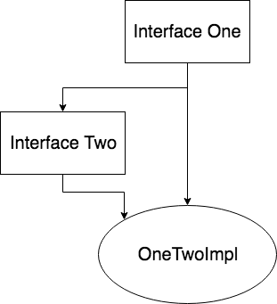

# Интерфейс

- [Интерфейс](#интерфейс)
  - [Введение](#введение)
  - [Гибкость](#гибкость)
  - [Создание интерфейса](#создание-интерфейса)
    - [Абстрактный метод](#абстрактный-метод)
    - [Статический метод](#статический-метод)
    - [Метод с реализацией по умолчанию](#метод-с-реализацией-по-умолчанию)
    - [Приватный метод](#приватный-метод)
    - [Интерфейсы-маркеры](#интерфейсы-маркеры)
  - [Определение свойств](#определение-свойств)
  - [Использование интерфейса](#использование-интерфейса)
  - [Множественное наследование в Java](#множественное-наследование-в-java)
    - [Ромбовидное наследование](#ромбовидное-наследование)
    - [Разрешение конфликтов реализаций](#разрешение-конфликтов-реализаций)
  - [Наследование интерфейсов](#наследование-интерфейсов)
  - [Анонимный класс, реализующий интерфейс](#анонимный-класс-реализующий-интерфейс)
  - [Функциональные интерфейсы](#функциональные-интерфейсы)
  - [Заключение](#заключение)

## Введение

Как мы уже обсуждали во [введении в ООП](./intro.md), класс - это совокупность `поведения` и `состояния`.

Состояние - это то, какую информацию, какие данные хранит этот класс.
Поведение же - это то, что мы можем ожидать при работе с классом, как с ним взаимодействовать и т.д.

В `ООП` понятию `поведение` выделена настолько большая роль, что существует специальный термин для этого - `интерфейс`.

Если приводить пример из жизни, то можно рассмотреть объект 'машина'. Состояние этого объекта - это материал, цвет, колеса, стекла и т.д
Поведение же - это возможность открыть двери, багажник, возможность передвижения, включения фар, переключения передач и т.д

Что вы видите, когда садитесь за руль?

Скорее всего, по крайней мере так было в 2018 году, вы увидите руль, педали, рычаг коробки переключения передач и т.д.
Другими словами, вы видите интерфейс взаимодействия с машиной.

Графическая составляющая программ не даром называется интерфейсом.
Она определяет то, как вы будете взаимодействовать с программой, то как вы будете использовать функционал программы. То, как **ведет** себя программа.
При этом вы можете абсолютно не знать деталей **реализации** интерфейса.

В случае с автомобилем вы можете абсолютно не иметь представления о том, какой мотор у вас используется, карбюратор у вас или инжектор, на каком языке написана программа, которой вы пользуетесь: вам, как обычному водителю, это не важно.

> Интерфейс позволяет вам не знать деталей реализации, а просто взаимодействовать с объектом.

Точно тот же принцип используется и в программировании!

Если перенести эту мысль в область программирования, то можно сказать, что интерфейс определяет то, как мы можем использовать объект.

Другими словами:

`Интерфейс` - это определение функциональности, в виде определения методов и свойств, без каких либо привязок к особенностям класса.

Теперь давайте продемонстрируем ту гибкость, которую нам предоставляют интерфейсы. Для этого мы снова заглянем в святая святых - `JDK`.

## Гибкость

Рассмотрим гибкость, которую дает нам применение интерфейсов на примере `Java` коллекций.
Одна из самых известны и часто применяемых коллекций в программировании - это список, от английского `list`.

Список — это абстрактный тип данных, представляющий собой упорядоченный набор значений, в котором некоторое значение может встречаться более одного раза.

> Подробнее про списки можно прочесть в [википедии](https://ru.wikipedia.org/wiki/%D0%A1%D0%BF%D0%B8%D1%81%D0%BE%D0%BA_(%D0%B8%D0%BD%D1%84%D0%BE%D1%80%D0%BC%D0%B0%D1%82%D0%B8%D0%BA%D0%B0))

Существует несколько видов реализации списка.
В `Java` наиболее популярны две реализации: связные списки - `java.util.LinkedList` и списки, основанные на массивах, `java.util.ArrayList`.

Обе структуры данных являются списками, они представляют собой упорядоченный набор значений, каждый элемент может встречаться более одного раза.
Однако, то **как** они хранят эти значения - различно.

Но то, **что** они делают - одинаково, они хранят элементы в порядке добавления, мы можем достать оттуда элемент, удалить и т.д.

Наверное вы уже начали догадываться: и `java.util.LinkedList`, и `java.util.ArrayList` предоставляют нам один интерфейс взаимодействия.
Этим интерфейсом является `java.util.List`.

Благодаря этому можно писать более гибкий и общий код.
Например, вы хотите распечатать список строк. Вы можете написать код как построенный на использовании интерфейса, так и на использовании конкретной реализации.

```java
void print1(List<String> lst) {
    for(String s : lst) {
        System.out.println(s);
    }
}

void print2(ArrayList<String> lst) {
    for(String s : lst) {
        System.out.println(s);
    }
}
```

И тот, и другой способ будут работать.
Однако, второй вариант написания ограничивает нас конкретной реализацией `java.util.ArrayList`.

Благодаря указанию в качестве параметра метода интерфейса мы можем передать в `print1` любой список строк: и `java.util.ArrayList`, и `java.util.LinkedList`, и собственную реализацию списка, реализующую интерфейс `java.util.List`.

Чем это грозит?

Давайте опять проведем параллель с реальным миром и представим себе автомойку.

В первом случае, наша автомойка может работать со всеми автомобилями, в то время как во втором случае автомойка может работать только с автомобилем `ВАЗ-2109`.

Пока вы ездите на `ВАЗ-2109` или пользуетесь `java.util.LinkedList` для вас разницы в использовании `print1` и `print2` нет, однако как только вы захотите использовать другую реализацию списка, то вам потребуется уже искать новую автомойку/переписывать `print2`.

При использовании же интерфейса вам ничего делать не надо, начали ездить на `Alfa Romeo`/использовать `ArrayList` - никаких телодвижений не требуется, все уже готово.
Ведь вы ждете от объекта, с которым взаимодействуете, некоторое определенное поведение и если этот объект вам его гарантирует - вам не важно, что **именно** это за объект.

В этом заключается та универсальность и мощь применения интерфейсов.
Если вы пользуетесь интерфейсами - вы абстрагируетесь от реализации, поэтому если у вас эта реализация изменится, то вам не потребуется переписывать ваш код.

Этот совет касается не только передаваемых в метод ссылок, но и объявления свойств в классе, переменных в методе и т.д.

В начале своего пути начинающие программисты часто пишут код вида:

```java
class Books {
    private ArrayList<String> bookNames;
    
    // или

    public static void main(String args[]) {
        ArrayList<String> books = new ArrayList<>();
    }
}
```

Т.е объявляя ссылку на объект используют конкретную реализацию.

Объявляя переменную помните, что вы объявляете **поведение**, которое ждете от объекта. Точно также, как и в случае, когда вы передаете объект.

Какое поведение мы хотим от `bookNames` или `books`? Мы просто хотим создать ссылку на **список** книг!
А значит нам надо использовать не `ArrayList` в объявлении ссылки, а просто интерфейс списка:

```java
class Books {
    private List<String> bookNames;
    
    // или

    public static void main(String args[]) {
        List<String> books = new ArrayList<>();
    }
}
```

Поэтому везде, где это возможно, старайтесь пользоваться интерфейсами, передавать и возвращать их из методов, объявлять параметром класса и т.д.

И да, бывают ситуации, когда мы хотим использовать что-то более конкретное, например, в случае, когда нам нужен порядок добавления элементов в хеш-мапу, то необходимо работать с `LinkedHashMap`. И интерфейс `Map` в данном случае не подойдет.

## Создание интерфейса

Для создания интерфейса используется ключевое слово `interface`, после которого идет название интерфейса, внутри которого происходит уже определение методов и свойств.

```java
public interface Greeting {
    // methods
    void greeting();
}
```

Исходя из того, что интерфейс, это `поведение` не имеющее `состояния`, можно сделать вывод, что создается только описание метода.

Какие методы могут быть объявлены в интерфейсе:

* Абстрактные, без тела метода, `Java 7+`.
* Статические, `Java 8+`.
* С реализацией по умолчанию, `Java 8+`.
* Приватные, `Java 9+`.

По умолчанию, все методы и свойства интерфейса имеют модификатор доступа `public`.
Что довольно логично ожидать, учитывая что цель интерфейса - это определение функционала для его последующей реализации.

### Абстрактный метод

Что можно сказать об абстрактных методах в интерфейсе:

* Абстрактный метод в интерфейсе не имеет реализации.
* Модификатор доступа `public`.
* Является стандартным механизмом объявления функционала.

Типичный пример:

```java
public interface Greeting {
    // methods
    void greeting();
}
```

Каждый класс, реализующий интерфейс `Greeting` добавляет себе абстрактный метод `void greeting()`.

Класс не обязательно должен определять все абстрактные методы реализуемого интерфейса, но в таком случае он сам должен быть абстрактным классом.

```java
public abstract class GreetingClass implements Greeting {
    // body
}
```

Здесь тоже все логично: мы реализовываем интерфейс, тем самым добавляем себе новый метод, так как этот метод абстрактный, то мы либо должны его определить, либо быть абстрактным классом.

[Подробнее про абстрактные классы](./abstract_class.md)

### Статический метод

Начиная с `Java 8` стало возможно описание статического метода в интерфейсе.
Тут все также как у обычного статического метода:

```java
interface Printable {
    static void print(){
        System.out.println("Printable print!");
    }
}

public class Test {
    public static void main(String[] args) {
        Printable.print();
    }
}
```

Статические методы у интерфейса очень удобны для группирования `utility` или `factory` методов.

> Если вы не знаете что такое `factory` метод, то советую посмотреть:
>
> * Подробнее о паттерне [фабрика](../patterns/creational/factory_method.md)
> * Подробнее [статических методах](../start/static_java.md)

Если раньше такие методы выносились в отдельный класс, то теперь можно логически сгруппировать это в одном месте, как сделано, например, в `java.util.stream.Stream`.
Где сгруппированы методы на подобие `public static<T> Stream<T> of(T t)` и прочее, необходимые для создания стримов.

Раньше бы потребовалось объявить интерфейс `java.util.stream.Stream`, а подобные фабричные методы вынести в отдельный класс, т.е 'размазать' эту логику на два файла.
Сейчас можно удобно сгруппировать это в одном интерфейсе.

При этом, чтобы не было путаницы, в `Java` статический метод, определенный в интерфейсе можно вызвать только явно через интерфейс его содержащий.

Другими словами:

```java
interface Printable {
    static void print() {
        System.out.println("Hello there!");
    }
}

class Test implements Printable {
    public static void main(String[] args) {
        print();   // error

        Printable printableTest = new Test();

        printableTest.print(); // error

        Printable.print(); // ok
    }
}
```

### Метод с реализацией по умолчанию

В `Java 8` добавили возможность реализации метода по умолчанию, так называемой `default` реализации.

Это достигается с помощью ключевого слова `default`.

```java
public interface Greeting {
    // methods
    default void greeting() {
        System.out.println("Default greeting");
    }
}
```

Реализация по умолчанию удобна, когда большинство классов, реализующих интерфейс, будут определять метод, содержащийся в этом интерфейсе, одинаково.
И в таком случае, удобно, когда вы не дублируете один и тот же кусок реализации в каждый класс, а сделали реализацию по умолчанию.

В таком случае все классы, где реализация одинакова, будут использовать то, что объявлено по умолчанию, а те классы, которым такая реализация не подходит, просто переопределят ее.

Использование методов с реализацией по умолчанию позволит избежать дублирования кода, при этом не теряется ни гибкость, ни читабельность.

### Приватный метод

Начиная в `Java 9` добавили возможность объявления `private`-методов в интерфейсе.

> Если коротко, то такие методы введены для внутреннего использования, чтобы убрать повторяемость кода, которая может возникнуть в некоторых случаях.

Такие методы могут быть статическими и нестатическими, но они не могут иметь реализации по умолчанию. Такие методы **обязаны** быть реализованы сразу и могут использоваться только внутри самого интерфейса, в котором они определены.

Сделано это для упрощения написания кода, когда вам в интерфейсе необходимо выполнить повторяющиеся действия:

```java
public interface Logger {

    default void logInfo(String message) {
        log(message, "INFO");
    }

    default void logWarn(String message) {
        log(message, "WARN");
    }

    default void logError(String message) {
        log(message, "ERROR");
    }

    default void logFatal(String message) {
        log(message, "FATAL");
    }

    private void log(String message, String msgPrefix) {
        // Log Message with Prefix and styles etc.
    }
    // Any other abstract, static, default methods
}
```

### Интерфейсы-маркеры

Интерфейс может быть пустым, т.е не содержать никаких объявлений:

```java
public interface Serializable {
}

```

Такие интерфейсы называются `интерфейсы-маркеры`.

В качестве примера можно посмотреть такие интерфейсы как `java.io.Serializable`, `java.lang.Cloneable` и `java.util.EventListener`.

Как следует из названия, задача интерфейса-маркера сообщить о наличии определённого поведения у объектов класса, помеченного таким интерфейсом.

Не стоит принижать значение интерфейсов-маркеров просто ввиду их 'пустоты'. Они способны оказывать серьезное влияние на производные классы, как например, `java.lang.Cloneable` или `java.io.Serializable`.
Классы, реализующие `java.lang.Cloneable`, например, могут использовать метод `clone`, в то время как при отсутствии этого маркера вызов `clone` породит ошибку `java.lang.CloneNotSupportedException`!

> О клонировании объектов можно прочесть [тут](../object/clone.md)

В интерфейсах мы можем описывать не только методы, но и свойства.

## Определение свойств

Помимо методов в интерфейсах могут быть определены еще и константы.

По умолчанию поля в интерфейсах имеют модификаторы `public static final`, и поэтому их значение доступно из любого места вашего кода.

С одной стороны, можно считать, что константа - это тоже часть интерфейса. Поэтому и сделали возможность их добавления в интерфейс.

```java
public interface Stateable {
    int OPEN = 1;
    int CLOSED = 0;
}
```

Эту возможность разработчики, особенно раньше, часто используют для хранения констант в интерфейсах и использование их в классах, реализующих такие интерфейсы.

Этот подход имеет право на жизнь, до сих пор часто встречается, но я считаю это не совсем правильным подходом, так как мне кажется, что интерфейсы предназначены не для этого.

Более удобный способ хранения констант, как и более красивый, на мой взгляд - это [использование классов для констант](../start/classes_for_static.md)

Мы пока не сказали ничего о том как же использовать интерфейс в `Java`. Давайте это исправим?

## Использование интерфейса

Как вы уже знаете, ключевое слово `extends` используется для наследования классов.
Однако, интерфейс - это не совсем класс, это только поведение, поэтому интерфейс **реализуют**.

Для того, чтобы реализовать интерфейс используется ключевое слово `implements`.

```java
interface Logging  {
    void log();
}

class Test implements Logging {
    @Override
    public void log() {
        System.out.println("Logging");
    }
}
```

В отличии от наследования, класс может реализовывать несколько интерфейсов.
Для этого после ключевого слова `implements` вы перечисляете через запятую все интерфейсы, которые реализует ваш класс:

```java
class Test implements Serializable, Cloneable {
}
```

## Множественное наследование в Java

В `Java` запрещено множественное наследование и очень часто можно встретить утверждение, что возможность реализовать несколько интерфейсов заменяет множественное наследование.
Так вот, я опять таки не соглашусь с этим утверждением.

Да, вы можете реализовать несколько интерфейсов и это **частично** поможет вам заменить множественное наследование.
Но давайте помнить, что наследование - это приобретение и **поведения**, и **состояния**.

В то время как реализация интерфейса - это приобретение **только** поведения.

И то, что вы **можете частично** заменить множественное наследование с помощью интерфейсов никак не говорит о том, что интерфейсы нужны для этого.
Гвоздь микроскопом вы тоже забить можете.

Подробнее про наследование прочитать можно [здесь](./inheritance.md)

### Ромбовидное наследование

Одна из проблем множественного наследования - это так называемая проблема [ромбовидного наследования](https://ru.wikipedia.org/wiki/%D0%A0%D0%BE%D0%BC%D0%B1%D0%BE%D0%B2%D0%B8%D0%B4%D0%BD%D0%BE%D0%B5_%D0%BD%D0%B0%D1%81%D0%BB%D0%B5%D0%B4%D0%BE%D0%B2%D0%B0%D0%BD%D0%B8%D0%B5).

Если коротко описать эту проблему, то представьте, что у вас есть класс `Button`, он может одновременно наследуется от класса `Rectangle` и от класса `Clickable`.
В свою очередь, `Rectangle` и `Clickable` наследуются от класса `Object`.

Если вызвать метод `equals` для объекта `Button`, и в классе `Button` не окажется такого метода, но в классе `Object` будет присутствовать метод `equals` по-своему переопределенный как в классе `Rectangle`, так и в `Clickable`, то какой из методов должен быть вызван?

Для ее решения в каждом из языков программирования, которые поддерживают множественное наследование, используется своя стратегия.
В `C++`, например, используется виртуальное наследование, в `Python` явно определен порядок поиска таких методов в родительских классов и т.д.

В `Java` этой проблемы нет из-за отсутствия множественного наследования, но что если у вас есть два интерфейса, имеющих одно и то же описание метода?

Например:

```java
interface One {
   void hello();
}

interface Two {
   void hello();
}
```

Что тогда? Не нарушает ли это нашу идиллию и равновесие?

Абсолютно нет! Ведь как мы уже говорили, интерфейс - это **только** поведение!

И если два интерфейса имеют одно и то же описание метода, то это всего лишь говорит о том, что реализующий эти интерфейсы объект **должен** уметь это делать.
А как он будет это делать - это ответственность уже класса, реализующего интерфейсы.

Ну а что если мы с помощью `default` методов попробуем воспроизвести проблему с множественным наследованием?

### Разрешение конфликтов реализаций

Определим интерфейс следующим образом:

```java
interface One {
   default void hello() {
       System.out.println("Hello One!");
   }
}
```

Создадим класс, реализующий интерфейс `One` и переопределим метод `hello`.

```java
class OneImpl implements One {
    @Override
    public void hello() {
       System.out.println("Hello OneImpl!");
   }
}
```

Как вы думаете, что будет при выполнении следующего кода:

```java
class Test {
    public static void main(String[] args) {
        new OneImpl().hello();
    }
}
```

Другими словами, какая из реализаций имеет более высокий приоритет?
Правильно, реализация у класса.

Соответственно, вывод будет:

```java
Hello OneImpl!
```

> Запомните:
>
> Реализация у класса или у суперкласса **всегда** имеет более высокий приоритет, чем реализация по умолчанию в интерфейсе.

Теперь напишем еще один интерфейс `Two`:

```java
interface Two extends One {
   default void hello() {
       System.out.println("Hello Two!");
   }
}
```

И напишем следующий класс:

```java
class OneTwoImpl implements One, Two {
}
```

Еще раз обращу внимание на то, что интерфейсы `Two` и `One` **связаны** между собой.

Как вы думаете, какой результат выполнения кода будет:

```java
class Test {
    public static void main(String[] args) {
        new OneTwoImpl().hello();
    }
}
```

Результатом будет.. Барабанная дробь...

```java
Hello Two!
```

Почему так будет понятно, если мы нарисуем как связаны наши интерфейсы и класс:



Берем реализацию из `Two` - она наиболее явная, так как до нее ближе всего.

И это, на мой взгляд, довольно логично.
Мы пытаемся вызвать метод и если не находим его реализации у текущего класса идем выше по иерархии.

> Запомните:
>
> Наибольшим приоритетом обладает наиболее явный метод, тот до которого ближе всего.

Ну и в тот момент, когда вы уже окончательно запутались и решили завязать с программированием, стоит прояснить последнюю возможную ситуацию.

Если мы добавим к прошлому примеру еще один интерфейс `Three`, с дефолтной реализацией метода `hello`:

```java
interface Three extends One {
   default void hello() {
       System.out.println("Hello Three!");
   }
}
```

Достроим ромб и по сути полностью воспроизведем проблему с ромбовидным наследованием.

```java
class OneTwoThreeImpl implements One, Two, Three {
}
```

Диаграмма связи будет в виде:


Будет ли валиден такой код?

Нет, такой код будет **не валиден** и `Java` вам явно скажет, что так нельзя, так как каждый из интерфейсов тянет за собой какую-то дефолтную реализацию методов.
А в таком случае возникает уже рассмотренная проблема ромбовидного наследования.

И тут, в отличии от предыдущего случая, явно нельзя сказать какую из найденных реализаций выбрать - и `Three`, и `Two` на одном уровне по приоритету.

Поэтому в `Java` это просто запрещено и компилятор явно попросит вас реализовать этот метод в классе, реализующем интерфейсы.

## Наследование интерфейсов

`Java` позволяет нам создать иерархию интерфейсов.
Если вы хотите отнаследовать один интерфейс от другого - вы можете использовать ключевое слово `extends`.

Т.е один интерфейс **расширяет** другой, даже с точки зрения английского языка все выглядит очень логично!

```java
interface Printable {
    void print();
}

interface Logging extends Printable {
}

class Test implements Logging {
    @Override
    public void print() {
    }
}
```

Таким образом, интерфейс `Logging` расширяет интерфейс `Printable` и приобретает его константы и методы, кроме статических.

## Анонимный класс, реализующий интерфейс

К слову говоря, в `Java` существует возможность создать анонимный класс, реализующий интерфейс.
Это бывает очень удобно тогда, когда объявлять именованный класс не совсем разумно, например, он будет использоваться только один раз.
И вместо того, чтобы объявлять класс, придумывать ему имя, реализовывать у него нужный интерфейс и создавать в месте использования объект этого класса можно просто написать так:

```java
public class Test {
    public static void main(String[] args) {
        Namable helloName = new Namable() {
            @Override
            public String name() {
                return "Hello";
            }
        };
    }
}

interface Namable {
    String name();
}

```

Удобно и коротко.

## Функциональные интерфейсы

С приходом в `Java` функционального программирования(ФП) стало необходимо как-то объявить функцию.
До этого, если вы не забыли, у нас были только методы, которые принадлежали классам.

В `Java` сделали поддержку ФП максимально по `ООП` канонам и ввели понятие функционального интерфейса.

Если у интерфейса только один абстрактный метод, то можем считать, что это функциональный интерфейс.
Его принято помечать аннотацией `@FunctionalInterface`, которая указывает компилятору, что при обнаружении второго абстрактного метода в этом интерфейсе нужно сообщить об ошибке.
При этом, `default` методов у интерфейса может быть несколько.

Для примера рассмотрим `EventHandler`:

```java
@FunctionalInterface
public interface EventHandler<T extends Event> extends EventListener {
    void handle(T event);
}
```

Этот интерфейс имеет один абстрактный метод, помечен аннотацией и является функциональным интерфейсом.
А это дает нам возможность использовать его в виде:

```java
button.setOnAction(event -> // если происходит событие
   System.out.println("Обрабатываем нажатие кнопки."));
```

Где setOnAction выглядит в виде: `void setOnAction(EventHandler<ActionEvent> value)`.

Вот так вот в `Java` ввели поддержку функций.

## Заключение

Интерфейсы определяют поведение объекта, при этом не выставляя никаких требований к состоянию.
Это позволяет абстрагироваться от реализации и ориентироваться только на поведение объекта, на то, что от него можно ждать и как с ним взаимодействовать.

Интерфейсы реализуются классами, при этом используется ключевое слово `implements`.
Класс может реализовывать более одного интерфейса, техническое ограничение на количество реализуемых интерфейсов составляет `65535`.

> Если вам мешает это ограничение - вы делаете что-то не так.

Интерфейсы могут наследоваться друг от друга, один интерфейс может иметь несколько родительских интерфейсов.

Разумеется, интерфейс не может наследоваться от класса.
Это логично, если вспомнить что класс - это и поведение, и состояние.
В то время как интерфейс - это только поведение.

С некоторой точки зрения, интерфейсы позволяют обойти ограничение в множественном наследовании у классов.
Помните, что реализация методов в классах имеет более высокий приоритет, чем реализация по умолчанию в интерфейсах.

Всегда держите в уме простое правило:

Использование интерфейса в качестве типа переменной или параметра метода позволяет писать более поддерживаемый, гибкий и понятный код.

Интерфейсы тесно связаны с понятием [абстрактного класса](./abstract_class.md), поэтому [здесь](./abstract_vs_interface.md) мы разберем отличия абстрактного класса от интерфейса, а также когда что предпочтительнее использовать.

Также стоит познакомиться с [SOLID](./SOLID.md)
