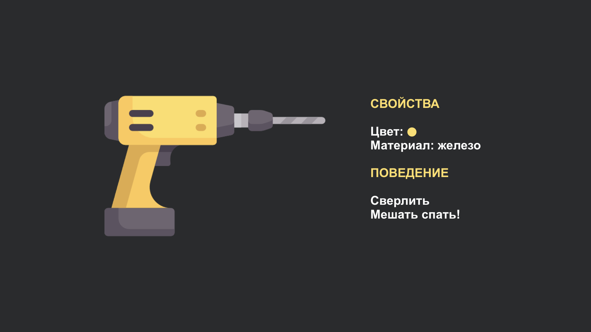
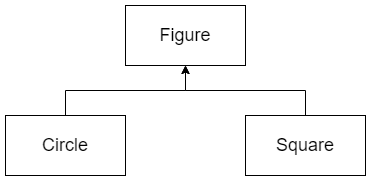
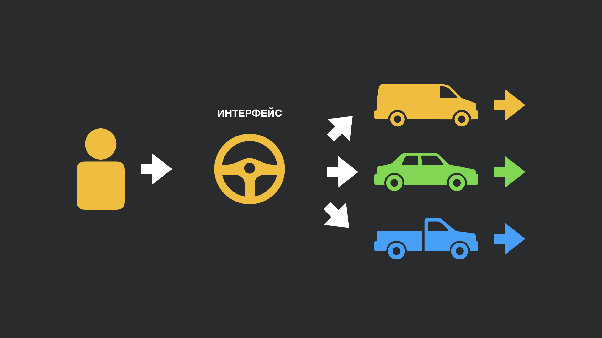

# Объектно-ориентированное программирование

- [Объектно-ориентированное программирование](#объектно-ориентированное-программирование)
  - [Осторожно](#осторожно)
  - [Введение](#введение)
  - [Базовые понятия](#базовые-понятия)
  - [Ключевые черты ООП](#ключевые-черты-ооп)
    - [Наследование](#наследование)
    - [Инкапсуляция](#инкапсуляция)
    - [Полиморфизм](#полиморфизм)
    - [Абстракция](#абстракция)
  - [Полезные ссылки](#полезные-ссылки)

## Осторожно

Вообще говоря, `ООП` - это крайне холиварная тема.
В свое время, да и сейчас тоже, на ней было вскормлено и выращено не одно поколение троллей.

> В `Java` мире есть даже люди со своим видением того, что такое `ООП` и как с ним работать.
>
> Яркий пример - Егор Бугаенко - на момент написания этой статьи его можно было найти по ссылке: [Егор Бугаенко](https://www.yegor256.com/).
>
> Рекомендую крайне аккуратно читать его материалы.
> Там есть много интересных идей, но многие вещи навязываются крайне агрессивно и иногда не совсем логично, на мой взгляд.

Я надеюсь, что вы откроете эту главу при дневном свете - а значит тролли вам страшны не будут, поэтому давайте начнем.

## Введение

Про `ООП` можно говорить **очень** долго, люди пишут книги и статьи посвященные этому и я решил, что здесь лучше дать поверхностное определение `ООП`, что называется, "на пальцах". Мы рассмотрим основные принципы и приведем примеры использования.

Итак, начнем.

Любая программа - это данные и операции над ними.

В процедурном программировании данные обычно отделены от операций, которые используются для манипуляции с этими данными. Одни и те же процедуры применяются к данным разного рода.
Вспомните свои программы на `C` или `Pascal`, где функциональность программы определяется в основном набором процедур и функций для обработки данных.
Сами данные при этом имеют второстепенное значение, они как бы "размазаны" по программе или в структурах.

Объектно-ориентированное программирование - это методология, основанная на представлении программы в виде совокупности объектов, каждый из которых является экземпляром определённого класса, а классы, в свою очередь, образуют иерархию наследования.

При объектно-ориентированном подходе и данные, и операции(код), используемые для манипулирования ими, инкапсулируются в одном объекте. В таком случае, данные - это свойства или атрибуты объекта, а операции - это поведение объекта, то, что он может сделать.

Т.е объектно-ориентированное программирование задумывалось как попытка связать данные и операции над ними, его поведение, а также спроецировать объекты реального мира на программный код. Ведь человеку проще мыслить в таких абстракциях, где объекты подчинены некоторой классификации и выстроены в иерархии связей.

Идея подхода в том, чтобы составить иерархии объектов, которые взаимодействуют в программе и написать код, который описывает взаимодействие этих объектов.

## Базовые понятия

Мы будем оперировать такими понятиями как `Класс` и `Объект` класса, иногда еще говорят `instance` класса.
Так вот, `Класс` - это описание методов и свойств `Объекта`, а `Объект` - это уже его сущность.

Класс - это как техническое описание прибора, купленного вами в электронном дискаунтере.
Он описывает то, какими свойствами должен обладать прибор: материал, цвет и т.д.
Эти свойства уникальны, ведь для каждого прибора они свои. Свойства объекта - это его **состояние**.

Кроме этого класс описывает еще и **поведение** объекта, то как с ним взаимодействовать. Поведение - это методы класса. Все объекты, являющиеся экземплярами одного и того же класса, ведут себя одинаково. Поведение объекта определяется методами, которые можно вызвать.



Объект - это уже непосредственно сам прибор, сделанный **по** техническому описанию, со своим уникальным набором свойств и описанным поведением.

> Самое лаконичное описание объекта предложил Буч:
>
> «Объект обладает состоянием, поведением и индивидуальностью».

В `ООП` понятию `поведение` выделена настолько большая роль, что существует специальный термин для этого: `Интерфейс`.

Когда мы садимся за руль автомобиля вы видите(на момент написания этого текста все было именно так): руль, педали, рычаг коробки переключения передач и т.д.
Т.е интерфейс взаимодействия с машиной.


Всегда существует некоторый ограниченный набор элементов управления, с которыми вы можете взаимодействовать.
Точно то же самое и в программировании. Такой набор элементов называется `интерфейс`.

Приведем пример:

```java
public class Printer {
    public String color;
    public String mark;
    public int printSpeed;

    void print() {
        System.out.println("Printing");
    }

    void scan() {
        System.out.println("Scan");
    }
}
```

Состояние класса - это цвет, марка, скорость печати. Поведение - печать, сканирование.

Закрепим:

1. `Класс` – это способ описания сущности, **определяющий** `состояние` и `поведение`, зависящее от этого состояния, а также правила для взаимодействия с данной сущностью.
2. `Объект` - это отдельный представитель `Класса`, **имеющий** конкретное состояние и поведение, которое полностью определяется `Классом`.
3. `Интерфейс` - это набор методов класса, доступных для использования другими объектами.

    Подробнее про [Интерфейс](./interface.md).

## Ключевые черты ООП

Прежде всего, какие принципы `ООП` мы знаем?

Пока вы не перебили меня:

1. Наследование
2. Инкапсуляция
3. Полиморфизм
4. Абстракция

Это фундаментальные свойства.
Язык, претендующий называться объектно-ориентированным, должен обладать ими.

О каждом из них поговорим подробнее.

### Наследование

`Наследование` — это инструмент, позволяющий описать новый класс на основе уже существующего с частично или полностью заимствованной функциональностью.
Это мощный инструмент переиспользования кода и создания собственных иерархий.

Борьба с повторяемостью - это попытка переиспользовать уже написанный код, избегая его дублирования.

Класс, от которого производится наследование, называется `базовым`, `родительским` или `суперклассом`.
Новый класс — `потомком`, `наследником`, `дочерним` или `производным` классом.

Из описания выше можно сделать вывод, что при наследовании класс-потомок перенимает и состояние, и поведение класса-родителя.

Необходимо отметить, что производный класс полностью удовлетворяет спецификации родительского, однако может иметь дополнительную функциональность.

Еще раз, наследование - это приобретение **и** состояния, **и** поведения класса-родителя.
Эти два `и` крайне важны в понимании.

Самый яркий пример `наследования`, который приводится в любых книгах - это иерархия классов фигура, круг, квадрат и т.д.
Круг - это фигура, квадрат - это тоже фигура.
Т.е фигура - это родительский класс, а квадрат и круг - наследники.



Несмотря на кажущуюся простоту и неоспоримые плюсы, которые несет за собой подобный подход, у него существует также ряд существенных недостатков.

Главный минус состоит в том, что удачно применить наследование получается крайне редко, а злоупотребление им настолько серьезно может испортить код и вашу жизнь, что многие считают наследование опасным или даже вредным в использовании.

> В `Java` решили ограничить безконтрольное использование тем, что наследоваться можно только от одного родительского класса.
>
> Проще говоря - в `Java` отсутствует множественное наследование.

Поэтому использовать наследование надо с умом и осторожностью.

Более подробно об этом в главе, полностю посвященной этой теме:

[Наследование](./inheritance.md)

### Инкапсуляция

Слово `Инкапсуляция` происходит от `лат. in capsula`, `capsula` - "коробочка".

`Инкапсуляция` - механизм, позволяющий объединить данные и методы, работающие с этими данными, в единый объект и скрыть детали реализации от пользователя.

С инкапсуляцией каждый читатель сталкивается каждый день. Для примера возьмем автомобиль: все детали реализации автомобиля скрыты. Вы не доберетесь до мотора просто так, а уж до того, что внутри мотора - тем более.
Для вас, как для пользователя, как для водителя, автомобиль предоставляет интерфейс взаимодействия: руль, педали, коробка передач. Вы жмете газ и едете, при этом что происходит внутри можно и не понимать. Детали реализации **машина едет** скрыты.

Простым примером может служить также сцена на почте из фильма 'Люди в черном 2'(почтовая машина, сортирующая почту, и инопланетянин, сидящий внутри).


Из этого следует, что `инкапсуляция` неразрывно связана с понятием `интерфейса` класса.
Грубо говоря, всё то, что не входит в интерфейс, инкапсулируется внутри класса.

Подробнее про инкапсуляцию:

[Инкапсуляция](./encapsulation.md)

### Полиморфизм

Слово `полиморфизм` происходит от др.-греч. `πολύμορφος` «многообразный».

Представим, что вы получили водительские права.
Когда вы получаете права - это говорит о том, что вы умеете водить автомобиль, при этом не важно какой он был марки - вы *умеете* водить машину, будь это ВАЗ-2109 или Alfa Romeo 159 TI.

Вы садитесь в любой автомобиль и практически сразу знаете что делать. Иначе получалось бы так, что под каждый автомобиль надо было заново учиться и сдавать на права и обучение вождению не имело бы смысла, ведь так?



Ровно о том же самом и `Полиморфизм`.

`Полиморфизм` – это свойство системы использовать объекты с одинаковым интерфейсом без информации о типе и внутренней структуре объекта.

При этом поведение каждого типа будет зависеть от реализации. Ровно также, как и с автомобилем: несмотря на то, что интерфейс одинаковый и у ВАЗ-2109, и Alfa Romeo 159 TI, однако последний автомобиль будет более резок, быстр и управляем, нежели старина ВАЗ.

Как проявляется полиморфизм в `Java`? Например, есть классы: `Square`, `Line`, `Circle`. У каждого из этих классов определен метод `draw`.
Возникает случай, когда нам надо перебрать и отрисовать набор фигур, среди которых есть и `Square`, и `Line`, и `Circle`.

Такой код, без возможности работать с объектами полиморфно, будет выглядть в виде:

```java
Square  [] squares = new Square  [10];
Line    [] lines = new Line    [10];
Circle  [] circles = new Circle  [10];

for (int i = 0; i < squares.length; i++){
    // вызов метода draw() в случае, если ячейка не пустая.
    if (s[i] != null) 
        s.draw();
}
for(int i = 0; i < lines.length; i++){
    if (l[i] != null) 
        l.draw();
}
for(int i = 0; i < circles.length; i++){
    if (c[i] != null)
        c.draw();
}
```

С помощью возможности работать с объектом полиморфно, можно выделить общий интерфейс или предка, объявить там необходимое поведение и далее работать не с конкретной реализацией каждой фигуры:

```java
public class Shape
{
    public void draw()
    {
        System.out.println("Фигура");
    }
}

public class Point extends Shape
{
    public void draw() {
         System.out.println("Квадрат");
    }
}

public class Line extends Shape
{
    public void draw() {
         System.out.println("Линия");
    }
}

public class Сircle extends Shape {
     public void draw() {
         System.out.println("Круг");
     }
}

public class Triangle extends Shape {
     public void draw() {
         System.out.println("Треугольник");
     }
}

Shape[] shapes = new Shape[] {new Shape(), new Triangle(), new Square(), new Сircle()};

// Полиморфно работаем с объектом
for(int i = 0; i < a.length; i++) {
     a[i].draw();
}
```

Через абстрактные классы и интерфейсы разработчик выставляет дозволенные рамки изменений в наследниках и то, **как** полиморфно будут взаимодействовать с этими объектами.
Ключевым моментом в полиморфизме является именно способность использовать объект вне зависимости от его реализации.

Любой объект в `Java`, который может пройти более одного теста `is-a` отношения считается полиморфным.

### Абстракция

`Абстрагирование` – это способ выделить набор значимых характеристик объекта, исключая из рассмотрения незначимые.
Соответственно, `Абстракция` – это набор всех таких характеристик.

Основная идея состоит в том, чтобы представить объект минимальным набором полей и методов и при этом с достаточной точностью для решаемой задачи.

`Абстракция` - это по сути выстраивание архитектуры вашего кода.

Правильно подобраные абстракции позволят вам сделать вашу программу максимально поддерживаемой и понятной.
В то же время слабая `абстракция` даст вам неподдерживаемый и переосложненный, трудно понимаемый код.

`Абстрагирование` не является атрибутом исключительно ООП, да и вообще программирования.

Процесс создания уровней абстракции распространяется практически на все области знаний человека.

Так, мы можем делать суждения о материалах, не вдаваясь в подробности их молекулярной структуры.
Можем рассуждать о сложных механизмах, например, о компьютере или автомобиле, не вспоминая отдельные детали этих сущностей.

## Полезные ссылки

0. [ООП в картинках](https://habr.com/ru/post/463125/)
1. [Объектно-ориентированное программирование](https://ru.wikipedia.org/wiki/%D0%9E%D0%B1%D1%8A%D0%B5%D0%BA%D1%82%D0%BD%D0%BE-%D0%BE%D1%80%D0%B8%D0%B5%D0%BD%D1%82%D0%B8%D1%80%D0%BE%D0%B2%D0%B0%D0%BD%D0%BD%D0%BE%D0%B5_%D0%BF%D1%80%D0%BE%D0%B3%D1%80%D0%B0%D0%BC%D0%BC%D0%B8%D1%80%D0%BE%D0%B2%D0%B0%D0%BD%D0%B8%D0%B5)
2. [ООП с примерами, Часть 1](https://habr.com/post/87119/)
3. [ООП с примерами, Часть 2](https://habr.com/post/87205/)
4. [Полиморфизм простыми словами Sergey Ufocoder](https://medium.com/devschacht/polymorphism-207d9f9cd78)
5. [Про полиморфизм](https://www.youtube.com/watch?v=ve3eAhuaF0s)
6. [Полиморфизм простыми словами Sergey Ufocoder](https://www.youtube.com/watch?v=QDEuPc-TGS8)
7. [Java Courses With Kovalevskyi Модуль 2. Урок 1. Введение в ООП.](https://www.youtube.com/watch?v=l_b9K7uQvAI&list=PLsQAG1V_t58AKvV5v4NVXxo68OyLdNX3j&index=7)

Также стоит познакомиться с [SOLID](./SOLID.md)

Но не все так радужно, поэтому и недостатки стоит знать.

Минусы ООП:

1. [Десять вещей, которые я терпеть не могу в ООП](https://habr.com/post/169601/)
2. [Я не знаю ООП](https://habr.com/post/147927/)

Также я очень советую посмотреть интересный [доклад Николая Алименкова](https://www.youtube.com/watch?v=G6LJkWwZGuc&t=6s).
