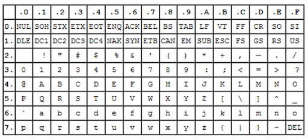
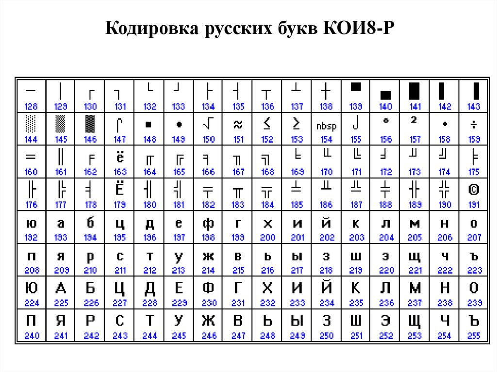

# Кодировки

## Введение

Работая со строками, разработчики редко задумываются о том, как они хранятся и что из себя представляют на самом деле.

> Нет такого понятия, как простой текст.
>
> Строка не имеет никакого смысла, если вы не знаете, в какой кодировке она записана.

Все, с чем вы работаете на компьютере, хранится в виде последовательности битов. Бит имеет два значения: 1 или 0.

Так вот, каждому символу, который вы видите на экране, соответствует определенная комбинация нулей и единиц, его код.
Совокупность таких кодов называется кодировкой.

К примеру:

```java
01100010 01101001 01110100 01110011
bits
```

В этой кодировке `01100010` представляет из себя `b`, представлению `i`соответствует `01101001`, `01110100` — это `t`, ну и `01110011` — это `s`.

Внешний вид самих символов определяется файлами шрифтов, которые предоставлены операционной системой.

Поэтому процесс вывода на экран текста можно описать как постоянное сопоставление последовательностей нулей и единиц каким-то конкретным символам, входящим в состав шрифта.

Кодировок существует огромное множество и для того, чтобы понять почему так произошло, необходимо обратиться к истории.

## История

### ASCII

Прародителем всех современных кодировок можно считать [ASCII](https://ru.wikipedia.org/wiki/ASCII).

Эта аббревиатура расшифровывается как `American Standard Code for Information Interchange`: американская стандартная кодировочная таблица для печатных символов и некоторых специальных кодов.

Кодировка `ASCII` была разработана в `1963` году Американской Ассоциацией Стандартов (которая позже стала Американским Национальным Институтом Стандартов — `ANSI`). Кодировка несколько раз обновлялась — в 1967 и 1986 годах.

Изначально `ASCII` являлась 7-битной кодировкой, включающая в себя 128 символов: 33 непечатных управляющих символа (влияющих на обработку текста и пробелов) и 95 печатных символов, включая цифры, буквы латинского алфавита в строчном и прописном вариантах, ряд пунктуационных символов.

> Неиспользование 8-го бита было связано с тем, что кодировка разрабатывалась для обмена информацией по телетайпу и старший бит использовался для контроля ошибок, возникших при передаче данных. 

Позже ее расширили, чтобы задействовать 8-й бит, и появилась возможность использования большего количества символов.



И всё было хорошо, пока вашим языком был английский. Но что делать, если понадобилось добавить поддержку других языков? В байте 8 бит, а значит коды 128-255 можно использовать по своему усмотрению. А значит, символы в верхней части (от 128) можно было использовать для локализации.

А так как языков в мире огромное количество, то и вариантов такой расширенной кодировки `ASCII` существует огромное количество. Так появились [кодовые страницы](https://ru.wikipedia.org/wiki/%D0%9A%D0%BE%D0%B4%D0%BE%D0%B2%D0%B0%D1%8F_%D1%81%D1%82%D1%80%D0%B0%D0%BD%D0%B8%D1%86%D0%B0). Коды от 0 до 127 совпадают с кодами `ASCII`, а коды от 128 до 255 могут означать разные символы различных языков в зависимости от выбранной кодовой страницы. Например, `KOI8-R` - это тоже расширенная кодировка `ASCII`, которая была разработана в СССР в 1974 году.

Аббревиатура `KOI8` расшифровывается как Код Обмена Информацией, 8 бит. Как следует из названия, это была 8-битная кодировка, что позволяло включить в нее в два раза больше символов, чем вмещала 7-битная версия `ASCII`. Кодировака `KOI8` включала в себя цифры, буквы латинского и русского алфавита, а также знаки пунктуации, спецсимволы и псевдографику.



Кодировка `KOI8-R` была предназначена для русского алфавита, вариант `KOI8-U` — для украинского.

Соответственно, неверно выбранная кодовая страница приводит к появлению непонятных символов и слов вместо осмысленного текста.

### ANSI

Следующим шагом в развитии кодировок было появление так называемых `ANSI`-кодировок (англ. ANSI code page).

По сути это были те же расширенные версии `ASCII`, однако из них были удалены различные псевдографические элементы и добавлены символы типографики, для которых ранее не хватало 'свободных мест'.

В это время были разработаны такие известные кодировки как `Windows-1251`, `Windows-1252` и т.д. 

До этого момента включительно человечество всё еще следовало правилу `1 символ - 1 байт` и пыталось вместить в 8 бит всё необходимое.

Всё это привело к тому, что появилось большое количество кодировок в которых коды кириллических символов были разными.

> Например, в KOI8-R русский алфавит был расположен не в алфавитном порядке: позиции символов русского алфавита соответствовали их фонетическим аналогам в английском алфавите.

Из-за отсутствия общего стандарта часто возникала проблема отображения символов, так как символы были закодированны с помощью одной кодировочной страницы, а отображение происходило с помощью другой.

Всё эти проблемы и сложности подтолкнули к созданию некой универсальной кодировки, способной вместить в себя всё необходимые символы.

### Unicode

Стандарт [Unicode](https://ru.wikipedia.org/wiki/%D0%AE%D0%BD%D0%B8%D0%BA%D0%BE%D0%B4) был предложен некоммерческой организацией 'Консорциум Юникода'(Unicode Consortium, Unicode Inc.) в 1991 году.

Пока предполагалось, что символ отображается в какую-то группу битов, которые уже можно хранить: `A` -> `0100 0001`.

В `Unicode` же символ отображается в `кодовую позицию`.
Проще говоря, `Unicode` – это огромная таблица соответствия символов и чисел, а различные `UTF`-кодировки определяют, как эти числа переводятся в биты.

Стандарт `Unicode` подразумевает, что все символы принадлежат семнадцати [плоскостям](https://ru.wikipedia.org/wiki/%D0%9F%D0%BB%D0%BE%D1%81%D0%BA%D0%BE%D1%81%D1%82%D1%8C_(%D0%AE%D0%BD%D0%B8%D0%BA%D0%BE%D0%B4)).

Плоскость `0` называется `Основная многоязычная плоскость`(англ. `Basic Multilingual Plane`, `BMP`), которая содержит наиболее часто используемые символы. Остальные плоскости (1—16) называются 'дополнительными'.

Например, строке `Hello` в `Unicode` соответствует пять кодовых позиций: `U+0048 U+0065 U+006C U+006C U+006F`.

Аббревиатура `UTF` расшифровывается как Unicode Transformation Format.

Посмотреть `Unicode`-таблицу: [тут](https://unicode-table.com/ru/).

### UTF-32

В самом начале было предложено для кодирования одного символа использовать аж 32 бита. И такая кодировка получила название [UTF-32](https://ru.wikipedia.org/wiki/UTF-32).

Ясно, что с помощью такой кодировки можно представить огромное количество символов, однако за такой размер необходимо платить тем, что каждый символ занимает 4 байта.

Во времена модемной связи и малых объемов устройств хранения информации это была непозволительная роскошь. Тридцать два бита на один символ, вдумайтесь насколько это расточительно! Особенно, если не требуются экзотические символы и больше двух третей не используется вообще.

У `UTF-32` есть свои плюсы, но его минусы перекрывают их, тем более далее речь пойдет о более 'экономных' кодировках. 

### UTF-16

Понимая все минусы, была разработана кодировка [UTF-16](https://ru.wikipedia.org/wiki/UTF-16).

Эта кодировка переменной длины, символы кодируются двухбайтовыми словами, отсюда и цифра 16 в названии. Один символ кодировки `UTF-16` представлен последовательностью двух байтов или двух пар байтов. Отсюда можно сделать вывод, что минимальный размер символа будет составлять два байта. Символы из `BMP` кодируются как раз одним двухбайтным словом.

В таком случае, `Hello` превращается в `00 48 00 65 00 6C 00 6C 00 6F`.

Вспомним, что в случаях, если число не может быть представлено одним байтом, имеет значение, в каком порядке байты записываются в памяти компьютера.

[Порядок байтов](https://ru.wikipedia.org/wiki/%D0%9F%D0%BE%D1%80%D1%8F%D0%B4%D0%BE%D0%BA_%D0%B1%D0%B0%D0%B9%D1%82%D0%BE%D0%B2) определяется в зависимости от архитектуры компьютера. Но нас интересует `little endian`, от младшего к старшему, и `big endian`, от старшего к младшему, порядки.

При работе с `UTF-16` символ записывается минимум двумя байтами, а значит то, какой из двух байтов идёт впереди, старший или младший, зависит от архитектуры и оказывает непосредственное влияние на кодирование.

А значит, необходимо как-то сообщать об этом при раскодировании. Для определения порядка байтов используется метка порядка байтов или `BOM`, речь об этом пойдет чуть ниже.

> Можно также использовать не 'общую' кодировку `UTF-16`, а явно сообщать какой порядок байтов используется.
>
> Для этого кодировка должна быть описана как `UTF-16LE` или `UTF-16BE` (little-endian / big-endian), а не просто `UTF-16`.

Количества символов в `UTF-16` хватало для комфортной работы, но проблема заключалась в том, что при переходе на эту кодировку с `ASCII` размер файлов увеличивался вдвое. Поэтому трудно было убедить всех перейти на общий стандарт.

Учтя все недочеты была предпринята еще одна попытка перевести всех к одному стандарту, в результате чего была разработана многобайтовая кодировка с переменной длинной символа: `UTF-8`.

### UTF-8

В [UTF-8](https://ru.wikipedia.org/wiki/UTF-8) все латинские символы кодируются 8 битами, как и в кодировке `ASCII`. Базовая часть кодировки `ASCII` - 128 символов - перешла в `UTF-8`, что позволяет хранить их в 1 байте, сохраняя при этом универсальность, ради которой все и затевалось.

Каждый символ кодировки, отличный от `ASCII`, состоит из ведущего байта, указывающего длину последовательности, и одного или нескольких продолжающих байт. Такой принцип позволяет определить длину последовательности только по первому байту

Поэтому, первые 128 символов кодируются 1 байтом, в то время как все остальные символы кодируются уже 2 байтами и более.

При этом достигается удачный эффект: английский текст в `UTF-8` выглядит точно так же как в `ASCII`!

В таком случае, `Hello` превращается из `00 48 00 65 00 6C 00 6C 00 6F` в старые-добрые `48 65 6C 6C 6F`.

В частности, каждый символ кириллицы кодируется именно 2 байтами.

Стандарт `RFC-3629` ограничивает `UTF-8` 4 байтами, однако теоретически `UTF-8` позволяет использовать последовательности вплоть до 6 байт.

Более подробно об алгоритме кодировке можно прочитать [здесь](https://ru.wikipedia.org/wiki/UTF-8).

Кодировка `UTF-8` проблем с порядком байтов не имеет, так как входной поток читается по байту, так как это минимальное возможное значение представления символа, и интерпретируется последовательно, в то время как в `UTF-16`, как было сказано выше, входной поток читается по два байта. 

Кодировка `UTF-8` является универсальной и имеет внушительный резерв на будущее. Это делает ее наиболее удобной кодировкой для использования.

## BOM

`BOM` расшифровывается как Byte Order Mark. Это специальный `Unicode`-символ, используемый для индикации порядка байтов текстового файла.

Вставляется в начало текстового файла или потока для обозначения того, что в файле/потоке используется `Unicode`, а также для косвенного указания кодировки и порядка байтов, с помощью которых символы были закодированы. Номер этого символа в стандарте Юникод — `U+FEFF`.

Для кодировки `UTF-8` он трехбайтовый, в то время как в `UTF-16` он двухбайтовый.

По сути это метаинформация о кодировке, записывающаяся в начало файла.

Для `UTF-16` его наличие важно, так как он указывает [порядок байтов](https://ru.wikipedia.org/wiki/%D0%9F%D0%BE%D1%80%D1%8F%D0%B4%D0%BE%D0%BA_%D0%B1%D0%B0%D0%B9%D1%82%D0%BE%D0%B2).

Использование `BOM` **не является** обязательным для `UTF-8`, поэтому встречается он редко. Для `UTF-8` это как маячок, что внутри `UTF-8`.

Однако некоторые программы и текстовые редакторы автоматически вставляют `BOM` и для `UTF-8`.

Символ является непечатным и иногда может вызвать некоторые проблемы, например, он может быть воспринят как символ, занимающий целую строку.

Подробнее про [BOM](https://ru.wikipedia.org/wiki/%D0%9C%D0%B0%D1%80%D0%BA%D0%B5%D1%80_%D0%BF%D0%BE%D1%81%D0%BB%D0%B5%D0%B4%D0%BE%D0%B2%D0%B0%D1%82%D0%B5%D0%BB%D1%8C%D0%BD%D0%BE%D1%81%D1%82%D0%B8_%D0%B1%D0%B0%D0%B9%D1%82%D0%BE%D0%B2).

### Сравнение UTF

Длина:

1. `UTF-8` - это переменная от 1 до 4 байт.
2. `UTF-16` - это переменные 2 или 4 байта.
3. `UTF-32` имеет фиксированные 4 байта.

Если локализация не ориентирована на западноевропейские языки, то использование `UTF-16` будет оправдано, так как символ будет занимать меньше, чем в `UTF-8`. В случае, если ориентация идет на западноевропейские языки, то предпочтительнее выбрать `UTF-8`.

Рассмотрим символ `語`, его представлени в кодировке `UTF-8`:

```java
11101000 10101010 10011110
```

Представление в кодировке `UTF-16`:

```java
10001010 10011110
```

Второе представление явно короче, а значит и занимает меньше места в памяти.

Также стоит напомнить об обязательном использовании `BOM` для `UTF-16` и `UTF-32`.

## Кодировки в Java

По-умолчанию `JVM` использует `UTF-8` кодировку. 
Однако это поведение может быть изменено с помощью параметра file.encoding(например, `-Dfile.encoding=UTF-16`) при запуске `JVM`, либо явным заданием этого параметра:

```java
System.setProperty("file.encoding","UTF-8");
```

Тип данных `char` в `Java` занимает **2 байта**.

Тип данных `java.lang.String` - это массив `char` символов.

Для демонстрации этого выведем на экран количество `char` символов в строке 'Hello World':

```java
System.out.println("Hello World".length());
```

Что выведет на экран `11`. 

---

**Вопрос**:

Но существуют же символы, которые занимают в кодировке, которую использует `Java`, более 2 байт!

Например:

```java
𝔊 - MATHEMATICAL_FRAKTUR_CAPITAL_G
```

Как в таком случае быть?

**Ответ**:

Такие символы занимают в `Java` два `char`-а.

При этом `Java` сразу заменит его на шестнадцатеричный номер в `unicode`:

```java
public class Test {
    public static void main(String[] args) {
        System.out.println("\uD835\uDD0A");
        System.out.println("\uD835\uDD0A".length());
    }
}
```

Что выведет на экран:

```java
𝔊
2
```
---

Из примера видно, что количество `char` символов может быть одно, а количество `unicode`-символов в строке - уже другое.

Для того, чтобы получить количество `unicode`-символов в строке существует метод `public int codePointCount(int beginIndex, int endIndex)`:

```java
public class Test {
    public static void main(String[] args) {
        String literal = "\uD835\uDD0A";
        System.out.println(literal);
        System.out.println(literal.length());
        System.out.println(literal.codePointCount(0, literal.length()));
    }
}
```

Что выведет на экран уже:

```java
𝔊
2
1
```

> Помните!
> 
> Количество `char` символов в строке не всегда равно количеству `unicode` символов в ней!

### Туда и Обратно

#### Туда

Для перевода строки в последовательность байт в `Java` у `java.lang.String` существуют специальные методы:

```java
public byte[] getBytes()
public byte[] getBytes(Charset charset)
public byte[] getBytes(String charsetName) throws UnsupportedEncodingException
```

Кодировку можно явно передать по имени и получить байты, закодированные в ней:

```java
        String hello = "Hello World";
        byte[] utf8bytes = hello.getBytes("UTF-8");

        System.out.println(hello);
        System.out.println(Arrays.toString(utf8bytes));
```

Что выведет на экран:

```java
Hello World
[72, 101, 108, 108, 111, 32, 87, 111, 114, 108, 100]
```

> При передаче кодировки явно по имени необходимо также обработать `checked`-исключение `java.io.UnsupportedEncodingException`

Можно передать экземпляр класса `java.nio.charset.Charset`, самые популярные кодировки уже представлены в классе `java.nio.charset.StandardCharsets`:

```java
        String hello = "Hello World";
        byte[] utf8bytes = hello.getBytes(StandardCharsets.UTF_8);

        System.out.println(hello);
        System.out.println(Arrays.toString(utf8bytes));
```

Что выведет на экран:

```java
Hello World
[72, 101, 108, 108, 111, 32, 87, 111, 114, 108, 100]
```

Либо воспользоваться методом, который закодирует строку с помощью кодировки по-умолчанию для текущей платформы:

```java
        String hello = "Hello World";
        byte[] utf8bytes = hello.getBytes();

        System.out.println(hello);
        System.out.println(Arrays.toString(utf8bytes));
```

Что снова выведет на экран:

```java
Hello World
[72, 101, 108, 108, 111, 32, 87, 111, 114, 108, 100]
```

Узнать кодировку для платформы можно так:

```java
        System.out.println(Charset.defaultCharset());
```

Что для меня выведет:

```java
UTF-8
```

Я считаю, что лучше явно задавать кодировку, в которой вы хотите закодировать вашу последовательность символов, так как `defaultCharset` для различных платформ может быть разный.

#### Обратно

Для получения строки из последовательности байтов стоит воспользоваться конструктороми `java.lang.String`:

```java
public String(char value[])
public String(byte bytes[], Charset charset)
public String(byte bytes[], String charsetName) throws UnsupportedEncodingException
```

Принцип работы здесь ровно тот же, что описано в предыдущем блоке.

Из всего вышесказанного ясно, что даже когда **кажется**, что никто не использует явно кодировку, то **какая-то** кодировка все равно будет выбрана.

Это же касается и работы с файлами.

Кодировка либо задается явно, либо используется по-умолчанию.

Кодировка по-умолчанию зависит от платформы, на которой запущен код, и параметров запуска. На разных операционных системах и разных `JVM` может быть выбрана разная кодировка по-умолчанию.

## Потеря данных

Стоит также помнить о том, что сохранение из `Unicode` в другой кодировке может привести к потере данных.

Рассмотрим следующий пример:

```java
 x ≠ y // юникокод символа \u2260
```

Закодируем его с помощью кодировки `windows-1251` и убедимся в том, что часть данных будет потеряна:

```java
        // \u2260 NOT EQUAL TO
        String mathematicalExpression = "x \u2260 y";

        Charset windows1251 = Charset.forName("windows-1251");

        byte[] encoded = mathematicalExpression
                .getBytes(windows1251);
        String decoded = new String(encoded, windows1251);

        System.out.println(mathematicalExpression);
        System.out.println(decoded);
```

Результат выполнения:

```java
x ≠ y
x ? y
```

Проиходит это по той причине, что символа `≠` попросту нет в кодировке `windows-1251`, поэтому он заменяется на другой.

Поэтому стоит более осторожно относиться к использованию не `unicode` кодировкам и форматам, их использующим.

Отметим, что большинство форматов, таких как `XML` или `JSON`, поддерживают `Unicode`.

## Заключение

Кодировка `UTF-8` является универсальной и наиболее популярной кодировкой на сегодняшний день.

В `Java` строки состоят из последовательностей символов, при этом тип данных `char` занимает 2 байта.
В `Unicode` существуют символы, для хранения которых необходимо более 2 байт, в таком случае такой символ будет представлен как два `char`-символа.

Наиболее популярные кодировки представлены объектами класса `java.nio.charset.Charset` и хранятся в `java.nio.charset.StandardCharsets`.

Класс `java.lang.String` предоставляет все необходимые методы для преобразования символов в байты и наоборот, при этом используемая кодировка будет либо указана явно, либо использована по-умолчанию.

Кодировка по-умолчанию может быть переопределена, но в основном будет использована `UTF-8`.

При перекодировке из `Unicode` опасайтесь потерь данных.

## Полезные ссылки

1. [Статья 'Кодировки в Java'](http://illegalargumentexception.blogspot.com/2009/05/java-rough-guide-to-character-encoding.html)
2. [Статья 'Все, что программист должен знать о кодировках'](http://kunststube.net/encoding/)
3. [Таблица символов Unicode](https://unicode-table.com/ru/)
4. [Unicode](https://ru.wikipedia.org/wiki/%D0%AE%D0%BD%D0%B8%D0%BA%D0%BE%D0%B4)
5. [UTF-8](https://ru.wikipedia.org/wiki/UTF-8)
6. [Кодовые страницы](https://ru.wikipedia.org/wiki/%D0%9A%D0%BE%D0%B4%D0%BE%D0%B2%D0%B0%D1%8F_%D1%81%D1%82%D1%80%D0%B0%D0%BD%D0%B8%D1%86%D0%B0)
7. [Джоэл о программировании.](https://www.ozon.ru/context/detail/id/2820575/)
8. [Лекция про Юникод, UCS, и UTF](https://www.youtube.com/watch?v=OG9gsFvGtSE)
