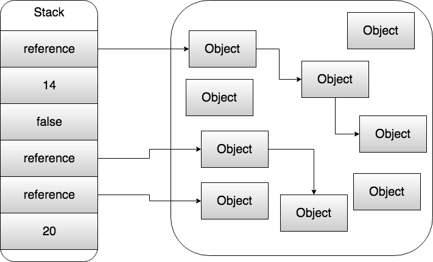

# Garbage Collector

## Введение

Как вы знаете, `Java` код транслируется в `байткод`, который уже в свою очередь выполняется платформой `JVM`.

Таким образом, `JVM` платформа играет ключевую роль в работе ваших приложений и предоставляет разработчикам множество преимуществ, среди которых есть одно настолько значимое, что не поговорить об этом было бы преступлением.

Это автоматическое управление памятью.

Некоторые языки программирования, такие как `C` или `C++`, дают разработчику возможность управления памятью.
Это дает возможность гибкого распределения ресурсов, их экономии и, в некоторых случаях, быстроте работы.

Но за такую гибкость приходится платить и обратной стороной медали является то, что вы теперь ответственны за эту область, а значит и за проблемы с ней.
Вы обязаны следить за освобождением памяти.

Для этого существуют разные механизмы, например, деструкторы.

Безусловно, для кого-то это не является большим минусом, но взглянем правде в глаза - многие проблемы программ, написанных на таких языках, связаны с несовершенным управлением памятью.

Существует даже специальные программы-анализаторы, задачей которых является как раз поиск проблемных мест и утечек памяти.

Не допускать ситуаций с утечками памяти вроде бы и не трудно — нужно всего лишь "класть на место всё что взяли", но на практике это очень сильно осложняется хитростью архитектуры, нелинейным порядком выполнения операторов, например, из-за применения исключений, а также человеческим фактором.
Ведь человеку присуще делать ошибки, что-то забывать и пропускать. И по отношению к памяти такие вещи крайне опасны, губительны, а иногда и непростительны.

Разумеется, логичным желанием было бы делегировать эту рутинную работу кому-то.

И `JVM` вместе с `Garbage Collector` освобождает разработчиков от ручного управления памятью, забирая эту задачу себе.
Благодаря чему `Java`-разработчик больше сконцентрирован на бизнес задаче(по крайней мере должен).

Теперь, когда мы поняли кому мы делегировали работу, давайте поговорим как выделяется память для объектов и примитивных типов.

## Стек и Куча

У стандартного процесса `Java` есть `stack`(стек) и `heap`(куча). `Стек` — это место, где создаются ссылки и локальные переменные, содержащие примитивы, при этом локальные переменные ссылочного типа будут указывать на память, выделяемую в куче.

`Куча` — это место, в котором создаются объекты.

В грубом приближении можно проиллюистрировать это как:



Т.е ссылки и примитивы создаются на стеке, в то время как объекты создаются в куче. Это надо понимать.

---

**Вопрос**:

Интересным моментом является то, где выделяется память на примитивные типы данных, которые принадлежат объекту? Т.е если примитив является свойстов класса, а объект создается на куче, то где будет создан такой примитив?

**Ответ**:

Примитивные поля объекта тоже выделяются по адресам внутри кучи!

---

Теперь поговорим о том, кто и как очищает память.

## Garbage collector

Поиском и освобождением ненужных участков в памяти в `JVM` занимается специальный процесс, который называется `garbage collector` или коротко `GC`.
У `Garbage Collector` две задачи - это обнаружение и очистка мусора.

Существует несколько реализаций `GC`, работающих по различным алгоритмам, каждый из которых по своему решает проблему отслеживания и уничтожения уже ненужных объектов.

Мы уже много раз сказали слово "ненужные" объекты. Но как определить, что объект ненужен, что это мусор?

Существует несколько подходов для поиска мусора:

* Reference counting
* Tracing

### Reference Counting

Как можно догадаться из названия данный подход основан на подсчете ссылок.

Суть подхода состоит в том, что каждый объект имеет некоторый счетчик. Этот счетчик хранит информацию о том, сколько ссылок указывает на объект.
Kогда какая-либо ссылка уничтожается, то счетчик уменьшается.

Если значение счетчика равно нулю - объект можно считать мусором и память, которую он занимает, можно очищать.

Это выглядит следующим образом:


Выглядит простым и рабочим вариантом.

Однако, у этого подхода есть несколько существенных минусов.

Главным из них является сложность обеспечения точности счетчика.

Также при таком подходе сложно выявлять циклические зависимости - когда два объекта указывают друг на друга, но ни один живой объект на них не ссылается. Это приводит к утечкам памяти.

Благодаря своим минусам данный подход используется редко и сейчас более распространен другой подход.

### Tracing

Этот подход вводит новое поняте - `GC Root` или корневая точка(чуть ниже мы поясним что это такое).

Главную идею подхода можно сформулировать как:

> "Живые объект - те до которых мы можем добраться с корневых точек (`GC Root`), все остальные является мусором. Все что доступно с живого объекта - также живое".

Рассмотрим следующую иерархию объектов:

```java
Person p = new Person();
p.setFlat(new Flat());
p.setCar(new Car());
p.getCar().setEngine(new Engine());
p.getCar().setHorn(new Horn());
```

Выглядеть это будет как-то так:


Так вот `Person` - это и есть та самая корневая точка. Т.е это наивысшая точка графа связанных объектов.
Так как `Person` у нас является живым объектом, то считается, что все объекты, до которых мы можем добраться из `Person` - также живые.

Проговорим еще раз смысл разбираемого подхода:
> Если мы представим все объекты и ссылки между ними как дерево, то нам нужно пройти с корневых узлов по всем узлам.
> При этом узлы, до которых мы сможем добраться - не мусор, все остальные - мусор.

Визуализируем для закрепления:


Видно, что одна из проблем `reference counting` с циклическими зависимостями сейчас решается сама собой. Не можем добраться до объекта - значит объект мусор.

Логичным образом возникает вопрос: какие бывают `GC Root`?

Мы уже поняли из примера c `Person`, что локальные переменные являются `GC Root`.

Но что еще может быть корневой точкой?

На момент `Java 8` корневой точкой могут быть:

* Локальные переменные и параметры методов
* Потоки
* Статические переменные
* Ссылки из JNI

Из этого следует, что даже самое простое `java` приложение имеет более одной корневой точки.

С задачей **обнаружения** мусора разобрались.

Теперь поговорим о том как просиходит очистка.

## Очистка памяти

Очистка памяти процесс довольно сложный, поэтому было разработано несколько алгоритмов, выполняющих эту задачу.

Рассмотрим какие алгоритмы очистки существуют.

### Copying collectors

Память условно делится на две области: `from-space` и `to-space`.

Все объекты создаются в области `from-space`, по мере заполнения этой области запускается очистка мусора.
Приложение полностью останавливается - происходит так называемый [stop-the-world](https://en.wikipedia.org/wiki/Tracing_garbage_collection#Stop-the-world_vs._incremental_vs._concurrent) - в момент начала очистки, после чего все "живые" объекты в `from-space` копируются в `to-space`.
После того, как все "живые" объекты скопированы происходит полная очистка `from-space` и области меняются местами.

> `Stop-the-World` - это остановка любой активности приложения, кроме сборки мусора.

Это очень напоминает обыкновенный `swap` двух переменных, только вместо переменных - области памяти.

Из плюсов можно выделить то, что объекты плотно забивают память, поэтому `Tracing` происходит быстрее.

Из минусов можно отметить полную остановку приложения и то, что у нас одна область памяти по сути не используется, а при большом количестве объектов это проблема.

И эти минусы довольно весомые, поэтому сейчас данный подход не используется.

### Mark-and-Sweep

Данный алгоритм называется `Mark-and-Sweep`: "отслеживание и очистка".

Алгоритм очень похож на предыдущий, но с некоторыми улучшениями.

Итак, как же он работает?

Объекты аллоцируются в памяти и в какой-то момент запускается очистка мусора.
Приложение полностью останавливается - здесь все также, как и в предыдущем случае, без остановки никуда.
После остановки мы проходим по всем объектам и помечаем(`mark`) все "живые" объекты как `sweep`.

После чего все не отмеченные куски помечаются как `free list`.

Следующие объекты создаются уже в области `free list`.

Главным минусом подхода является то, что память становится фрагментированной. Так как мы помечаем целые куски как `free list`, получаются "дыры".
Также при большом количестве "живых" объектов работа алгоритма становится гораздо менее эффективной.

Проиллюстрируем это, красным выделена как раз `free list` область:


### Mark-and-sweep compact

В отличии от простого `Mark-and-sweep` мы ищем "мертвые" объекты, помечаем их для переноса и только после этого останавливаем приложение для очистки памяти.

Так как с "мертвыми" объектами наше приложение уже не работает мы можем искать их параллельно работе приложения. Это очень эффективно, так как мы теперь не тратим вермя паузы на поиск, как в предыдущих алгоритмах.

После завершения процедуры удаления происходит `compact` - мы дефрагментируем память. Объекты "сдвигаются" на более близкие адреса.

Плюсы:

* Нет фрагментации памяти.
* Эффективная работа при большом количестве "живых" объектов.

Минусы:

* Плохо работает при большом количестве "мертвых" объектов.
* `Compact` - дорогостояющая операция, занимающая много времени.

Проиллюстрируем этот подход:


Далее в дело вмешался анализ работы систем и статистика. Благодаря чему начали учитывать поколения объектов и модель памяти в `Java`.

### Модель памяти в Java

Исходя из анализа уже работающих систем было выделено две закономерности.

Первая из них гласит, что большинство объектов в программе либо живут очень долго(хоть и не всегда счастливо), либо очень недолго.
Более того, количество объектов живущих долго крайне невелико.

Вторая закономерность гласит, что существует очень мало связей между "старыми" объектами, которые уже существовали давно, и "новыми", только что или недавно созданными, объектами.

Для того, чтобы учесть обе закономерности, память разделяется на несколько областей: `Eden`, `Survivor`, `Tenured` и `PermGen`.


#### Эдем

Эдем (`Eden`) — это область динамической памяти, в которой изначально создаются объекты. Многие объекты никогда не покидают этой области памяти.

#### Область уцелевших

Область уцелевших (`Survivor`) — как правило, в памяти присутствует две области уцелевших. Или же можно считать, что область уцелевших обычно делится пополам. Именно в нее попадают объекты, пережившие "изгнание из Эдема" (отсюда и ее название). Иногда два этих пространства называются **Из** (`From`) и **В** (`To`). По причинам, рассмотренным ниже, одна из областей уцелевших пустует, если только не происходит процесс сбора.

#### Хранилище

Хранилище (`Tenured`) — это область (также называемая "старым поколением"), где оказываются уцелевшие объекты, которые признаются "достаточно старыми"(таким образом, они покидают область уцелевших). Хранилище не очищается в ходе молодой сборки(об этом пойдет речь ниже).

#### Постоянное поколение памяти

Постоянное поколение памяти (`PermGen`) — здесь выделяется место для внутренних структур, например для определений классов. Строго говоря, постоянное поколение не входит в состав динамической памяти, обычные объекты сюда никогда не попадают.

Тут хранятся метаданные, классы, интернированные строки, и т.д.

Из этих двух закономерностей следует логичный вывод - сборка мусора должна чаще происходить над "новыми" объектами.

Соответственно поэтому существует несколько типов сборок: молодые, `young collection`, и полные, `full collection`.

### Молодая сборка

В ходе молодой сборки система пытается очистить только области с молодыми объектами — `Eden` и `Survivor`.
Этот процесс довольно прост.

1. Все живые молодые объекты, найденные на этапе отслеживания, перемещаются в следующие места:
    * Объекты, которые уже достаточно стары, которые пережили достаточное количество предыдущих циклов сборки мусора, попадают в `Tenured`.
    * Все остальные молодые "живые" объекты отправляются в пустую область уцелевших(как было сказано выше эта область разделяется на две).
  
2. После этого `Eden` и только что очищенная область в `Survivor` могут быть перезаписаны и переиспользованы, поскольку в них больше нет ничего, кроме мусора.

Молодая сборка начинается после того, как `Eden` оказывается целиком заполнен.

Обратите внимание на то, что на этапе отслеживания требуется обойти весь граф живых объектов.
Это означает, что если у молодого объекта есть ссылка на объект из `Tenured`, то ссылки, удерживаемые объектом из `Tenured`, также должны быть просмотрены и отслежены.

В противном случае может возникнуть ситуация, в которой объект из `Tenured` удерживает ссылку на объект из `Eden`, но больше на этот объект из `Eden` нет никаких ссылок.
Если не произвести полного обхода на этапе отслеживания, то объект из `Eden` никогда не удастся увидеть и, соответственно, не получится правильно обработать.

Такую сборку часто еще называют “major garbage collection”.

Сборки проходят часто, быстро и уничтожает кучу мусора, так как происходят на сравнительно небольшом участке памяти который скорее всего содержит много мусора.


### Полная сборка

Если молодая сборка не может перевести объект в хранилище (недостаточно пространства), то запускается `full collection`.
В зависимости от того, какой механизм сборки применяется при работе со старым поколением, может потребоваться перемещать объекты в старом поколении.
Это позволяет гарантировать, что в старом поколении хватает места, чтобы при необходимости выделить крупный объект.

Такой процесс называется уплотнением (`compacting`). Это очень похоже на то, как работает `Mark-and-Sweep Compact`.

Такую сборку часто еще называют “minor garbage collection”.

Сборки происходят не часто, но когда происходит, занимают много времени.

Сборщики мусора, умеющие работать с такой моделью называются “Generational Garbage Collection”, т.е учитывающие поколения.

## Реализации GC

В HotSpot VM реализовано четыре сборщика мусора основанных на идее “Generational Garbage Collection”:

1. **Serial GC**

    Данный сборщик мусора работает с молодыми и с полными сборками, как уже было описано.

2. **Parallel GC**

    Работает также как и `Serial GC`, но с использованием многопоточности.

3. **CMS GC**

    Concurrent Mark-and-Sweep.
    Он делает две очень краткие паузы с полной остановкой всех потоков, а также работает параллельно с другими потоками приложения в оставшуюся часть цикла по сборке мусора.
    Широко использовался до `Java 7` и `G1`.

4. **G1 GC**

    Центральная идея, лежащая в основе `G1`, называется `pause goal` - "желательная пауза".

    Этот параметр показывает, на какое время программа может прервать работу во время исполнения ради сборки мусора, например, на 20 мс один раз в 5 минут.

    Сборщик мусора не гарантирует, что будет работать именно так, но будет стараться работать с заданными желательными паузами. Это коренным образом отличает его от всех сборщиков мусора, с которыми мы сталкивались раньше. Разработчик может гораздо более гибко контролировать процесс сборки мусора.

    `G1` не из тех сборщиков мусора, которые работают с учетом поколений. При работе он делит `heap` на области равного размера, например, по 1 мегабайту, не различая молодых и старых областей. В каждом сегменте подсчитывается количество "мертвых" объектов. 
    Сборка мусора начинается с наиболее "замусоренных" сегментов. Алгоритм работы очистки - `Mark-and-Sweep-Compact`.

G1 лучше работает с большими размерами `heap`-а, в то время как `CMS` подойдет для большинства средне нагруженных приложений с не очень большими размерами `heap`.

В конце приведем таблицу с полезными настройками для `JVM`:

Для CMS:

| Настройка JVM                          | Описание                                                                                     |
|:--------------------------------------:|:---------------------------------------------------------------------------------------------|
|        -XX:+UseConcMarkSweepGC         |     Переключается на CMS-сборку                                                              |
|      -XX:+CMSIncrementalMode           |     Инкрементный режим (обычно необходим)                                                    |
|       -XX:+CMSIncrementalPacing        |     Инкрементный режим (обычно необходим)                                                    |
|       -XX:+UseParNewGC                 |     Параллельное выполнение молодых сборок                                                   |
|       -XX:ParallelGCThreads=<N>        |    Количество потоков, которые следует использовать при сборке мусора                        |

Для G1:

| Настройка JVM                          | Описание                                                                                     |
|:--------------------------------------:|:---------------------------------------------------------------------------------------------|
|        -XX:+UseG1GC                    |     Включает использование G1                                                                |
|      -XX:MaxGCPauseMillis=50           |     Указывает G1, что в ходе отдельно взятой сборки необходимо избегать пауз дольше 50 мс    |
|       -XX:GCPauseIntervalMillis=200    |     Указывает G1, что между сборками мусора должно проходить не менее 200 мс                 |

Общие настройки сборки:

| Настройка JVM                          | Описание                                                                                     |
|:--------------------------------------:|:---------------------------------------------------------------------------------------------|
|      -XX:MaxGCPauseMillis=NNN          |     Размер максимально допустимой паузы                                                      |
|      -XX:GCTimeRatio=nnn               |     Как часто будет происходить сборка, вычисляется по 1 / (1 + nnn)                         |