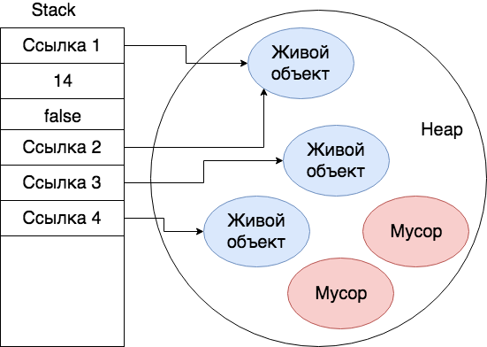
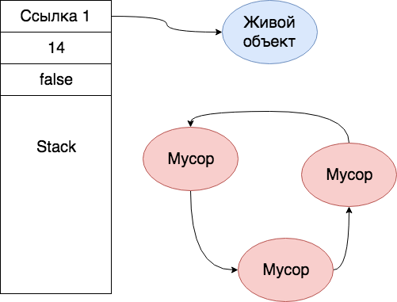
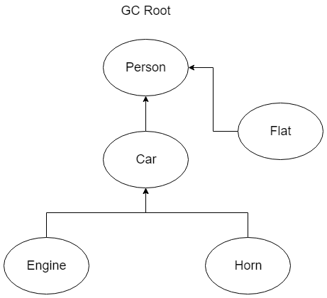
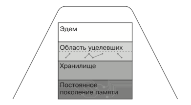

# Garbage Collector

## Введение

Как вы знаете, `Java` код транслируется в `байткод`, который уже в свою очередь выполняется `JVM`.

Таким образом, `JVM` играет ключевую роль в работе приложения и предоставляет разработчикам преимущества, среди которых есть одно настолько значимое, что не поговорить об этом было бы преступлением.

Это автоматическое управление памятью.

Некоторые языки программирования, такие как `C` или `C++`, дают разработчику возможность управления памятью.
Это позволяет более гибко распределять ресурсы, экономить их и, в некоторых случаях, писать более производительный код.

Но за такую гибкость приходиться платить и обратной стороной медали является то, что вы теперь ответственны за эту область, а значит и за проблемы с ней.
Вы **обязаны** следить за освобождением памяти.

Безусловно, для кого-то это не является большим минусом, но взглянем правде в глаза - многие проблемы программ, написанных на таких языках, связаны с несовершенным управлением памятью.

Существует даже специальные программы-анализаторы, задачей которых является как раз поиск проблемных мест и утечек памяти.

Не допускать ситуаций с утечками памяти вроде бы и не трудно — нужно всего лишь "класть на место всё что взяли", но на практике это очень сильно осложняется хитростью архитектуры, нелинейным порядком выполнения операторов, например, из-за применения исключений, а также человеческим фактором.

Человеку присуще делать ошибки, что-то забывать и пропускать. И по отношению к памяти такие вещи крайне опасны, губительны, а иногда и непростительны.

При этом не менее важна не только утечка памяти, но и доступ уже к осовбожденным частям. Нередки ситуации, когда память освобождена, а указатель на нее остался и разработчик по этому указателю обращается, в результате чего случаются ужасные вещи.

Учитывая еще то, что вы должны думать о бизнес логике в приложении получается двойная нагрузка на разработчика.

Разумеется, логичным желанием было бы делегировать эту рутинную работу кому-то.

И `JVM` вместе с `Garbage Collector` освобождает разработчиков от ручного управления памятью, забирая эту задачу себе.
Благодаря чему `Java`-разработчик больше сконцентрирован на бизнес задаче(по крайней мере должен).

## Garbage collector

Поиском и освобождением ненужных участков в памяти в `JVM` занимается специальный процесс, который называется `garbage collector` или коротко `GC`.
У `Garbage Collector` всего две задачи - это `обнаружение` и `очистка` мусора.

> Мусор - это структура данных(объект) в памяти не достижимый из программного кода.

Существует несколько реализаций `GC`, работающих по различным алгоритмам, каждый из которых по своему решает проблему отслеживания и уничтожения уже ненужных объектов.
Какие-то реализации лучше работают на больших размерах `heap`-а, какие-то лучше работают на средних размерах и меньше.

> При этом по спецификации нет никаких правил для реализации `GC`, кроме соблюдения корректности - это значит, что нельзя собирать объекты, которые в будущем в приложении будут использоваться.

Мы уже много раз сказали слово "ненужные" объекты. Но как определить, что объект ненужен, что объект не используется и это мусор?

Существует несколько подходов для поиска мусора:

* Reference counting
* Tracing

### Reference Counting

Данный подход основан на подсчете ссылок, о чем можно догадаться из названия.

Суть подхода состоит в том, что каждый объект имеет некоторый счетчик. Этот счетчик хранит информацию о том, сколько ссылок указывает на объект.
Kогда какая-либо ссылка уничтожается, то и значение счетчика уменьшается.

Если значение счетчика равно нулю - объект можно считать мусором и память, которую он занимает, можно очищать.

Это выглядит следующим образом:



Используется во многих языках программирования, например, в `Python`.

У этого подхода есть много плюсов: он прост, не требует долгих пауз для сборки мусора.

Однако, есть и несколько существенных минусов:

* Плохо сочетается с многопоточностью
* Сложно выявлять циклические зависимости, что требует большой ответственнсоти для реализации точности счетчика.
* Влияет на производительность – каждый раз, когда мы что-то читаем, записываем ссылку на объект в локальную переменную, нам нужно увеличивать счетчик.

Циклические зависимости - когда два объекта указывают друг на друга, но ни один живой объект на них не ссылается.
Это приводит к утечкам памяти.



Каждый из объектов на рисунке имеет по одной ссылке на себя, однако только один является по-настоящему "живым" и нужным.

Благодаря своим минусам данный подход не используется и вытеснен более гибким подходом, под названием `Tracing`.

### Tracing

Этот подход вводит новое поняте - `GC Root` или корень, якорь(чуть ниже мы поясним что это такое).

Главную идею подхода можно сформулировать как:

> Живые объекты - это те, до которых мы можем добраться от корня (`GC Root`), в то время как все остальные являются мусором.
>
> Все что доступно с живого объекта - также живое.

Пусть у нас есть следующий код:

```java
Person p = new Person();
p.setFlat(new Flat());
p.setCar(new Car());
p.getCar().setEngine(new Engine());
p.getCar().setHorn(new Horn());
```

Применимо к тому, о чем мы сейчас говорим, выглядеть это будет как-то так:



Так вот `Person` - это и есть тот самый корень, якорь. Т.е это наивысшая точка графа связанных объектов.

Так как `Person` у нас является живым объектом, то считается, что все объекты, до которых мы можем добраться из `Person` - также живые.

Проговорим еще раз смысл разбираемого подхода:
> Если мы представим все объекты и ссылки между ними как дерево, то нам нужно пройти от корневых узлов по всем узлам.
>
> При этом узлы, до которых мы сможем добраться - не мусор, все остальные - мусор.

Визуализируем для закрепления:


Видно, что одна из проблем `reference counting`, с циклическими зависимостями, сейчас решается сама собой.
Все просто: не можем добраться до объекта - значит объект мусор.

Логичным образом всплывает вопрос: какие бывают `GC Root`?
Как мы уже поняли из примера c `Person`, что локальные переменные являются `GC Root`.

#### Live rangers

Вернемся к примеру выше и предположим, что код принадлежит некоторому методу:

```java
void foo() {
    Person p = new Person();
    p.setFlat(new Flat());
    p.setCar(new Car());
    p.getCar().setEngine(new Engine());
    p.getCar().setHorn(new Horn());

    System.gc();
}
```

Так вот, во время `GC` очистки объект по ссылке `p` и связанные с ним объекты в общем случае не выживут.

> Можно проверить данное утверждение, включив `-Xcomp`

Почему?

Дело в том, что компилятор вычисляет для всех переменных `live ranges` - это все, что находится на любых путях исполнения от определения переменной до последнего использования (или использований, они могут быть разные на разных путях).

Другими словами, компилятор всегда знает: жива сейчас переменная или нет, могут ее потенциально в будущем еще использовать или нет.

`GC` тоже ориентируется на это знание от компилятора. Если переменная вне своего `live range`, то значит она уже не будет корнем.

Для того, чтобы гарантировать, что объект никуда не денется существует метод [Reference.reachabilityFence​(Object ref)](https://docs.oracle.com/javase/9/docs/api/java/lang/ref/Reference.html#reachabilityFence-java.lang.Object-).

Он гарантирует, что до вызова метода объект никуда не денется.

Но что еще может быть корневой точкой?

На момент `Java 8` корневой точкой могут быть:

* Локальные переменные и параметры методов
* Потоки `Java`
* Статические переменные
* Ссылки из [JNI](https://ru.wikipedia.org/wiki/Java_Native_Interface)

Из этого следует, что даже самое простое `java` приложение имеет следующие `GC Root`:

* Локальные переменные внутри `main` метода.
* Статические переменные класса, содержащего `main` метод.
* Параметры `main` метода.
* Поток, который выполняет `main` метод.

С задачей **обнаружения** мусора разобрались.

Теперь поговорим о том как просиходит очистка.

## Очистка памяти

Очистка памяти процесс довольно сложный, поэтому было также разработано несколько алгоритмов, выполняющих эту задачу.

Рассмотрим какие алгоритмы очистки существуют.

### Copying collectors

Память условно делится на две области: `from-space` и `to-space`.

Все объекты создаются в области `from-space`, по мере заполнения этой области запускается очистка мусора.
Приложение полностью останавливается - происходит так называемый [stop-the-world](https://en.wikipedia.org/wiki/Tracing_garbage_collection#Stop-the-world_vs._incremental_vs._concurrent) - в момент начала очистки, после чего все "живые" объекты в `from-space` копируются в `to-space`.

После того, как все "живые" объекты скопированы происходит полная очистка `from-space` и области меняются местами.

> `Stop-the-World` - это остановка любой мутирующей `heap` активности.

Из плюсов можно выделить то, что объекты плотно забивают память, поэтому `tracing` происходит быстрее.

Из минусов можно отметить полную остановку приложения и то, что у нас одна область памяти по сути не используется, а при большом количестве объектов это проблема.

---

**Вопрос**:

Почему приложение делает эту паузу? Какие преимущества дает нам `stop the world`?

**Ответ**:

Благодаря `stop the world` паузе нам:

* Проще определять достижимость объектов, так как граф объектов в этот момент заморожен.
* Проще перемещать объекты в куче, так как можно не бояться, что мы что-то сломаем и мы можем ненадолго перевести кучу в некорректное состояние для наших нужд.

Для тех задач, где пауза критична существует такое понятие как `инкрементальная сборка`.
Там мы делаем большое количество кратковременных пауз. Это выражается в большей нагрузке на приложение.

Примером инкрементального сборщика может являться `CMS GC`.

---

Перечисленные минусы довольно весомые, поэтому сейчас данный алгоритм практически не используется.

### Mark-and-Sweep

Данный алгоритм называется `Mark-and-Sweep`: "отслеживание и очистка".

Алгоритм очень похож на предыдущий, но с некоторыми улучшениями.

Объекты аллоцируются в памяти и в какой-то момент запускается очистка мусора.
Приложение полностью останавливается - здесь все также, как и в предыдущем случае, без остановки никуда.

После остановки мы проходим по всем объектам и помечаем(`mark`) все "живые" объекты, после чего делаем `sweep` - чистим и снимаем все пометки с "живых" объектов.

Главным минусом подхода является то, что память становится фрагментированной. Так как получаются целые куски свободной памяти после `sweep`.

Также при большом количестве "живых" объектов работа алгоритма становится гораздо менее эффективной.

Проиллюстрируем это, красным выделена очищенная область:


### Mark-and-Sweep Compact

В отличии от простого `Mark-and-sweep` мы ищем "мертвые" объекты, помечаем их для переноса и только после этого останавливаем приложение для очистки памяти.

Так как с "мертвыми" объектами наше приложение уже не работает мы можем искать их параллельно работе приложения. Это очень эффективно, так как мы теперь не тратим время паузы на поиск, как в предыдущих алгоритмах.

После завершения процедуры удаления происходит `compact` - мы дефрагментируем память. Объекты "сдвигаются" на более близкие адреса.


Плюсы:

* Нет фрагментации памяти.
* Эффективная работа при большом количестве "живых" объектов.

Минусы:

* Плохо работает при большом количестве "мертвых" объектов.
* `Compact` - дорогостояющая операция, занимающая много времени.

Далее в дело вмешался анализ работы систем и статистика времени жизни объектов.
Благодаря чему начали учитывать поколения объектов и модель памяти в `Java`.

### Поколения объектов в Java

> Все сказанное ниже относится к виртуальной машине `HotSpot`.

Исходя из анализа уже работающих систем было выделено две закономерности.

Первая из них гласит, что большинство объектов в программе либо живут очень долго(хоть и не всегда счастливо), либо очень недолго.
Более того, количество объектов живущих долго крайне невелико.

Вторая закономерность гласит, что существует очень мало связей между "старыми" объектами, которые уже существовали давно, и "новыми", только что или недавно созданными, объектами.

Эти две закономерности еще иногда называют "слабой гипотезой о поколениях".

Исходя из этих предположений логично было бы разделить нашу память на области, в которых бы хранились объекты разных поколений и те области, в которых будут хранится "молодые" объекты пытаться очищать чаще.

Поэтому память в версиях `Java 7` и ниже разделяется на несколько областей: `Eden`, `Survivor`, `Tenured` и `PermGen`.
В `Java 8` и старше было решено убрать `PermGen`, о причинах расскажем чуть ниже.



Можно отнести `Eden` и `Survivor` к так называемому "молодому" поколению, `young generation`, а `Tenured` - к старому, `old generation`.

#### Эдем

Эдем (`Eden`) — это область динамической памяти, в которой изначально создаются объекты.
Многие объекты никогда не покидают этой области памяти, так как быстро становятся мусором.

Когда мы пишем что-то в виде `new Object()` мы создаем объект именно в `Eden`.

Относится к `young generation`.

#### Область уцелевших

Область уцелевших (`Survivor`) — как правило, в памяти присутствует две области уцелевших. Или же можно считать, что область уцелевших обычно делится пополам. Именно в нее попадают объекты, пережившие "изгнание из Эдема" (отсюда и ее название). Иногда два этих пространства называются `From Space` и `To Space`.
Одна из этих областей всегда пустует, если только не происходит процесс сбора.

Из `From Space` объекты либо удаляются `GC`, либо перекочевывают в `To Space` - последнее место перед тем, как стать совсем старыми и перейти в `Tenured`.

Относится к `young generation`.

#### Хранилище

Хранилище (`Tenured`) — это область (также называемая "старым поколением"), где оказываются уцелевшие объекты, которые признаются "достаточно старыми"(таким образом, они покидают область `Survivor`).

Хранилище не очищается в ходе молодой сборки(об этом пойдет речь ниже).

Относится к `old generation`.

#### Постоянное поколение памяти

До `Java 8` существовал специальный раздел: `PermGen` — здесь выделялось место для внутренних структур, например для определений классов. Строго говоря, `PermGen` не входило в состав динамической памяти, обычные объекты сюда никогда не попадали.

Тут хранились метаданные, классы, интернированные строки, и т.д - это была специальная область памяти у `JVM`.

Так как достаточно трудно понять необходимый размер этой области, то ранее, до `Java 8`, можно было часто наблюдать ошибку `java.lang.OutOfMemoryError`.

Происходило это потому, что эта область переполнялась, если только вы не выставили достаточное количество памяти для нее, а определить достаточно памяти или нет можно было только научным методом "тыка".

Поэтому, начиная с `Java 8`, было принято вообще убрать эту область и вся информация, которая там хранилась либо переносится в `heap`, например интернированные строки, либо выносится в область `metaspace`, в `native memory`.

Максимальный `Metaspace` по умолчанию не ограничен ничем кроме предела объёма нативной памяти. Но его можно по желанию ограничить параметром `MaxMetaspaceSize`, аналогичным по сути к `MaxPermSize` у предка - `PermGen`.

Из этих двух закономерностей следует логичный вывод - сборка мусора должна чаще происходить над "новыми" объектами.

Соответственно поэтому существует несколько типов сборок: `minor`, `major` и  `full`.

### Minor сборка

В ходе `minor` сборки система пытается очистить только области с молодыми объектами — `Eden` и `Survivor`.

Этот процесс довольно прост.

1. Все "живые" молодые объекты, найденные на этапе отслеживания, перемещаются в следующие места:
    * Объекты, которые уже достаточно стары, которые пережили достаточное количество предыдущих циклов сборки мусора, попадают из `Survivor` области `To Space` в `Tenured`.
    * Все остальные молодые "живые" объекты отправляются в пустую область уцелевших `Survivor`.
  
2. После этого `Eden` и только что очищенная область в `Survivor` могут быть перезаписаны и переиспользованы, поскольку в них больше нет ничего, кроме мусора.

`Minor` сборка начинается после того, как `Eden` оказывается целиком заполнен.

Обратите внимание на то, что на этапе отслеживания требуется обойти весь граф живых объектов.
Это означает, что если у молодого объекта есть ссылка на объект из `Tenured`, то ссылки, удерживаемые объектом из `Tenured`, также должны быть просмотрены и отслежены.

В противном случае может возникнуть ситуация, в которой объект из `Tenured` удерживает ссылку на объект из `Eden`, но больше на этот объект из `Eden` нет никаких ссылок.
Если не произвести полного обхода на этапе отслеживания, то объект из `Eden` никогда не удастся увидеть и, соответственно, не получится правильно обработать.

Сборки проходят часто, быстро и уничтожает кучу мусора, так как происходят на сравнительно небольшом участке памяти который скорее всего содержит много мусора.


### Major сборка

В ходе `major` сборки система пытается очистить области с старым поколением - `old generation`.

Многие `major` сборки запускаются `minor` сборками, как например, было сказано выше, когда объекты из `Eden` и `Tenured` связаны.

Из-за того, что `minor` и `major` сборки тесно связаны, то часто говорят сразу про `full` сборку.

### Full сборка

Если молодая сборка не может перевести объект в хранилище (недостаточно пространства), то запускается `full`.

`Full` сборка очищает обе области - и старое поколение, и новое.

В зависимости от того, какой механизм сборки применяется при работе со старым поколением, может потребоваться перемещать объекты в старом поколении.
Это позволяет гарантировать, что в старом поколении хватает места, чтобы при необходимости выделить крупный объект.

Сборки происходят не часто, но когда происходит, занимают много времени.

Сборщики мусора, умеющие работать с такой моделью называются `Generational Garbage Collection`, т.е учитывающие поколения.

## Реализации GC

В HotSpot VM реализовано четыре сборщика мусора основанных на идее “Generational Garbage Collection”:

1. **Serial GC**

    Данный сборщик мусора работает с молодыми и с полными сборками, как уже было описано.
    Это последовательная сборка молодого и старого поколения.

2. **Parallel GC**

    Работает также как и `Serial GC`, но с использованием многопоточности.

3. **CMS GC**

    Concurrent Mark-and-Sweep.
    Он делает две краткие паузы с полной остановкой всех потоков, эти паузы в сумме меньше, чем общий цикл фоновой сборки.
    По возможности, осуществляет сборку мусора в фоновом режиме.

    Первая пауза называется `initial mark`, в это время анализируется `stack`, после чего в **фоновом** режиме происходит обход `heap`-а, начинается `mark` фаза.
    После этого надо снова остановить приложение и провести `remark` - удостовериться, что пока мы делали в фоновом режиме ничего не изменилось.
    И только после этого просиходит `sweep` в фоновом режиме - очистка уже ненужных участков.

    Такое поведение возможно только при работе с молодой сборкой.
    Как только нужна полная сборка происходит настоящая `stop the world` пауза и в одном потоке уже идет полная сборка.

    Широко использовался до `Java 7` и `G1`.

    > Concurrency - это когда две или несколько задач могут запускаться, запускаться и заканчиваться в перекрывающиеся периоды времени.
    > Это не обязательно означает, что они оба будут работать в одно и то же мгновение. Например. многозадачность на одноядерной машине.
    >
    > Parallelism - это когда задачи буквально запускаются одновременно, например, на многоядерном процессоре.
    >
    > Для лучшего понимания разницы можно также погуглить :)

4. **G1 GC**

    Центральная идея, лежащая в основе `G1`, называется `pause goal` - "желательная пауза".

    Этот параметр показывает, на какое время программа может прервать работу во время исполнения ради сборки мусора, например, на 20 мс один раз в 5 минут.

    Сборщик мусора не гарантирует, что будет работать именно так, но будет стараться работать с заданными желательными паузами. Это коренным образом отличает его от всех сборщиков мусора, с которыми мы сталкивались раньше. Разработчик может гораздо более гибко контролировать процесс сборки мусора.

    `G1` при работе делит `heap` на области(регионы) равного размера, например, по 1 мегабайту.
    Далее динамически выбирается набор таких регионов, которые называются молодым поколением, при этом сохраняется понятие `Eden` и `Survivor`.
    Но выбор происходит **динамически**!

    Также выбирается и старое поколение.

    Большие объекты, которые не помещаются в один регион, хранятся в смежных регионах. Такие объекты называются `humongous objects`.

    В каждом сегменте подсчитывается количество "мертвых" объектов.

    При сборке мусора выбирается `collection set` - регионы, в которых будет происходить сборка мусора. Туда входит все молодое поколение и **некоторые** регионы из старого.
    Суть алгоритма в том, что мы всегда работаем с размером памяти меньшим, чем весь `heap`.
    Фоновая маркировка помогает отобрать такие регионы.

    После этого происходит копирование живых объектов в часть `survivor` области, помеченную как `To Space`, и в регионы из старшего поколения.
    Получается, что размер очищенных `From Space` и `Eden` регионов существенно больше, чем тот, в которой мы перенсли живые объекты.
    Происходит компактификация засчет копирования.

    Сборка мусора начинается с наиболее "замусоренных" сегментов. Алгоритм работы очистки - `Mark-and-Sweep-Compact`.

Для каждого приложения `GC` подбирается индивидуально, в зависимости от того какой размер `heap`-а используется, какие требования к приложению и т.д.

На просторах интернета можно найти информацию, что `G1` гораздо лучше работает с большими размерами `heap`-а(более 5 GB), особенно если ожидается загруженность этого `heap`-а более 50%, в то время как `Parallel GC` подойдет для большинства средне нагруженных приложений с не очень большими размерами `heap`.

`G1` точно не рекомендуется там, где разработчики хотят минимальные паузы `< 100ms`.

В целом, начинайте выбирать `GC` только в том случае, когда вас серьезно не устраивает работа текущего.
Учитывайте размер `heap` при выборе реализации `GC`. И отталкивайтесь от того, какие цели вы преследуете.

Приведем реализации по-умолчанию в последних версиях `Java`, применяемых в `HotSpot JVM`:

* Java 7 - Parallel GC
* Java 8 - Parallel GC
* Java 9 - G1 GC

В конце приведем таблицу с полезными настройками для `JVM`:

Для `CMS`:

| Настройка JVM                          | Описание                                                                                     |
|:--------------------------------------:|:---------------------------------------------------------------------------------------------|
|        -XX:+UseConcMarkSweepGC         |     Переключается на CMS-сборку                                                              |
|      -XX:+CMSIncrementalMode           |     Инкрементный режим (обычно необходим)                                                    |
|       -XX:+CMSIncrementalPacing        |     Инкрементный режим (обычно необходим)                                                    |
|       -XX:+UseParNewGC                 |     Параллельное выполнение молодых сборок                                                   |
|       -XX:ParallelGCThreads=NNN        |    Количество потоков, которые следует использовать при сборке мусора                        |

Для `G1`:

| Настройка JVM                          | Описание                                                                                     |
|:--------------------------------------:|:---------------------------------------------------------------------------------------------|
|        -XX:+UseG1GC                    |     Включает использование G1                                                                |
|      -XX:MaxGCPauseMillis=50           |     Указывает G1, что в ходе отдельно взятой сборки необходимо избегать пауз дольше 50 мс    |
|       -XX:GCPauseIntervalMillis=200    |     Указывает G1, что между сборками мусора должно проходить не менее 200 мс                 |

Общие настройки сборки:

| Настройка JVM                          | Описание                                                                                     |
|:--------------------------------------:|:---------------------------------------------------------------------------------------------|
|      -XX:MaxGCPauseMillis=NNN          |     Размер максимально допустимой паузы                                                      |
|      -XX:GCTimeRatio=nnn               |     Как часто будет происходить сборка, вычисляется по 1 / (1 + nnn)                         |

### Экспериментальные GC

#### Epsilon GC

Начиная с `Java 11+` появилась еще одна реализация GC: `Epsilon GC`. Это экспериментальный сборщик мусора, суть которого заключается в отказе от такого понятия, как сборка мусора.
Он заботится только об аллокации новой памяти, не очиащая за собой мусор, т.е не использует все эти стратегии сбора мусора, а значит, не делает и `stop the world` пауз.
Казалось бы, зачем нужен сборщик мусора, который не собирает мусор?

Как уже было сказано выше, среднестатическое приложение на `Java`, в зависимости от времени работы, будет переживать как `full gc`, так и `minor gc` сбокри.
А это, разумеется, влияет на производительность. Но как сильно? Тут то и пригодится простой `gc`, с ограниченным набором памяти, которую он может выделить, а если память заканчивается, то начинается процедура остановки `JVM`.

Или представим, что вы пишете приложение, где сам факт сборки мусора считается багом в приложении: вместо того, чтобы собирать мусор лучше упасть.

Таким образом, можно сравнить производительность приложения с "боевым" `gc`. Посмотреть какие получаются накладные расходы на циклы работы сборщика, насколько увеличивается пауза на сборку, когда есть барьеры на запись/чтение. Также, такой `gc` будет полезен для тестирования приложений, фреймворков, да и других реализаций `gc`, которые претендуют на то, что почти не засоряют `heap` объектами, как например, `Netty`.

Для использования `Epsilon GC`, необходимо всего добавить следующие флаги в аргументы запуска `JVM`: `XX:+UnlockExperimentalVMOptions` `-XX:+UseEpsilonGC`.

Таким образом, `Epsilon GC` занимает нишу тестирования производительности вашего кода.

## Стек и Куча

В общем представлении можно считать, что у стандартного процесса `Java` есть `stack`(стек) и `heap`(куча).

Очень часто можно встретить такие определения:

* `Стек` — это место, где создаются ссылки и локальные переменные, содержащие примитивы, при этом локальные переменные ссылочного типа будут указывать на память, выделяемую в куче.

* `Куча` — это место, где в основном создаются объекты.

Однако это не совсем так!

Объекты **могут** аллоцироваться и на стеке(и даже на регистрах).

Это одна из довольно популярных оптимизаций - заметить, что объект нужен только локально.
Так как при аллокации объекта на стеке его не надо очищать `GC` - он сам умрет, когда фрейм очистится.

> При этом объекты, реализующие [java.lang.Object#finalize](../object/finalize.md) так не аллоцируются.
>
> Это еще одна причина **не использовать** [java.lang.Object#finalize](../object/finalize.md)

Об этом можно прочесть [здесь](https://shipilev.net/jvm/anatomy-quarks/18-scalar-replacement/).

## Полезные ссылки

1. [GC Алгоритмы](https://plumbr.io/handbook/garbage-collection-algorithms)
2. [Поколения объектов](https://plumbr.io/handbook/garbage-collection-in-java)
3. [Реализации GC](https://plumbr.io/handbook/garbage-collection-algorithms-implementations)
4. [Доклад о сборке мусора в Java](http://profyclub.ru/docs/305)
5. [Доклад Ивана Углянского по GC](https://www.youtube.com/watch?v=PnajHQ06vPs&t=2676s)
6. [Статья о Epsilon GC](https://habr.com/ru/post/321856/)

## Отдельная благодарность

Отдельную благодарность за ревью и помощь автор хочет выразить [Углянскому Ивану](https://twitter.com/dbg_nsk), ссылка на [его](https://github.com/ugliansky) github.
