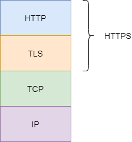
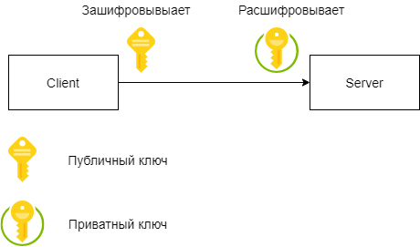

# HTTP

## Введение

Аббревиатура `HTTP` расшифровывается как `HyperText Transfer Protocol`, «протокол передачи гипертекста». `HTTP` является протоколом прикладного уровня по модели OSI (верхнего, 7-го).

`HTTP` — широко распространённый протокол передачи данных, изначально предназначенный для передачи гипертекстовых документов(частный случай - `HTML`), в настоящий момент используется для передачи произвольных данных.

Протокол `HTTP` предполагает использование клиент-серверной структуры передачи данных. Клиентское приложение формирует запрос и отправляет его на сервер, после чего сервер обрабатывает данный запрос, формирует ответ и передаёт его обратно клиенту. После чего клиент может продолжить слать запросы, которые будут обработаны аналогичным образом.

Какие задачи решает `HTTP`?

* Структура данных, передаваемых по сети.
  
  Данные передаются по `TCP` сплошным потоком байт, клиент и сервер, которые взаимодействуют по `TCP` должны каким-то образом договориться когда можно считать, что запрос закончен, когда можно считать, что ответ получен? Нужна внутренняя структура для данных.

* Передача мета-информации о документе.

    MIME-type(Content-type), размер документа и т.д.

* Авторизация.
    
    Передаваемые документы могут быть как публичными, так и приватными. Для обеспечения приватности нужна проверка прав доступа, авторизация.

* Поддержка сессий.
* Кеширование документов.
* Согласование содержимого.
  
  Клиент и сервер могут договориться в каком виде передавать документ, например, сжимать его и по какому протоколу это делать.
* Управление соединением.
    Протокол `TCP` не предусматривает управления, кроме как закрытия соединения. Протокол `HTTP` позволяет более гибко управлять соединением, в частности, закрывать его или оставлять открытым для последующих запросов.

Ключевые особенности:

* Работает поверх `TCP/TLS`.
* Протокол `HTTP` работает по принципу запрос-ответ.
* Это `stateless` протокол, он не хранит состояние о соединении.
* Является текстовым протоколом, данные передаются в виде `plain` текста, с разделителем "\r\n".
* Расширяемый протокол. Можно вводить дополнительные заголовки.

Задача, которую необходимо было решить в первую очередь - это указать Content-type документа и его длину.

Помимо всего вышеперечисленного, в `HTTP 1.1` были введены:

* Виртуальные хосты
  
  На одном IP и порту несколько DNS имен.

* Persistent-Connection
    
    Connection: Keep-Alive по умолчанию.

* Chunked transfer encoding
  
    Позволяет отправлять ответ не зная его полного размера и не буферизуя его на стороне сервера.
    Отправляем по кусочкам.

* Range request
  
  Запрос только части ресурса. Например, позволяет в несколько потоков скачать ресурс.

* Сжатие

    Сжимается только тело запроса, заголовки не сжимаются.

В `HTTP 1.1` соединение будет закрыто, если:

* Сервер или клиент использует версию `HTTP` младше 1.1
* Сервер или клиент передал заголовок Connection: close
* По истечению таймаута

Иначе соединение остается открытым для последующих запросов.

Сейчас мир постепенно переходит к использованию протокола `HTTP 2.0`.

## Структура

Каждое `HTTP`-сообщение состоит из трёх частей, которые передаются в указанном порядке:

* Стартовая строка - определяет тип сообщения;

    Запрос представляется в виде: `Метод URI HTTP/Версия`.

        Метод - тип запроса, одно слово заглавными буквами. Список методов для версии 1.1 представлен ниже.
        
        URI определяет путь к запрашиваемому документу.
        
        Версия - пара разделённых точкой цифр. Например: 1.1.

        Пример: GET /wiki/HTTP HTTP/1.1

    Ответ представляется в виде: `HTTP/Версия КодСостояния Пояснение`.

        Версия - пара разделённых точкой цифр, как в запросе;
        
        Код состояния - три цифры. По коду состояния определяется дальнейшее содержимое сообщения и поведение клиента;
        
        Пояснение - текстовое короткое пояснение к коду ответа для пользователя. Никак не влияет на сообщение и является необязательным.

        Пример: HTTP/1.1 200 OK

* Заголовки - характеризуют тело сообщения, параметры передачи и прочие сведения;
* Тело сообщения - непосредственно данные сообщения. Обязательно должно отделяться от заголовков пустой строкой.

Тело сообщения может отсутствовать, в то время как стартовая строка и заголовок являются обязательными элементами.

Для версии протокола `1.1` сообщение запроса обязательно должно содержать заголовок `Host`. Почему?

Преобразование доменного имени в `IP`-адрес осуществляется на стороне клиента, и когда открывается `TCP`-соединение, то удалённый сервер не обладает никакой информацией о том, какой именно адрес использовался для соединения. Благодаря `virtual hosts`, это может быть и habrahabr.ru, и m.habrahabr.ru, ответ может разниться для каждого. Однако фактически сетевое соединение во всех случаях открывается с узлом по `IP`-адресу, и даже если первоначально при открытии соединения был задан не этот `IP`-адрес, а какое-либо доменное имя, то сервер об этом никак не информируется - и именно поэтому этот адрес необходимо передать в заголовке `Host`. Чтобы сервер знал как был сформирован запрос.

## HTTP методы

Метод представляет собой последовательность из любых символов, кроме управляющих и разделителей, определяет операцию, которую нужно осуществить с указанным ресурсом.

`HTTP` методы:

* `GET` - получение документа.

    Согласно стандарту `HTTP`, запросы типа `GET` считаются [идемпотентными](https://ru.wikipedia.org/wiki/%D0%98%D0%B4%D0%B5%D0%BC%D0%BF%D0%BE%D1%82%D0%B5%D0%BD%D1%82%D0%BD%D0%BE%D1%81%D1%82%D1%8C).

    Кроме обычного метода `GET`, различают ещё

    * Условный `GET` — содержит заголовки If-Modified-Since, If-Match, If-Range и подобные;
    * Частичный `GET` — содержит в запросе Range.

* `HEAD` - получение только заголовков и статуса ответа.
  
    Для проверки наличия документа, например, поисковыми ботами.

* `POST` - отправка данных на сервер.

    Применяется для передачи пользовательских данных заданному ресурсу. Данные могут быть произвольными.
    В отличие от метода `GET`, метод `POST` не считается идемпотентным.

* `PUT` - отправка документа на сервер.
  
  Отправка данных, но отправка документа целиком. Обычно отключен в целях безопасности.
  Фундаментальное различие методов `POST` и `PUT` заключается в понимании предназначений `URI` ресурсов. Метод `POST` предполагает, что по указанному `URI` будет производиться обработка передаваемого клиентом содержимого. Используя `PUT`, клиент предполагает, что загружаемое содержимое соответствует находящемуся по данному `URI` ресурсу.

  Сообщения ответов сервера на метод `PUT` не кэшируются.

* `DELETE` - удаление документа.
  
  Обычно отключен в целях безопасности.
* CONNECT, TRACE, OPTIONS

    Для получения информации о веб-сервере.


## HTTP коды ответа

`HTTP` коды ответа:

* 1xx - информационные.

    Для координации действий клиента и веб-сервера.

* 2xx - упешное выполнение
  
  Примеры: 
   * 200 OK - запрос успешно выполнен, в теле ответа будет документ для клиента.
   * 204 No Content - запрос успешно выполнен, но документ пуст.


* 3xx - перенаправление
  
    Документ может быть получен с другого `URL`, существуют другие версии документа и т.д.

    Примеры:
    * 301 Moved Permanently - документ сменил URL. Может кешироваться на стороне браузера.
    * 302 Found - повторить запрос по другому URL. Не кешируется.
    * 304 Not Modified - документ не изменился, использовать кеш.

* 4xx - ошибка на стороне клиента
  
  Запрос осуществить не удалось и проблема у клиента.
  
  Примеры:
    * 400 Bad Request - неправильный синтаксис запроса.
    * 401 Unauthorized - требуется авторизация.
    * 403 Forbidden - нет доступа.
    * 404 Not Found - документ не найден.
  
* 5xxx - ошибка на стороне сервера

  Примеры:
    * 500 Internal Server Error - неожиданная ошибка сервера.
    * 502 Bad Gateway - проксируемый сервер отвечает с ошибкой.
    * 504 Gateway Timeout - проксируемый сервер не отвечает.

## Заголовки HTTP запросов

### Общие

* Content-Type - MIME тип документа.
* Content-Length - длина сообщения.
* Content-Encoding - кодирование документа, например, gzip-сжатие.
* Transfer-Encoding - формат передачи, например, chunked - передача частями.
* Connection - управление соединением. В `HTTP 1.1` предполагается удержание соединения, если не передано `close`.

### Остальные

* Authorization - авторизация, логин/пароль.
* Cookie - передача состояниея(сессии) на сервер. Так как сервер не поддерживает постоянное соединение с пользователем и должен понимать, что за пользователь пришел, то используют информацию о сессии, передавая ее в заголовке Cookie.
* Refer - URL предыдущего документа, контекст запроса. Например, с какого сайта перешли на нашу страничку.
* User-Agent - описание web-слиента, версия браузера.
* If-Modified-Since - условный GET запрос.
* Accept:* - согласование содержимого. Договоренности какие документы браузер готов принять(сжатые, кодировка и т.д.).

### Пример

Как уже было сказано, для того, чтобы сформировать `HTTP`-запрос, необходимо составить стартовую строку, а также задать по крайней мере один заголовок — это заголовок Host, который является обязательным, и должен присутствовать в каждом запросе.

Запрос клиента:

```javascript
GET /wiki/страница HTTP/1.1
Host: ru.wikipedia.org
User-Agent: Mozilla/5.0 (X11; U; Linux i686; ru; rv:1.9b5) Gecko/2008050509 Firefox/3.0b5
Accept: text/html
Connection: close
(пустая строка)  
```

Стартовая строка:

```javascript
GET /wiki/страница HTTP/1.1
```

Здесь сообщается, что необходимо получить документ, используя протокол `HTTP` версии 1.1.
В заголовках предоставляется информация о клиенте и о том, что мы работаем с текстом, без сжатия. Соединение после ответа можно закрыть.

Ответ сервера:

```javascript
HTTP/1.1 200 OK
Date: Wed, 11 Feb 2009 11:20:59 GMT
Server: Apache
X-Powered-By: PHP/5.2.4-2ubuntu5wm1
Last-Modified: Wed, 11 Feb 2009 11:20:59 GMT
Content-Language: ru
Content-Type: text/html; charset=utf-8
Content-Length: 1234
Connection: close
(пустая строка)
(запрошенная страница в HTML)
```

В ответе говорится, что запрос выполнен успешно, в заголовках предоставляется информация о странице и ее содержании, длине, кодировке и сама страница.

## HTTPS

Сам по себе протокол HTTP не предполагает использование шифрования для передачи информации. Передача информации происходит в открытом виде, что делает использование протокола небезопасным.

Представьте, что вы оплачиваете заказ в интернет-магазине, вы вводите детали банковской карты. Этого не видно, но браузер передаёт эти детали серверу. Если сообщение перехватят злоумышленники, они узнают детали карты, чего бы не хотелось.

Именно для того, чтобы этого не сулчилось, используйте `HTTPS` (HyperText Transfer Protocol Secure).

Зачем нужен `HTTPS`?

* Аутентификация - на том конце точно тот, с кем я говорю.
* Целостность данных - никто не может вклиниться в процесс передачи.
* Шифрование - никто не может видеть какие данные передаются.



Из рисунка видно, что `HTTPS` - это `HTTP` и `TLS`-слой.

### Принцип работы SSL-шифрования

В `HTTPS` важную роль играет понятие `Сертификат`. 
В основе любого метода шифрования лежит ключ. Ключ — это способ зашифровать или расшифровать сообщение. В работе `SSL`-сертификата участвуют три ключа: публичный, приватный и сеансовый.

**Публичный** ключ зашифровывает сообщение.

Браузер использует его, когда нужно отправить пользовательские данные серверу. Например, после того как вы ввели данные банковской карты и нажали «Оплатить». Этот ключ виден всем, браузер прикрепляет его к сообщению. 

**Приватный** ключ расшифровывает сообщение. Его использует сервер, когда получает сообщение от браузера. Этот ключ хранится на сервере и никогда не передаётся вместе с сообщением.

**Сеансовый** ключ одновременно зашифровывает и расшифровывает сообщения. Браузер генерирует его на время, которое пользователь проводит на сайте. Стоит пользователю закрыть вкладку, сеанс закончится и ключ перестанет работать.

Публичный и приватный ключи генерируются один раз при создании запроса на выпуск сертификата. Поэтому приватный ключ нужно хранить осторожно. Если ключ попадёт в руки другому человеку, он сможет расшифровывать сообщения, в таком случае сертификат будет скомпрометирован и его нужно будет перевыпускать.



Грубо говоря, публичный ключ - это как ящичек с кодовым замком. Вы кладете туда сообщение и только тот, у кого есть код замка может достать оттуда данные.

Шифрование с двумя разными ключами называют асимметричным. Использовать такой метод более безопасно, но медленно. Поэтому браузер и сервер используют его один раз: чтобы создать сеансовый ключ.

Шифрование с одним ключом называют симметричным. Этот метод удобен, но не так безопасен. Поэтому браузер и делает уникальный ключ для каждого сеанса вместо того, чтобы хранить его на сервере.

### Как браузер и сервер устанавливают безопасное соединение

Браузер и сервер устанавливают SSL-соединение каждый раз, когда пользователь заходит на сайт. Это занимает несколько секунд во время загрузки сайта. Этот процесс называется `handshake`, «рукопожатие».

Когда вы вводите адрес сайта в браузере, он спрашивает у сервера, установлен ли для сайта сертификат. В ответ сервер отправляет общую информацию об `SSL`-сертификате и публичный ключ. Браузер сверяет информацию со списком авторизованных центров сертификации. Такой список есть во всех популярных браузерах. Если всё в порядке, браузер генерирует `session key` (сеансовый ключ), зашифровывает его публичным ключом и отправляет на сервер. Сервер расшифровывает сообщение и сохраняет сеансовый ключ. После этого между браузером и сайтом устанавливается безопасное соединение через протокол `HTTPS`.

Сертификат содержит название компании и электронную подпись, которая подтверждает его подлинность. Именно ее проверяет браузер в момент установки безопасного HTTPS соединения.

Сертификат - это как наториально заверенный документ, подтверждающий вашу личность. А нотариус - это центр сертификации.

## HTTP/2

`HTTP/2` - вторая крупная версия сетевого протокола `HTTP`.

Главные отличия от `HTTP/1.1`:

* Бинарный
  
  `HTTP/2` пытается решить проблему выросшей задержки, существовавшую в `HTTP/1.x`, переходом на бинарный формат.

* Мультиплексирование — передача нескольких асинхронных `HTTP`-запросов по одному `TCP`-соединению.
  
    В `HTTP/1.1` для каждого запроса требуется устанавливать отдельное `TCP`-соединение.
    Мультиплексирование же позволяет браузеру выполнять множество запросов в рамках одного `TCP`-соединения.

* Сжатие заголовков методом HPACK
  
   Если мы постоянного обращаемся к серверу из одного и того же клиента, то в заголовках раз за разом посылается огромное количество повторяющихся данных. А иногда к этому добавляются ещё и куки, раздувающие размер заголовков, что снижает пропускную способность сети и увеличивает время задержки.

* Server Push — несколько ответов на один запрос

    Server push позволяет серверу снизить количество дополнительных запросов. Если он знает, что клиент собирается запросить данные, он сразу их посылает.

* Приоритизация запросов
  
  Каждому запросу можно назначить приоритет.
  Например, браузер может попросить сервер сначала загрузить `CSS`-файлы или `JavaScript`, а уже потом — `HTML` или изображения.

  Грубо говоря, представьте себе кортеж с мигалками. Каким-то файлам теперь можно назначить кортеж с мигалками и доставлять их быстрее.

## Полезные ссылки

1. [Web-технологии. Протокол HTTP | Технострим][(https://habr.com/ru/post/113145/](https://www.youtube.com/watch?v=HFt7Lm7hv1E))
2. [HTTP Wikipedia](https://ru.wikipedia.org/wiki/HTTP)
3. [HTTP протокол - Иван Бибилов](https://www.youtube.com/watch?v=yUHlrabtEaU)
4. [HTTP и HTTPS - Вячеслав Бирюков](https://www.youtube.com/watch?v=WNVcwW7mC34&t=1550s)
5. [Простым языком об HTTP](https://habr.com/ru/post/215117/)
6. [Что надо знать о HTTP/2](https://www.youtube.com/watch?v=4yyhqMh9FcY)
7. [Путь к HTTP/2](https://habr.com/ru/post/308846/)
8. [HTTP/2: готовимся к переходу](https://habr.com/ru/company/selectel/blog/278167/)