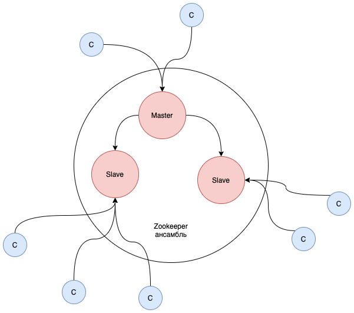

# Zookeeper

Что такое `Zookeeper`?
На сайте официальной документации значится такое определение: 

> ZooKeeper: A Distributed Coordination Service for Distributed Applications.

Это распределенный сервис координации и синхронизации для распределенных приложений.

> Кластер серверов `Zookeeper` обычно называют ансамблем.

`Zookeeper` задумывался как простой, масштабируемый и быстрый сервис, для определенных задач.

Зачастую `Zookeeper` используется, когда у вас **кластеризуемое** приложение и необходим:

* Выбор лидера (понимание кто `master` и кто `slave`, выбор лидера `Leader Election`)
* Распределенная блокировка
* Определение списка участников
* Распределнный счетчик
* Хранение конфигураций 

Важно понимать, что `Zookeeper` **не предназначен** для хранения и оперирования большим количеством данных.
Основная задача: - синхронизация между сервисами, хранение конфигураций систем.

В ансамбле `Apache Zookeeper` есть выделенный `master` или `leader`, остальные сервера являются `slave`-ами.

При этом клиентам не обязательно работать только с `leader`-ом, они могут работать с любым членом ансамбля.



## Первый запуск

Скачать дистрибутив можно с официального сайта [Apache Zookeeper](http://zookeeper.apache.org/releases.html).

В дистрибутиве поставляются скрипты для запуска, набор простых конфигурационных файлов.

Перейдя в директорию с распакованным дистрибутивом, взглянем на файл конфигурации `conf/zoo_sample.cfg`:

```
# The number of milliseconds of each tick
tickTime=2000
# The number of ticks that the initial 
# synchronization phase can take
initLimit=10
# The number of ticks that can pass between 
# sending a request and getting an acknowledgement
syncLimit=5
# the directory where the snapshot is stored.
# do not use /tmp for storage, /tmp here is just 
# example sakes.
dataDir=/tmp/zookeeper
# the port at which the clients will connect
clientPort=2181
# the maximum number of client connections.
# increase this if you need to handle more clients
#maxClientCnxns=60
```

На данном этапе важно указать `dataDir` - путь до места хранения состояния `Zookeeper`-а, а также `clientPort` - порт для клиентских соединений, остальные параметры будут рассмотрены позже.

Представленная конфигурация позволит запустить `Zookeeper` в `standalone` режиме, для разбора работы и внутреннего устройства подойдет, а в конце будет представлена конфигурация для запуска в кластере.

В директории `bin` находятся скрипты для запуска, подключения к `Zookeeper`.

Запустим `Zookeeper`:

```
bin/zkServer.sh start conf/zoo_sample.cfg
```

После чего `Zookeeper` запустится:

```
ZooKeeper JMX enabled by default
Using config: conf/zoo_sample.cfg
Starting zookeeper ... STARTED
```

### ZkCli

В составе дистрибутива поставляется еще и клиент для `Zookeeper`, с помощью которого можно взаимодейтсвовать с кластером из командной строки.

Подсоединимся к запущенному `Zookeeper`:

```
bin/zkCli.sh -server localhost:2181
```

Обратите внимание, что указывается клиентский порт (в нашем случае `2181`).

После чего откроется консоль подключения к `Zookeeper`.

Введем первую команду: 

```
ls /
```

И результат будет:

```
[zookeeper]
```

Сама команда, да и ее результат, напоминает будто бы работа ведется с файловой системой. И это подводит к вопросу о том, а как `Zookeeper` хранит свои данные?

## Модель данных

Модель данных в `Zookeeper` представлена в виде древовидной структуры, похожей на файловую.


Файлы или папки (они же узлы или ноды дерева иерархии) в теримнах `Zookeeper` - это `ZNode`-ы.
Каждая `ZNode`-а может содержать данные и дочерние узлы.
Узел уникально идентифицируется по пути и имени.

Если вам претит консоль, то вы можете воспользоваться инструментом с графической оболочкой `ZooInspector`, в нем отображение структуры `Zookeeper` проекта будет выглядеть так (пример рабочего проекта):


Как видите, основа `ZooKeeper` — это виртуальная файловая система, состоящая из взаимосвязанных узлов, которые представляют собой совмещенное понятие файла и директории.
Каждый узел может как хранить данные, так и иметь вложенные узлы.

Схожесть с файловой системой на этом не заканчивается и у каждой `Znode` есть метаинформация, хранящая время создания и изменения, количество вложенных `Znode`, версию и т.д.

Для демонстрации введем команду:

```
ls -s /
```

Результат:

```
[zookeeper]
cZxid = 0x0
ctime = Thu Jan 01 05:00:00 YEKT 1970
mZxid = 0x0
mtime = Thu Jan 01 05:00:00 YEKT 1970
pZxid = 0x0
cversion = -1
dataVersion = 0
aclVersion = 0
ephemeralOwner = 0x0
dataLength = 0
numChildren = 1
```

Какие еще операции с данными поддерживает `Zookeeper`:

// todo таблица

create /path data создать znode со значением data
delete /path удалить znode
exists /path проверить существует ли znode
setData /path data записать данные
getData /path прочитать данные
getChildren /path получить всех потомков


### Ограничения

#### Имена и пути

Все пути абсолютные, должны начинаться с `/`.
Глубина дерева и количество нод не ограничено.

Так как `Zookeeper` использует `Unicode`, то имена `ZNode` могут быть любыми, кроме зарезервированного имени `zookeeper`.
Использование `.` в имени не рекомендуется, используйте `_`.

Использование `.` в пути не допускается.

#### Размер данных

Каждая `ZNode`-а может хранить в себе значение до **1 mb**. Данные хранятся в байтах. Что еще раз говорит о том, что `Zookeeper` проектировался как сервис для координации других сервисов, а никак не для хранения больших или средних объемов данных.

## Типы ZNode

// todo подробнее

Существуте два типа `ZNode`:

* Ephemeral
* Persistent

Тип ноды задается **при создании**.

### Persistent

Данные в нодах такого типа будут хранится даже в случае, если клиент, записавший данные, надолго потеряет соединение или вообще будет выключен.

Ноды `persistent` типа могут быть удалены только **явным** вызовом `delete`.

### Ephemeral

В отличии от нод предыдущего типа, `ephemeral` ноды удаляются при завершении сессии клиента.
Ноды этого типа также можно удалить явным вызовом `delete`.

Еще одним отличием является то, что `ephemeral` ноды не могут иметь детей.

### Sequential

Не совсем применимо к разделению на типы, но и `ephemeral`, и `persistent` ноды могут быть `sequential`.

Это ноды с десятизнаным числом в названии, при создании ноды будет использован счетчик, предоставляемый `Zookeeper`.
Счетчик хранит последовательность чисел в `signed integer`.

Значение счетчика новой ноды под одним родителем всегда больше, чем уже у существующих детей.

Например, при создании в корне `sequential` ноды с именем znode будет создана: `/znode-0000000001`, если попытаться снова создать `sequential` ноду с именем znode, то будет созданна нода `/znode-0000000002`. Родительская нода здесь - это корень `/`.

## Принцип работы

С этого места и далее мы будем говорить про `Zookeeper`, имея в виду ансамбль, т.е. кластер серверов `Zookeeper`.


> Изображение взято с [официального сайта](https://zookeeper.apache.org/doc/current/zookeeperOver.html#sc_dataModelNameSpace).

Для запуска ансамбля 

## Heartbeat

Как было сказано выше, `ephemeral` ноды существуют в рамках сессии с клиентом.

Но как `Zookeeper` понимает, что клиент завершил сессию? Что клиент все еще жив?

Определение того, что соединение между клиентом и сервером потеряно осуществляется посредством `heartbeat`-ов. Сессия имеет таймаут, если за время таймаута от клиента не пришел `heartbeat`, то клиент считается невалидным и сессия завершается.

Также клиент может явно завершить сессию.

Клиент каждые 3 секунды шлет на сервер heartbeat-ы.

Если в течении 10 секунд от клиента не было heartbeat-а, то соединение считается потерянным.
Сервер удаляет все эфемерные ноды связанные с клиентом.
Удаляет все вотчеры связанные с этим клиентом.
Рассылает нотификации остальным клиентам если были вотчеры

 
## Запись 
Библиотека Curator

Операция записи данных происходит через `master`, является атомарной, происходит в одном потоке без конкуренции (потому что только `master` решает как записывать) и упорядочена.

Операции на запись транслируются на `slave`-ы не **синхронно** (но и не асинхронно, `master` ждет от каких-то `slave`-ов ответа о записи). Поэтому может быть лаг, `slave`-ы могут отставать.


## Пример

```
tickTime=2000
dataDir=/var/zookeeper
clientPort=2181
initLimit=5
syncLimit=2

server.1=zoo1:2888:3888
server.2=zoo2:2888:3888
server.3=zoo3:2888:3888
```


## Полезные ссылки

1. [Apache Zookeeper Documentation](https://zookeeper.apache.org/doc/current/index.html)
2. [Apache Zookeeper часть 1](https://www.youtube.com/watch?v=PgTpvzv8xp0)
3. [Apache Zookeeper часть 2](https://www.youtube.com/watch?v=hYDrkFjznHQ)
4. [В чем польза ZooKeeper для админов и разработчиков. Семинар в Яндексе](https://habr.com/ru/company/yandex/blog/234335/)
* [Apache Curator](https://curator.apache.org/)