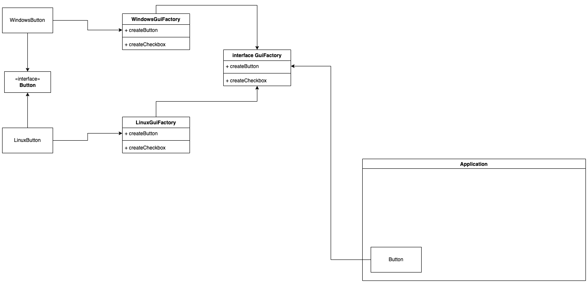

# Паттерн Abstract Factory

## Введение

Давайте рассмотрим ситуацию, в которой нам нужно наладить производство мебели: стулья, диваны, столы и т.д.

При этом мебель производится для разных стилей интерьера: модерн, ампир, лофт и т.д.

Просто создавать каждый раз объекты в необходимых местах через `new` проблематично. Во-первых, это большое количество повторяющегося кода.
Ну представьте, что вы каждый раз пишите что-то типа:

```java
new Chair("modern").setLegs(4).setMaterial("wood") ....
```

Каждый раз, когда вам нужен деревянный стул в стиле модерн такое прописывать не хочется.
Программисты люди ленивые и хочется просто *попросить* кого-то дать вам необходимый стул.

Т.е. создать некоторый объект-фабрику, производящую нужные продукты: стулья, столы, диваны.

При этом, если вы хотите приобрести набор стульев, то вы хотите их приобрести для одного интерьера.
Было бы странно, что вы запросили два стула и вам дали один лофт, а другой ампир.

Или представьте, что вы пишите игру и вам надо создать армию из эльфов, окров и нежити.
И вот вы создаете эльфов и тут вдруг, как и со стульями, опечатались/ошиблись и у вас в армии эльфов вдруг орк или нежить.

Т.е. наша проблема - это создание различных групп взаимосвязанных объектов.
Нам нужен спо­соб созда­вать объ­ек­ты про­дук­тов (юнитов в армиях), чтобы они соче­та­лись с дру­ги­ми про­дук­та­ми (юнитами) того же семей­ства.

## Абстрактная фабрика

Давайте выделим общие интерфейсы для продуктов, составляющих семейства:

```java
// стулья
public interface Chair {}

public class ModernChair implements Chair {}

public class LoftChair implements Chair {}

// диваны
public interface Sofa {}

public class ModernSofa implements Sofa {}

public class LoftSofa implements Sofa {}
```

Понятно, что раз у нас несколько семейств - то и фабрик будет несколько.
Каждая фабрика будет выпускать объекты-продукты для своего конкретного семейства, по своей специализации.

Но все фабрики объединяет то, что они производят наши продукты. Т.е. некоторый общий интерфейс!

Отсюда мы приходим к тому, что у нас должна быть некоторая 'абстрактная' фабрика, предоставляющая общий интерфейс создания всех имеющихся продуктов (объектов семейства). У такой абстрактной фабрики будет несколько реализаций, каждая из которых отвечает за создание продуктов своего семейства.

```java
public interface FunitureFactory {
    Chair createChair();
    Sofa createSofa();
}

class ModernFunitureFactory implements FunitureFactory {
    // реализация
}

class LoftFunitureFactory implements FunitureFactory {
    // реализация
}
```

При этом код, который использует фабрики дол­жен рабо­тать через общие интер­фей­сы продуктов и фабрики. Это поз­во­лит передавать в ваши клас­сы любой тип фаб­ри­ки и про­из­во­дить любые про­дук­ты, ниче­го не ломая.

И вот какой интерьер клиенту нужен, ту реализацию фабрики вы ему передадите. Сам же клиент (клиентский код) не будет акцентировать внимание на этом, ведь ему нужна мебель: стол и стулья. А у вас будет гарантия того, что продукты будут одного семейства.

А благодаря тому, что все работают через общие интерфейсы, при необходимости изменить интерьер - вам нужно будет только передать клиенту другую фабрику, не меняя клиентский код.

Абстракция позволяет нам гибко работать с клиентами, не меняя сам клиентский код, так как скры­ва­ет от кли­ент­ско­го кода подроб­но­сти того, как и какие кон­крет­но объ­ек­ты будут созда­ны.

## Общий вид паттерна

Теперь давайте для закрепления разберем из чего состоит и нарисуем как выглядит паттерн в общем виде.

Выделение абстракций продуктов и фабрик, проихводящих продукты, а затем объединение взаимосвязанных или взаимозависимых реализаций в одну фабрику.


## Разница с Factory Method

Те, кто только начинает знакомство с этим паттерном, обычно пребывают в недоумении, так как это очень напоминает [Factory Method](./factory_method.md).

На самом деле, абстрактная фабрика основывается на фабричном методе.

По сути, основное назначение паттерна - это предоставить интерфейс для создания семейств взаимосвязанных или взаимозависимых объектов, без акцента на конкретных реализациях.

Т.е. абстрактная фабрика - это по сути работа с семейством фабричных методов.

## Применимость

Паттерн часто можно встретить во всяких фреймворках, которые предполагают гибкую настройку через конфигурацию или переменные окружения, например, `Spring`.

Также применяется в кроссплатформенных фреймворках и библиотеках. Когда на старте приложения вы понимаете платформу и создаете фабрики, производяющие объекты под эту платформу.

Например, в зависимости от `ОС` вы можете создать фабрики `GUI` элементов: кнопок, лейблов, чекбоксов. При старте приложения вы создаете фабрики под конкретные `ОС` и отдаете клиентскому коду элементы под `ОС`. При этом клиентский код вы никак не меняете/не модернизируете.

Благодаря интерфейсам ваш код работает с абстракциями и абстрактной фабрикой!



## Заключение

Широко применимый паттерн, отвечающий за создание различных групп взаимосвязанных объектов и позволяющий гибко работать с кодом клиента.

Клиентский код работает через абстракции с объектами, а производством объектов занимаются фабрики.

Позволяет упростить замену семейств продуктов, гарантирует сочетаемость продуктов.

## Полезные ссылки

1. [Абстрактная фабрика на пальцах](https://habr.com/ru/post/465835/)
2. [Шаблоны Java. AbstractFactory (Абcтрактная фабрика)](https://www.youtube.com/watch?v=cmyUI_ZezoU)
3. [Шаблоны Java. Абстрактная фабрика (Abstract Factory)](https://www.youtube.com/watch?v=FYX9l5OQtJE)
4. [Абстрактная Фабрика](https://www.youtube.com/watch?v=1mVONOCxfLg)
