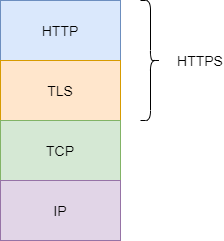

## HTTPS

Сам по себе протокол HTTP не предполагает использование шифрования для передачи информации. Передача информации происходит в открытом виде, что делает использование протокола небезопасным.

Представьте, что вы оплачиваете заказ в интернет-магазине, вы вводите детали банковской карты. Этого не видно, но браузер передаёт эти детали серверу. Если сообщение перехватят злоумышленники, они узнают детали карты, чего бы не хотелось.

Именно для того, чтобы этого не сулчилось, используйте `HTTPS` (HyperText Transfer Protocol Secure).

Зачем нужен `HTTPS`?

* Аутентификация - на том конце точно тот, с кем я говорю.
* Целостность данных - никто не может вклиниться в процесс передачи.
* Шифрование - никто не может видеть какие данные передаются.

Из рисунка видно, что `HTTPS` - это `HTTP` и `TLS`-слой.

### Принцип работы SSL-шифрования

В `HTTPS` важную роль играет понятие `Сертификат`. 
В основе любого метода шифрования лежит ключ. Ключ — это способ зашифровать или расшифровать сообщение. В работе `SSL`-сертификата участвуют три ключа: публичный, приватный и сеансовый.

**Публичный** ключ зашифровывает сообщение.

Браузер использует его, когда нужно отправить пользовательские данные серверу. Например, после того как вы ввели данные банковской карты и нажали «Оплатить». Этот ключ виден всем, браузер прикрепляет его к сообщению. 

**Приватный** ключ расшифровывает сообщение. Его использует сервер, когда получает сообщение от браузера. Этот ключ хранится на сервере и никогда не передаётся вместе с сообщением.

**Сеансовый** ключ одновременно зашифровывает и расшифровывает сообщения. Браузер генерирует его на время, которое пользователь проводит на сайте. Стоит пользователю закрыть вкладку, сеанс закончится и ключ перестанет работать.

Публичный и приватный ключи генерируются один раз при создании запроса на выпуск сертификата. Поэтому приватный ключ нужно хранить осторожно. Если ключ попадёт в руки другому человеку, он сможет расшифровывать сообщения, в таком случае сертификат будет скомпрометирован и его нужно будет перевыпускать.

Грубо говоря, публичный ключ - это как ящичек с кодовым замком. Вы кладете туда сообщение и только тот, у кого есть код замка может достать оттуда данные.

Шифрование с двумя разными ключами называют асимметричным. Использовать такой метод более безопасно, но медленно. Поэтому браузер и сервер используют его один раз: чтобы создать сеансовый ключ.

Шифрование с одним ключом называют симметричным. Этот метод удобен, но не так безопасен. Поэтому браузер и делает уникальный ключ для каждого сеанса вместо того, чтобы хранить его на сервере.

### Как браузер и сервер устанавливают безопасное соединение

Браузер и сервер устанавливают SSL-соединение каждый раз, когда пользователь заходит на сайт. Это занимает несколько секунд во время загрузки сайта. Этот процесс называется `handshake`, «рукопожатие».

Когда вы вводите адрес сайта в браузере, он спрашивает у сервера, установлен ли для сайта сертификат. В ответ сервер отправляет общую информацию об `SSL`-сертификате и публичный ключ. Браузер сверяет информацию со списком авторизованных центров сертификации. Такой список есть во всех популярных браузерах. Если всё в порядке, браузер генерирует `session key` (сеансовый ключ), зашифровывает его публичным ключом и отправляет на сервер. Сервер расшифровывает сообщение и сохраняет сеансовый ключ. После этого между браузером и сайтом устанавливается безопасное соединение через протокол `HTTPS`.

Сертификат содержит название компании и электронную подпись, которая подтверждает его подлинность. Именно ее проверяет браузер в момент установки безопасного HTTPS соединения.

Сертификат - это как наториально заверенный документ, подтверждающий вашу личность. А нотариус - это центр сертификации.